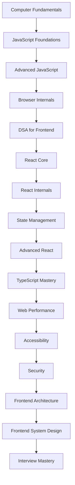

# Frontend Mastery Knowledge Base

A world-class learning system for progressing from beginner to expert and teaching-level frontend engineering.

## Learning Outcomes

By completing these notes, you should be able to master JavaScript and React, understand browser internals, crack frontend interviews at top product companies, teach concepts clearly, design scalable architectures, and build production-grade applications.

## Repository Review and Improvements Applied

The previous version used repeated generic scaffolding. This revision improves the repository by:

1. Adding missing volumes for TypeScript, Web Performance, Accessibility, Security, and Advanced Frontend Patterns.
2. Reordering the roadmap from runtime fundamentals to language, browser, DSA, React, architecture, system design, and interviews.
3. Expanding every topic with the required structure: intro, why, fundamentals, internals, mental models, Mermaid diagrams, examples, memory views, use cases, mistakes, best practices, performance, edge cases, 30 interview questions, coding challenges, assignments, projects, revision notes, cheat sheets, teaching notes, FAQs, and related concepts.
4. Adding cross-layer explanations for JavaScript engine behavior, browser rendering, React Fiber/scheduling, and production concerns.
5. Reducing duplicate generic prose by making each topic include topic-specific examples, diagrams, and interview prompts.

## How to Study

1. Read a topic once for vocabulary.
2. Draw the diagram from memory.
3. Run or rewrite the code example.
4. Answer the beginner/intermediate/advanced interview questions aloud.
5. Complete the coding challenges.
6. Teach the topic in beginner, junior, and senior modes.

## Volumes

| Volume | Focus | Notes |
| --- | --- | --- |
| 1 | Computer Fundamentals | [Open](volumes/01-computer-fundamentals.md) |
| 2 | JavaScript Foundations | [Open](volumes/02-javascript-foundations.md) |
| 3 | Advanced JavaScript | [Open](volumes/03-advanced-javascript.md) |
| 4 | Browser Internals | [Open](volumes/04-browser-internals.md) |
| 5 | DSA for Frontend | [Open](volumes/05-dsa-for-frontend.md) |
| 6 | React Core | [Open](volumes/06-react-core.md) |
| 7 | React Internals | [Open](volumes/07-react-internals.md) |
| 8 | State Management | [Open](volumes/08-state-management.md) |
| 9 | Advanced React | [Open](volumes/09-advanced-react.md) |
| 10 | Frontend Architecture | [Open](volumes/10-frontend-architecture.md) |
| 11 | Frontend System Design | [Open](volumes/11-frontend-system-design.md) |
| 12 | Interview Mastery | [Open](volumes/12-interview-mastery.md) |
| 13 | TypeScript Mastery | [Open](volumes/13-typescript-mastery.md) |
| 14 | Web Performance | [Open](volumes/14-web-performance.md) |
| 15 | Accessibility | [Open](volumes/15-accessibility.md) |
| 16 | Security | [Open](volumes/16-security.md) |
| 17 | Advanced Frontend Patterns | [Open](volumes/17-advanced-frontend-patterns.md) |

## Master Roadmap

## Expert Checklist

- Explain every topic in one sentence, one diagram, and one production example.
- Predict JavaScript execution order and memory behavior.
- Predict browser rendering and networking behavior.
- Predict React render, reconciliation, commit, and scheduling behavior.
- Design accessible, secure, observable, and performant frontend systems.
- Solve interview problems while explaining trade-offs.
