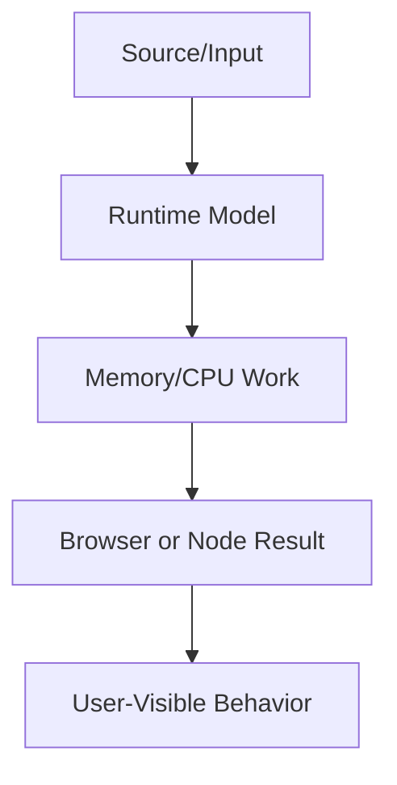

# Computer Fundamentals

This volume contains domain-specific senior-level notes for: Computer Architecture, CPU, RAM, Process, Thread, Stack, Heap, Memory Model, Garbage Collection, Browser Fundamentals, Networking Basics.



## Computer Architecture

### What it is
Computer architecture is the CPU, memory, storage, buses, and I/O model that ultimately constrains every web app.

### Why it exists
It explains why JavaScript is fast for many UI tasks but slow when a single thread performs too much CPU work.

### Source-code / internal model
A browser process schedules renderer processes, JS engine execution, GPU compositing, network I/O, and OS memory pages.

### Architecture diagram


### Production React example
A React analytics dashboard must account for low-end CPU, limited RAM, and GPU compositing when rendering charts.

```tsx
const ComputerArchitectureExample = {
  input: "dashboard filter, route transition, or API response",
  failureMode: "stale state, remount, blocked input, or unsafe data sink",
  metric: "React Profiler commit time, Chrome long task, heap growth, or Web Vital",
};
```

### Debugging scenario
If the app is fast on a MacBook but slow on Android, profile hardware-bound CPU, memory, and paint costs.

### Performance profiling example
Use CPU throttling and Performance panel to distinguish JavaScript execution from rendering or network delay.

### Product-company interview prompts
- Asked: what happens from URL enter to pixels and where CPU/RAM/network participate.
- Explain one production incident involving Computer Architecture and how you would prevent recurrence.
- Implement or design a minimal example of Computer Architecture while narrating correctness, edge cases, and trade-offs.

### Senior-engineer checklist
- What owns the data or behavior?
- What can make it stale, slow, inaccessible, insecure, or hard to test?
- What instrumentation proves it works in production?
- What API would you expose to a team so misuse is difficult?

## CPU

### What it is
CPU executes instructions; frontend CPU cost appears as JavaScript execution, style calculation, layout, parsing, and JSON processing.

### Why it exists
It matters because the browser main thread can be blocked by CPU-heavy work.

### Source-code / internal model
V8/JSC/SpiderMonkey run JS on the renderer main thread, optimize hot functions, and deoptimize unstable shapes.

### Architecture diagram


### Production React example
A data grid sorting 50k rows can freeze typing if sorting runs synchronously on every keypress.

```tsx
performance.mark("start");
runExpensiveUIWork();
performance.mark("end");
performance.measure("ui-work", "start", "end");
```

### Debugging scenario
If interactions freeze, look for long tasks over 50ms and expensive JS stacks.

### Performance profiling example
Throttle CPU 4x in Chrome and compare scripting time before and after memoization, virtualization, or Web Worker offload.

### Product-company interview prompts
- Asked: how to keep input responsive while doing CPU-heavy filtering.
- Explain one production incident involving CPU and how you would prevent recurrence.
- Implement or design a minimal example of CPU while narrating correctness, edge cases, and trade-offs.

### Senior-engineer checklist
- What owns the data or behavior?
- What can make it stale, slow, inaccessible, insecure, or hard to test?
- What instrumentation proves it works in production?
- What API would you expose to a team so misuse is difficult?

## RAM

### What it is
RAM is working memory used by browser processes, DOM nodes, JS heap, images, ArrayBuffers, and caches.

### Why it exists
SPAs live for hours, so memory growth becomes a product reliability issue.

### Source-code / internal model
Objects stay in JS heap while reachable; decoded images and DOM nodes may live outside JS heap but still consume memory.

### Architecture diagram


### Production React example
Infinite feeds must cap cached pages and unmount offscreen DOM through virtualization.

```tsx
performance.mark("start");
runExpensiveUIWork();
performance.mark("end");
performance.measure("ui-work", "start", "end");
```

### Debugging scenario
If tabs crash after navigation loops, compare heap snapshots and browser task-manager memory.

### Performance profiling example
Use Allocation instrumentation and heap snapshots to identify retained arrays, detached DOM, and cache growth.

### Product-company interview prompts
- Asked: how to diagnose memory growth in a React single-page app.
- Explain one production incident involving RAM and how you would prevent recurrence.
- Implement or design a minimal example of RAM while narrating correctness, edge cases, and trade-offs.

### Senior-engineer checklist
- What owns the data or behavior?
- What can make it stale, slow, inaccessible, insecure, or hard to test?
- What instrumentation proves it works in production?
- What API would you expose to a team so misuse is difficult?

## Process

### What it is
A process is an OS-isolated execution container; browsers use multiple processes for tabs, GPU, network, and extensions.

### Why it exists
Process isolation limits blast radius and enforces site isolation/security boundaries.

### Source-code / internal model
Chrome may run a renderer process per site instance; crashes or memory pressure can kill isolated renderers.

### Architecture diagram


### Production React example
A payment iframe runs in an isolated context from the merchant app.

```tsx
const ProcessExample = {
  input: "dashboard filter, route transition, or API response",
  failureMode: "stale state, remount, blocked input, or unsafe data sink",
  metric: "React Profiler commit time, Chrome long task, heap growth, or Web Vital",
};
```

### Debugging scenario
If only one tab crashes, inspect renderer process failure rather than app-wide failure.

### Performance profiling example
Use Chrome Task Manager to view process CPU/memory per tab/frame.

### Product-company interview prompts
- Asked: process vs thread and why browsers are multi-process.
- Explain one production incident involving Process and how you would prevent recurrence.
- Implement or design a minimal example of Process while narrating correctness, edge cases, and trade-offs.

### Senior-engineer checklist
- What owns the data or behavior?
- What can make it stale, slow, inaccessible, insecure, or hard to test?
- What instrumentation proves it works in production?
- What API would you expose to a team so misuse is difficult?

## Thread

### What it is
A thread is an execution path inside a process; web apps mainly fight over the renderer main thread.

### Why it exists
It exists so work can be parallelized, but DOM access remains main-thread-bound.

### Source-code / internal model
Browser renderer has main thread, compositor thread, raster workers, and Web Workers for JS without DOM access.

### Architecture diagram


### Production React example
Image compression before upload should run in a Web Worker, not block form input.

```tsx
const ThreadExample = {
  input: "dashboard filter, route transition, or API response",
  failureMode: "stale state, remount, blocked input, or unsafe data sink",
  metric: "React Profiler commit time, Chrome long task, heap growth, or Web Vital",
};
```

### Debugging scenario
If scroll janks, identify whether main thread or compositor is blocked.

### Performance profiling example
Performance panel shows main-thread flamechart and worker activity.

### Product-company interview prompts
- Asked: Web Worker limitations and main thread responsibilities.
- Explain one production incident involving Thread and how you would prevent recurrence.
- Implement or design a minimal example of Thread while narrating correctness, edge cases, and trade-offs.

### Senior-engineer checklist
- What owns the data or behavior?
- What can make it stale, slow, inaccessible, insecure, or hard to test?
- What instrumentation proves it works in production?
- What API would you expose to a team so misuse is difficult?

## Stack

### What it is
The stack stores active function calls and local execution frames.

### Why it exists
It enables deterministic function return order and stack traces.

### Source-code / internal model
Each call pushes a frame; recursion or deeply nested sync calls can overflow the stack.

### Architecture diagram


### Production React example
Recursive tree rendering or traversal can crash on very deep comment threads.

```tsx
const StackExample = {
  input: "dashboard filter, route transition, or API response",
  failureMode: "stale state, remount, blocked input, or unsafe data sink",
  metric: "React Profiler commit time, Chrome long task, heap growth, or Web Vital",
};
```

### Debugging scenario
RangeError maximum call stack size means uncontrolled recursion or cyclic traversal.

### Performance profiling example
Profile call depth and convert deep recursion to iteration when data depth is untrusted.

### Product-company interview prompts
- Asked: call stack output order and recursion limits.
- Explain one production incident involving Stack and how you would prevent recurrence.
- Implement or design a minimal example of Stack while narrating correctness, edge cases, and trade-offs.

### Senior-engineer checklist
- What owns the data or behavior?
- What can make it stale, slow, inaccessible, insecure, or hard to test?
- What instrumentation proves it works in production?
- What API would you expose to a team so misuse is difficult?

## Heap

### What it is
The heap stores objects, arrays, functions, closures, DOM wrappers, and long-lived data.

### Why it exists
It supports dynamic allocation where object lifetime is not tied to a single function call.

### Source-code / internal model
GC traces references from roots to determine which heap objects survive.

### Architecture diagram


### Production React example
Client-side caches, normalized stores, and memoized selectors all occupy heap.

```tsx
const HeapExample = {
  input: "dashboard filter, route transition, or API response",
  failureMode: "stale state, remount, blocked input, or unsafe data sink",
  metric: "React Profiler commit time, Chrome long task, heap growth, or Web Vital",
};
```

### Debugging scenario
Heap snapshots show retaining paths from global stores, closures, or listeners.

### Performance profiling example
Track heap after repeated route transitions to confirm cleanup.

### Product-company interview prompts
- Asked: stack vs heap and why closures can retain heap objects.
- Explain one production incident involving Heap and how you would prevent recurrence.
- Implement or design a minimal example of Heap while narrating correctness, edge cases, and trade-offs.

### Senior-engineer checklist
- What owns the data or behavior?
- What can make it stale, slow, inaccessible, insecure, or hard to test?
- What instrumentation proves it works in production?
- What API would you expose to a team so misuse is difficult?

## Memory Model

### What it is
The JavaScript memory model defines visibility/order rules for SharedArrayBuffer and Atomics across agents.

### Why it exists
It exists so worker communication can be correct without data races.

### Source-code / internal model
Normal objects are not shared across workers; structured clone copies, Transferable moves ownership, SharedArrayBuffer shares bytes with Atomics coordination.

### Architecture diagram


### Production React example
A collaborative editor may use a Worker and SharedArrayBuffer for parsing or CRDT processing.

```tsx
const MemoryModelExample = {
  input: "dashboard filter, route transition, or API response",
  failureMode: "stale state, remount, blocked input, or unsafe data sink",
  metric: "React Profiler commit time, Chrome long task, heap growth, or Web Vital",
};
```

### Debugging scenario
Race-like bugs appear when assuming postMessage is synchronous or shared memory is automatically safe.

### Performance profiling example
Measure worker transfer vs clone cost for large payloads.

### Product-company interview prompts
- Asked: structured clone vs Transferable vs SharedArrayBuffer.
- Explain one production incident involving Memory Model and how you would prevent recurrence.
- Implement or design a minimal example of Memory Model while narrating correctness, edge cases, and trade-offs.

### Senior-engineer checklist
- What owns the data or behavior?
- What can make it stale, slow, inaccessible, insecure, or hard to test?
- What instrumentation proves it works in production?
- What API would you expose to a team so misuse is difficult?

## Garbage Collection

### What it is
Garbage collection automatically reclaims memory that is no longer reachable.

### Why it exists
It prevents most manual memory management while still requiring developers to remove accidental references.

### Source-code / internal model
Engines trace roots such as stack, globals, closures, DOM references, and mark unreachable heap objects for collection.

### Architecture diagram


### Production React example
SPAs must clean intervals, subscriptions, observers, and detached DOM to avoid leaks.

```tsx
const GarbageCollectionExample = {
  input: "dashboard filter, route transition, or API response",
  failureMode: "stale state, remount, blocked input, or unsafe data sink",
  metric: "React Profiler commit time, Chrome long task, heap growth, or Web Vital",
};
```

### Debugging scenario
Heap snapshots reveal retained objects and retaining paths.

### Performance profiling example
GC pauses and memory growth affect low-end devices.

### Product-company interview prompts
- Asked: mark-and-sweep, memory leaks in JS, WeakMap, WeakRef caveats.
- Explain one production incident involving Garbage Collection and how you would prevent recurrence.
- Implement or design a minimal example of Garbage Collection while narrating correctness, edge cases, and trade-offs.

### Senior-engineer checklist
- What owns the data or behavior?
- What can make it stale, slow, inaccessible, insecure, or hard to test?
- What instrumentation proves it works in production?
- What API would you expose to a team so misuse is difficult?

## Browser Fundamentals

### What it is
Browser fundamentals cover navigation, parsing, JS execution, rendering, storage, security, and user interaction.

### Why it exists
They explain why the same JavaScript can behave differently depending on document lifecycle and browser pipeline.

### Source-code / internal model
Navigation creates requests, responses, documents, event loops, DOM/CSSOM, render tree, and composited output.

### Architecture diagram


### Production React example
Route transitions, auth redirects, prefetching, and hydration all depend on browser lifecycle.

```tsx
const BrowserFundamentalsExample = {
  input: "dashboard filter, route transition, or API response",
  failureMode: "stale state, remount, blocked input, or unsafe data sink",
  metric: "React Profiler commit time, Chrome long task, heap growth, or Web Vital",
};
```

### Debugging scenario
If code runs before elements exist, inspect defer/module/DOMContentLoaded/hydration timing.

### Performance profiling example
Use Network, Performance, Application, and Rendering panels together.

### Product-company interview prompts
- Asked: explain what happens after entering a URL.
- Explain one production incident involving Browser Fundamentals and how you would prevent recurrence.
- Implement or design a minimal example of Browser Fundamentals while narrating correctness, edge cases, and trade-offs.

### Senior-engineer checklist
- What owns the data or behavior?
- What can make it stale, slow, inaccessible, insecure, or hard to test?
- What instrumentation proves it works in production?
- What API would you expose to a team so misuse is difficult?

## Networking Basics

### What it is
Networking basics cover DNS, TCP/TLS, HTTP, caching, compression, and request prioritization.

### Why it exists
Frontend performance is often network-bound before JavaScript runs.

### Source-code / internal model
Browser resolves DNS, opens/reuses connections, negotiates TLS, sends HTTP requests, and applies cache policy.

### Architecture diagram


### Production React example
API clients rely on cache-control, ETags, retries, aborts, and request deduplication.

```tsx
const NetworkingBasicsExample = {
  input: "dashboard filter, route transition, or API response",
  failureMode: "stale state, remount, blocked input, or unsafe data sink",
  metric: "React Profiler commit time, Chrome long task, heap growth, or Web Vital",
};
```

### Debugging scenario
If API feels slow, inspect DNS/TLS/TTFB/download and server timing.

### Performance profiling example
Use DevTools Network waterfall and WebPageTest connection view.

### Product-company interview prompts
- Asked: HTTP caching, CDN, preflight, and why HTTP/2 multiplexing matters.
- Explain one production incident involving Networking Basics and how you would prevent recurrence.
- Implement or design a minimal example of Networking Basics while narrating correctness, edge cases, and trade-offs.

### Senior-engineer checklist
- What owns the data or behavior?
- What can make it stale, slow, inaccessible, insecure, or hard to test?
- What instrumentation proves it works in production?
- What API would you expose to a team so misuse is difficult?

