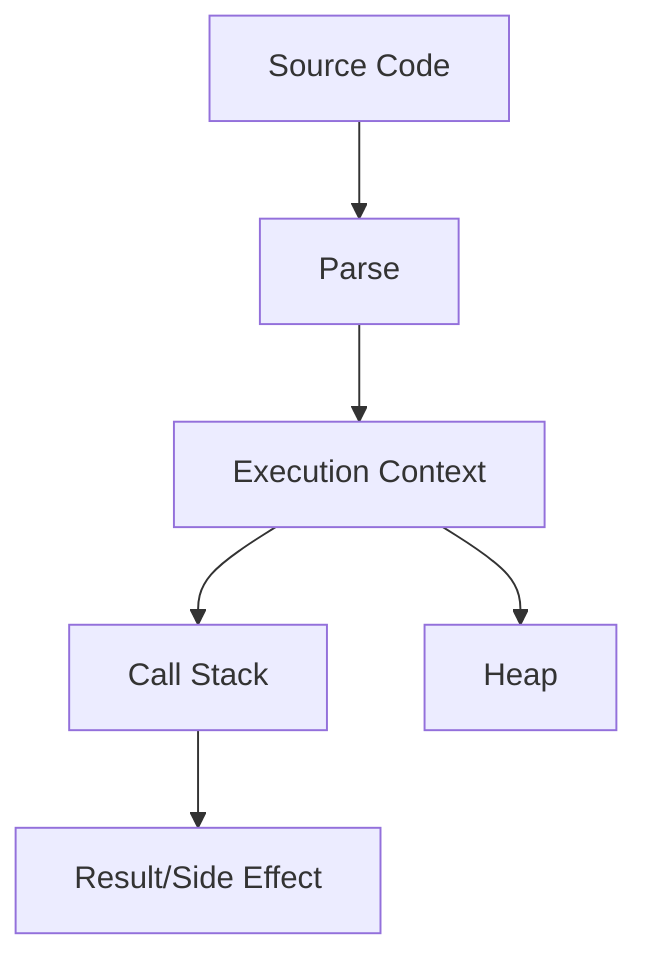

# Volume 01: Computer Fundamentals

This volume covers Computer Fundamentals from beginner foundations to teaching-level mastery. Each topic follows the required repository structure and links internals to production frontend work.

## Volume Learning Order

Computer Architecture -> CPU -> RAM -> Process -> Thread -> Stack -> Heap -> Memory Model -> Garbage Collection -> Browser Fundamentals -> Networking Basics

# Computer Architecture

## Introduction

Computer Architecture is a foundational Computer Fundamentals topic. Mastery means you can use it correctly, predict its behavior, debug production issues, explain internals, and connect it to interviews, architecture, accessibility, security, and performance.

## Why This Concept Exists

* What problem does it solve? It reduces ambiguity around how frontend systems represent data, run code, render UI, communicate over networks, and recover from failure.
* Why was it introduced? It emerged because applications needed more predictable, reusable, observable, and scalable ways to manage complexity.

## Core Fundamentals

- Definition: know the exact vocabulary for Computer Architecture.
- Contract: identify inputs, outputs, side effects, ownership, lifecycle, and cleanup.
- Boundaries: separate language behavior, browser behavior, framework behavior, and application policy.
- Correctness: cover happy path, loading path, empty state, error state, retry path, and cleanup path.
- Production readiness: include tests, monitoring, documentation, performance budgets, and accessibility/security review where relevant.

## Internal Working

Explain step-by-step what happens internally.

JavaScript engines parse source, create execution contexts, allocate primitives on stack-like records and objects on the heap, execute through an interpreter/JIT, and reclaim unreachable memory with garbage collection.

For JavaScript topics:

* Memory: primitives are stored directly in execution records where possible; objects, arrays, functions, and closures live on the heap and are referenced.
* Execution Context: creation phase builds bindings and scope links; execution phase evaluates statements and expressions.
* Call Stack: synchronous frames push and pop; long frames block input and rendering.
* Engine Behavior: engines optimize stable shapes and predictable types, but can deoptimize polymorphic or megamorphic hot paths.

For React topics:

* Rendering: React calls components to describe UI.
* Reconciliation: React compares previous and next element trees using type and key.
* Fiber: work is represented as interruptible units linked in a tree.
* Scheduler: urgent updates can be prioritized over non-urgent rendering.

For Browser topics:

* DOM: parsed HTML becomes nodes and relationships.
* CSSOM: CSS becomes matched style rules.
* Rendering Pipeline: style, layout, paint, and composite turn data into pixels.

## Mental Models

- Restaurant analogy: Computer Architecture is like the workflow between order taking, kitchen preparation, serving, and cleanup.
- Airport analogy: requests and events move through queues, priorities, gates, and security checks.
- Library analogy: references point to books on shelves; losing the catalog reference makes a book eligible for cleanup.
- Warehouse analogy: caching and indexing trade storage cost for faster retrieval.

## Visual Diagrams



## Step-by-Step Examples

```js
const topic = "Computer Architecture";
console.log(`Learning ${topic} deeply`);
```

Line-by-line explanation:

1. Identify declarations and allocate necessary bindings.
2. Create runtime values or references.
3. Execute the synchronous part first.
4. Schedule asynchronous, rendering, or cleanup work if present.
5. Observe the final state through logs, UI, network panel, profiler, or tests.

Specific explanation: This minimal snippet creates, stores, and reads a value related to Computer Architecture; expand it with real inputs, errors, and measurement.

## Memory Visualizations

```text
Stack / Execution Records
main() frame
  local binding -> ref:0x001

Heap
0x001 -> { topic: "Computer Architecture", lifecycle: "created -> used -> cleaned" }

GC rule
reachable from stack/module/global/subscription => kept
unreachable after cleanup => collectible
```

## Real-World Use Cases

- React hooks and component state synchronization.
- React Query or cache invalidation workflows.
- Debouncing input and avoiding unnecessary network calls.
- Authentication, authorization, and guarded routes.
- Notifications, chat, optimistic updates, uploads, and realtime dashboards.

## Common Mistakes

- Treating Computer Architecture as syntax instead of a lifecycle and ownership problem.
- Forgetting cleanup for listeners, timers, subscriptions, observers, or pending requests.
- Confusing microtasks, tasks, render work, and React commits.
- Ignoring empty, duplicate, stale, failed, or slow states.
- Adding abstractions before the problem repeats.

## Best Practices

- Make ownership explicit.
- Keep side effects at boundaries.
- Prefer native browser semantics before custom JavaScript.
- Add tests for normal, boundary, and failure behavior.
- Document invariants and trade-offs.

## Performance Considerations

- Time complexity: identify whether work is O(1), O(n), O(n log n), or worse.
- Space complexity: track retained objects, caches, closures, and subscriptions.
- Rendering cost: avoid unnecessary DOM work, style recalculation, layout, paint, and React re-renders.
- Re-renders: stabilize keys, props, callbacks, and derived data only when measurement shows benefit.
- Memory impact: release references and cap cache size.

## Edge Cases

- Null, undefined, empty arrays, duplicate IDs, and unexpected types.
- Slow network, offline mode, retries, cancellation, and race conditions.
- Browser tab suspension and page visibility changes.
- Server/client mismatches during hydration.
- Accessibility states such as focus, disabled, expanded, selected, and live updates.

## Interview Questions

### Beginner Questions

1. Define Computer Architecture?
2. Why does production code need Computer Architecture?
3. Show a simple example of Computer Architecture?
4. What problem is solved by Computer Architecture?
5. What breaks when misusing Computer Architecture?
6. How do you debug Computer Architecture?
7. What browser or engine behavior affects Computer Architecture?
8. What React behavior affects Computer Architecture?
9. What performance metric is impacted by Computer Architecture?
10. How would you teach Computer Architecture?

### Intermediate Questions

1. Compare trade-offs of Computer Architecture in a real app?
2. Describe memory implications of Computer Architecture in a real app?
3. Explain async or rendering order for Computer Architecture in a real app?
4. Design a reusable abstraction around Computer Architecture in a real app?
5. List edge cases for Computer Architecture in a real app?
6. Write tests for Computer Architecture in a real app?
7. Profile bottlenecks caused by Computer Architecture in a real app?
8. Connect security concerns to Computer Architecture in a real app?
9. Explain failure recovery for Computer Architecture in a real app?
10. Refactor legacy usage of Computer Architecture in a real app?

### Advanced Questions

1. Explain internals of Computer Architecture under scale?
2. How would you optimize Computer Architecture under scale?
3. How would you design observability for Computer Architecture under scale?
4. What deoptimization or reconciliation pitfalls affect Computer Architecture under scale?
5. How do concurrent updates change Computer Architecture under scale?
6. How would you document invariants for Computer Architecture under scale?
7. How would you migrate a large codebase using Computer Architecture under scale?
8. How would you prevent regressions in Computer Architecture under scale?
9. How would you answer a staff-level interview about Computer Architecture under scale?
10. What are the hidden trade-offs of Computer Architecture under scale?

## Coding Challenges

1. Build a minimal demo for Computer Architecture and log every lifecycle step.
2. Add input validation and error handling.
3. Add cleanup logic and prove it with a test.
4. Profile the implementation and remove one bottleneck.
5. Convert the demo into a reusable production-style API.

## Assignments

1. Write a one-page beginner explanation with a diagram.
2. Create an interview answer bank with short and long answers.
3. Build a production checklist covering tests, performance, accessibility, and security.

## Mini Projects

- Build a small dashboard feature that uses Computer Architecture, includes loading/error/empty states, has tests, exposes metrics, and documents trade-offs.

## Revision Notes

Computer Architecture: definition, problem solved, lifecycle, memory model, browser/React impact, failure modes, performance cost, debugging tools, and one production example.

## Cheat Sheet

| Need | Reminder |
| --- | --- |
| Define | State what Computer Architecture is in one sentence. |
| Debug | Inspect stack, heap references, events, network, render commits, and logs. |
| Optimize | Measure first, then reduce repeated work or retained memory. |
| Interview | Answer with definition, example, internals, edge cases, trade-offs. |

## Teaching Notes

- A beginner: use one analogy and one tiny example.
- A junior developer: add lifecycle, pitfalls, and debugging workflow.
- A senior developer: discuss trade-offs, scale, observability, migration, and failure isolation.

## FAQs

1. What is Computer Architecture? It is a core concept in Computer Fundamentals used to reason about frontend behavior.
2. Why should I learn it? It appears in bugs, architecture, and interviews.
3. Is it language-level or browser-level? It may involve both; separate the layers.
4. How do I debug it? Reproduce, isolate, inspect runtime state, and add targeted tests.
5. What is the biggest beginner mistake? Memorizing behavior without understanding lifecycle.
6. What is the biggest production mistake? Forgetting cleanup, failure states, or monitoring.
7. How does it affect performance? Through CPU time, memory retention, rendering, network, or bundle size.
8. How does React change the story? React adds render, reconciliation, commit, and scheduling semantics.
9. What should I say in interviews? Define it, show an example, explain internals, and discuss trade-offs.
10. How do I teach it? Start with analogy, then code, then internals, then production scenario.

## Related Topics

Computer Architecture -> Scope -> Execution Context -> Event Loop -> Browser Rendering -> React Rendering -> Testing -> Performance -> System Design

# CPU

## Introduction

CPU is a foundational Computer Fundamentals topic. Mastery means you can use it correctly, predict its behavior, debug production issues, explain internals, and connect it to interviews, architecture, accessibility, security, and performance.

## Why This Concept Exists

* What problem does it solve? It reduces ambiguity around how frontend systems represent data, run code, render UI, communicate over networks, and recover from failure.
* Why was it introduced? It emerged because applications needed more predictable, reusable, observable, and scalable ways to manage complexity.

## Core Fundamentals

- Definition: know the exact vocabulary for CPU.
- Contract: identify inputs, outputs, side effects, ownership, lifecycle, and cleanup.
- Boundaries: separate language behavior, browser behavior, framework behavior, and application policy.
- Correctness: cover happy path, loading path, empty state, error state, retry path, and cleanup path.
- Production readiness: include tests, monitoring, documentation, performance budgets, and accessibility/security review where relevant.

## Internal Working

Explain step-by-step what happens internally.

JavaScript engines parse source, create execution contexts, allocate primitives on stack-like records and objects on the heap, execute through an interpreter/JIT, and reclaim unreachable memory with garbage collection.

For JavaScript topics:

* Memory: primitives are stored directly in execution records where possible; objects, arrays, functions, and closures live on the heap and are referenced.
* Execution Context: creation phase builds bindings and scope links; execution phase evaluates statements and expressions.
* Call Stack: synchronous frames push and pop; long frames block input and rendering.
* Engine Behavior: engines optimize stable shapes and predictable types, but can deoptimize polymorphic or megamorphic hot paths.

For React topics:

* Rendering: React calls components to describe UI.
* Reconciliation: React compares previous and next element trees using type and key.
* Fiber: work is represented as interruptible units linked in a tree.
* Scheduler: urgent updates can be prioritized over non-urgent rendering.

For Browser topics:

* DOM: parsed HTML becomes nodes and relationships.
* CSSOM: CSS becomes matched style rules.
* Rendering Pipeline: style, layout, paint, and composite turn data into pixels.

## Mental Models

- Restaurant analogy: CPU is like the workflow between order taking, kitchen preparation, serving, and cleanup.
- Airport analogy: requests and events move through queues, priorities, gates, and security checks.
- Library analogy: references point to books on shelves; losing the catalog reference makes a book eligible for cleanup.
- Warehouse analogy: caching and indexing trade storage cost for faster retrieval.

## Visual Diagrams


## Step-by-Step Examples

```js
const topic = "CPU";
console.log(`Learning ${topic} deeply`);
```

Line-by-line explanation:

1. Identify declarations and allocate necessary bindings.
2. Create runtime values or references.
3. Execute the synchronous part first.
4. Schedule asynchronous, rendering, or cleanup work if present.
5. Observe the final state through logs, UI, network panel, profiler, or tests.

Specific explanation: This minimal snippet creates, stores, and reads a value related to CPU; expand it with real inputs, errors, and measurement.

## Memory Visualizations

```text
Stack / Execution Records
main() frame
  local binding -> ref:0x001

Heap
0x001 -> { topic: "CPU", lifecycle: "created -> used -> cleaned" }

GC rule
reachable from stack/module/global/subscription => kept
unreachable after cleanup => collectible
```

## Real-World Use Cases

- React hooks and component state synchronization.
- React Query or cache invalidation workflows.
- Debouncing input and avoiding unnecessary network calls.
- Authentication, authorization, and guarded routes.
- Notifications, chat, optimistic updates, uploads, and realtime dashboards.

## Common Mistakes

- Treating CPU as syntax instead of a lifecycle and ownership problem.
- Forgetting cleanup for listeners, timers, subscriptions, observers, or pending requests.
- Confusing microtasks, tasks, render work, and React commits.
- Ignoring empty, duplicate, stale, failed, or slow states.
- Adding abstractions before the problem repeats.

## Best Practices

- Make ownership explicit.
- Keep side effects at boundaries.
- Prefer native browser semantics before custom JavaScript.
- Add tests for normal, boundary, and failure behavior.
- Document invariants and trade-offs.

## Performance Considerations

- Time complexity: identify whether work is O(1), O(n), O(n log n), or worse.
- Space complexity: track retained objects, caches, closures, and subscriptions.
- Rendering cost: avoid unnecessary DOM work, style recalculation, layout, paint, and React re-renders.
- Re-renders: stabilize keys, props, callbacks, and derived data only when measurement shows benefit.
- Memory impact: release references and cap cache size.

## Edge Cases

- Null, undefined, empty arrays, duplicate IDs, and unexpected types.
- Slow network, offline mode, retries, cancellation, and race conditions.
- Browser tab suspension and page visibility changes.
- Server/client mismatches during hydration.
- Accessibility states such as focus, disabled, expanded, selected, and live updates.

## Interview Questions

### Beginner Questions

1. Define CPU?
2. Why does production code need CPU?
3. Show a simple example of CPU?
4. What problem is solved by CPU?
5. What breaks when misusing CPU?
6. How do you debug CPU?
7. What browser or engine behavior affects CPU?
8. What React behavior affects CPU?
9. What performance metric is impacted by CPU?
10. How would you teach CPU?

### Intermediate Questions

1. Compare trade-offs of CPU in a real app?
2. Describe memory implications of CPU in a real app?
3. Explain async or rendering order for CPU in a real app?
4. Design a reusable abstraction around CPU in a real app?
5. List edge cases for CPU in a real app?
6. Write tests for CPU in a real app?
7. Profile bottlenecks caused by CPU in a real app?
8. Connect security concerns to CPU in a real app?
9. Explain failure recovery for CPU in a real app?
10. Refactor legacy usage of CPU in a real app?

### Advanced Questions

1. Explain internals of CPU under scale?
2. How would you optimize CPU under scale?
3. How would you design observability for CPU under scale?
4. What deoptimization or reconciliation pitfalls affect CPU under scale?
5. How do concurrent updates change CPU under scale?
6. How would you document invariants for CPU under scale?
7. How would you migrate a large codebase using CPU under scale?
8. How would you prevent regressions in CPU under scale?
9. How would you answer a staff-level interview about CPU under scale?
10. What are the hidden trade-offs of CPU under scale?

## Coding Challenges

1. Build a minimal demo for CPU and log every lifecycle step.
2. Add input validation and error handling.
3. Add cleanup logic and prove it with a test.
4. Profile the implementation and remove one bottleneck.
5. Convert the demo into a reusable production-style API.

## Assignments

1. Write a one-page beginner explanation with a diagram.
2. Create an interview answer bank with short and long answers.
3. Build a production checklist covering tests, performance, accessibility, and security.

## Mini Projects

- Build a small dashboard feature that uses CPU, includes loading/error/empty states, has tests, exposes metrics, and documents trade-offs.

## Revision Notes

CPU: definition, problem solved, lifecycle, memory model, browser/React impact, failure modes, performance cost, debugging tools, and one production example.

## Cheat Sheet

| Need | Reminder |
| --- | --- |
| Define | State what CPU is in one sentence. |
| Debug | Inspect stack, heap references, events, network, render commits, and logs. |
| Optimize | Measure first, then reduce repeated work or retained memory. |
| Interview | Answer with definition, example, internals, edge cases, trade-offs. |

## Teaching Notes

- A beginner: use one analogy and one tiny example.
- A junior developer: add lifecycle, pitfalls, and debugging workflow.
- A senior developer: discuss trade-offs, scale, observability, migration, and failure isolation.

## FAQs

1. What is CPU? It is a core concept in Computer Fundamentals used to reason about frontend behavior.
2. Why should I learn it? It appears in bugs, architecture, and interviews.
3. Is it language-level or browser-level? It may involve both; separate the layers.
4. How do I debug it? Reproduce, isolate, inspect runtime state, and add targeted tests.
5. What is the biggest beginner mistake? Memorizing behavior without understanding lifecycle.
6. What is the biggest production mistake? Forgetting cleanup, failure states, or monitoring.
7. How does it affect performance? Through CPU time, memory retention, rendering, network, or bundle size.
8. How does React change the story? React adds render, reconciliation, commit, and scheduling semantics.
9. What should I say in interviews? Define it, show an example, explain internals, and discuss trade-offs.
10. How do I teach it? Start with analogy, then code, then internals, then production scenario.

## Related Topics

CPU -> Scope -> Execution Context -> Event Loop -> Browser Rendering -> React Rendering -> Testing -> Performance -> System Design

# RAM

## Introduction

RAM is a foundational Computer Fundamentals topic. Mastery means you can use it correctly, predict its behavior, debug production issues, explain internals, and connect it to interviews, architecture, accessibility, security, and performance.

## Why This Concept Exists

* What problem does it solve? It reduces ambiguity around how frontend systems represent data, run code, render UI, communicate over networks, and recover from failure.
* Why was it introduced? It emerged because applications needed more predictable, reusable, observable, and scalable ways to manage complexity.

## Core Fundamentals

- Definition: know the exact vocabulary for RAM.
- Contract: identify inputs, outputs, side effects, ownership, lifecycle, and cleanup.
- Boundaries: separate language behavior, browser behavior, framework behavior, and application policy.
- Correctness: cover happy path, loading path, empty state, error state, retry path, and cleanup path.
- Production readiness: include tests, monitoring, documentation, performance budgets, and accessibility/security review where relevant.

## Internal Working

Explain step-by-step what happens internally.

JavaScript engines parse source, create execution contexts, allocate primitives on stack-like records and objects on the heap, execute through an interpreter/JIT, and reclaim unreachable memory with garbage collection.

For JavaScript topics:

* Memory: primitives are stored directly in execution records where possible; objects, arrays, functions, and closures live on the heap and are referenced.
* Execution Context: creation phase builds bindings and scope links; execution phase evaluates statements and expressions.
* Call Stack: synchronous frames push and pop; long frames block input and rendering.
* Engine Behavior: engines optimize stable shapes and predictable types, but can deoptimize polymorphic or megamorphic hot paths.

For React topics:

* Rendering: React calls components to describe UI.
* Reconciliation: React compares previous and next element trees using type and key.
* Fiber: work is represented as interruptible units linked in a tree.
* Scheduler: urgent updates can be prioritized over non-urgent rendering.

For Browser topics:

* DOM: parsed HTML becomes nodes and relationships.
* CSSOM: CSS becomes matched style rules.
* Rendering Pipeline: style, layout, paint, and composite turn data into pixels.

## Mental Models

- Restaurant analogy: RAM is like the workflow between order taking, kitchen preparation, serving, and cleanup.
- Airport analogy: requests and events move through queues, priorities, gates, and security checks.
- Library analogy: references point to books on shelves; losing the catalog reference makes a book eligible for cleanup.
- Warehouse analogy: caching and indexing trade storage cost for faster retrieval.

## Visual Diagrams


## Step-by-Step Examples

```js
const topic = "RAM";
console.log(`Learning ${topic} deeply`);
```

Line-by-line explanation:

1. Identify declarations and allocate necessary bindings.
2. Create runtime values or references.
3. Execute the synchronous part first.
4. Schedule asynchronous, rendering, or cleanup work if present.
5. Observe the final state through logs, UI, network panel, profiler, or tests.

Specific explanation: This minimal snippet creates, stores, and reads a value related to RAM; expand it with real inputs, errors, and measurement.

## Memory Visualizations

```text
Stack / Execution Records
main() frame
  local binding -> ref:0x001

Heap
0x001 -> { topic: "RAM", lifecycle: "created -> used -> cleaned" }

GC rule
reachable from stack/module/global/subscription => kept
unreachable after cleanup => collectible
```

## Real-World Use Cases

- React hooks and component state synchronization.
- React Query or cache invalidation workflows.
- Debouncing input and avoiding unnecessary network calls.
- Authentication, authorization, and guarded routes.
- Notifications, chat, optimistic updates, uploads, and realtime dashboards.

## Common Mistakes

- Treating RAM as syntax instead of a lifecycle and ownership problem.
- Forgetting cleanup for listeners, timers, subscriptions, observers, or pending requests.
- Confusing microtasks, tasks, render work, and React commits.
- Ignoring empty, duplicate, stale, failed, or slow states.
- Adding abstractions before the problem repeats.

## Best Practices

- Make ownership explicit.
- Keep side effects at boundaries.
- Prefer native browser semantics before custom JavaScript.
- Add tests for normal, boundary, and failure behavior.
- Document invariants and trade-offs.

## Performance Considerations

- Time complexity: identify whether work is O(1), O(n), O(n log n), or worse.
- Space complexity: track retained objects, caches, closures, and subscriptions.
- Rendering cost: avoid unnecessary DOM work, style recalculation, layout, paint, and React re-renders.
- Re-renders: stabilize keys, props, callbacks, and derived data only when measurement shows benefit.
- Memory impact: release references and cap cache size.

## Edge Cases

- Null, undefined, empty arrays, duplicate IDs, and unexpected types.
- Slow network, offline mode, retries, cancellation, and race conditions.
- Browser tab suspension and page visibility changes.
- Server/client mismatches during hydration.
- Accessibility states such as focus, disabled, expanded, selected, and live updates.

## Interview Questions

### Beginner Questions

1. Define RAM?
2. Why does production code need RAM?
3. Show a simple example of RAM?
4. What problem is solved by RAM?
5. What breaks when misusing RAM?
6. How do you debug RAM?
7. What browser or engine behavior affects RAM?
8. What React behavior affects RAM?
9. What performance metric is impacted by RAM?
10. How would you teach RAM?

### Intermediate Questions

1. Compare trade-offs of RAM in a real app?
2. Describe memory implications of RAM in a real app?
3. Explain async or rendering order for RAM in a real app?
4. Design a reusable abstraction around RAM in a real app?
5. List edge cases for RAM in a real app?
6. Write tests for RAM in a real app?
7. Profile bottlenecks caused by RAM in a real app?
8. Connect security concerns to RAM in a real app?
9. Explain failure recovery for RAM in a real app?
10. Refactor legacy usage of RAM in a real app?

### Advanced Questions

1. Explain internals of RAM under scale?
2. How would you optimize RAM under scale?
3. How would you design observability for RAM under scale?
4. What deoptimization or reconciliation pitfalls affect RAM under scale?
5. How do concurrent updates change RAM under scale?
6. How would you document invariants for RAM under scale?
7. How would you migrate a large codebase using RAM under scale?
8. How would you prevent regressions in RAM under scale?
9. How would you answer a staff-level interview about RAM under scale?
10. What are the hidden trade-offs of RAM under scale?

## Coding Challenges

1. Build a minimal demo for RAM and log every lifecycle step.
2. Add input validation and error handling.
3. Add cleanup logic and prove it with a test.
4. Profile the implementation and remove one bottleneck.
5. Convert the demo into a reusable production-style API.

## Assignments

1. Write a one-page beginner explanation with a diagram.
2. Create an interview answer bank with short and long answers.
3. Build a production checklist covering tests, performance, accessibility, and security.

## Mini Projects

- Build a small dashboard feature that uses RAM, includes loading/error/empty states, has tests, exposes metrics, and documents trade-offs.

## Revision Notes

RAM: definition, problem solved, lifecycle, memory model, browser/React impact, failure modes, performance cost, debugging tools, and one production example.

## Cheat Sheet

| Need | Reminder |
| --- | --- |
| Define | State what RAM is in one sentence. |
| Debug | Inspect stack, heap references, events, network, render commits, and logs. |
| Optimize | Measure first, then reduce repeated work or retained memory. |
| Interview | Answer with definition, example, internals, edge cases, trade-offs. |

## Teaching Notes

- A beginner: use one analogy and one tiny example.
- A junior developer: add lifecycle, pitfalls, and debugging workflow.
- A senior developer: discuss trade-offs, scale, observability, migration, and failure isolation.

## FAQs

1. What is RAM? It is a core concept in Computer Fundamentals used to reason about frontend behavior.
2. Why should I learn it? It appears in bugs, architecture, and interviews.
3. Is it language-level or browser-level? It may involve both; separate the layers.
4. How do I debug it? Reproduce, isolate, inspect runtime state, and add targeted tests.
5. What is the biggest beginner mistake? Memorizing behavior without understanding lifecycle.
6. What is the biggest production mistake? Forgetting cleanup, failure states, or monitoring.
7. How does it affect performance? Through CPU time, memory retention, rendering, network, or bundle size.
8. How does React change the story? React adds render, reconciliation, commit, and scheduling semantics.
9. What should I say in interviews? Define it, show an example, explain internals, and discuss trade-offs.
10. How do I teach it? Start with analogy, then code, then internals, then production scenario.

## Related Topics

RAM -> Scope -> Execution Context -> Event Loop -> Browser Rendering -> React Rendering -> Testing -> Performance -> System Design

# Process

## Introduction

Process is a foundational Computer Fundamentals topic. Mastery means you can use it correctly, predict its behavior, debug production issues, explain internals, and connect it to interviews, architecture, accessibility, security, and performance.

## Why This Concept Exists

* What problem does it solve? It reduces ambiguity around how frontend systems represent data, run code, render UI, communicate over networks, and recover from failure.
* Why was it introduced? It emerged because applications needed more predictable, reusable, observable, and scalable ways to manage complexity.

## Core Fundamentals

- Definition: know the exact vocabulary for Process.
- Contract: identify inputs, outputs, side effects, ownership, lifecycle, and cleanup.
- Boundaries: separate language behavior, browser behavior, framework behavior, and application policy.
- Correctness: cover happy path, loading path, empty state, error state, retry path, and cleanup path.
- Production readiness: include tests, monitoring, documentation, performance budgets, and accessibility/security review where relevant.

## Internal Working

Explain step-by-step what happens internally.

JavaScript engines parse source, create execution contexts, allocate primitives on stack-like records and objects on the heap, execute through an interpreter/JIT, and reclaim unreachable memory with garbage collection.

For JavaScript topics:

* Memory: primitives are stored directly in execution records where possible; objects, arrays, functions, and closures live on the heap and are referenced.
* Execution Context: creation phase builds bindings and scope links; execution phase evaluates statements and expressions.
* Call Stack: synchronous frames push and pop; long frames block input and rendering.
* Engine Behavior: engines optimize stable shapes and predictable types, but can deoptimize polymorphic or megamorphic hot paths.

For React topics:

* Rendering: React calls components to describe UI.
* Reconciliation: React compares previous and next element trees using type and key.
* Fiber: work is represented as interruptible units linked in a tree.
* Scheduler: urgent updates can be prioritized over non-urgent rendering.

For Browser topics:

* DOM: parsed HTML becomes nodes and relationships.
* CSSOM: CSS becomes matched style rules.
* Rendering Pipeline: style, layout, paint, and composite turn data into pixels.

## Mental Models

- Restaurant analogy: Process is like the workflow between order taking, kitchen preparation, serving, and cleanup.
- Airport analogy: requests and events move through queues, priorities, gates, and security checks.
- Library analogy: references point to books on shelves; losing the catalog reference makes a book eligible for cleanup.
- Warehouse analogy: caching and indexing trade storage cost for faster retrieval.

## Visual Diagrams


## Step-by-Step Examples

```js
const topic = "Process";
console.log(`Learning ${topic} deeply`);
```

Line-by-line explanation:

1. Identify declarations and allocate necessary bindings.
2. Create runtime values or references.
3. Execute the synchronous part first.
4. Schedule asynchronous, rendering, or cleanup work if present.
5. Observe the final state through logs, UI, network panel, profiler, or tests.

Specific explanation: This minimal snippet creates, stores, and reads a value related to Process; expand it with real inputs, errors, and measurement.

## Memory Visualizations

```text
Stack / Execution Records
main() frame
  local binding -> ref:0x001

Heap
0x001 -> { topic: "Process", lifecycle: "created -> used -> cleaned" }

GC rule
reachable from stack/module/global/subscription => kept
unreachable after cleanup => collectible
```

## Real-World Use Cases

- React hooks and component state synchronization.
- React Query or cache invalidation workflows.
- Debouncing input and avoiding unnecessary network calls.
- Authentication, authorization, and guarded routes.
- Notifications, chat, optimistic updates, uploads, and realtime dashboards.

## Common Mistakes

- Treating Process as syntax instead of a lifecycle and ownership problem.
- Forgetting cleanup for listeners, timers, subscriptions, observers, or pending requests.
- Confusing microtasks, tasks, render work, and React commits.
- Ignoring empty, duplicate, stale, failed, or slow states.
- Adding abstractions before the problem repeats.

## Best Practices

- Make ownership explicit.
- Keep side effects at boundaries.
- Prefer native browser semantics before custom JavaScript.
- Add tests for normal, boundary, and failure behavior.
- Document invariants and trade-offs.

## Performance Considerations

- Time complexity: identify whether work is O(1), O(n), O(n log n), or worse.
- Space complexity: track retained objects, caches, closures, and subscriptions.
- Rendering cost: avoid unnecessary DOM work, style recalculation, layout, paint, and React re-renders.
- Re-renders: stabilize keys, props, callbacks, and derived data only when measurement shows benefit.
- Memory impact: release references and cap cache size.

## Edge Cases

- Null, undefined, empty arrays, duplicate IDs, and unexpected types.
- Slow network, offline mode, retries, cancellation, and race conditions.
- Browser tab suspension and page visibility changes.
- Server/client mismatches during hydration.
- Accessibility states such as focus, disabled, expanded, selected, and live updates.

## Interview Questions

### Beginner Questions

1. Define Process?
2. Why does production code need Process?
3. Show a simple example of Process?
4. What problem is solved by Process?
5. What breaks when misusing Process?
6. How do you debug Process?
7. What browser or engine behavior affects Process?
8. What React behavior affects Process?
9. What performance metric is impacted by Process?
10. How would you teach Process?

### Intermediate Questions

1. Compare trade-offs of Process in a real app?
2. Describe memory implications of Process in a real app?
3. Explain async or rendering order for Process in a real app?
4. Design a reusable abstraction around Process in a real app?
5. List edge cases for Process in a real app?
6. Write tests for Process in a real app?
7. Profile bottlenecks caused by Process in a real app?
8. Connect security concerns to Process in a real app?
9. Explain failure recovery for Process in a real app?
10. Refactor legacy usage of Process in a real app?

### Advanced Questions

1. Explain internals of Process under scale?
2. How would you optimize Process under scale?
3. How would you design observability for Process under scale?
4. What deoptimization or reconciliation pitfalls affect Process under scale?
5. How do concurrent updates change Process under scale?
6. How would you document invariants for Process under scale?
7. How would you migrate a large codebase using Process under scale?
8. How would you prevent regressions in Process under scale?
9. How would you answer a staff-level interview about Process under scale?
10. What are the hidden trade-offs of Process under scale?

## Coding Challenges

1. Build a minimal demo for Process and log every lifecycle step.
2. Add input validation and error handling.
3. Add cleanup logic and prove it with a test.
4. Profile the implementation and remove one bottleneck.
5. Convert the demo into a reusable production-style API.

## Assignments

1. Write a one-page beginner explanation with a diagram.
2. Create an interview answer bank with short and long answers.
3. Build a production checklist covering tests, performance, accessibility, and security.

## Mini Projects

- Build a small dashboard feature that uses Process, includes loading/error/empty states, has tests, exposes metrics, and documents trade-offs.

## Revision Notes

Process: definition, problem solved, lifecycle, memory model, browser/React impact, failure modes, performance cost, debugging tools, and one production example.

## Cheat Sheet

| Need | Reminder |
| --- | --- |
| Define | State what Process is in one sentence. |
| Debug | Inspect stack, heap references, events, network, render commits, and logs. |
| Optimize | Measure first, then reduce repeated work or retained memory. |
| Interview | Answer with definition, example, internals, edge cases, trade-offs. |

## Teaching Notes

- A beginner: use one analogy and one tiny example.
- A junior developer: add lifecycle, pitfalls, and debugging workflow.
- A senior developer: discuss trade-offs, scale, observability, migration, and failure isolation.

## FAQs

1. What is Process? It is a core concept in Computer Fundamentals used to reason about frontend behavior.
2. Why should I learn it? It appears in bugs, architecture, and interviews.
3. Is it language-level or browser-level? It may involve both; separate the layers.
4. How do I debug it? Reproduce, isolate, inspect runtime state, and add targeted tests.
5. What is the biggest beginner mistake? Memorizing behavior without understanding lifecycle.
6. What is the biggest production mistake? Forgetting cleanup, failure states, or monitoring.
7. How does it affect performance? Through CPU time, memory retention, rendering, network, or bundle size.
8. How does React change the story? React adds render, reconciliation, commit, and scheduling semantics.
9. What should I say in interviews? Define it, show an example, explain internals, and discuss trade-offs.
10. How do I teach it? Start with analogy, then code, then internals, then production scenario.

## Related Topics

Process -> Scope -> Execution Context -> Event Loop -> Browser Rendering -> React Rendering -> Testing -> Performance -> System Design

# Thread

## Introduction

Thread is a foundational Computer Fundamentals topic. Mastery means you can use it correctly, predict its behavior, debug production issues, explain internals, and connect it to interviews, architecture, accessibility, security, and performance.

## Why This Concept Exists

* What problem does it solve? It reduces ambiguity around how frontend systems represent data, run code, render UI, communicate over networks, and recover from failure.
* Why was it introduced? It emerged because applications needed more predictable, reusable, observable, and scalable ways to manage complexity.

## Core Fundamentals

- Definition: know the exact vocabulary for Thread.
- Contract: identify inputs, outputs, side effects, ownership, lifecycle, and cleanup.
- Boundaries: separate language behavior, browser behavior, framework behavior, and application policy.
- Correctness: cover happy path, loading path, empty state, error state, retry path, and cleanup path.
- Production readiness: include tests, monitoring, documentation, performance budgets, and accessibility/security review where relevant.

## Internal Working

Explain step-by-step what happens internally.

JavaScript engines parse source, create execution contexts, allocate primitives on stack-like records and objects on the heap, execute through an interpreter/JIT, and reclaim unreachable memory with garbage collection.

For JavaScript topics:

* Memory: primitives are stored directly in execution records where possible; objects, arrays, functions, and closures live on the heap and are referenced.
* Execution Context: creation phase builds bindings and scope links; execution phase evaluates statements and expressions.
* Call Stack: synchronous frames push and pop; long frames block input and rendering.
* Engine Behavior: engines optimize stable shapes and predictable types, but can deoptimize polymorphic or megamorphic hot paths.

For React topics:

* Rendering: React calls components to describe UI.
* Reconciliation: React compares previous and next element trees using type and key.
* Fiber: work is represented as interruptible units linked in a tree.
* Scheduler: urgent updates can be prioritized over non-urgent rendering.

For Browser topics:

* DOM: parsed HTML becomes nodes and relationships.
* CSSOM: CSS becomes matched style rules.
* Rendering Pipeline: style, layout, paint, and composite turn data into pixels.

## Mental Models

- Restaurant analogy: Thread is like the workflow between order taking, kitchen preparation, serving, and cleanup.
- Airport analogy: requests and events move through queues, priorities, gates, and security checks.
- Library analogy: references point to books on shelves; losing the catalog reference makes a book eligible for cleanup.
- Warehouse analogy: caching and indexing trade storage cost for faster retrieval.

## Visual Diagrams


## Step-by-Step Examples

```js
const topic = "Thread";
console.log(`Learning ${topic} deeply`);
```

Line-by-line explanation:

1. Identify declarations and allocate necessary bindings.
2. Create runtime values or references.
3. Execute the synchronous part first.
4. Schedule asynchronous, rendering, or cleanup work if present.
5. Observe the final state through logs, UI, network panel, profiler, or tests.

Specific explanation: This minimal snippet creates, stores, and reads a value related to Thread; expand it with real inputs, errors, and measurement.

## Memory Visualizations

```text
Stack / Execution Records
main() frame
  local binding -> ref:0x001

Heap
0x001 -> { topic: "Thread", lifecycle: "created -> used -> cleaned" }

GC rule
reachable from stack/module/global/subscription => kept
unreachable after cleanup => collectible
```

## Real-World Use Cases

- React hooks and component state synchronization.
- React Query or cache invalidation workflows.
- Debouncing input and avoiding unnecessary network calls.
- Authentication, authorization, and guarded routes.
- Notifications, chat, optimistic updates, uploads, and realtime dashboards.

## Common Mistakes

- Treating Thread as syntax instead of a lifecycle and ownership problem.
- Forgetting cleanup for listeners, timers, subscriptions, observers, or pending requests.
- Confusing microtasks, tasks, render work, and React commits.
- Ignoring empty, duplicate, stale, failed, or slow states.
- Adding abstractions before the problem repeats.

## Best Practices

- Make ownership explicit.
- Keep side effects at boundaries.
- Prefer native browser semantics before custom JavaScript.
- Add tests for normal, boundary, and failure behavior.
- Document invariants and trade-offs.

## Performance Considerations

- Time complexity: identify whether work is O(1), O(n), O(n log n), or worse.
- Space complexity: track retained objects, caches, closures, and subscriptions.
- Rendering cost: avoid unnecessary DOM work, style recalculation, layout, paint, and React re-renders.
- Re-renders: stabilize keys, props, callbacks, and derived data only when measurement shows benefit.
- Memory impact: release references and cap cache size.

## Edge Cases

- Null, undefined, empty arrays, duplicate IDs, and unexpected types.
- Slow network, offline mode, retries, cancellation, and race conditions.
- Browser tab suspension and page visibility changes.
- Server/client mismatches during hydration.
- Accessibility states such as focus, disabled, expanded, selected, and live updates.

## Interview Questions

### Beginner Questions

1. Define Thread?
2. Why does production code need Thread?
3. Show a simple example of Thread?
4. What problem is solved by Thread?
5. What breaks when misusing Thread?
6. How do you debug Thread?
7. What browser or engine behavior affects Thread?
8. What React behavior affects Thread?
9. What performance metric is impacted by Thread?
10. How would you teach Thread?

### Intermediate Questions

1. Compare trade-offs of Thread in a real app?
2. Describe memory implications of Thread in a real app?
3. Explain async or rendering order for Thread in a real app?
4. Design a reusable abstraction around Thread in a real app?
5. List edge cases for Thread in a real app?
6. Write tests for Thread in a real app?
7. Profile bottlenecks caused by Thread in a real app?
8. Connect security concerns to Thread in a real app?
9. Explain failure recovery for Thread in a real app?
10. Refactor legacy usage of Thread in a real app?

### Advanced Questions

1. Explain internals of Thread under scale?
2. How would you optimize Thread under scale?
3. How would you design observability for Thread under scale?
4. What deoptimization or reconciliation pitfalls affect Thread under scale?
5. How do concurrent updates change Thread under scale?
6. How would you document invariants for Thread under scale?
7. How would you migrate a large codebase using Thread under scale?
8. How would you prevent regressions in Thread under scale?
9. How would you answer a staff-level interview about Thread under scale?
10. What are the hidden trade-offs of Thread under scale?

## Coding Challenges

1. Build a minimal demo for Thread and log every lifecycle step.
2. Add input validation and error handling.
3. Add cleanup logic and prove it with a test.
4. Profile the implementation and remove one bottleneck.
5. Convert the demo into a reusable production-style API.

## Assignments

1. Write a one-page beginner explanation with a diagram.
2. Create an interview answer bank with short and long answers.
3. Build a production checklist covering tests, performance, accessibility, and security.

## Mini Projects

- Build a small dashboard feature that uses Thread, includes loading/error/empty states, has tests, exposes metrics, and documents trade-offs.

## Revision Notes

Thread: definition, problem solved, lifecycle, memory model, browser/React impact, failure modes, performance cost, debugging tools, and one production example.

## Cheat Sheet

| Need | Reminder |
| --- | --- |
| Define | State what Thread is in one sentence. |
| Debug | Inspect stack, heap references, events, network, render commits, and logs. |
| Optimize | Measure first, then reduce repeated work or retained memory. |
| Interview | Answer with definition, example, internals, edge cases, trade-offs. |

## Teaching Notes

- A beginner: use one analogy and one tiny example.
- A junior developer: add lifecycle, pitfalls, and debugging workflow.
- A senior developer: discuss trade-offs, scale, observability, migration, and failure isolation.

## FAQs

1. What is Thread? It is a core concept in Computer Fundamentals used to reason about frontend behavior.
2. Why should I learn it? It appears in bugs, architecture, and interviews.
3. Is it language-level or browser-level? It may involve both; separate the layers.
4. How do I debug it? Reproduce, isolate, inspect runtime state, and add targeted tests.
5. What is the biggest beginner mistake? Memorizing behavior without understanding lifecycle.
6. What is the biggest production mistake? Forgetting cleanup, failure states, or monitoring.
7. How does it affect performance? Through CPU time, memory retention, rendering, network, or bundle size.
8. How does React change the story? React adds render, reconciliation, commit, and scheduling semantics.
9. What should I say in interviews? Define it, show an example, explain internals, and discuss trade-offs.
10. How do I teach it? Start with analogy, then code, then internals, then production scenario.

## Related Topics

Thread -> Scope -> Execution Context -> Event Loop -> Browser Rendering -> React Rendering -> Testing -> Performance -> System Design

# Stack

## Introduction

Stack is a foundational Computer Fundamentals topic. Mastery means you can use it correctly, predict its behavior, debug production issues, explain internals, and connect it to interviews, architecture, accessibility, security, and performance.

## Why This Concept Exists

* What problem does it solve? It reduces ambiguity around how frontend systems represent data, run code, render UI, communicate over networks, and recover from failure.
* Why was it introduced? It emerged because applications needed more predictable, reusable, observable, and scalable ways to manage complexity.

## Core Fundamentals

- Definition: know the exact vocabulary for Stack.
- Contract: identify inputs, outputs, side effects, ownership, lifecycle, and cleanup.
- Boundaries: separate language behavior, browser behavior, framework behavior, and application policy.
- Correctness: cover happy path, loading path, empty state, error state, retry path, and cleanup path.
- Production readiness: include tests, monitoring, documentation, performance budgets, and accessibility/security review where relevant.

## Internal Working

Explain step-by-step what happens internally.

JavaScript engines parse source, create execution contexts, allocate primitives on stack-like records and objects on the heap, execute through an interpreter/JIT, and reclaim unreachable memory with garbage collection.

For JavaScript topics:

* Memory: primitives are stored directly in execution records where possible; objects, arrays, functions, and closures live on the heap and are referenced.
* Execution Context: creation phase builds bindings and scope links; execution phase evaluates statements and expressions.
* Call Stack: synchronous frames push and pop; long frames block input and rendering.
* Engine Behavior: engines optimize stable shapes and predictable types, but can deoptimize polymorphic or megamorphic hot paths.

For React topics:

* Rendering: React calls components to describe UI.
* Reconciliation: React compares previous and next element trees using type and key.
* Fiber: work is represented as interruptible units linked in a tree.
* Scheduler: urgent updates can be prioritized over non-urgent rendering.

For Browser topics:

* DOM: parsed HTML becomes nodes and relationships.
* CSSOM: CSS becomes matched style rules.
* Rendering Pipeline: style, layout, paint, and composite turn data into pixels.

## Mental Models

- Restaurant analogy: Stack is like the workflow between order taking, kitchen preparation, serving, and cleanup.
- Airport analogy: requests and events move through queues, priorities, gates, and security checks.
- Library analogy: references point to books on shelves; losing the catalog reference makes a book eligible for cleanup.
- Warehouse analogy: caching and indexing trade storage cost for faster retrieval.

## Visual Diagrams


## Step-by-Step Examples

```js
const topic = "Stack";
console.log(`Learning ${topic} deeply`);
```

Line-by-line explanation:

1. Identify declarations and allocate necessary bindings.
2. Create runtime values or references.
3. Execute the synchronous part first.
4. Schedule asynchronous, rendering, or cleanup work if present.
5. Observe the final state through logs, UI, network panel, profiler, or tests.

Specific explanation: This minimal snippet creates, stores, and reads a value related to Stack; expand it with real inputs, errors, and measurement.

## Memory Visualizations

```text
Stack / Execution Records
main() frame
  local binding -> ref:0x001

Heap
0x001 -> { topic: "Stack", lifecycle: "created -> used -> cleaned" }

GC rule
reachable from stack/module/global/subscription => kept
unreachable after cleanup => collectible
```

## Real-World Use Cases

- React hooks and component state synchronization.
- React Query or cache invalidation workflows.
- Debouncing input and avoiding unnecessary network calls.
- Authentication, authorization, and guarded routes.
- Notifications, chat, optimistic updates, uploads, and realtime dashboards.

## Common Mistakes

- Treating Stack as syntax instead of a lifecycle and ownership problem.
- Forgetting cleanup for listeners, timers, subscriptions, observers, or pending requests.
- Confusing microtasks, tasks, render work, and React commits.
- Ignoring empty, duplicate, stale, failed, or slow states.
- Adding abstractions before the problem repeats.

## Best Practices

- Make ownership explicit.
- Keep side effects at boundaries.
- Prefer native browser semantics before custom JavaScript.
- Add tests for normal, boundary, and failure behavior.
- Document invariants and trade-offs.

## Performance Considerations

- Time complexity: identify whether work is O(1), O(n), O(n log n), or worse.
- Space complexity: track retained objects, caches, closures, and subscriptions.
- Rendering cost: avoid unnecessary DOM work, style recalculation, layout, paint, and React re-renders.
- Re-renders: stabilize keys, props, callbacks, and derived data only when measurement shows benefit.
- Memory impact: release references and cap cache size.

## Edge Cases

- Null, undefined, empty arrays, duplicate IDs, and unexpected types.
- Slow network, offline mode, retries, cancellation, and race conditions.
- Browser tab suspension and page visibility changes.
- Server/client mismatches during hydration.
- Accessibility states such as focus, disabled, expanded, selected, and live updates.

## Interview Questions

### Beginner Questions

1. Define Stack?
2. Why does production code need Stack?
3. Show a simple example of Stack?
4. What problem is solved by Stack?
5. What breaks when misusing Stack?
6. How do you debug Stack?
7. What browser or engine behavior affects Stack?
8. What React behavior affects Stack?
9. What performance metric is impacted by Stack?
10. How would you teach Stack?

### Intermediate Questions

1. Compare trade-offs of Stack in a real app?
2. Describe memory implications of Stack in a real app?
3. Explain async or rendering order for Stack in a real app?
4. Design a reusable abstraction around Stack in a real app?
5. List edge cases for Stack in a real app?
6. Write tests for Stack in a real app?
7. Profile bottlenecks caused by Stack in a real app?
8. Connect security concerns to Stack in a real app?
9. Explain failure recovery for Stack in a real app?
10. Refactor legacy usage of Stack in a real app?

### Advanced Questions

1. Explain internals of Stack under scale?
2. How would you optimize Stack under scale?
3. How would you design observability for Stack under scale?
4. What deoptimization or reconciliation pitfalls affect Stack under scale?
5. How do concurrent updates change Stack under scale?
6. How would you document invariants for Stack under scale?
7. How would you migrate a large codebase using Stack under scale?
8. How would you prevent regressions in Stack under scale?
9. How would you answer a staff-level interview about Stack under scale?
10. What are the hidden trade-offs of Stack under scale?

## Coding Challenges

1. Build a minimal demo for Stack and log every lifecycle step.
2. Add input validation and error handling.
3. Add cleanup logic and prove it with a test.
4. Profile the implementation and remove one bottleneck.
5. Convert the demo into a reusable production-style API.

## Assignments

1. Write a one-page beginner explanation with a diagram.
2. Create an interview answer bank with short and long answers.
3. Build a production checklist covering tests, performance, accessibility, and security.

## Mini Projects

- Build a small dashboard feature that uses Stack, includes loading/error/empty states, has tests, exposes metrics, and documents trade-offs.

## Revision Notes

Stack: definition, problem solved, lifecycle, memory model, browser/React impact, failure modes, performance cost, debugging tools, and one production example.

## Cheat Sheet

| Need | Reminder |
| --- | --- |
| Define | State what Stack is in one sentence. |
| Debug | Inspect stack, heap references, events, network, render commits, and logs. |
| Optimize | Measure first, then reduce repeated work or retained memory. |
| Interview | Answer with definition, example, internals, edge cases, trade-offs. |

## Teaching Notes

- A beginner: use one analogy and one tiny example.
- A junior developer: add lifecycle, pitfalls, and debugging workflow.
- A senior developer: discuss trade-offs, scale, observability, migration, and failure isolation.

## FAQs

1. What is Stack? It is a core concept in Computer Fundamentals used to reason about frontend behavior.
2. Why should I learn it? It appears in bugs, architecture, and interviews.
3. Is it language-level or browser-level? It may involve both; separate the layers.
4. How do I debug it? Reproduce, isolate, inspect runtime state, and add targeted tests.
5. What is the biggest beginner mistake? Memorizing behavior without understanding lifecycle.
6. What is the biggest production mistake? Forgetting cleanup, failure states, or monitoring.
7. How does it affect performance? Through CPU time, memory retention, rendering, network, or bundle size.
8. How does React change the story? React adds render, reconciliation, commit, and scheduling semantics.
9. What should I say in interviews? Define it, show an example, explain internals, and discuss trade-offs.
10. How do I teach it? Start with analogy, then code, then internals, then production scenario.

## Related Topics

Stack -> Scope -> Execution Context -> Event Loop -> Browser Rendering -> React Rendering -> Testing -> Performance -> System Design

# Heap

## Introduction

Heap is a foundational Computer Fundamentals topic. Mastery means you can use it correctly, predict its behavior, debug production issues, explain internals, and connect it to interviews, architecture, accessibility, security, and performance.

## Why This Concept Exists

* What problem does it solve? It reduces ambiguity around how frontend systems represent data, run code, render UI, communicate over networks, and recover from failure.
* Why was it introduced? It emerged because applications needed more predictable, reusable, observable, and scalable ways to manage complexity.

## Core Fundamentals

- Definition: know the exact vocabulary for Heap.
- Contract: identify inputs, outputs, side effects, ownership, lifecycle, and cleanup.
- Boundaries: separate language behavior, browser behavior, framework behavior, and application policy.
- Correctness: cover happy path, loading path, empty state, error state, retry path, and cleanup path.
- Production readiness: include tests, monitoring, documentation, performance budgets, and accessibility/security review where relevant.

## Internal Working

Explain step-by-step what happens internally.

JavaScript engines parse source, create execution contexts, allocate primitives on stack-like records and objects on the heap, execute through an interpreter/JIT, and reclaim unreachable memory with garbage collection.

For JavaScript topics:

* Memory: primitives are stored directly in execution records where possible; objects, arrays, functions, and closures live on the heap and are referenced.
* Execution Context: creation phase builds bindings and scope links; execution phase evaluates statements and expressions.
* Call Stack: synchronous frames push and pop; long frames block input and rendering.
* Engine Behavior: engines optimize stable shapes and predictable types, but can deoptimize polymorphic or megamorphic hot paths.

For React topics:

* Rendering: React calls components to describe UI.
* Reconciliation: React compares previous and next element trees using type and key.
* Fiber: work is represented as interruptible units linked in a tree.
* Scheduler: urgent updates can be prioritized over non-urgent rendering.

For Browser topics:

* DOM: parsed HTML becomes nodes and relationships.
* CSSOM: CSS becomes matched style rules.
* Rendering Pipeline: style, layout, paint, and composite turn data into pixels.

## Mental Models

- Restaurant analogy: Heap is like the workflow between order taking, kitchen preparation, serving, and cleanup.
- Airport analogy: requests and events move through queues, priorities, gates, and security checks.
- Library analogy: references point to books on shelves; losing the catalog reference makes a book eligible for cleanup.
- Warehouse analogy: caching and indexing trade storage cost for faster retrieval.

## Visual Diagrams


## Step-by-Step Examples

```js
const topic = "Heap";
console.log(`Learning ${topic} deeply`);
```

Line-by-line explanation:

1. Identify declarations and allocate necessary bindings.
2. Create runtime values or references.
3. Execute the synchronous part first.
4. Schedule asynchronous, rendering, or cleanup work if present.
5. Observe the final state through logs, UI, network panel, profiler, or tests.

Specific explanation: This minimal snippet creates, stores, and reads a value related to Heap; expand it with real inputs, errors, and measurement.

## Memory Visualizations

```text
Stack / Execution Records
main() frame
  local binding -> ref:0x001

Heap
0x001 -> { topic: "Heap", lifecycle: "created -> used -> cleaned" }

GC rule
reachable from stack/module/global/subscription => kept
unreachable after cleanup => collectible
```

## Real-World Use Cases

- React hooks and component state synchronization.
- React Query or cache invalidation workflows.
- Debouncing input and avoiding unnecessary network calls.
- Authentication, authorization, and guarded routes.
- Notifications, chat, optimistic updates, uploads, and realtime dashboards.

## Common Mistakes

- Treating Heap as syntax instead of a lifecycle and ownership problem.
- Forgetting cleanup for listeners, timers, subscriptions, observers, or pending requests.
- Confusing microtasks, tasks, render work, and React commits.
- Ignoring empty, duplicate, stale, failed, or slow states.
- Adding abstractions before the problem repeats.

## Best Practices

- Make ownership explicit.
- Keep side effects at boundaries.
- Prefer native browser semantics before custom JavaScript.
- Add tests for normal, boundary, and failure behavior.
- Document invariants and trade-offs.

## Performance Considerations

- Time complexity: identify whether work is O(1), O(n), O(n log n), or worse.
- Space complexity: track retained objects, caches, closures, and subscriptions.
- Rendering cost: avoid unnecessary DOM work, style recalculation, layout, paint, and React re-renders.
- Re-renders: stabilize keys, props, callbacks, and derived data only when measurement shows benefit.
- Memory impact: release references and cap cache size.

## Edge Cases

- Null, undefined, empty arrays, duplicate IDs, and unexpected types.
- Slow network, offline mode, retries, cancellation, and race conditions.
- Browser tab suspension and page visibility changes.
- Server/client mismatches during hydration.
- Accessibility states such as focus, disabled, expanded, selected, and live updates.

## Interview Questions

### Beginner Questions

1. Define Heap?
2. Why does production code need Heap?
3. Show a simple example of Heap?
4. What problem is solved by Heap?
5. What breaks when misusing Heap?
6. How do you debug Heap?
7. What browser or engine behavior affects Heap?
8. What React behavior affects Heap?
9. What performance metric is impacted by Heap?
10. How would you teach Heap?

### Intermediate Questions

1. Compare trade-offs of Heap in a real app?
2. Describe memory implications of Heap in a real app?
3. Explain async or rendering order for Heap in a real app?
4. Design a reusable abstraction around Heap in a real app?
5. List edge cases for Heap in a real app?
6. Write tests for Heap in a real app?
7. Profile bottlenecks caused by Heap in a real app?
8. Connect security concerns to Heap in a real app?
9. Explain failure recovery for Heap in a real app?
10. Refactor legacy usage of Heap in a real app?

### Advanced Questions

1. Explain internals of Heap under scale?
2. How would you optimize Heap under scale?
3. How would you design observability for Heap under scale?
4. What deoptimization or reconciliation pitfalls affect Heap under scale?
5. How do concurrent updates change Heap under scale?
6. How would you document invariants for Heap under scale?
7. How would you migrate a large codebase using Heap under scale?
8. How would you prevent regressions in Heap under scale?
9. How would you answer a staff-level interview about Heap under scale?
10. What are the hidden trade-offs of Heap under scale?

## Coding Challenges

1. Build a minimal demo for Heap and log every lifecycle step.
2. Add input validation and error handling.
3. Add cleanup logic and prove it with a test.
4. Profile the implementation and remove one bottleneck.
5. Convert the demo into a reusable production-style API.

## Assignments

1. Write a one-page beginner explanation with a diagram.
2. Create an interview answer bank with short and long answers.
3. Build a production checklist covering tests, performance, accessibility, and security.

## Mini Projects

- Build a small dashboard feature that uses Heap, includes loading/error/empty states, has tests, exposes metrics, and documents trade-offs.

## Revision Notes

Heap: definition, problem solved, lifecycle, memory model, browser/React impact, failure modes, performance cost, debugging tools, and one production example.

## Cheat Sheet

| Need | Reminder |
| --- | --- |
| Define | State what Heap is in one sentence. |
| Debug | Inspect stack, heap references, events, network, render commits, and logs. |
| Optimize | Measure first, then reduce repeated work or retained memory. |
| Interview | Answer with definition, example, internals, edge cases, trade-offs. |

## Teaching Notes

- A beginner: use one analogy and one tiny example.
- A junior developer: add lifecycle, pitfalls, and debugging workflow.
- A senior developer: discuss trade-offs, scale, observability, migration, and failure isolation.

## FAQs

1. What is Heap? It is a core concept in Computer Fundamentals used to reason about frontend behavior.
2. Why should I learn it? It appears in bugs, architecture, and interviews.
3. Is it language-level or browser-level? It may involve both; separate the layers.
4. How do I debug it? Reproduce, isolate, inspect runtime state, and add targeted tests.
5. What is the biggest beginner mistake? Memorizing behavior without understanding lifecycle.
6. What is the biggest production mistake? Forgetting cleanup, failure states, or monitoring.
7. How does it affect performance? Through CPU time, memory retention, rendering, network, or bundle size.
8. How does React change the story? React adds render, reconciliation, commit, and scheduling semantics.
9. What should I say in interviews? Define it, show an example, explain internals, and discuss trade-offs.
10. How do I teach it? Start with analogy, then code, then internals, then production scenario.

## Related Topics

Heap -> Scope -> Execution Context -> Event Loop -> Browser Rendering -> React Rendering -> Testing -> Performance -> System Design

# Memory Model

## Introduction

Memory Model is a foundational Computer Fundamentals topic. Mastery means you can use it correctly, predict its behavior, debug production issues, explain internals, and connect it to interviews, architecture, accessibility, security, and performance.

## Why This Concept Exists

* What problem does it solve? It reduces ambiguity around how frontend systems represent data, run code, render UI, communicate over networks, and recover from failure.
* Why was it introduced? It emerged because applications needed more predictable, reusable, observable, and scalable ways to manage complexity.

## Core Fundamentals

- Definition: know the exact vocabulary for Memory Model.
- Contract: identify inputs, outputs, side effects, ownership, lifecycle, and cleanup.
- Boundaries: separate language behavior, browser behavior, framework behavior, and application policy.
- Correctness: cover happy path, loading path, empty state, error state, retry path, and cleanup path.
- Production readiness: include tests, monitoring, documentation, performance budgets, and accessibility/security review where relevant.

## Internal Working

Explain step-by-step what happens internally.

JavaScript engines parse source, create execution contexts, allocate primitives on stack-like records and objects on the heap, execute through an interpreter/JIT, and reclaim unreachable memory with garbage collection.

For JavaScript topics:

* Memory: primitives are stored directly in execution records where possible; objects, arrays, functions, and closures live on the heap and are referenced.
* Execution Context: creation phase builds bindings and scope links; execution phase evaluates statements and expressions.
* Call Stack: synchronous frames push and pop; long frames block input and rendering.
* Engine Behavior: engines optimize stable shapes and predictable types, but can deoptimize polymorphic or megamorphic hot paths.

For React topics:

* Rendering: React calls components to describe UI.
* Reconciliation: React compares previous and next element trees using type and key.
* Fiber: work is represented as interruptible units linked in a tree.
* Scheduler: urgent updates can be prioritized over non-urgent rendering.

For Browser topics:

* DOM: parsed HTML becomes nodes and relationships.
* CSSOM: CSS becomes matched style rules.
* Rendering Pipeline: style, layout, paint, and composite turn data into pixels.

## Mental Models

- Restaurant analogy: Memory Model is like the workflow between order taking, kitchen preparation, serving, and cleanup.
- Airport analogy: requests and events move through queues, priorities, gates, and security checks.
- Library analogy: references point to books on shelves; losing the catalog reference makes a book eligible for cleanup.
- Warehouse analogy: caching and indexing trade storage cost for faster retrieval.

## Visual Diagrams


## Step-by-Step Examples

```js
const topic = "Memory Model";
console.log(`Learning ${topic} deeply`);
```

Line-by-line explanation:

1. Identify declarations and allocate necessary bindings.
2. Create runtime values or references.
3. Execute the synchronous part first.
4. Schedule asynchronous, rendering, or cleanup work if present.
5. Observe the final state through logs, UI, network panel, profiler, or tests.

Specific explanation: This minimal snippet creates, stores, and reads a value related to Memory Model; expand it with real inputs, errors, and measurement.

## Memory Visualizations

```text
Stack / Execution Records
main() frame
  local binding -> ref:0x001

Heap
0x001 -> { topic: "Memory Model", lifecycle: "created -> used -> cleaned" }

GC rule
reachable from stack/module/global/subscription => kept
unreachable after cleanup => collectible
```

## Real-World Use Cases

- React hooks and component state synchronization.
- React Query or cache invalidation workflows.
- Debouncing input and avoiding unnecessary network calls.
- Authentication, authorization, and guarded routes.
- Notifications, chat, optimistic updates, uploads, and realtime dashboards.

## Common Mistakes

- Treating Memory Model as syntax instead of a lifecycle and ownership problem.
- Forgetting cleanup for listeners, timers, subscriptions, observers, or pending requests.
- Confusing microtasks, tasks, render work, and React commits.
- Ignoring empty, duplicate, stale, failed, or slow states.
- Adding abstractions before the problem repeats.

## Best Practices

- Make ownership explicit.
- Keep side effects at boundaries.
- Prefer native browser semantics before custom JavaScript.
- Add tests for normal, boundary, and failure behavior.
- Document invariants and trade-offs.

## Performance Considerations

- Time complexity: identify whether work is O(1), O(n), O(n log n), or worse.
- Space complexity: track retained objects, caches, closures, and subscriptions.
- Rendering cost: avoid unnecessary DOM work, style recalculation, layout, paint, and React re-renders.
- Re-renders: stabilize keys, props, callbacks, and derived data only when measurement shows benefit.
- Memory impact: release references and cap cache size.

## Edge Cases

- Null, undefined, empty arrays, duplicate IDs, and unexpected types.
- Slow network, offline mode, retries, cancellation, and race conditions.
- Browser tab suspension and page visibility changes.
- Server/client mismatches during hydration.
- Accessibility states such as focus, disabled, expanded, selected, and live updates.

## Interview Questions

### Beginner Questions

1. Define Memory Model?
2. Why does production code need Memory Model?
3. Show a simple example of Memory Model?
4. What problem is solved by Memory Model?
5. What breaks when misusing Memory Model?
6. How do you debug Memory Model?
7. What browser or engine behavior affects Memory Model?
8. What React behavior affects Memory Model?
9. What performance metric is impacted by Memory Model?
10. How would you teach Memory Model?

### Intermediate Questions

1. Compare trade-offs of Memory Model in a real app?
2. Describe memory implications of Memory Model in a real app?
3. Explain async or rendering order for Memory Model in a real app?
4. Design a reusable abstraction around Memory Model in a real app?
5. List edge cases for Memory Model in a real app?
6. Write tests for Memory Model in a real app?
7. Profile bottlenecks caused by Memory Model in a real app?
8. Connect security concerns to Memory Model in a real app?
9. Explain failure recovery for Memory Model in a real app?
10. Refactor legacy usage of Memory Model in a real app?

### Advanced Questions

1. Explain internals of Memory Model under scale?
2. How would you optimize Memory Model under scale?
3. How would you design observability for Memory Model under scale?
4. What deoptimization or reconciliation pitfalls affect Memory Model under scale?
5. How do concurrent updates change Memory Model under scale?
6. How would you document invariants for Memory Model under scale?
7. How would you migrate a large codebase using Memory Model under scale?
8. How would you prevent regressions in Memory Model under scale?
9. How would you answer a staff-level interview about Memory Model under scale?
10. What are the hidden trade-offs of Memory Model under scale?

## Coding Challenges

1. Build a minimal demo for Memory Model and log every lifecycle step.
2. Add input validation and error handling.
3. Add cleanup logic and prove it with a test.
4. Profile the implementation and remove one bottleneck.
5. Convert the demo into a reusable production-style API.

## Assignments

1. Write a one-page beginner explanation with a diagram.
2. Create an interview answer bank with short and long answers.
3. Build a production checklist covering tests, performance, accessibility, and security.

## Mini Projects

- Build a small dashboard feature that uses Memory Model, includes loading/error/empty states, has tests, exposes metrics, and documents trade-offs.

## Revision Notes

Memory Model: definition, problem solved, lifecycle, memory model, browser/React impact, failure modes, performance cost, debugging tools, and one production example.

## Cheat Sheet

| Need | Reminder |
| --- | --- |
| Define | State what Memory Model is in one sentence. |
| Debug | Inspect stack, heap references, events, network, render commits, and logs. |
| Optimize | Measure first, then reduce repeated work or retained memory. |
| Interview | Answer with definition, example, internals, edge cases, trade-offs. |

## Teaching Notes

- A beginner: use one analogy and one tiny example.
- A junior developer: add lifecycle, pitfalls, and debugging workflow.
- A senior developer: discuss trade-offs, scale, observability, migration, and failure isolation.

## FAQs

1. What is Memory Model? It is a core concept in Computer Fundamentals used to reason about frontend behavior.
2. Why should I learn it? It appears in bugs, architecture, and interviews.
3. Is it language-level or browser-level? It may involve both; separate the layers.
4. How do I debug it? Reproduce, isolate, inspect runtime state, and add targeted tests.
5. What is the biggest beginner mistake? Memorizing behavior without understanding lifecycle.
6. What is the biggest production mistake? Forgetting cleanup, failure states, or monitoring.
7. How does it affect performance? Through CPU time, memory retention, rendering, network, or bundle size.
8. How does React change the story? React adds render, reconciliation, commit, and scheduling semantics.
9. What should I say in interviews? Define it, show an example, explain internals, and discuss trade-offs.
10. How do I teach it? Start with analogy, then code, then internals, then production scenario.

## Related Topics

Memory Model -> Scope -> Execution Context -> Event Loop -> Browser Rendering -> React Rendering -> Testing -> Performance -> System Design

# Garbage Collection

## Introduction

Garbage Collection is a foundational Computer Fundamentals topic. Mastery means you can use it correctly, predict its behavior, debug production issues, explain internals, and connect it to interviews, architecture, accessibility, security, and performance.

## Why This Concept Exists

* What problem does it solve? It reduces ambiguity around how frontend systems represent data, run code, render UI, communicate over networks, and recover from failure.
* Why was it introduced? It emerged because applications needed more predictable, reusable, observable, and scalable ways to manage complexity.

## Core Fundamentals

- Definition: know the exact vocabulary for Garbage Collection.
- Contract: identify inputs, outputs, side effects, ownership, lifecycle, and cleanup.
- Boundaries: separate language behavior, browser behavior, framework behavior, and application policy.
- Correctness: cover happy path, loading path, empty state, error state, retry path, and cleanup path.
- Production readiness: include tests, monitoring, documentation, performance budgets, and accessibility/security review where relevant.

## Internal Working

Explain step-by-step what happens internally.

JavaScript engines parse source, create execution contexts, allocate primitives on stack-like records and objects on the heap, execute through an interpreter/JIT, and reclaim unreachable memory with garbage collection.

For JavaScript topics:

* Memory: primitives are stored directly in execution records where possible; objects, arrays, functions, and closures live on the heap and are referenced.
* Execution Context: creation phase builds bindings and scope links; execution phase evaluates statements and expressions.
* Call Stack: synchronous frames push and pop; long frames block input and rendering.
* Engine Behavior: engines optimize stable shapes and predictable types, but can deoptimize polymorphic or megamorphic hot paths.

For React topics:

* Rendering: React calls components to describe UI.
* Reconciliation: React compares previous and next element trees using type and key.
* Fiber: work is represented as interruptible units linked in a tree.
* Scheduler: urgent updates can be prioritized over non-urgent rendering.

For Browser topics:

* DOM: parsed HTML becomes nodes and relationships.
* CSSOM: CSS becomes matched style rules.
* Rendering Pipeline: style, layout, paint, and composite turn data into pixels.

## Mental Models

- Restaurant analogy: Garbage Collection is like the workflow between order taking, kitchen preparation, serving, and cleanup.
- Airport analogy: requests and events move through queues, priorities, gates, and security checks.
- Library analogy: references point to books on shelves; losing the catalog reference makes a book eligible for cleanup.
- Warehouse analogy: caching and indexing trade storage cost for faster retrieval.

## Visual Diagrams


## Step-by-Step Examples

```js
const topic = "Garbage Collection";
console.log(`Learning ${topic} deeply`);
```

Line-by-line explanation:

1. Identify declarations and allocate necessary bindings.
2. Create runtime values or references.
3. Execute the synchronous part first.
4. Schedule asynchronous, rendering, or cleanup work if present.
5. Observe the final state through logs, UI, network panel, profiler, or tests.

Specific explanation: This minimal snippet creates, stores, and reads a value related to Garbage Collection; expand it with real inputs, errors, and measurement.

## Memory Visualizations

```text
Stack / Execution Records
main() frame
  local binding -> ref:0x001

Heap
0x001 -> { topic: "Garbage Collection", lifecycle: "created -> used -> cleaned" }

GC rule
reachable from stack/module/global/subscription => kept
unreachable after cleanup => collectible
```

## Real-World Use Cases

- React hooks and component state synchronization.
- React Query or cache invalidation workflows.
- Debouncing input and avoiding unnecessary network calls.
- Authentication, authorization, and guarded routes.
- Notifications, chat, optimistic updates, uploads, and realtime dashboards.

## Common Mistakes

- Treating Garbage Collection as syntax instead of a lifecycle and ownership problem.
- Forgetting cleanup for listeners, timers, subscriptions, observers, or pending requests.
- Confusing microtasks, tasks, render work, and React commits.
- Ignoring empty, duplicate, stale, failed, or slow states.
- Adding abstractions before the problem repeats.

## Best Practices

- Make ownership explicit.
- Keep side effects at boundaries.
- Prefer native browser semantics before custom JavaScript.
- Add tests for normal, boundary, and failure behavior.
- Document invariants and trade-offs.

## Performance Considerations

- Time complexity: identify whether work is O(1), O(n), O(n log n), or worse.
- Space complexity: track retained objects, caches, closures, and subscriptions.
- Rendering cost: avoid unnecessary DOM work, style recalculation, layout, paint, and React re-renders.
- Re-renders: stabilize keys, props, callbacks, and derived data only when measurement shows benefit.
- Memory impact: release references and cap cache size.

## Edge Cases

- Null, undefined, empty arrays, duplicate IDs, and unexpected types.
- Slow network, offline mode, retries, cancellation, and race conditions.
- Browser tab suspension and page visibility changes.
- Server/client mismatches during hydration.
- Accessibility states such as focus, disabled, expanded, selected, and live updates.

## Interview Questions

### Beginner Questions

1. Define Garbage Collection?
2. Why does production code need Garbage Collection?
3. Show a simple example of Garbage Collection?
4. What problem is solved by Garbage Collection?
5. What breaks when misusing Garbage Collection?
6. How do you debug Garbage Collection?
7. What browser or engine behavior affects Garbage Collection?
8. What React behavior affects Garbage Collection?
9. What performance metric is impacted by Garbage Collection?
10. How would you teach Garbage Collection?

### Intermediate Questions

1. Compare trade-offs of Garbage Collection in a real app?
2. Describe memory implications of Garbage Collection in a real app?
3. Explain async or rendering order for Garbage Collection in a real app?
4. Design a reusable abstraction around Garbage Collection in a real app?
5. List edge cases for Garbage Collection in a real app?
6. Write tests for Garbage Collection in a real app?
7. Profile bottlenecks caused by Garbage Collection in a real app?
8. Connect security concerns to Garbage Collection in a real app?
9. Explain failure recovery for Garbage Collection in a real app?
10. Refactor legacy usage of Garbage Collection in a real app?

### Advanced Questions

1. Explain internals of Garbage Collection under scale?
2. How would you optimize Garbage Collection under scale?
3. How would you design observability for Garbage Collection under scale?
4. What deoptimization or reconciliation pitfalls affect Garbage Collection under scale?
5. How do concurrent updates change Garbage Collection under scale?
6. How would you document invariants for Garbage Collection under scale?
7. How would you migrate a large codebase using Garbage Collection under scale?
8. How would you prevent regressions in Garbage Collection under scale?
9. How would you answer a staff-level interview about Garbage Collection under scale?
10. What are the hidden trade-offs of Garbage Collection under scale?

## Coding Challenges

1. Build a minimal demo for Garbage Collection and log every lifecycle step.
2. Add input validation and error handling.
3. Add cleanup logic and prove it with a test.
4. Profile the implementation and remove one bottleneck.
5. Convert the demo into a reusable production-style API.

## Assignments

1. Write a one-page beginner explanation with a diagram.
2. Create an interview answer bank with short and long answers.
3. Build a production checklist covering tests, performance, accessibility, and security.

## Mini Projects

- Build a small dashboard feature that uses Garbage Collection, includes loading/error/empty states, has tests, exposes metrics, and documents trade-offs.

## Revision Notes

Garbage Collection: definition, problem solved, lifecycle, memory model, browser/React impact, failure modes, performance cost, debugging tools, and one production example.

## Cheat Sheet

| Need | Reminder |
| --- | --- |
| Define | State what Garbage Collection is in one sentence. |
| Debug | Inspect stack, heap references, events, network, render commits, and logs. |
| Optimize | Measure first, then reduce repeated work or retained memory. |
| Interview | Answer with definition, example, internals, edge cases, trade-offs. |

## Teaching Notes

- A beginner: use one analogy and one tiny example.
- A junior developer: add lifecycle, pitfalls, and debugging workflow.
- A senior developer: discuss trade-offs, scale, observability, migration, and failure isolation.

## FAQs

1. What is Garbage Collection? It is a core concept in Computer Fundamentals used to reason about frontend behavior.
2. Why should I learn it? It appears in bugs, architecture, and interviews.
3. Is it language-level or browser-level? It may involve both; separate the layers.
4. How do I debug it? Reproduce, isolate, inspect runtime state, and add targeted tests.
5. What is the biggest beginner mistake? Memorizing behavior without understanding lifecycle.
6. What is the biggest production mistake? Forgetting cleanup, failure states, or monitoring.
7. How does it affect performance? Through CPU time, memory retention, rendering, network, or bundle size.
8. How does React change the story? React adds render, reconciliation, commit, and scheduling semantics.
9. What should I say in interviews? Define it, show an example, explain internals, and discuss trade-offs.
10. How do I teach it? Start with analogy, then code, then internals, then production scenario.

## Related Topics

Garbage Collection -> Scope -> Execution Context -> Event Loop -> Browser Rendering -> React Rendering -> Testing -> Performance -> System Design

# Browser Fundamentals

## Introduction

Browser Fundamentals is a foundational Computer Fundamentals topic. Mastery means you can use it correctly, predict its behavior, debug production issues, explain internals, and connect it to interviews, architecture, accessibility, security, and performance.

## Why This Concept Exists

* What problem does it solve? It reduces ambiguity around how frontend systems represent data, run code, render UI, communicate over networks, and recover from failure.
* Why was it introduced? It emerged because applications needed more predictable, reusable, observable, and scalable ways to manage complexity.

## Core Fundamentals

- Definition: know the exact vocabulary for Browser Fundamentals.
- Contract: identify inputs, outputs, side effects, ownership, lifecycle, and cleanup.
- Boundaries: separate language behavior, browser behavior, framework behavior, and application policy.
- Correctness: cover happy path, loading path, empty state, error state, retry path, and cleanup path.
- Production readiness: include tests, monitoring, documentation, performance budgets, and accessibility/security review where relevant.

## Internal Working

Explain step-by-step what happens internally.

JavaScript engines parse source, create execution contexts, allocate primitives on stack-like records and objects on the heap, execute through an interpreter/JIT, and reclaim unreachable memory with garbage collection.

For JavaScript topics:

* Memory: primitives are stored directly in execution records where possible; objects, arrays, functions, and closures live on the heap and are referenced.
* Execution Context: creation phase builds bindings and scope links; execution phase evaluates statements and expressions.
* Call Stack: synchronous frames push and pop; long frames block input and rendering.
* Engine Behavior: engines optimize stable shapes and predictable types, but can deoptimize polymorphic or megamorphic hot paths.

For React topics:

* Rendering: React calls components to describe UI.
* Reconciliation: React compares previous and next element trees using type and key.
* Fiber: work is represented as interruptible units linked in a tree.
* Scheduler: urgent updates can be prioritized over non-urgent rendering.

For Browser topics:

* DOM: parsed HTML becomes nodes and relationships.
* CSSOM: CSS becomes matched style rules.
* Rendering Pipeline: style, layout, paint, and composite turn data into pixels.

## Mental Models

- Restaurant analogy: Browser Fundamentals is like the workflow between order taking, kitchen preparation, serving, and cleanup.
- Airport analogy: requests and events move through queues, priorities, gates, and security checks.
- Library analogy: references point to books on shelves; losing the catalog reference makes a book eligible for cleanup.
- Warehouse analogy: caching and indexing trade storage cost for faster retrieval.

## Visual Diagrams


## Step-by-Step Examples

```js
const topic = "Browser Fundamentals";
console.log(`Learning ${topic} deeply`);
```

Line-by-line explanation:

1. Identify declarations and allocate necessary bindings.
2. Create runtime values or references.
3. Execute the synchronous part first.
4. Schedule asynchronous, rendering, or cleanup work if present.
5. Observe the final state through logs, UI, network panel, profiler, or tests.

Specific explanation: This minimal snippet creates, stores, and reads a value related to Browser Fundamentals; expand it with real inputs, errors, and measurement.

## Memory Visualizations

```text
Stack / Execution Records
main() frame
  local binding -> ref:0x001

Heap
0x001 -> { topic: "Browser Fundamentals", lifecycle: "created -> used -> cleaned" }

GC rule
reachable from stack/module/global/subscription => kept
unreachable after cleanup => collectible
```

## Real-World Use Cases

- React hooks and component state synchronization.
- React Query or cache invalidation workflows.
- Debouncing input and avoiding unnecessary network calls.
- Authentication, authorization, and guarded routes.
- Notifications, chat, optimistic updates, uploads, and realtime dashboards.

## Common Mistakes

- Treating Browser Fundamentals as syntax instead of a lifecycle and ownership problem.
- Forgetting cleanup for listeners, timers, subscriptions, observers, or pending requests.
- Confusing microtasks, tasks, render work, and React commits.
- Ignoring empty, duplicate, stale, failed, or slow states.
- Adding abstractions before the problem repeats.

## Best Practices

- Make ownership explicit.
- Keep side effects at boundaries.
- Prefer native browser semantics before custom JavaScript.
- Add tests for normal, boundary, and failure behavior.
- Document invariants and trade-offs.

## Performance Considerations

- Time complexity: identify whether work is O(1), O(n), O(n log n), or worse.
- Space complexity: track retained objects, caches, closures, and subscriptions.
- Rendering cost: avoid unnecessary DOM work, style recalculation, layout, paint, and React re-renders.
- Re-renders: stabilize keys, props, callbacks, and derived data only when measurement shows benefit.
- Memory impact: release references and cap cache size.

## Edge Cases

- Null, undefined, empty arrays, duplicate IDs, and unexpected types.
- Slow network, offline mode, retries, cancellation, and race conditions.
- Browser tab suspension and page visibility changes.
- Server/client mismatches during hydration.
- Accessibility states such as focus, disabled, expanded, selected, and live updates.

## Interview Questions

### Beginner Questions

1. Define Browser Fundamentals?
2. Why does production code need Browser Fundamentals?
3. Show a simple example of Browser Fundamentals?
4. What problem is solved by Browser Fundamentals?
5. What breaks when misusing Browser Fundamentals?
6. How do you debug Browser Fundamentals?
7. What browser or engine behavior affects Browser Fundamentals?
8. What React behavior affects Browser Fundamentals?
9. What performance metric is impacted by Browser Fundamentals?
10. How would you teach Browser Fundamentals?

### Intermediate Questions

1. Compare trade-offs of Browser Fundamentals in a real app?
2. Describe memory implications of Browser Fundamentals in a real app?
3. Explain async or rendering order for Browser Fundamentals in a real app?
4. Design a reusable abstraction around Browser Fundamentals in a real app?
5. List edge cases for Browser Fundamentals in a real app?
6. Write tests for Browser Fundamentals in a real app?
7. Profile bottlenecks caused by Browser Fundamentals in a real app?
8. Connect security concerns to Browser Fundamentals in a real app?
9. Explain failure recovery for Browser Fundamentals in a real app?
10. Refactor legacy usage of Browser Fundamentals in a real app?

### Advanced Questions

1. Explain internals of Browser Fundamentals under scale?
2. How would you optimize Browser Fundamentals under scale?
3. How would you design observability for Browser Fundamentals under scale?
4. What deoptimization or reconciliation pitfalls affect Browser Fundamentals under scale?
5. How do concurrent updates change Browser Fundamentals under scale?
6. How would you document invariants for Browser Fundamentals under scale?
7. How would you migrate a large codebase using Browser Fundamentals under scale?
8. How would you prevent regressions in Browser Fundamentals under scale?
9. How would you answer a staff-level interview about Browser Fundamentals under scale?
10. What are the hidden trade-offs of Browser Fundamentals under scale?

## Coding Challenges

1. Build a minimal demo for Browser Fundamentals and log every lifecycle step.
2. Add input validation and error handling.
3. Add cleanup logic and prove it with a test.
4. Profile the implementation and remove one bottleneck.
5. Convert the demo into a reusable production-style API.

## Assignments

1. Write a one-page beginner explanation with a diagram.
2. Create an interview answer bank with short and long answers.
3. Build a production checklist covering tests, performance, accessibility, and security.

## Mini Projects

- Build a small dashboard feature that uses Browser Fundamentals, includes loading/error/empty states, has tests, exposes metrics, and documents trade-offs.

## Revision Notes

Browser Fundamentals: definition, problem solved, lifecycle, memory model, browser/React impact, failure modes, performance cost, debugging tools, and one production example.

## Cheat Sheet

| Need | Reminder |
| --- | --- |
| Define | State what Browser Fundamentals is in one sentence. |
| Debug | Inspect stack, heap references, events, network, render commits, and logs. |
| Optimize | Measure first, then reduce repeated work or retained memory. |
| Interview | Answer with definition, example, internals, edge cases, trade-offs. |

## Teaching Notes

- A beginner: use one analogy and one tiny example.
- A junior developer: add lifecycle, pitfalls, and debugging workflow.
- A senior developer: discuss trade-offs, scale, observability, migration, and failure isolation.

## FAQs

1. What is Browser Fundamentals? It is a core concept in Computer Fundamentals used to reason about frontend behavior.
2. Why should I learn it? It appears in bugs, architecture, and interviews.
3. Is it language-level or browser-level? It may involve both; separate the layers.
4. How do I debug it? Reproduce, isolate, inspect runtime state, and add targeted tests.
5. What is the biggest beginner mistake? Memorizing behavior without understanding lifecycle.
6. What is the biggest production mistake? Forgetting cleanup, failure states, or monitoring.
7. How does it affect performance? Through CPU time, memory retention, rendering, network, or bundle size.
8. How does React change the story? React adds render, reconciliation, commit, and scheduling semantics.
9. What should I say in interviews? Define it, show an example, explain internals, and discuss trade-offs.
10. How do I teach it? Start with analogy, then code, then internals, then production scenario.

## Related Topics

Browser Fundamentals -> Scope -> Execution Context -> Event Loop -> Browser Rendering -> React Rendering -> Testing -> Performance -> System Design

# Networking Basics

## Introduction

Networking Basics is a foundational Computer Fundamentals topic. Mastery means you can use it correctly, predict its behavior, debug production issues, explain internals, and connect it to interviews, architecture, accessibility, security, and performance.

## Why This Concept Exists

* What problem does it solve? It reduces ambiguity around how frontend systems represent data, run code, render UI, communicate over networks, and recover from failure.
* Why was it introduced? It emerged because applications needed more predictable, reusable, observable, and scalable ways to manage complexity.

## Core Fundamentals

- Definition: know the exact vocabulary for Networking Basics.
- Contract: identify inputs, outputs, side effects, ownership, lifecycle, and cleanup.
- Boundaries: separate language behavior, browser behavior, framework behavior, and application policy.
- Correctness: cover happy path, loading path, empty state, error state, retry path, and cleanup path.
- Production readiness: include tests, monitoring, documentation, performance budgets, and accessibility/security review where relevant.

## Internal Working

Explain step-by-step what happens internally.

JavaScript engines parse source, create execution contexts, allocate primitives on stack-like records and objects on the heap, execute through an interpreter/JIT, and reclaim unreachable memory with garbage collection.

For JavaScript topics:

* Memory: primitives are stored directly in execution records where possible; objects, arrays, functions, and closures live on the heap and are referenced.
* Execution Context: creation phase builds bindings and scope links; execution phase evaluates statements and expressions.
* Call Stack: synchronous frames push and pop; long frames block input and rendering.
* Engine Behavior: engines optimize stable shapes and predictable types, but can deoptimize polymorphic or megamorphic hot paths.

For React topics:

* Rendering: React calls components to describe UI.
* Reconciliation: React compares previous and next element trees using type and key.
* Fiber: work is represented as interruptible units linked in a tree.
* Scheduler: urgent updates can be prioritized over non-urgent rendering.

For Browser topics:

* DOM: parsed HTML becomes nodes and relationships.
* CSSOM: CSS becomes matched style rules.
* Rendering Pipeline: style, layout, paint, and composite turn data into pixels.

## Mental Models

- Restaurant analogy: Networking Basics is like the workflow between order taking, kitchen preparation, serving, and cleanup.
- Airport analogy: requests and events move through queues, priorities, gates, and security checks.
- Library analogy: references point to books on shelves; losing the catalog reference makes a book eligible for cleanup.
- Warehouse analogy: caching and indexing trade storage cost for faster retrieval.

## Visual Diagrams


## Step-by-Step Examples

```js
const topic = "Networking Basics";
console.log(`Learning ${topic} deeply`);
```

Line-by-line explanation:

1. Identify declarations and allocate necessary bindings.
2. Create runtime values or references.
3. Execute the synchronous part first.
4. Schedule asynchronous, rendering, or cleanup work if present.
5. Observe the final state through logs, UI, network panel, profiler, or tests.

Specific explanation: This minimal snippet creates, stores, and reads a value related to Networking Basics; expand it with real inputs, errors, and measurement.

## Memory Visualizations

```text
Stack / Execution Records
main() frame
  local binding -> ref:0x001

Heap
0x001 -> { topic: "Networking Basics", lifecycle: "created -> used -> cleaned" }

GC rule
reachable from stack/module/global/subscription => kept
unreachable after cleanup => collectible
```

## Real-World Use Cases

- React hooks and component state synchronization.
- React Query or cache invalidation workflows.
- Debouncing input and avoiding unnecessary network calls.
- Authentication, authorization, and guarded routes.
- Notifications, chat, optimistic updates, uploads, and realtime dashboards.

## Common Mistakes

- Treating Networking Basics as syntax instead of a lifecycle and ownership problem.
- Forgetting cleanup for listeners, timers, subscriptions, observers, or pending requests.
- Confusing microtasks, tasks, render work, and React commits.
- Ignoring empty, duplicate, stale, failed, or slow states.
- Adding abstractions before the problem repeats.

## Best Practices

- Make ownership explicit.
- Keep side effects at boundaries.
- Prefer native browser semantics before custom JavaScript.
- Add tests for normal, boundary, and failure behavior.
- Document invariants and trade-offs.

## Performance Considerations

- Time complexity: identify whether work is O(1), O(n), O(n log n), or worse.
- Space complexity: track retained objects, caches, closures, and subscriptions.
- Rendering cost: avoid unnecessary DOM work, style recalculation, layout, paint, and React re-renders.
- Re-renders: stabilize keys, props, callbacks, and derived data only when measurement shows benefit.
- Memory impact: release references and cap cache size.

## Edge Cases

- Null, undefined, empty arrays, duplicate IDs, and unexpected types.
- Slow network, offline mode, retries, cancellation, and race conditions.
- Browser tab suspension and page visibility changes.
- Server/client mismatches during hydration.
- Accessibility states such as focus, disabled, expanded, selected, and live updates.

## Interview Questions

### Beginner Questions

1. Define Networking Basics?
2. Why does production code need Networking Basics?
3. Show a simple example of Networking Basics?
4. What problem is solved by Networking Basics?
5. What breaks when misusing Networking Basics?
6. How do you debug Networking Basics?
7. What browser or engine behavior affects Networking Basics?
8. What React behavior affects Networking Basics?
9. What performance metric is impacted by Networking Basics?
10. How would you teach Networking Basics?

### Intermediate Questions

1. Compare trade-offs of Networking Basics in a real app?
2. Describe memory implications of Networking Basics in a real app?
3. Explain async or rendering order for Networking Basics in a real app?
4. Design a reusable abstraction around Networking Basics in a real app?
5. List edge cases for Networking Basics in a real app?
6. Write tests for Networking Basics in a real app?
7. Profile bottlenecks caused by Networking Basics in a real app?
8. Connect security concerns to Networking Basics in a real app?
9. Explain failure recovery for Networking Basics in a real app?
10. Refactor legacy usage of Networking Basics in a real app?

### Advanced Questions

1. Explain internals of Networking Basics under scale?
2. How would you optimize Networking Basics under scale?
3. How would you design observability for Networking Basics under scale?
4. What deoptimization or reconciliation pitfalls affect Networking Basics under scale?
5. How do concurrent updates change Networking Basics under scale?
6. How would you document invariants for Networking Basics under scale?
7. How would you migrate a large codebase using Networking Basics under scale?
8. How would you prevent regressions in Networking Basics under scale?
9. How would you answer a staff-level interview about Networking Basics under scale?
10. What are the hidden trade-offs of Networking Basics under scale?

## Coding Challenges

1. Build a minimal demo for Networking Basics and log every lifecycle step.
2. Add input validation and error handling.
3. Add cleanup logic and prove it with a test.
4. Profile the implementation and remove one bottleneck.
5. Convert the demo into a reusable production-style API.

## Assignments

1. Write a one-page beginner explanation with a diagram.
2. Create an interview answer bank with short and long answers.
3. Build a production checklist covering tests, performance, accessibility, and security.

## Mini Projects

- Build a small dashboard feature that uses Networking Basics, includes loading/error/empty states, has tests, exposes metrics, and documents trade-offs.

## Revision Notes

Networking Basics: definition, problem solved, lifecycle, memory model, browser/React impact, failure modes, performance cost, debugging tools, and one production example.

## Cheat Sheet

| Need | Reminder |
| --- | --- |
| Define | State what Networking Basics is in one sentence. |
| Debug | Inspect stack, heap references, events, network, render commits, and logs. |
| Optimize | Measure first, then reduce repeated work or retained memory. |
| Interview | Answer with definition, example, internals, edge cases, trade-offs. |

## Teaching Notes

- A beginner: use one analogy and one tiny example.
- A junior developer: add lifecycle, pitfalls, and debugging workflow.
- A senior developer: discuss trade-offs, scale, observability, migration, and failure isolation.

## FAQs

1. What is Networking Basics? It is a core concept in Computer Fundamentals used to reason about frontend behavior.
2. Why should I learn it? It appears in bugs, architecture, and interviews.
3. Is it language-level or browser-level? It may involve both; separate the layers.
4. How do I debug it? Reproduce, isolate, inspect runtime state, and add targeted tests.
5. What is the biggest beginner mistake? Memorizing behavior without understanding lifecycle.
6. What is the biggest production mistake? Forgetting cleanup, failure states, or monitoring.
7. How does it affect performance? Through CPU time, memory retention, rendering, network, or bundle size.
8. How does React change the story? React adds render, reconciliation, commit, and scheduling semantics.
9. What should I say in interviews? Define it, show an example, explain internals, and discuss trade-offs.
10. How do I teach it? Start with analogy, then code, then internals, then production scenario.

## Related Topics

Networking Basics -> Scope -> Execution Context -> Event Loop -> Browser Rendering -> React Rendering -> Testing -> Performance -> System Design

