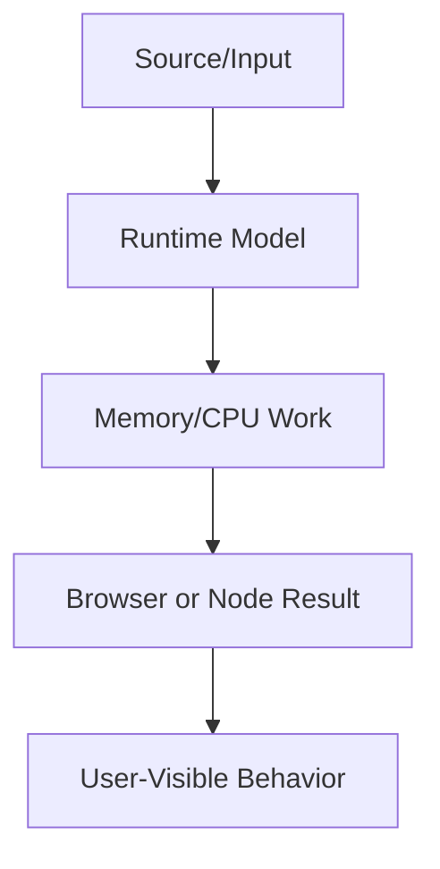

# JavaScript Foundations

This volume contains domain-specific senior-level notes for: Variables, Data Types, Type Coercion, Scope, Hoisting, Execution Context, Closures, this, Objects, Prototypes, Classes.



## Variables

### What it is
Variables are named bindings to values, not boxes that always contain objects.

### Why it exists
Bindings let code refer to changing or constant values across scopes.

### Source-code / internal model
let/const create lexical bindings; var is function-scoped; assignments update binding values or object contents.

### Architecture diagram


### Production React example
Feature flags and derived UI state must use clear binding ownership.

```tsx
const VariablesExample = {
  input: "dashboard filter, route transition, or API response",
  failureMode: "stale state, remount, blocked input, or unsafe data sink",
  metric: "React Profiler commit time, Chrome long task, heap growth, or Web Vital",
};
```

### Debugging scenario
Unexpected mutation often comes from changing an object referenced by a const binding.

### Performance profiling example
No runtime issue alone; clarity prevents stale closures and mutation bugs.

### Product-company interview prompts
- Asked: var vs let vs const, reassignment vs mutation.
- Explain one production incident involving Variables and how you would prevent recurrence.
- Implement or design a minimal example of Variables while narrating correctness, edge cases, and trade-offs.

### Senior-engineer checklist
- What owns the data or behavior?
- What can make it stale, slow, inaccessible, insecure, or hard to test?
- What instrumentation proves it works in production?
- What API would you expose to a team so misuse is difficult?

## Data Types

### What it is
JavaScript types include primitives, objects, functions, symbols, BigInt, null, and undefined.

### Why it exists
Types define operations, equality, serialization, and engine optimization behavior.

### Source-code / internal model
Primitives are immutable values; objects are reference values with prototype links and shapes.

### Architecture diagram


### Production React example
API parsing must validate unknown JSON before treating it as typed domain data.

```tsx
const DataTypesExample = {
  input: "dashboard filter, route transition, or API response",
  failureMode: "stale state, remount, blocked input, or unsafe data sink",
  metric: "React Profiler commit time, Chrome long task, heap growth, or Web Vital",
};
```

### Debugging scenario
NaN, null, undefined, Date, and numeric strings are common production data bugs.

### Performance profiling example
Stable object shapes and numeric arrays help engine optimization.

### Product-company interview prompts
- Asked: typeof null, NaN, primitive vs reference, equality.
- Explain one production incident involving Data Types and how you would prevent recurrence.
- Implement or design a minimal example of Data Types while narrating correctness, edge cases, and trade-offs.

### Senior-engineer checklist
- What owns the data or behavior?
- What can make it stale, slow, inaccessible, insecure, or hard to test?
- What instrumentation proves it works in production?
- What API would you expose to a team so misuse is difficult?

## Type Coercion

### What it is
Type coercion is JavaScript converting values implicitly or explicitly between types.

### Why it exists
It exists for legacy web compatibility and ergonomic operators, but creates traps.

### Source-code / internal model
Abstract equality, addition, relational comparison, ToPrimitive, ToNumber, and ToString drive coercion.

### Architecture diagram


### Production React example
Form inputs arrive as strings, so price/quantity calculations must parse deliberately.

```tsx
const TypeCoercionExample = {
  input: "dashboard filter, route transition, or API response",
  failureMode: "stale state, remount, blocked input, or unsafe data sink",
  metric: "React Profiler commit time, Chrome long task, heap growth, or Web Vital",
};
```

### Debugging scenario
Bugs like "10" + 2 becoming "102" come from implicit string concatenation.

### Performance profiling example
Explicit parsing avoids repeated conversion and logic errors.

### Product-company interview prompts
- Asked: == vs === and [] + {} style puzzles.
- Explain one production incident involving Type Coercion and how you would prevent recurrence.
- Implement or design a minimal example of Type Coercion while narrating correctness, edge cases, and trade-offs.

### Senior-engineer checklist
- What owns the data or behavior?
- What can make it stale, slow, inaccessible, insecure, or hard to test?
- What instrumentation proves it works in production?
- What API would you expose to a team so misuse is difficult?

## Scope

### What it is
Scope is where a binding can be referenced.

### Why it exists
It prevents name collisions and enables closures.

### Source-code / internal model
Lexical scope is determined by source structure; the scope chain resolves identifiers outward.

### Architecture diagram


### Production React example
Module scope protects utilities from globals in large apps.

```tsx
const ScopeExample = {
  input: "dashboard filter, route transition, or API response",
  failureMode: "stale state, remount, blocked input, or unsafe data sink",
  metric: "React Profiler commit time, Chrome long task, heap growth, or Web Vital",
};
```

### Debugging scenario
Shadowed variables cause wrong values in callbacks.

### Performance profiling example
Scope lookup is optimized, but avoid global mutable state for architecture.

### Product-company interview prompts
- Asked: lexical vs dynamic scope and block scope.
- Explain one production incident involving Scope and how you would prevent recurrence.
- Implement or design a minimal example of Scope while narrating correctness, edge cases, and trade-offs.

### Senior-engineer checklist
- What owns the data or behavior?
- What can make it stale, slow, inaccessible, insecure, or hard to test?
- What instrumentation proves it works in production?
- What API would you expose to a team so misuse is difficult?

## Hoisting

### What it is
Hoisting describes creation-phase binding setup before code execution.

### Why it exists
It explains why some declarations are usable before their line of code and why let/const have a temporal dead zone.

### Source-code / internal model
var is initialized to undefined; let/const are created but stay in the temporal dead zone; function declarations get callable bindings.

### Architecture diagram


### Production React example
Module initialization order and circular imports require hoisting knowledge.

```tsx
const HoistingExample = {
  input: "dashboard filter, route transition, or API response",
  failureMode: "stale state, remount, blocked input, or unsafe data sink",
  metric: "React Profiler commit time, Chrome long task, heap growth, or Web Vital",
};
```

### Debugging scenario
ReferenceError before initialization usually means TDZ, not missing variable.

### Performance profiling example
No direct performance cost; clarity improves by declaring before use.

### Product-company interview prompts
- Asked often: console.log(a); var/let/const/function outputs and why.
- Explain one production incident involving Hoisting and how you would prevent recurrence.
- Implement or design a minimal example of Hoisting while narrating correctness, edge cases, and trade-offs.

### Senior-engineer checklist
- What owns the data or behavior?
- What can make it stale, slow, inaccessible, insecure, or hard to test?
- What instrumentation proves it works in production?
- What API would you expose to a team so misuse is difficult?

## Execution Context

### What it is
Execution context is the runtime record for running code: variable environment, lexical environment, this binding, and outer reference.

### Why it exists
It gives JavaScript a concrete runtime record for bindings, scope chain, this, and stack traces.

### Source-code / internal model
Global, function, eval, and module contexts push stack frames; creation phase allocates bindings, execution phase evaluates code.

### Architecture diagram


### Production React example
Debugging stack traces and closure memory retention requires execution-context knowledge.

```tsx
const ExecutionContextExample = {
  input: "dashboard filter, route transition, or API response",
  failureMode: "stale state, remount, blocked input, or unsafe data sink",
  metric: "React Profiler commit time, Chrome long task, heap growth, or Web Vital",
};
```

### Debugging scenario
A wrong this value or missing variable often traces to the current context and outer lexical chain.

### Performance profiling example
Deep recursion grows stack; heavy closures can retain contexts longer than expected.

### Product-company interview prompts
- Interviews ask: call stack, lexical environment, scope chain, and creation vs execution phase.
- Explain one production incident involving Execution Context and how you would prevent recurrence.
- Implement or design a minimal example of Execution Context while narrating correctness, edge cases, and trade-offs.

### Senior-engineer checklist
- What owns the data or behavior?
- What can make it stale, slow, inaccessible, insecure, or hard to test?
- What instrumentation proves it works in production?
- What API would you expose to a team so misuse is difficult?

## Closures

### What it is
A closure is a function retaining access to its lexical environment after the outer function has returned.

### Why it exists
They let functions remember lexical state, enabling callbacks, memoization, factories, and React hook behavior.

### Source-code / internal model
Engines keep captured variables reachable on the heap through environment records referenced by functions.

### Architecture diagram


### Production React example
React hooks use closures for event handlers and effects; stale closure bugs appear when dependencies are wrong.

```tsx
const ClosuresExample = {
  input: "dashboard filter, route transition, or API response",
  failureMode: "stale state, remount, blocked input, or unsafe data sink",
  metric: "React Profiler commit time, Chrome long task, heap growth, or Web Vital",
};
```

### Debugging scenario
If a click handler sees old state, inspect captured values and dependency arrays.

### Performance profiling example
Memory profiles reveal retained closures holding large objects or DOM nodes.

### Product-company interview prompts
- Interviewers ask: implement once, memoize, debounce, private state, and explain stale closure in hooks.
- Explain one production incident involving Closures and how you would prevent recurrence.
- Implement or design a minimal example of Closures while narrating correctness, edge cases, and trade-offs.

### Senior-engineer checklist
- What owns the data or behavior?
- What can make it stale, slow, inaccessible, insecure, or hard to test?
- What instrumentation proves it works in production?
- What API would you expose to a team so misuse is difficult?

## this

### What it is
`this` is the dynamic receiver value for a function call, not the lexical scope.

### Why it exists
It exists so the same function can operate on different receiver objects and class instances.

### Source-code / internal model
For normal functions, call-site syntax determines this; arrow functions capture lexical this; bind/call/apply set it explicitly.

### Architecture diagram


### Production React example
React class components required method binding; modern code still hits this in SDK callbacks and DOM handlers.

```tsx
const thisExample = {
  input: "dashboard filter, route transition, or API response",
  failureMode: "stale state, remount, blocked input, or unsafe data sink",
  metric: "React Profiler commit time, Chrome long task, heap growth, or Web Vital",
};
```

### Debugging scenario
If this is undefined, inspect whether a method was extracted and passed as a plain callback.

### Performance profiling example
Bound methods and arrow fields allocate differently; avoid unnecessary per-item bindings in huge lists.

### Product-company interview prompts
- Asked: this in object method, arrow function, constructor, event listener, bind/call/apply.
- Explain one production incident involving this and how you would prevent recurrence.
- Implement or design a minimal example of this while narrating correctness, edge cases, and trade-offs.

### Senior-engineer checklist
- What owns the data or behavior?
- What can make it stale, slow, inaccessible, insecure, or hard to test?
- What instrumentation proves it works in production?
- What API would you expose to a team so misuse is difficult?

## Objects

### What it is
Objects are dynamic key-value reference types with prototypes and property descriptors.

### Why it exists
They model records, maps, config, component props, and domain entities.

### Source-code / internal model
Engines optimize stable hidden classes; adding/deleting properties unpredictably can deoptimize.

### Architecture diagram


### Production React example
Normalized entity stores use objects keyed by ID for O(1) lookup.

```tsx
const byId = new Map(items.map(item => [item.id, item]));
const visible = items.filter(item => selectedIds.has(item.id));
```

### Debugging scenario
Prototype pollution and accidental mutation are production risks.

### Performance profiling example
Prefer stable shapes in hot paths and Object.freeze for invariant config.

### Product-company interview prompts
- Asked: property lookup, descriptors, Object.create, shallow copy.
- Explain one production incident involving Objects and how you would prevent recurrence.
- Implement or design a minimal example of Objects while narrating correctness, edge cases, and trade-offs.

### Senior-engineer checklist
- What owns the data or behavior?
- What can make it stale, slow, inaccessible, insecure, or hard to test?
- What instrumentation proves it works in production?
- What API would you expose to a team so misuse is difficult?

## Prototypes

### What it is
Prototypes are delegation links used for property lookup and method sharing.

### Why it exists
They avoid copying methods to every object and power class syntax.

### Source-code / internal model
Lookup checks own properties then prototype chain until null.

### Architecture diagram


### Production React example
Shared model methods or built-in methods like Array.prototype.map rely on prototypes.

```tsx
const PrototypesExample = {
  input: "dashboard filter, route transition, or API response",
  failureMode: "stale state, remount, blocked input, or unsafe data sink",
  metric: "React Profiler commit time, Chrome long task, heap growth, or Web Vital",
};
```

### Debugging scenario
Modifying built-in prototypes can break third-party code.

### Performance profiling example
Prototype lookup is optimized but polluted chains are dangerous.

### Product-company interview prompts
- Asked: __proto__ vs prototype, inheritance, class desugaring.
- Explain one production incident involving Prototypes and how you would prevent recurrence.
- Implement or design a minimal example of Prototypes while narrating correctness, edge cases, and trade-offs.

### Senior-engineer checklist
- What owns the data or behavior?
- What can make it stale, slow, inaccessible, insecure, or hard to test?
- What instrumentation proves it works in production?
- What API would you expose to a team so misuse is difficult?

## Classes

### What it is
Classes are syntax over prototype-based construction with clearer inheritance and private fields.

### Why it exists
They organize stateful domain objects or framework APIs when functions alone are insufficient.

### Source-code / internal model
constructor initializes instances; methods live on prototype; fields are per-instance; private fields are brand-checked.

### Architecture diagram


### Production React example
SDK clients and error classes often use classes in frontend codebases.

```tsx
const ClassesExample = {
  input: "dashboard filter, route transition, or API response",
  failureMode: "stale state, remount, blocked input, or unsafe data sink",
  metric: "React Profiler commit time, Chrome long task, heap growth, or Web Vital",
};
```

### Debugging scenario
Losing this when passing methods as callbacks is common.

### Performance profiling example
Classes can create many instances; avoid per-instance arrow methods in huge lists unless needed.

### Product-company interview prompts
- Asked: class vs function constructor, extends, super, private fields.
- Explain one production incident involving Classes and how you would prevent recurrence.
- Implement or design a minimal example of Classes while narrating correctness, edge cases, and trade-offs.

### Senior-engineer checklist
- What owns the data or behavior?
- What can make it stale, slow, inaccessible, insecure, or hard to test?
- What instrumentation proves it works in production?
- What API would you expose to a team so misuse is difficult?

