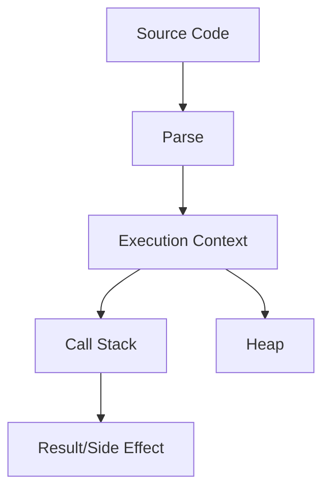

# Volume 02: JavaScript Foundations

This volume covers JavaScript Foundations from beginner foundations to teaching-level mastery. Each topic follows the required repository structure and links internals to production frontend work.

## Volume Learning Order

Variables -> Data Types -> Type Coercion -> Scope -> Hoisting -> Execution Context -> Closures -> this -> Objects -> Prototypes -> Classes

# Variables

## Introduction

Variables is a foundational JavaScript Foundations topic. Mastery means you can use it correctly, predict its behavior, debug production issues, explain internals, and connect it to interviews, architecture, accessibility, security, and performance.

## Why This Concept Exists

* What problem does it solve? It reduces ambiguity around how frontend systems represent data, run code, render UI, communicate over networks, and recover from failure.
* Why was it introduced? It emerged because applications needed more predictable, reusable, observable, and scalable ways to manage complexity.

## Core Fundamentals

- Definition: know the exact vocabulary for Variables.
- Contract: identify inputs, outputs, side effects, ownership, lifecycle, and cleanup.
- Boundaries: separate language behavior, browser behavior, framework behavior, and application policy.
- Correctness: cover happy path, loading path, empty state, error state, retry path, and cleanup path.
- Production readiness: include tests, monitoring, documentation, performance budgets, and accessibility/security review where relevant.

## Internal Working

Explain step-by-step what happens internally.

JavaScript engines parse source, create execution contexts, allocate primitives on stack-like records and objects on the heap, execute through an interpreter/JIT, and reclaim unreachable memory with garbage collection.

For JavaScript topics:

* Memory: primitives are stored directly in execution records where possible; objects, arrays, functions, and closures live on the heap and are referenced.
* Execution Context: creation phase builds bindings and scope links; execution phase evaluates statements and expressions.
* Call Stack: synchronous frames push and pop; long frames block input and rendering.
* Engine Behavior: engines optimize stable shapes and predictable types, but can deoptimize polymorphic or megamorphic hot paths.

For React topics:

* Rendering: React calls components to describe UI.
* Reconciliation: React compares previous and next element trees using type and key.
* Fiber: work is represented as interruptible units linked in a tree.
* Scheduler: urgent updates can be prioritized over non-urgent rendering.

For Browser topics:

* DOM: parsed HTML becomes nodes and relationships.
* CSSOM: CSS becomes matched style rules.
* Rendering Pipeline: style, layout, paint, and composite turn data into pixels.

## Mental Models

- Restaurant analogy: Variables is like the workflow between order taking, kitchen preparation, serving, and cleanup.
- Airport analogy: requests and events move through queues, priorities, gates, and security checks.
- Library analogy: references point to books on shelves; losing the catalog reference makes a book eligible for cleanup.
- Warehouse analogy: caching and indexing trade storage cost for faster retrieval.

## Visual Diagrams



## Step-by-Step Examples

```js
const topic = "Variables";
console.log(`Learning ${topic} deeply`);
```

Line-by-line explanation:

1. Identify declarations and allocate necessary bindings.
2. Create runtime values or references.
3. Execute the synchronous part first.
4. Schedule asynchronous, rendering, or cleanup work if present.
5. Observe the final state through logs, UI, network panel, profiler, or tests.

Specific explanation: This minimal snippet creates, stores, and reads a value related to Variables; expand it with real inputs, errors, and measurement.

## Memory Visualizations

```text
Stack / Execution Records
main() frame
  local binding -> ref:0x001

Heap
0x001 -> { topic: "Variables", lifecycle: "created -> used -> cleaned" }

GC rule
reachable from stack/module/global/subscription => kept
unreachable after cleanup => collectible
```

## Real-World Use Cases

- React hooks and component state synchronization.
- React Query or cache invalidation workflows.
- Debouncing input and avoiding unnecessary network calls.
- Authentication, authorization, and guarded routes.
- Notifications, chat, optimistic updates, uploads, and realtime dashboards.

## Common Mistakes

- Treating Variables as syntax instead of a lifecycle and ownership problem.
- Forgetting cleanup for listeners, timers, subscriptions, observers, or pending requests.
- Confusing microtasks, tasks, render work, and React commits.
- Ignoring empty, duplicate, stale, failed, or slow states.
- Adding abstractions before the problem repeats.

## Best Practices

- Make ownership explicit.
- Keep side effects at boundaries.
- Prefer native browser semantics before custom JavaScript.
- Add tests for normal, boundary, and failure behavior.
- Document invariants and trade-offs.

## Performance Considerations

- Time complexity: identify whether work is O(1), O(n), O(n log n), or worse.
- Space complexity: track retained objects, caches, closures, and subscriptions.
- Rendering cost: avoid unnecessary DOM work, style recalculation, layout, paint, and React re-renders.
- Re-renders: stabilize keys, props, callbacks, and derived data only when measurement shows benefit.
- Memory impact: release references and cap cache size.

## Edge Cases

- Null, undefined, empty arrays, duplicate IDs, and unexpected types.
- Slow network, offline mode, retries, cancellation, and race conditions.
- Browser tab suspension and page visibility changes.
- Server/client mismatches during hydration.
- Accessibility states such as focus, disabled, expanded, selected, and live updates.

## Interview Questions

### Beginner Questions

1. Define Variables?
2. Why does production code need Variables?
3. Show a simple example of Variables?
4. What problem is solved by Variables?
5. What breaks when misusing Variables?
6. How do you debug Variables?
7. What browser or engine behavior affects Variables?
8. What React behavior affects Variables?
9. What performance metric is impacted by Variables?
10. How would you teach Variables?

### Intermediate Questions

1. Compare trade-offs of Variables in a real app?
2. Describe memory implications of Variables in a real app?
3. Explain async or rendering order for Variables in a real app?
4. Design a reusable abstraction around Variables in a real app?
5. List edge cases for Variables in a real app?
6. Write tests for Variables in a real app?
7. Profile bottlenecks caused by Variables in a real app?
8. Connect security concerns to Variables in a real app?
9. Explain failure recovery for Variables in a real app?
10. Refactor legacy usage of Variables in a real app?

### Advanced Questions

1. Explain internals of Variables under scale?
2. How would you optimize Variables under scale?
3. How would you design observability for Variables under scale?
4. What deoptimization or reconciliation pitfalls affect Variables under scale?
5. How do concurrent updates change Variables under scale?
6. How would you document invariants for Variables under scale?
7. How would you migrate a large codebase using Variables under scale?
8. How would you prevent regressions in Variables under scale?
9. How would you answer a staff-level interview about Variables under scale?
10. What are the hidden trade-offs of Variables under scale?

## Coding Challenges

1. Build a minimal demo for Variables and log every lifecycle step.
2. Add input validation and error handling.
3. Add cleanup logic and prove it with a test.
4. Profile the implementation and remove one bottleneck.
5. Convert the demo into a reusable production-style API.

## Assignments

1. Write a one-page beginner explanation with a diagram.
2. Create an interview answer bank with short and long answers.
3. Build a production checklist covering tests, performance, accessibility, and security.

## Mini Projects

- Build a small dashboard feature that uses Variables, includes loading/error/empty states, has tests, exposes metrics, and documents trade-offs.

## Revision Notes

Variables: definition, problem solved, lifecycle, memory model, browser/React impact, failure modes, performance cost, debugging tools, and one production example.

## Cheat Sheet

| Need | Reminder |
| --- | --- |
| Define | State what Variables is in one sentence. |
| Debug | Inspect stack, heap references, events, network, render commits, and logs. |
| Optimize | Measure first, then reduce repeated work or retained memory. |
| Interview | Answer with definition, example, internals, edge cases, trade-offs. |

## Teaching Notes

- A beginner: use one analogy and one tiny example.
- A junior developer: add lifecycle, pitfalls, and debugging workflow.
- A senior developer: discuss trade-offs, scale, observability, migration, and failure isolation.

## FAQs

1. What is Variables? It is a core concept in JavaScript Foundations used to reason about frontend behavior.
2. Why should I learn it? It appears in bugs, architecture, and interviews.
3. Is it language-level or browser-level? It may involve both; separate the layers.
4. How do I debug it? Reproduce, isolate, inspect runtime state, and add targeted tests.
5. What is the biggest beginner mistake? Memorizing behavior without understanding lifecycle.
6. What is the biggest production mistake? Forgetting cleanup, failure states, or monitoring.
7. How does it affect performance? Through CPU time, memory retention, rendering, network, or bundle size.
8. How does React change the story? React adds render, reconciliation, commit, and scheduling semantics.
9. What should I say in interviews? Define it, show an example, explain internals, and discuss trade-offs.
10. How do I teach it? Start with analogy, then code, then internals, then production scenario.

## Related Topics

Variables -> Scope -> Execution Context -> Event Loop -> Browser Rendering -> React Rendering -> Testing -> Performance -> System Design

# Data Types

## Introduction

Data Types is a foundational JavaScript Foundations topic. Mastery means you can use it correctly, predict its behavior, debug production issues, explain internals, and connect it to interviews, architecture, accessibility, security, and performance.

## Why This Concept Exists

* What problem does it solve? It reduces ambiguity around how frontend systems represent data, run code, render UI, communicate over networks, and recover from failure.
* Why was it introduced? It emerged because applications needed more predictable, reusable, observable, and scalable ways to manage complexity.

## Core Fundamentals

- Definition: know the exact vocabulary for Data Types.
- Contract: identify inputs, outputs, side effects, ownership, lifecycle, and cleanup.
- Boundaries: separate language behavior, browser behavior, framework behavior, and application policy.
- Correctness: cover happy path, loading path, empty state, error state, retry path, and cleanup path.
- Production readiness: include tests, monitoring, documentation, performance budgets, and accessibility/security review where relevant.

## Internal Working

Explain step-by-step what happens internally.

JavaScript engines parse source, create execution contexts, allocate primitives on stack-like records and objects on the heap, execute through an interpreter/JIT, and reclaim unreachable memory with garbage collection.

For JavaScript topics:

* Memory: primitives are stored directly in execution records where possible; objects, arrays, functions, and closures live on the heap and are referenced.
* Execution Context: creation phase builds bindings and scope links; execution phase evaluates statements and expressions.
* Call Stack: synchronous frames push and pop; long frames block input and rendering.
* Engine Behavior: engines optimize stable shapes and predictable types, but can deoptimize polymorphic or megamorphic hot paths.

For React topics:

* Rendering: React calls components to describe UI.
* Reconciliation: React compares previous and next element trees using type and key.
* Fiber: work is represented as interruptible units linked in a tree.
* Scheduler: urgent updates can be prioritized over non-urgent rendering.

For Browser topics:

* DOM: parsed HTML becomes nodes and relationships.
* CSSOM: CSS becomes matched style rules.
* Rendering Pipeline: style, layout, paint, and composite turn data into pixels.

## Mental Models

- Restaurant analogy: Data Types is like the workflow between order taking, kitchen preparation, serving, and cleanup.
- Airport analogy: requests and events move through queues, priorities, gates, and security checks.
- Library analogy: references point to books on shelves; losing the catalog reference makes a book eligible for cleanup.
- Warehouse analogy: caching and indexing trade storage cost for faster retrieval.

## Visual Diagrams


## Step-by-Step Examples

```js
const topic = "Data Types";
console.log(`Learning ${topic} deeply`);
```

Line-by-line explanation:

1. Identify declarations and allocate necessary bindings.
2. Create runtime values or references.
3. Execute the synchronous part first.
4. Schedule asynchronous, rendering, or cleanup work if present.
5. Observe the final state through logs, UI, network panel, profiler, or tests.

Specific explanation: This minimal snippet creates, stores, and reads a value related to Data Types; expand it with real inputs, errors, and measurement.

## Memory Visualizations

```text
Stack / Execution Records
main() frame
  local binding -> ref:0x001

Heap
0x001 -> { topic: "Data Types", lifecycle: "created -> used -> cleaned" }

GC rule
reachable from stack/module/global/subscription => kept
unreachable after cleanup => collectible
```

## Real-World Use Cases

- React hooks and component state synchronization.
- React Query or cache invalidation workflows.
- Debouncing input and avoiding unnecessary network calls.
- Authentication, authorization, and guarded routes.
- Notifications, chat, optimistic updates, uploads, and realtime dashboards.

## Common Mistakes

- Treating Data Types as syntax instead of a lifecycle and ownership problem.
- Forgetting cleanup for listeners, timers, subscriptions, observers, or pending requests.
- Confusing microtasks, tasks, render work, and React commits.
- Ignoring empty, duplicate, stale, failed, or slow states.
- Adding abstractions before the problem repeats.

## Best Practices

- Make ownership explicit.
- Keep side effects at boundaries.
- Prefer native browser semantics before custom JavaScript.
- Add tests for normal, boundary, and failure behavior.
- Document invariants and trade-offs.

## Performance Considerations

- Time complexity: identify whether work is O(1), O(n), O(n log n), or worse.
- Space complexity: track retained objects, caches, closures, and subscriptions.
- Rendering cost: avoid unnecessary DOM work, style recalculation, layout, paint, and React re-renders.
- Re-renders: stabilize keys, props, callbacks, and derived data only when measurement shows benefit.
- Memory impact: release references and cap cache size.

## Edge Cases

- Null, undefined, empty arrays, duplicate IDs, and unexpected types.
- Slow network, offline mode, retries, cancellation, and race conditions.
- Browser tab suspension and page visibility changes.
- Server/client mismatches during hydration.
- Accessibility states such as focus, disabled, expanded, selected, and live updates.

## Interview Questions

### Beginner Questions

1. Define Data Types?
2. Why does production code need Data Types?
3. Show a simple example of Data Types?
4. What problem is solved by Data Types?
5. What breaks when misusing Data Types?
6. How do you debug Data Types?
7. What browser or engine behavior affects Data Types?
8. What React behavior affects Data Types?
9. What performance metric is impacted by Data Types?
10. How would you teach Data Types?

### Intermediate Questions

1. Compare trade-offs of Data Types in a real app?
2. Describe memory implications of Data Types in a real app?
3. Explain async or rendering order for Data Types in a real app?
4. Design a reusable abstraction around Data Types in a real app?
5. List edge cases for Data Types in a real app?
6. Write tests for Data Types in a real app?
7. Profile bottlenecks caused by Data Types in a real app?
8. Connect security concerns to Data Types in a real app?
9. Explain failure recovery for Data Types in a real app?
10. Refactor legacy usage of Data Types in a real app?

### Advanced Questions

1. Explain internals of Data Types under scale?
2. How would you optimize Data Types under scale?
3. How would you design observability for Data Types under scale?
4. What deoptimization or reconciliation pitfalls affect Data Types under scale?
5. How do concurrent updates change Data Types under scale?
6. How would you document invariants for Data Types under scale?
7. How would you migrate a large codebase using Data Types under scale?
8. How would you prevent regressions in Data Types under scale?
9. How would you answer a staff-level interview about Data Types under scale?
10. What are the hidden trade-offs of Data Types under scale?

## Coding Challenges

1. Build a minimal demo for Data Types and log every lifecycle step.
2. Add input validation and error handling.
3. Add cleanup logic and prove it with a test.
4. Profile the implementation and remove one bottleneck.
5. Convert the demo into a reusable production-style API.

## Assignments

1. Write a one-page beginner explanation with a diagram.
2. Create an interview answer bank with short and long answers.
3. Build a production checklist covering tests, performance, accessibility, and security.

## Mini Projects

- Build a small dashboard feature that uses Data Types, includes loading/error/empty states, has tests, exposes metrics, and documents trade-offs.

## Revision Notes

Data Types: definition, problem solved, lifecycle, memory model, browser/React impact, failure modes, performance cost, debugging tools, and one production example.

## Cheat Sheet

| Need | Reminder |
| --- | --- |
| Define | State what Data Types is in one sentence. |
| Debug | Inspect stack, heap references, events, network, render commits, and logs. |
| Optimize | Measure first, then reduce repeated work or retained memory. |
| Interview | Answer with definition, example, internals, edge cases, trade-offs. |

## Teaching Notes

- A beginner: use one analogy and one tiny example.
- A junior developer: add lifecycle, pitfalls, and debugging workflow.
- A senior developer: discuss trade-offs, scale, observability, migration, and failure isolation.

## FAQs

1. What is Data Types? It is a core concept in JavaScript Foundations used to reason about frontend behavior.
2. Why should I learn it? It appears in bugs, architecture, and interviews.
3. Is it language-level or browser-level? It may involve both; separate the layers.
4. How do I debug it? Reproduce, isolate, inspect runtime state, and add targeted tests.
5. What is the biggest beginner mistake? Memorizing behavior without understanding lifecycle.
6. What is the biggest production mistake? Forgetting cleanup, failure states, or monitoring.
7. How does it affect performance? Through CPU time, memory retention, rendering, network, or bundle size.
8. How does React change the story? React adds render, reconciliation, commit, and scheduling semantics.
9. What should I say in interviews? Define it, show an example, explain internals, and discuss trade-offs.
10. How do I teach it? Start with analogy, then code, then internals, then production scenario.

## Related Topics

Data Types -> Scope -> Execution Context -> Event Loop -> Browser Rendering -> React Rendering -> Testing -> Performance -> System Design

# Type Coercion

## Introduction

Type Coercion is a foundational JavaScript Foundations topic. Mastery means you can use it correctly, predict its behavior, debug production issues, explain internals, and connect it to interviews, architecture, accessibility, security, and performance.

## Why This Concept Exists

* What problem does it solve? It reduces ambiguity around how frontend systems represent data, run code, render UI, communicate over networks, and recover from failure.
* Why was it introduced? It emerged because applications needed more predictable, reusable, observable, and scalable ways to manage complexity.

## Core Fundamentals

- Definition: know the exact vocabulary for Type Coercion.
- Contract: identify inputs, outputs, side effects, ownership, lifecycle, and cleanup.
- Boundaries: separate language behavior, browser behavior, framework behavior, and application policy.
- Correctness: cover happy path, loading path, empty state, error state, retry path, and cleanup path.
- Production readiness: include tests, monitoring, documentation, performance budgets, and accessibility/security review where relevant.

## Internal Working

Explain step-by-step what happens internally.

JavaScript engines parse source, create execution contexts, allocate primitives on stack-like records and objects on the heap, execute through an interpreter/JIT, and reclaim unreachable memory with garbage collection.

For JavaScript topics:

* Memory: primitives are stored directly in execution records where possible; objects, arrays, functions, and closures live on the heap and are referenced.
* Execution Context: creation phase builds bindings and scope links; execution phase evaluates statements and expressions.
* Call Stack: synchronous frames push and pop; long frames block input and rendering.
* Engine Behavior: engines optimize stable shapes and predictable types, but can deoptimize polymorphic or megamorphic hot paths.

For React topics:

* Rendering: React calls components to describe UI.
* Reconciliation: React compares previous and next element trees using type and key.
* Fiber: work is represented as interruptible units linked in a tree.
* Scheduler: urgent updates can be prioritized over non-urgent rendering.

For Browser topics:

* DOM: parsed HTML becomes nodes and relationships.
* CSSOM: CSS becomes matched style rules.
* Rendering Pipeline: style, layout, paint, and composite turn data into pixels.

## Mental Models

- Restaurant analogy: Type Coercion is like the workflow between order taking, kitchen preparation, serving, and cleanup.
- Airport analogy: requests and events move through queues, priorities, gates, and security checks.
- Library analogy: references point to books on shelves; losing the catalog reference makes a book eligible for cleanup.
- Warehouse analogy: caching and indexing trade storage cost for faster retrieval.

## Visual Diagrams


## Step-by-Step Examples

```js
const topic = "Type Coercion";
console.log(`Learning ${topic} deeply`);
```

Line-by-line explanation:

1. Identify declarations and allocate necessary bindings.
2. Create runtime values or references.
3. Execute the synchronous part first.
4. Schedule asynchronous, rendering, or cleanup work if present.
5. Observe the final state through logs, UI, network panel, profiler, or tests.

Specific explanation: This minimal snippet creates, stores, and reads a value related to Type Coercion; expand it with real inputs, errors, and measurement.

## Memory Visualizations

```text
Stack / Execution Records
main() frame
  local binding -> ref:0x001

Heap
0x001 -> { topic: "Type Coercion", lifecycle: "created -> used -> cleaned" }

GC rule
reachable from stack/module/global/subscription => kept
unreachable after cleanup => collectible
```

## Real-World Use Cases

- React hooks and component state synchronization.
- React Query or cache invalidation workflows.
- Debouncing input and avoiding unnecessary network calls.
- Authentication, authorization, and guarded routes.
- Notifications, chat, optimistic updates, uploads, and realtime dashboards.

## Common Mistakes

- Treating Type Coercion as syntax instead of a lifecycle and ownership problem.
- Forgetting cleanup for listeners, timers, subscriptions, observers, or pending requests.
- Confusing microtasks, tasks, render work, and React commits.
- Ignoring empty, duplicate, stale, failed, or slow states.
- Adding abstractions before the problem repeats.

## Best Practices

- Make ownership explicit.
- Keep side effects at boundaries.
- Prefer native browser semantics before custom JavaScript.
- Add tests for normal, boundary, and failure behavior.
- Document invariants and trade-offs.

## Performance Considerations

- Time complexity: identify whether work is O(1), O(n), O(n log n), or worse.
- Space complexity: track retained objects, caches, closures, and subscriptions.
- Rendering cost: avoid unnecessary DOM work, style recalculation, layout, paint, and React re-renders.
- Re-renders: stabilize keys, props, callbacks, and derived data only when measurement shows benefit.
- Memory impact: release references and cap cache size.

## Edge Cases

- Null, undefined, empty arrays, duplicate IDs, and unexpected types.
- Slow network, offline mode, retries, cancellation, and race conditions.
- Browser tab suspension and page visibility changes.
- Server/client mismatches during hydration.
- Accessibility states such as focus, disabled, expanded, selected, and live updates.

## Interview Questions

### Beginner Questions

1. Define Type Coercion?
2. Why does production code need Type Coercion?
3. Show a simple example of Type Coercion?
4. What problem is solved by Type Coercion?
5. What breaks when misusing Type Coercion?
6. How do you debug Type Coercion?
7. What browser or engine behavior affects Type Coercion?
8. What React behavior affects Type Coercion?
9. What performance metric is impacted by Type Coercion?
10. How would you teach Type Coercion?

### Intermediate Questions

1. Compare trade-offs of Type Coercion in a real app?
2. Describe memory implications of Type Coercion in a real app?
3. Explain async or rendering order for Type Coercion in a real app?
4. Design a reusable abstraction around Type Coercion in a real app?
5. List edge cases for Type Coercion in a real app?
6. Write tests for Type Coercion in a real app?
7. Profile bottlenecks caused by Type Coercion in a real app?
8. Connect security concerns to Type Coercion in a real app?
9. Explain failure recovery for Type Coercion in a real app?
10. Refactor legacy usage of Type Coercion in a real app?

### Advanced Questions

1. Explain internals of Type Coercion under scale?
2. How would you optimize Type Coercion under scale?
3. How would you design observability for Type Coercion under scale?
4. What deoptimization or reconciliation pitfalls affect Type Coercion under scale?
5. How do concurrent updates change Type Coercion under scale?
6. How would you document invariants for Type Coercion under scale?
7. How would you migrate a large codebase using Type Coercion under scale?
8. How would you prevent regressions in Type Coercion under scale?
9. How would you answer a staff-level interview about Type Coercion under scale?
10. What are the hidden trade-offs of Type Coercion under scale?

## Coding Challenges

1. Build a minimal demo for Type Coercion and log every lifecycle step.
2. Add input validation and error handling.
3. Add cleanup logic and prove it with a test.
4. Profile the implementation and remove one bottleneck.
5. Convert the demo into a reusable production-style API.

## Assignments

1. Write a one-page beginner explanation with a diagram.
2. Create an interview answer bank with short and long answers.
3. Build a production checklist covering tests, performance, accessibility, and security.

## Mini Projects

- Build a small dashboard feature that uses Type Coercion, includes loading/error/empty states, has tests, exposes metrics, and documents trade-offs.

## Revision Notes

Type Coercion: definition, problem solved, lifecycle, memory model, browser/React impact, failure modes, performance cost, debugging tools, and one production example.

## Cheat Sheet

| Need | Reminder |
| --- | --- |
| Define | State what Type Coercion is in one sentence. |
| Debug | Inspect stack, heap references, events, network, render commits, and logs. |
| Optimize | Measure first, then reduce repeated work or retained memory. |
| Interview | Answer with definition, example, internals, edge cases, trade-offs. |

## Teaching Notes

- A beginner: use one analogy and one tiny example.
- A junior developer: add lifecycle, pitfalls, and debugging workflow.
- A senior developer: discuss trade-offs, scale, observability, migration, and failure isolation.

## FAQs

1. What is Type Coercion? It is a core concept in JavaScript Foundations used to reason about frontend behavior.
2. Why should I learn it? It appears in bugs, architecture, and interviews.
3. Is it language-level or browser-level? It may involve both; separate the layers.
4. How do I debug it? Reproduce, isolate, inspect runtime state, and add targeted tests.
5. What is the biggest beginner mistake? Memorizing behavior without understanding lifecycle.
6. What is the biggest production mistake? Forgetting cleanup, failure states, or monitoring.
7. How does it affect performance? Through CPU time, memory retention, rendering, network, or bundle size.
8. How does React change the story? React adds render, reconciliation, commit, and scheduling semantics.
9. What should I say in interviews? Define it, show an example, explain internals, and discuss trade-offs.
10. How do I teach it? Start with analogy, then code, then internals, then production scenario.

## Related Topics

Type Coercion -> Scope -> Execution Context -> Event Loop -> Browser Rendering -> React Rendering -> Testing -> Performance -> System Design

# Scope

## Introduction

Scope is a foundational JavaScript Foundations topic. Mastery means you can use it correctly, predict its behavior, debug production issues, explain internals, and connect it to interviews, architecture, accessibility, security, and performance.

## Why This Concept Exists

* What problem does it solve? It reduces ambiguity around how frontend systems represent data, run code, render UI, communicate over networks, and recover from failure.
* Why was it introduced? It emerged because applications needed more predictable, reusable, observable, and scalable ways to manage complexity.

## Core Fundamentals

- Definition: know the exact vocabulary for Scope.
- Contract: identify inputs, outputs, side effects, ownership, lifecycle, and cleanup.
- Boundaries: separate language behavior, browser behavior, framework behavior, and application policy.
- Correctness: cover happy path, loading path, empty state, error state, retry path, and cleanup path.
- Production readiness: include tests, monitoring, documentation, performance budgets, and accessibility/security review where relevant.

## Internal Working

Explain step-by-step what happens internally.

JavaScript engines parse source, create execution contexts, allocate primitives on stack-like records and objects on the heap, execute through an interpreter/JIT, and reclaim unreachable memory with garbage collection.

For JavaScript topics:

* Memory: primitives are stored directly in execution records where possible; objects, arrays, functions, and closures live on the heap and are referenced.
* Execution Context: creation phase builds bindings and scope links; execution phase evaluates statements and expressions.
* Call Stack: synchronous frames push and pop; long frames block input and rendering.
* Engine Behavior: engines optimize stable shapes and predictable types, but can deoptimize polymorphic or megamorphic hot paths.

For React topics:

* Rendering: React calls components to describe UI.
* Reconciliation: React compares previous and next element trees using type and key.
* Fiber: work is represented as interruptible units linked in a tree.
* Scheduler: urgent updates can be prioritized over non-urgent rendering.

For Browser topics:

* DOM: parsed HTML becomes nodes and relationships.
* CSSOM: CSS becomes matched style rules.
* Rendering Pipeline: style, layout, paint, and composite turn data into pixels.

## Mental Models

- Restaurant analogy: Scope is like the workflow between order taking, kitchen preparation, serving, and cleanup.
- Airport analogy: requests and events move through queues, priorities, gates, and security checks.
- Library analogy: references point to books on shelves; losing the catalog reference makes a book eligible for cleanup.
- Warehouse analogy: caching and indexing trade storage cost for faster retrieval.

## Visual Diagrams


## Step-by-Step Examples

```js
const topic = "Scope";
console.log(`Learning ${topic} deeply`);
```

Line-by-line explanation:

1. Identify declarations and allocate necessary bindings.
2. Create runtime values or references.
3. Execute the synchronous part first.
4. Schedule asynchronous, rendering, or cleanup work if present.
5. Observe the final state through logs, UI, network panel, profiler, or tests.

Specific explanation: This minimal snippet creates, stores, and reads a value related to Scope; expand it with real inputs, errors, and measurement.

## Memory Visualizations

```text
Stack / Execution Records
main() frame
  local binding -> ref:0x001

Heap
0x001 -> { topic: "Scope", lifecycle: "created -> used -> cleaned" }

GC rule
reachable from stack/module/global/subscription => kept
unreachable after cleanup => collectible
```

## Real-World Use Cases

- React hooks and component state synchronization.
- React Query or cache invalidation workflows.
- Debouncing input and avoiding unnecessary network calls.
- Authentication, authorization, and guarded routes.
- Notifications, chat, optimistic updates, uploads, and realtime dashboards.

## Common Mistakes

- Treating Scope as syntax instead of a lifecycle and ownership problem.
- Forgetting cleanup for listeners, timers, subscriptions, observers, or pending requests.
- Confusing microtasks, tasks, render work, and React commits.
- Ignoring empty, duplicate, stale, failed, or slow states.
- Adding abstractions before the problem repeats.

## Best Practices

- Make ownership explicit.
- Keep side effects at boundaries.
- Prefer native browser semantics before custom JavaScript.
- Add tests for normal, boundary, and failure behavior.
- Document invariants and trade-offs.

## Performance Considerations

- Time complexity: identify whether work is O(1), O(n), O(n log n), or worse.
- Space complexity: track retained objects, caches, closures, and subscriptions.
- Rendering cost: avoid unnecessary DOM work, style recalculation, layout, paint, and React re-renders.
- Re-renders: stabilize keys, props, callbacks, and derived data only when measurement shows benefit.
- Memory impact: release references and cap cache size.

## Edge Cases

- Null, undefined, empty arrays, duplicate IDs, and unexpected types.
- Slow network, offline mode, retries, cancellation, and race conditions.
- Browser tab suspension and page visibility changes.
- Server/client mismatches during hydration.
- Accessibility states such as focus, disabled, expanded, selected, and live updates.

## Interview Questions

### Beginner Questions

1. Define Scope?
2. Why does production code need Scope?
3. Show a simple example of Scope?
4. What problem is solved by Scope?
5. What breaks when misusing Scope?
6. How do you debug Scope?
7. What browser or engine behavior affects Scope?
8. What React behavior affects Scope?
9. What performance metric is impacted by Scope?
10. How would you teach Scope?

### Intermediate Questions

1. Compare trade-offs of Scope in a real app?
2. Describe memory implications of Scope in a real app?
3. Explain async or rendering order for Scope in a real app?
4. Design a reusable abstraction around Scope in a real app?
5. List edge cases for Scope in a real app?
6. Write tests for Scope in a real app?
7. Profile bottlenecks caused by Scope in a real app?
8. Connect security concerns to Scope in a real app?
9. Explain failure recovery for Scope in a real app?
10. Refactor legacy usage of Scope in a real app?

### Advanced Questions

1. Explain internals of Scope under scale?
2. How would you optimize Scope under scale?
3. How would you design observability for Scope under scale?
4. What deoptimization or reconciliation pitfalls affect Scope under scale?
5. How do concurrent updates change Scope under scale?
6. How would you document invariants for Scope under scale?
7. How would you migrate a large codebase using Scope under scale?
8. How would you prevent regressions in Scope under scale?
9. How would you answer a staff-level interview about Scope under scale?
10. What are the hidden trade-offs of Scope under scale?

## Coding Challenges

1. Build a minimal demo for Scope and log every lifecycle step.
2. Add input validation and error handling.
3. Add cleanup logic and prove it with a test.
4. Profile the implementation and remove one bottleneck.
5. Convert the demo into a reusable production-style API.

## Assignments

1. Write a one-page beginner explanation with a diagram.
2. Create an interview answer bank with short and long answers.
3. Build a production checklist covering tests, performance, accessibility, and security.

## Mini Projects

- Build a small dashboard feature that uses Scope, includes loading/error/empty states, has tests, exposes metrics, and documents trade-offs.

## Revision Notes

Scope: definition, problem solved, lifecycle, memory model, browser/React impact, failure modes, performance cost, debugging tools, and one production example.

## Cheat Sheet

| Need | Reminder |
| --- | --- |
| Define | State what Scope is in one sentence. |
| Debug | Inspect stack, heap references, events, network, render commits, and logs. |
| Optimize | Measure first, then reduce repeated work or retained memory. |
| Interview | Answer with definition, example, internals, edge cases, trade-offs. |

## Teaching Notes

- A beginner: use one analogy and one tiny example.
- A junior developer: add lifecycle, pitfalls, and debugging workflow.
- A senior developer: discuss trade-offs, scale, observability, migration, and failure isolation.

## FAQs

1. What is Scope? It is a core concept in JavaScript Foundations used to reason about frontend behavior.
2. Why should I learn it? It appears in bugs, architecture, and interviews.
3. Is it language-level or browser-level? It may involve both; separate the layers.
4. How do I debug it? Reproduce, isolate, inspect runtime state, and add targeted tests.
5. What is the biggest beginner mistake? Memorizing behavior without understanding lifecycle.
6. What is the biggest production mistake? Forgetting cleanup, failure states, or monitoring.
7. How does it affect performance? Through CPU time, memory retention, rendering, network, or bundle size.
8. How does React change the story? React adds render, reconciliation, commit, and scheduling semantics.
9. What should I say in interviews? Define it, show an example, explain internals, and discuss trade-offs.
10. How do I teach it? Start with analogy, then code, then internals, then production scenario.

## Related Topics

Scope -> Scope -> Execution Context -> Event Loop -> Browser Rendering -> React Rendering -> Testing -> Performance -> System Design

# Hoisting

## Introduction

Hoisting is a foundational JavaScript Foundations topic. Mastery means you can use it correctly, predict its behavior, debug production issues, explain internals, and connect it to interviews, architecture, accessibility, security, and performance.

## Why This Concept Exists

* What problem does it solve? It reduces ambiguity around how frontend systems represent data, run code, render UI, communicate over networks, and recover from failure.
* Why was it introduced? It emerged because applications needed more predictable, reusable, observable, and scalable ways to manage complexity.

## Core Fundamentals

- Definition: know the exact vocabulary for Hoisting.
- Contract: identify inputs, outputs, side effects, ownership, lifecycle, and cleanup.
- Boundaries: separate language behavior, browser behavior, framework behavior, and application policy.
- Correctness: cover happy path, loading path, empty state, error state, retry path, and cleanup path.
- Production readiness: include tests, monitoring, documentation, performance budgets, and accessibility/security review where relevant.

## Internal Working

Explain step-by-step what happens internally.

JavaScript engines parse source, create execution contexts, allocate primitives on stack-like records and objects on the heap, execute through an interpreter/JIT, and reclaim unreachable memory with garbage collection.

For JavaScript topics:

* Memory: primitives are stored directly in execution records where possible; objects, arrays, functions, and closures live on the heap and are referenced.
* Execution Context: creation phase builds bindings and scope links; execution phase evaluates statements and expressions.
* Call Stack: synchronous frames push and pop; long frames block input and rendering.
* Engine Behavior: engines optimize stable shapes and predictable types, but can deoptimize polymorphic or megamorphic hot paths.

For React topics:

* Rendering: React calls components to describe UI.
* Reconciliation: React compares previous and next element trees using type and key.
* Fiber: work is represented as interruptible units linked in a tree.
* Scheduler: urgent updates can be prioritized over non-urgent rendering.

For Browser topics:

* DOM: parsed HTML becomes nodes and relationships.
* CSSOM: CSS becomes matched style rules.
* Rendering Pipeline: style, layout, paint, and composite turn data into pixels.

## Mental Models

- Restaurant analogy: Hoisting is like the workflow between order taking, kitchen preparation, serving, and cleanup.
- Airport analogy: requests and events move through queues, priorities, gates, and security checks.
- Library analogy: references point to books on shelves; losing the catalog reference makes a book eligible for cleanup.
- Warehouse analogy: caching and indexing trade storage cost for faster retrieval.

## Visual Diagrams


## Step-by-Step Examples

```js
console.log(a);
var a = 10;
```

Line-by-line explanation:

1. Identify declarations and allocate necessary bindings.
2. Create runtime values or references.
3. Execute the synchronous part first.
4. Schedule asynchronous, rendering, or cleanup work if present.
5. Observe the final state through logs, UI, network panel, profiler, or tests.

Specific explanation: Creation phase allocates a binding for `a` and initializes it to `undefined`; execution reads before assignment, then stores `10`.

## Memory Visualizations

```text
Stack / Execution Records
main() frame
  local binding -> ref:0x001

Heap
0x001 -> { topic: "Hoisting", lifecycle: "created -> used -> cleaned" }

GC rule
reachable from stack/module/global/subscription => kept
unreachable after cleanup => collectible
```

## Real-World Use Cases

- React hooks and component state synchronization.
- React Query or cache invalidation workflows.
- Debouncing input and avoiding unnecessary network calls.
- Authentication, authorization, and guarded routes.
- Notifications, chat, optimistic updates, uploads, and realtime dashboards.

## Common Mistakes

- Treating Hoisting as syntax instead of a lifecycle and ownership problem.
- Forgetting cleanup for listeners, timers, subscriptions, observers, or pending requests.
- Confusing microtasks, tasks, render work, and React commits.
- Ignoring empty, duplicate, stale, failed, or slow states.
- Adding abstractions before the problem repeats.

## Best Practices

- Make ownership explicit.
- Keep side effects at boundaries.
- Prefer native browser semantics before custom JavaScript.
- Add tests for normal, boundary, and failure behavior.
- Document invariants and trade-offs.

## Performance Considerations

- Time complexity: identify whether work is O(1), O(n), O(n log n), or worse.
- Space complexity: track retained objects, caches, closures, and subscriptions.
- Rendering cost: avoid unnecessary DOM work, style recalculation, layout, paint, and React re-renders.
- Re-renders: stabilize keys, props, callbacks, and derived data only when measurement shows benefit.
- Memory impact: release references and cap cache size.

## Edge Cases

- Null, undefined, empty arrays, duplicate IDs, and unexpected types.
- Slow network, offline mode, retries, cancellation, and race conditions.
- Browser tab suspension and page visibility changes.
- Server/client mismatches during hydration.
- Accessibility states such as focus, disabled, expanded, selected, and live updates.

## Interview Questions

### Beginner Questions

1. Define Hoisting?
2. Why does production code need Hoisting?
3. Show a simple example of Hoisting?
4. What problem is solved by Hoisting?
5. What breaks when misusing Hoisting?
6. How do you debug Hoisting?
7. What browser or engine behavior affects Hoisting?
8. What React behavior affects Hoisting?
9. What performance metric is impacted by Hoisting?
10. How would you teach Hoisting?

### Intermediate Questions

1. Compare trade-offs of Hoisting in a real app?
2. Describe memory implications of Hoisting in a real app?
3. Explain async or rendering order for Hoisting in a real app?
4. Design a reusable abstraction around Hoisting in a real app?
5. List edge cases for Hoisting in a real app?
6. Write tests for Hoisting in a real app?
7. Profile bottlenecks caused by Hoisting in a real app?
8. Connect security concerns to Hoisting in a real app?
9. Explain failure recovery for Hoisting in a real app?
10. Refactor legacy usage of Hoisting in a real app?

### Advanced Questions

1. Explain internals of Hoisting under scale?
2. How would you optimize Hoisting under scale?
3. How would you design observability for Hoisting under scale?
4. What deoptimization or reconciliation pitfalls affect Hoisting under scale?
5. How do concurrent updates change Hoisting under scale?
6. How would you document invariants for Hoisting under scale?
7. How would you migrate a large codebase using Hoisting under scale?
8. How would you prevent regressions in Hoisting under scale?
9. How would you answer a staff-level interview about Hoisting under scale?
10. What are the hidden trade-offs of Hoisting under scale?

## Coding Challenges

1. Build a minimal demo for Hoisting and log every lifecycle step.
2. Add input validation and error handling.
3. Add cleanup logic and prove it with a test.
4. Profile the implementation and remove one bottleneck.
5. Convert the demo into a reusable production-style API.

## Assignments

1. Write a one-page beginner explanation with a diagram.
2. Create an interview answer bank with short and long answers.
3. Build a production checklist covering tests, performance, accessibility, and security.

## Mini Projects

- Build a small dashboard feature that uses Hoisting, includes loading/error/empty states, has tests, exposes metrics, and documents trade-offs.

## Revision Notes

Hoisting: definition, problem solved, lifecycle, memory model, browser/React impact, failure modes, performance cost, debugging tools, and one production example.

## Cheat Sheet

| Need | Reminder |
| --- | --- |
| Define | State what Hoisting is in one sentence. |
| Debug | Inspect stack, heap references, events, network, render commits, and logs. |
| Optimize | Measure first, then reduce repeated work or retained memory. |
| Interview | Answer with definition, example, internals, edge cases, trade-offs. |

## Teaching Notes

- A beginner: use one analogy and one tiny example.
- A junior developer: add lifecycle, pitfalls, and debugging workflow.
- A senior developer: discuss trade-offs, scale, observability, migration, and failure isolation.

## FAQs

1. What is Hoisting? It is a core concept in JavaScript Foundations used to reason about frontend behavior.
2. Why should I learn it? It appears in bugs, architecture, and interviews.
3. Is it language-level or browser-level? It may involve both; separate the layers.
4. How do I debug it? Reproduce, isolate, inspect runtime state, and add targeted tests.
5. What is the biggest beginner mistake? Memorizing behavior without understanding lifecycle.
6. What is the biggest production mistake? Forgetting cleanup, failure states, or monitoring.
7. How does it affect performance? Through CPU time, memory retention, rendering, network, or bundle size.
8. How does React change the story? React adds render, reconciliation, commit, and scheduling semantics.
9. What should I say in interviews? Define it, show an example, explain internals, and discuss trade-offs.
10. How do I teach it? Start with analogy, then code, then internals, then production scenario.

## Related Topics

Hoisting -> Scope -> Execution Context -> Event Loop -> Browser Rendering -> React Rendering -> Testing -> Performance -> System Design

# Execution Context

## Introduction

Execution Context is a foundational JavaScript Foundations topic. Mastery means you can use it correctly, predict its behavior, debug production issues, explain internals, and connect it to interviews, architecture, accessibility, security, and performance.

## Why This Concept Exists

* What problem does it solve? It reduces ambiguity around how frontend systems represent data, run code, render UI, communicate over networks, and recover from failure.
* Why was it introduced? It emerged because applications needed more predictable, reusable, observable, and scalable ways to manage complexity.

## Core Fundamentals

- Definition: know the exact vocabulary for Execution Context.
- Contract: identify inputs, outputs, side effects, ownership, lifecycle, and cleanup.
- Boundaries: separate language behavior, browser behavior, framework behavior, and application policy.
- Correctness: cover happy path, loading path, empty state, error state, retry path, and cleanup path.
- Production readiness: include tests, monitoring, documentation, performance budgets, and accessibility/security review where relevant.

## Internal Working

Explain step-by-step what happens internally.

JavaScript engines parse source, create execution contexts, allocate primitives on stack-like records and objects on the heap, execute through an interpreter/JIT, and reclaim unreachable memory with garbage collection.

For JavaScript topics:

* Memory: primitives are stored directly in execution records where possible; objects, arrays, functions, and closures live on the heap and are referenced.
* Execution Context: creation phase builds bindings and scope links; execution phase evaluates statements and expressions.
* Call Stack: synchronous frames push and pop; long frames block input and rendering.
* Engine Behavior: engines optimize stable shapes and predictable types, but can deoptimize polymorphic or megamorphic hot paths.

For React topics:

* Rendering: React calls components to describe UI.
* Reconciliation: React compares previous and next element trees using type and key.
* Fiber: work is represented as interruptible units linked in a tree.
* Scheduler: urgent updates can be prioritized over non-urgent rendering.

For Browser topics:

* DOM: parsed HTML becomes nodes and relationships.
* CSSOM: CSS becomes matched style rules.
* Rendering Pipeline: style, layout, paint, and composite turn data into pixels.

## Mental Models

- Restaurant analogy: Execution Context is like the workflow between order taking, kitchen preparation, serving, and cleanup.
- Airport analogy: requests and events move through queues, priorities, gates, and security checks.
- Library analogy: references point to books on shelves; losing the catalog reference makes a book eligible for cleanup.
- Warehouse analogy: caching and indexing trade storage cost for faster retrieval.

## Visual Diagrams


## Step-by-Step Examples

```js
const topic = "Execution Context";
console.log(`Learning ${topic} deeply`);
```

Line-by-line explanation:

1. Identify declarations and allocate necessary bindings.
2. Create runtime values or references.
3. Execute the synchronous part first.
4. Schedule asynchronous, rendering, or cleanup work if present.
5. Observe the final state through logs, UI, network panel, profiler, or tests.

Specific explanation: This minimal snippet creates, stores, and reads a value related to Execution Context; expand it with real inputs, errors, and measurement.

## Memory Visualizations

```text
Stack / Execution Records
main() frame
  local binding -> ref:0x001

Heap
0x001 -> { topic: "Execution Context", lifecycle: "created -> used -> cleaned" }

GC rule
reachable from stack/module/global/subscription => kept
unreachable after cleanup => collectible
```

## Real-World Use Cases

- React hooks and component state synchronization.
- React Query or cache invalidation workflows.
- Debouncing input and avoiding unnecessary network calls.
- Authentication, authorization, and guarded routes.
- Notifications, chat, optimistic updates, uploads, and realtime dashboards.

## Common Mistakes

- Treating Execution Context as syntax instead of a lifecycle and ownership problem.
- Forgetting cleanup for listeners, timers, subscriptions, observers, or pending requests.
- Confusing microtasks, tasks, render work, and React commits.
- Ignoring empty, duplicate, stale, failed, or slow states.
- Adding abstractions before the problem repeats.

## Best Practices

- Make ownership explicit.
- Keep side effects at boundaries.
- Prefer native browser semantics before custom JavaScript.
- Add tests for normal, boundary, and failure behavior.
- Document invariants and trade-offs.

## Performance Considerations

- Time complexity: identify whether work is O(1), O(n), O(n log n), or worse.
- Space complexity: track retained objects, caches, closures, and subscriptions.
- Rendering cost: avoid unnecessary DOM work, style recalculation, layout, paint, and React re-renders.
- Re-renders: stabilize keys, props, callbacks, and derived data only when measurement shows benefit.
- Memory impact: release references and cap cache size.

## Edge Cases

- Null, undefined, empty arrays, duplicate IDs, and unexpected types.
- Slow network, offline mode, retries, cancellation, and race conditions.
- Browser tab suspension and page visibility changes.
- Server/client mismatches during hydration.
- Accessibility states such as focus, disabled, expanded, selected, and live updates.

## Interview Questions

### Beginner Questions

1. Define Execution Context?
2. Why does production code need Execution Context?
3. Show a simple example of Execution Context?
4. What problem is solved by Execution Context?
5. What breaks when misusing Execution Context?
6. How do you debug Execution Context?
7. What browser or engine behavior affects Execution Context?
8. What React behavior affects Execution Context?
9. What performance metric is impacted by Execution Context?
10. How would you teach Execution Context?

### Intermediate Questions

1. Compare trade-offs of Execution Context in a real app?
2. Describe memory implications of Execution Context in a real app?
3. Explain async or rendering order for Execution Context in a real app?
4. Design a reusable abstraction around Execution Context in a real app?
5. List edge cases for Execution Context in a real app?
6. Write tests for Execution Context in a real app?
7. Profile bottlenecks caused by Execution Context in a real app?
8. Connect security concerns to Execution Context in a real app?
9. Explain failure recovery for Execution Context in a real app?
10. Refactor legacy usage of Execution Context in a real app?

### Advanced Questions

1. Explain internals of Execution Context under scale?
2. How would you optimize Execution Context under scale?
3. How would you design observability for Execution Context under scale?
4. What deoptimization or reconciliation pitfalls affect Execution Context under scale?
5. How do concurrent updates change Execution Context under scale?
6. How would you document invariants for Execution Context under scale?
7. How would you migrate a large codebase using Execution Context under scale?
8. How would you prevent regressions in Execution Context under scale?
9. How would you answer a staff-level interview about Execution Context under scale?
10. What are the hidden trade-offs of Execution Context under scale?

## Coding Challenges

1. Build a minimal demo for Execution Context and log every lifecycle step.
2. Add input validation and error handling.
3. Add cleanup logic and prove it with a test.
4. Profile the implementation and remove one bottleneck.
5. Convert the demo into a reusable production-style API.

## Assignments

1. Write a one-page beginner explanation with a diagram.
2. Create an interview answer bank with short and long answers.
3. Build a production checklist covering tests, performance, accessibility, and security.

## Mini Projects

- Build a small dashboard feature that uses Execution Context, includes loading/error/empty states, has tests, exposes metrics, and documents trade-offs.

## Revision Notes

Execution Context: definition, problem solved, lifecycle, memory model, browser/React impact, failure modes, performance cost, debugging tools, and one production example.

## Cheat Sheet

| Need | Reminder |
| --- | --- |
| Define | State what Execution Context is in one sentence. |
| Debug | Inspect stack, heap references, events, network, render commits, and logs. |
| Optimize | Measure first, then reduce repeated work or retained memory. |
| Interview | Answer with definition, example, internals, edge cases, trade-offs. |

## Teaching Notes

- A beginner: use one analogy and one tiny example.
- A junior developer: add lifecycle, pitfalls, and debugging workflow.
- A senior developer: discuss trade-offs, scale, observability, migration, and failure isolation.

## FAQs

1. What is Execution Context? It is a core concept in JavaScript Foundations used to reason about frontend behavior.
2. Why should I learn it? It appears in bugs, architecture, and interviews.
3. Is it language-level or browser-level? It may involve both; separate the layers.
4. How do I debug it? Reproduce, isolate, inspect runtime state, and add targeted tests.
5. What is the biggest beginner mistake? Memorizing behavior without understanding lifecycle.
6. What is the biggest production mistake? Forgetting cleanup, failure states, or monitoring.
7. How does it affect performance? Through CPU time, memory retention, rendering, network, or bundle size.
8. How does React change the story? React adds render, reconciliation, commit, and scheduling semantics.
9. What should I say in interviews? Define it, show an example, explain internals, and discuss trade-offs.
10. How do I teach it? Start with analogy, then code, then internals, then production scenario.

## Related Topics

Execution Context -> Scope -> Execution Context -> Event Loop -> Browser Rendering -> React Rendering -> Testing -> Performance -> System Design

# Closures

## Introduction

Closures is a foundational JavaScript Foundations topic. Mastery means you can use it correctly, predict its behavior, debug production issues, explain internals, and connect it to interviews, architecture, accessibility, security, and performance.

## Why This Concept Exists

* What problem does it solve? It reduces ambiguity around how frontend systems represent data, run code, render UI, communicate over networks, and recover from failure.
* Why was it introduced? It emerged because applications needed more predictable, reusable, observable, and scalable ways to manage complexity.

## Core Fundamentals

- Definition: know the exact vocabulary for Closures.
- Contract: identify inputs, outputs, side effects, ownership, lifecycle, and cleanup.
- Boundaries: separate language behavior, browser behavior, framework behavior, and application policy.
- Correctness: cover happy path, loading path, empty state, error state, retry path, and cleanup path.
- Production readiness: include tests, monitoring, documentation, performance budgets, and accessibility/security review where relevant.

## Internal Working

Explain step-by-step what happens internally.

JavaScript engines parse source, create execution contexts, allocate primitives on stack-like records and objects on the heap, execute through an interpreter/JIT, and reclaim unreachable memory with garbage collection.

For JavaScript topics:

* Memory: primitives are stored directly in execution records where possible; objects, arrays, functions, and closures live on the heap and are referenced.
* Execution Context: creation phase builds bindings and scope links; execution phase evaluates statements and expressions.
* Call Stack: synchronous frames push and pop; long frames block input and rendering.
* Engine Behavior: engines optimize stable shapes and predictable types, but can deoptimize polymorphic or megamorphic hot paths.

For React topics:

* Rendering: React calls components to describe UI.
* Reconciliation: React compares previous and next element trees using type and key.
* Fiber: work is represented as interruptible units linked in a tree.
* Scheduler: urgent updates can be prioritized over non-urgent rendering.

For Browser topics:

* DOM: parsed HTML becomes nodes and relationships.
* CSSOM: CSS becomes matched style rules.
* Rendering Pipeline: style, layout, paint, and composite turn data into pixels.

## Mental Models

- Restaurant analogy: Closures is like the workflow between order taking, kitchen preparation, serving, and cleanup.
- Airport analogy: requests and events move through queues, priorities, gates, and security checks.
- Library analogy: references point to books on shelves; losing the catalog reference makes a book eligible for cleanup.
- Warehouse analogy: caching and indexing trade storage cost for faster retrieval.

## Visual Diagrams


## Step-by-Step Examples

```js
function makeCounter(){
  let count = 0;
  return () => ++count;
}
```

Line-by-line explanation:

1. Identify declarations and allocate necessary bindings.
2. Create runtime values or references.
3. Execute the synchronous part first.
4. Schedule asynchronous, rendering, or cleanup work if present.
5. Observe the final state through logs, UI, network panel, profiler, or tests.

Specific explanation: The returned function keeps a reference to the lexical environment where `count` lives.

## Memory Visualizations

```text
Stack / Execution Records
main() frame
  local binding -> ref:0x001

Heap
0x001 -> { topic: "Closures", lifecycle: "created -> used -> cleaned" }

GC rule
reachable from stack/module/global/subscription => kept
unreachable after cleanup => collectible
```

## Real-World Use Cases

- React hooks and component state synchronization.
- React Query or cache invalidation workflows.
- Debouncing input and avoiding unnecessary network calls.
- Authentication, authorization, and guarded routes.
- Notifications, chat, optimistic updates, uploads, and realtime dashboards.

## Common Mistakes

- Treating Closures as syntax instead of a lifecycle and ownership problem.
- Forgetting cleanup for listeners, timers, subscriptions, observers, or pending requests.
- Confusing microtasks, tasks, render work, and React commits.
- Ignoring empty, duplicate, stale, failed, or slow states.
- Adding abstractions before the problem repeats.

## Best Practices

- Make ownership explicit.
- Keep side effects at boundaries.
- Prefer native browser semantics before custom JavaScript.
- Add tests for normal, boundary, and failure behavior.
- Document invariants and trade-offs.

## Performance Considerations

- Time complexity: identify whether work is O(1), O(n), O(n log n), or worse.
- Space complexity: track retained objects, caches, closures, and subscriptions.
- Rendering cost: avoid unnecessary DOM work, style recalculation, layout, paint, and React re-renders.
- Re-renders: stabilize keys, props, callbacks, and derived data only when measurement shows benefit.
- Memory impact: release references and cap cache size.

## Edge Cases

- Null, undefined, empty arrays, duplicate IDs, and unexpected types.
- Slow network, offline mode, retries, cancellation, and race conditions.
- Browser tab suspension and page visibility changes.
- Server/client mismatches during hydration.
- Accessibility states such as focus, disabled, expanded, selected, and live updates.

## Interview Questions

### Beginner Questions

1. Define Closures?
2. Why does production code need Closures?
3. Show a simple example of Closures?
4. What problem is solved by Closures?
5. What breaks when misusing Closures?
6. How do you debug Closures?
7. What browser or engine behavior affects Closures?
8. What React behavior affects Closures?
9. What performance metric is impacted by Closures?
10. How would you teach Closures?

### Intermediate Questions

1. Compare trade-offs of Closures in a real app?
2. Describe memory implications of Closures in a real app?
3. Explain async or rendering order for Closures in a real app?
4. Design a reusable abstraction around Closures in a real app?
5. List edge cases for Closures in a real app?
6. Write tests for Closures in a real app?
7. Profile bottlenecks caused by Closures in a real app?
8. Connect security concerns to Closures in a real app?
9. Explain failure recovery for Closures in a real app?
10. Refactor legacy usage of Closures in a real app?

### Advanced Questions

1. Explain internals of Closures under scale?
2. How would you optimize Closures under scale?
3. How would you design observability for Closures under scale?
4. What deoptimization or reconciliation pitfalls affect Closures under scale?
5. How do concurrent updates change Closures under scale?
6. How would you document invariants for Closures under scale?
7. How would you migrate a large codebase using Closures under scale?
8. How would you prevent regressions in Closures under scale?
9. How would you answer a staff-level interview about Closures under scale?
10. What are the hidden trade-offs of Closures under scale?

## Coding Challenges

1. Build a minimal demo for Closures and log every lifecycle step.
2. Add input validation and error handling.
3. Add cleanup logic and prove it with a test.
4. Profile the implementation and remove one bottleneck.
5. Convert the demo into a reusable production-style API.

## Assignments

1. Write a one-page beginner explanation with a diagram.
2. Create an interview answer bank with short and long answers.
3. Build a production checklist covering tests, performance, accessibility, and security.

## Mini Projects

- Build a small dashboard feature that uses Closures, includes loading/error/empty states, has tests, exposes metrics, and documents trade-offs.

## Revision Notes

Closures: definition, problem solved, lifecycle, memory model, browser/React impact, failure modes, performance cost, debugging tools, and one production example.

## Cheat Sheet

| Need | Reminder |
| --- | --- |
| Define | State what Closures is in one sentence. |
| Debug | Inspect stack, heap references, events, network, render commits, and logs. |
| Optimize | Measure first, then reduce repeated work or retained memory. |
| Interview | Answer with definition, example, internals, edge cases, trade-offs. |

## Teaching Notes

- A beginner: use one analogy and one tiny example.
- A junior developer: add lifecycle, pitfalls, and debugging workflow.
- A senior developer: discuss trade-offs, scale, observability, migration, and failure isolation.

## FAQs

1. What is Closures? It is a core concept in JavaScript Foundations used to reason about frontend behavior.
2. Why should I learn it? It appears in bugs, architecture, and interviews.
3. Is it language-level or browser-level? It may involve both; separate the layers.
4. How do I debug it? Reproduce, isolate, inspect runtime state, and add targeted tests.
5. What is the biggest beginner mistake? Memorizing behavior without understanding lifecycle.
6. What is the biggest production mistake? Forgetting cleanup, failure states, or monitoring.
7. How does it affect performance? Through CPU time, memory retention, rendering, network, or bundle size.
8. How does React change the story? React adds render, reconciliation, commit, and scheduling semantics.
9. What should I say in interviews? Define it, show an example, explain internals, and discuss trade-offs.
10. How do I teach it? Start with analogy, then code, then internals, then production scenario.

## Related Topics

Closures -> Scope -> Execution Context -> Event Loop -> Browser Rendering -> React Rendering -> Testing -> Performance -> System Design

# this

## Introduction

this is a foundational JavaScript Foundations topic. Mastery means you can use it correctly, predict its behavior, debug production issues, explain internals, and connect it to interviews, architecture, accessibility, security, and performance.

## Why This Concept Exists

* What problem does it solve? It reduces ambiguity around how frontend systems represent data, run code, render UI, communicate over networks, and recover from failure.
* Why was it introduced? It emerged because applications needed more predictable, reusable, observable, and scalable ways to manage complexity.

## Core Fundamentals

- Definition: know the exact vocabulary for this.
- Contract: identify inputs, outputs, side effects, ownership, lifecycle, and cleanup.
- Boundaries: separate language behavior, browser behavior, framework behavior, and application policy.
- Correctness: cover happy path, loading path, empty state, error state, retry path, and cleanup path.
- Production readiness: include tests, monitoring, documentation, performance budgets, and accessibility/security review where relevant.

## Internal Working

Explain step-by-step what happens internally.

JavaScript engines parse source, create execution contexts, allocate primitives on stack-like records and objects on the heap, execute through an interpreter/JIT, and reclaim unreachable memory with garbage collection.

For JavaScript topics:

* Memory: primitives are stored directly in execution records where possible; objects, arrays, functions, and closures live on the heap and are referenced.
* Execution Context: creation phase builds bindings and scope links; execution phase evaluates statements and expressions.
* Call Stack: synchronous frames push and pop; long frames block input and rendering.
* Engine Behavior: engines optimize stable shapes and predictable types, but can deoptimize polymorphic or megamorphic hot paths.

For React topics:

* Rendering: React calls components to describe UI.
* Reconciliation: React compares previous and next element trees using type and key.
* Fiber: work is represented as interruptible units linked in a tree.
* Scheduler: urgent updates can be prioritized over non-urgent rendering.

For Browser topics:

* DOM: parsed HTML becomes nodes and relationships.
* CSSOM: CSS becomes matched style rules.
* Rendering Pipeline: style, layout, paint, and composite turn data into pixels.

## Mental Models

- Restaurant analogy: this is like the workflow between order taking, kitchen preparation, serving, and cleanup.
- Airport analogy: requests and events move through queues, priorities, gates, and security checks.
- Library analogy: references point to books on shelves; losing the catalog reference makes a book eligible for cleanup.
- Warehouse analogy: caching and indexing trade storage cost for faster retrieval.

## Visual Diagrams


## Step-by-Step Examples

```js
const topic = "this";
console.log(`Learning ${topic} deeply`);
```

Line-by-line explanation:

1. Identify declarations and allocate necessary bindings.
2. Create runtime values or references.
3. Execute the synchronous part first.
4. Schedule asynchronous, rendering, or cleanup work if present.
5. Observe the final state through logs, UI, network panel, profiler, or tests.

Specific explanation: This minimal snippet creates, stores, and reads a value related to this; expand it with real inputs, errors, and measurement.

## Memory Visualizations

```text
Stack / Execution Records
main() frame
  local binding -> ref:0x001

Heap
0x001 -> { topic: "this", lifecycle: "created -> used -> cleaned" }

GC rule
reachable from stack/module/global/subscription => kept
unreachable after cleanup => collectible
```

## Real-World Use Cases

- React hooks and component state synchronization.
- React Query or cache invalidation workflows.
- Debouncing input and avoiding unnecessary network calls.
- Authentication, authorization, and guarded routes.
- Notifications, chat, optimistic updates, uploads, and realtime dashboards.

## Common Mistakes

- Treating this as syntax instead of a lifecycle and ownership problem.
- Forgetting cleanup for listeners, timers, subscriptions, observers, or pending requests.
- Confusing microtasks, tasks, render work, and React commits.
- Ignoring empty, duplicate, stale, failed, or slow states.
- Adding abstractions before the problem repeats.

## Best Practices

- Make ownership explicit.
- Keep side effects at boundaries.
- Prefer native browser semantics before custom JavaScript.
- Add tests for normal, boundary, and failure behavior.
- Document invariants and trade-offs.

## Performance Considerations

- Time complexity: identify whether work is O(1), O(n), O(n log n), or worse.
- Space complexity: track retained objects, caches, closures, and subscriptions.
- Rendering cost: avoid unnecessary DOM work, style recalculation, layout, paint, and React re-renders.
- Re-renders: stabilize keys, props, callbacks, and derived data only when measurement shows benefit.
- Memory impact: release references and cap cache size.

## Edge Cases

- Null, undefined, empty arrays, duplicate IDs, and unexpected types.
- Slow network, offline mode, retries, cancellation, and race conditions.
- Browser tab suspension and page visibility changes.
- Server/client mismatches during hydration.
- Accessibility states such as focus, disabled, expanded, selected, and live updates.

## Interview Questions

### Beginner Questions

1. Define this?
2. Why does production code need this?
3. Show a simple example of this?
4. What problem is solved by this?
5. What breaks when misusing this?
6. How do you debug this?
7. What browser or engine behavior affects this?
8. What React behavior affects this?
9. What performance metric is impacted by this?
10. How would you teach this?

### Intermediate Questions

1. Compare trade-offs of this in a real app?
2. Describe memory implications of this in a real app?
3. Explain async or rendering order for this in a real app?
4. Design a reusable abstraction around this in a real app?
5. List edge cases for this in a real app?
6. Write tests for this in a real app?
7. Profile bottlenecks caused by this in a real app?
8. Connect security concerns to this in a real app?
9. Explain failure recovery for this in a real app?
10. Refactor legacy usage of this in a real app?

### Advanced Questions

1. Explain internals of this under scale?
2. How would you optimize this under scale?
3. How would you design observability for this under scale?
4. What deoptimization or reconciliation pitfalls affect this under scale?
5. How do concurrent updates change this under scale?
6. How would you document invariants for this under scale?
7. How would you migrate a large codebase using this under scale?
8. How would you prevent regressions in this under scale?
9. How would you answer a staff-level interview about this under scale?
10. What are the hidden trade-offs of this under scale?

## Coding Challenges

1. Build a minimal demo for this and log every lifecycle step.
2. Add input validation and error handling.
3. Add cleanup logic and prove it with a test.
4. Profile the implementation and remove one bottleneck.
5. Convert the demo into a reusable production-style API.

## Assignments

1. Write a one-page beginner explanation with a diagram.
2. Create an interview answer bank with short and long answers.
3. Build a production checklist covering tests, performance, accessibility, and security.

## Mini Projects

- Build a small dashboard feature that uses this, includes loading/error/empty states, has tests, exposes metrics, and documents trade-offs.

## Revision Notes

this: definition, problem solved, lifecycle, memory model, browser/React impact, failure modes, performance cost, debugging tools, and one production example.

## Cheat Sheet

| Need | Reminder |
| --- | --- |
| Define | State what this is in one sentence. |
| Debug | Inspect stack, heap references, events, network, render commits, and logs. |
| Optimize | Measure first, then reduce repeated work or retained memory. |
| Interview | Answer with definition, example, internals, edge cases, trade-offs. |

## Teaching Notes

- A beginner: use one analogy and one tiny example.
- A junior developer: add lifecycle, pitfalls, and debugging workflow.
- A senior developer: discuss trade-offs, scale, observability, migration, and failure isolation.

## FAQs

1. What is this? It is a core concept in JavaScript Foundations used to reason about frontend behavior.
2. Why should I learn it? It appears in bugs, architecture, and interviews.
3. Is it language-level or browser-level? It may involve both; separate the layers.
4. How do I debug it? Reproduce, isolate, inspect runtime state, and add targeted tests.
5. What is the biggest beginner mistake? Memorizing behavior without understanding lifecycle.
6. What is the biggest production mistake? Forgetting cleanup, failure states, or monitoring.
7. How does it affect performance? Through CPU time, memory retention, rendering, network, or bundle size.
8. How does React change the story? React adds render, reconciliation, commit, and scheduling semantics.
9. What should I say in interviews? Define it, show an example, explain internals, and discuss trade-offs.
10. How do I teach it? Start with analogy, then code, then internals, then production scenario.

## Related Topics

this -> Scope -> Execution Context -> Event Loop -> Browser Rendering -> React Rendering -> Testing -> Performance -> System Design

# Objects

## Introduction

Objects is a foundational JavaScript Foundations topic. Mastery means you can use it correctly, predict its behavior, debug production issues, explain internals, and connect it to interviews, architecture, accessibility, security, and performance.

## Why This Concept Exists

* What problem does it solve? It reduces ambiguity around how frontend systems represent data, run code, render UI, communicate over networks, and recover from failure.
* Why was it introduced? It emerged because applications needed more predictable, reusable, observable, and scalable ways to manage complexity.

## Core Fundamentals

- Definition: know the exact vocabulary for Objects.
- Contract: identify inputs, outputs, side effects, ownership, lifecycle, and cleanup.
- Boundaries: separate language behavior, browser behavior, framework behavior, and application policy.
- Correctness: cover happy path, loading path, empty state, error state, retry path, and cleanup path.
- Production readiness: include tests, monitoring, documentation, performance budgets, and accessibility/security review where relevant.

## Internal Working

Explain step-by-step what happens internally.

JavaScript engines parse source, create execution contexts, allocate primitives on stack-like records and objects on the heap, execute through an interpreter/JIT, and reclaim unreachable memory with garbage collection.

For JavaScript topics:

* Memory: primitives are stored directly in execution records where possible; objects, arrays, functions, and closures live on the heap and are referenced.
* Execution Context: creation phase builds bindings and scope links; execution phase evaluates statements and expressions.
* Call Stack: synchronous frames push and pop; long frames block input and rendering.
* Engine Behavior: engines optimize stable shapes and predictable types, but can deoptimize polymorphic or megamorphic hot paths.

For React topics:

* Rendering: React calls components to describe UI.
* Reconciliation: React compares previous and next element trees using type and key.
* Fiber: work is represented as interruptible units linked in a tree.
* Scheduler: urgent updates can be prioritized over non-urgent rendering.

For Browser topics:

* DOM: parsed HTML becomes nodes and relationships.
* CSSOM: CSS becomes matched style rules.
* Rendering Pipeline: style, layout, paint, and composite turn data into pixels.

## Mental Models

- Restaurant analogy: Objects is like the workflow between order taking, kitchen preparation, serving, and cleanup.
- Airport analogy: requests and events move through queues, priorities, gates, and security checks.
- Library analogy: references point to books on shelves; losing the catalog reference makes a book eligible for cleanup.
- Warehouse analogy: caching and indexing trade storage cost for faster retrieval.

## Visual Diagrams


## Step-by-Step Examples

```js
const topic = "Objects";
console.log(`Learning ${topic} deeply`);
```

Line-by-line explanation:

1. Identify declarations and allocate necessary bindings.
2. Create runtime values or references.
3. Execute the synchronous part first.
4. Schedule asynchronous, rendering, or cleanup work if present.
5. Observe the final state through logs, UI, network panel, profiler, or tests.

Specific explanation: This minimal snippet creates, stores, and reads a value related to Objects; expand it with real inputs, errors, and measurement.

## Memory Visualizations

```text
Stack / Execution Records
main() frame
  local binding -> ref:0x001

Heap
0x001 -> { topic: "Objects", lifecycle: "created -> used -> cleaned" }

GC rule
reachable from stack/module/global/subscription => kept
unreachable after cleanup => collectible
```

## Real-World Use Cases

- React hooks and component state synchronization.
- React Query or cache invalidation workflows.
- Debouncing input and avoiding unnecessary network calls.
- Authentication, authorization, and guarded routes.
- Notifications, chat, optimistic updates, uploads, and realtime dashboards.

## Common Mistakes

- Treating Objects as syntax instead of a lifecycle and ownership problem.
- Forgetting cleanup for listeners, timers, subscriptions, observers, or pending requests.
- Confusing microtasks, tasks, render work, and React commits.
- Ignoring empty, duplicate, stale, failed, or slow states.
- Adding abstractions before the problem repeats.

## Best Practices

- Make ownership explicit.
- Keep side effects at boundaries.
- Prefer native browser semantics before custom JavaScript.
- Add tests for normal, boundary, and failure behavior.
- Document invariants and trade-offs.

## Performance Considerations

- Time complexity: identify whether work is O(1), O(n), O(n log n), or worse.
- Space complexity: track retained objects, caches, closures, and subscriptions.
- Rendering cost: avoid unnecessary DOM work, style recalculation, layout, paint, and React re-renders.
- Re-renders: stabilize keys, props, callbacks, and derived data only when measurement shows benefit.
- Memory impact: release references and cap cache size.

## Edge Cases

- Null, undefined, empty arrays, duplicate IDs, and unexpected types.
- Slow network, offline mode, retries, cancellation, and race conditions.
- Browser tab suspension and page visibility changes.
- Server/client mismatches during hydration.
- Accessibility states such as focus, disabled, expanded, selected, and live updates.

## Interview Questions

### Beginner Questions

1. Define Objects?
2. Why does production code need Objects?
3. Show a simple example of Objects?
4. What problem is solved by Objects?
5. What breaks when misusing Objects?
6. How do you debug Objects?
7. What browser or engine behavior affects Objects?
8. What React behavior affects Objects?
9. What performance metric is impacted by Objects?
10. How would you teach Objects?

### Intermediate Questions

1. Compare trade-offs of Objects in a real app?
2. Describe memory implications of Objects in a real app?
3. Explain async or rendering order for Objects in a real app?
4. Design a reusable abstraction around Objects in a real app?
5. List edge cases for Objects in a real app?
6. Write tests for Objects in a real app?
7. Profile bottlenecks caused by Objects in a real app?
8. Connect security concerns to Objects in a real app?
9. Explain failure recovery for Objects in a real app?
10. Refactor legacy usage of Objects in a real app?

### Advanced Questions

1. Explain internals of Objects under scale?
2. How would you optimize Objects under scale?
3. How would you design observability for Objects under scale?
4. What deoptimization or reconciliation pitfalls affect Objects under scale?
5. How do concurrent updates change Objects under scale?
6. How would you document invariants for Objects under scale?
7. How would you migrate a large codebase using Objects under scale?
8. How would you prevent regressions in Objects under scale?
9. How would you answer a staff-level interview about Objects under scale?
10. What are the hidden trade-offs of Objects under scale?

## Coding Challenges

1. Build a minimal demo for Objects and log every lifecycle step.
2. Add input validation and error handling.
3. Add cleanup logic and prove it with a test.
4. Profile the implementation and remove one bottleneck.
5. Convert the demo into a reusable production-style API.

## Assignments

1. Write a one-page beginner explanation with a diagram.
2. Create an interview answer bank with short and long answers.
3. Build a production checklist covering tests, performance, accessibility, and security.

## Mini Projects

- Build a small dashboard feature that uses Objects, includes loading/error/empty states, has tests, exposes metrics, and documents trade-offs.

## Revision Notes

Objects: definition, problem solved, lifecycle, memory model, browser/React impact, failure modes, performance cost, debugging tools, and one production example.

## Cheat Sheet

| Need | Reminder |
| --- | --- |
| Define | State what Objects is in one sentence. |
| Debug | Inspect stack, heap references, events, network, render commits, and logs. |
| Optimize | Measure first, then reduce repeated work or retained memory. |
| Interview | Answer with definition, example, internals, edge cases, trade-offs. |

## Teaching Notes

- A beginner: use one analogy and one tiny example.
- A junior developer: add lifecycle, pitfalls, and debugging workflow.
- A senior developer: discuss trade-offs, scale, observability, migration, and failure isolation.

## FAQs

1. What is Objects? It is a core concept in JavaScript Foundations used to reason about frontend behavior.
2. Why should I learn it? It appears in bugs, architecture, and interviews.
3. Is it language-level or browser-level? It may involve both; separate the layers.
4. How do I debug it? Reproduce, isolate, inspect runtime state, and add targeted tests.
5. What is the biggest beginner mistake? Memorizing behavior without understanding lifecycle.
6. What is the biggest production mistake? Forgetting cleanup, failure states, or monitoring.
7. How does it affect performance? Through CPU time, memory retention, rendering, network, or bundle size.
8. How does React change the story? React adds render, reconciliation, commit, and scheduling semantics.
9. What should I say in interviews? Define it, show an example, explain internals, and discuss trade-offs.
10. How do I teach it? Start with analogy, then code, then internals, then production scenario.

## Related Topics

Objects -> Scope -> Execution Context -> Event Loop -> Browser Rendering -> React Rendering -> Testing -> Performance -> System Design

# Prototypes

## Introduction

Prototypes is a foundational JavaScript Foundations topic. Mastery means you can use it correctly, predict its behavior, debug production issues, explain internals, and connect it to interviews, architecture, accessibility, security, and performance.

## Why This Concept Exists

* What problem does it solve? It reduces ambiguity around how frontend systems represent data, run code, render UI, communicate over networks, and recover from failure.
* Why was it introduced? It emerged because applications needed more predictable, reusable, observable, and scalable ways to manage complexity.

## Core Fundamentals

- Definition: know the exact vocabulary for Prototypes.
- Contract: identify inputs, outputs, side effects, ownership, lifecycle, and cleanup.
- Boundaries: separate language behavior, browser behavior, framework behavior, and application policy.
- Correctness: cover happy path, loading path, empty state, error state, retry path, and cleanup path.
- Production readiness: include tests, monitoring, documentation, performance budgets, and accessibility/security review where relevant.

## Internal Working

Explain step-by-step what happens internally.

JavaScript engines parse source, create execution contexts, allocate primitives on stack-like records and objects on the heap, execute through an interpreter/JIT, and reclaim unreachable memory with garbage collection.

For JavaScript topics:

* Memory: primitives are stored directly in execution records where possible; objects, arrays, functions, and closures live on the heap and are referenced.
* Execution Context: creation phase builds bindings and scope links; execution phase evaluates statements and expressions.
* Call Stack: synchronous frames push and pop; long frames block input and rendering.
* Engine Behavior: engines optimize stable shapes and predictable types, but can deoptimize polymorphic or megamorphic hot paths.

For React topics:

* Rendering: React calls components to describe UI.
* Reconciliation: React compares previous and next element trees using type and key.
* Fiber: work is represented as interruptible units linked in a tree.
* Scheduler: urgent updates can be prioritized over non-urgent rendering.

For Browser topics:

* DOM: parsed HTML becomes nodes and relationships.
* CSSOM: CSS becomes matched style rules.
* Rendering Pipeline: style, layout, paint, and composite turn data into pixels.

## Mental Models

- Restaurant analogy: Prototypes is like the workflow between order taking, kitchen preparation, serving, and cleanup.
- Airport analogy: requests and events move through queues, priorities, gates, and security checks.
- Library analogy: references point to books on shelves; losing the catalog reference makes a book eligible for cleanup.
- Warehouse analogy: caching and indexing trade storage cost for faster retrieval.

## Visual Diagrams


## Step-by-Step Examples

```js
const topic = "Prototypes";
console.log(`Learning ${topic} deeply`);
```

Line-by-line explanation:

1. Identify declarations and allocate necessary bindings.
2. Create runtime values or references.
3. Execute the synchronous part first.
4. Schedule asynchronous, rendering, or cleanup work if present.
5. Observe the final state through logs, UI, network panel, profiler, or tests.

Specific explanation: This minimal snippet creates, stores, and reads a value related to Prototypes; expand it with real inputs, errors, and measurement.

## Memory Visualizations

```text
Stack / Execution Records
main() frame
  local binding -> ref:0x001

Heap
0x001 -> { topic: "Prototypes", lifecycle: "created -> used -> cleaned" }

GC rule
reachable from stack/module/global/subscription => kept
unreachable after cleanup => collectible
```

## Real-World Use Cases

- React hooks and component state synchronization.
- React Query or cache invalidation workflows.
- Debouncing input and avoiding unnecessary network calls.
- Authentication, authorization, and guarded routes.
- Notifications, chat, optimistic updates, uploads, and realtime dashboards.

## Common Mistakes

- Treating Prototypes as syntax instead of a lifecycle and ownership problem.
- Forgetting cleanup for listeners, timers, subscriptions, observers, or pending requests.
- Confusing microtasks, tasks, render work, and React commits.
- Ignoring empty, duplicate, stale, failed, or slow states.
- Adding abstractions before the problem repeats.

## Best Practices

- Make ownership explicit.
- Keep side effects at boundaries.
- Prefer native browser semantics before custom JavaScript.
- Add tests for normal, boundary, and failure behavior.
- Document invariants and trade-offs.

## Performance Considerations

- Time complexity: identify whether work is O(1), O(n), O(n log n), or worse.
- Space complexity: track retained objects, caches, closures, and subscriptions.
- Rendering cost: avoid unnecessary DOM work, style recalculation, layout, paint, and React re-renders.
- Re-renders: stabilize keys, props, callbacks, and derived data only when measurement shows benefit.
- Memory impact: release references and cap cache size.

## Edge Cases

- Null, undefined, empty arrays, duplicate IDs, and unexpected types.
- Slow network, offline mode, retries, cancellation, and race conditions.
- Browser tab suspension and page visibility changes.
- Server/client mismatches during hydration.
- Accessibility states such as focus, disabled, expanded, selected, and live updates.

## Interview Questions

### Beginner Questions

1. Define Prototypes?
2. Why does production code need Prototypes?
3. Show a simple example of Prototypes?
4. What problem is solved by Prototypes?
5. What breaks when misusing Prototypes?
6. How do you debug Prototypes?
7. What browser or engine behavior affects Prototypes?
8. What React behavior affects Prototypes?
9. What performance metric is impacted by Prototypes?
10. How would you teach Prototypes?

### Intermediate Questions

1. Compare trade-offs of Prototypes in a real app?
2. Describe memory implications of Prototypes in a real app?
3. Explain async or rendering order for Prototypes in a real app?
4. Design a reusable abstraction around Prototypes in a real app?
5. List edge cases for Prototypes in a real app?
6. Write tests for Prototypes in a real app?
7. Profile bottlenecks caused by Prototypes in a real app?
8. Connect security concerns to Prototypes in a real app?
9. Explain failure recovery for Prototypes in a real app?
10. Refactor legacy usage of Prototypes in a real app?

### Advanced Questions

1. Explain internals of Prototypes under scale?
2. How would you optimize Prototypes under scale?
3. How would you design observability for Prototypes under scale?
4. What deoptimization or reconciliation pitfalls affect Prototypes under scale?
5. How do concurrent updates change Prototypes under scale?
6. How would you document invariants for Prototypes under scale?
7. How would you migrate a large codebase using Prototypes under scale?
8. How would you prevent regressions in Prototypes under scale?
9. How would you answer a staff-level interview about Prototypes under scale?
10. What are the hidden trade-offs of Prototypes under scale?

## Coding Challenges

1. Build a minimal demo for Prototypes and log every lifecycle step.
2. Add input validation and error handling.
3. Add cleanup logic and prove it with a test.
4. Profile the implementation and remove one bottleneck.
5. Convert the demo into a reusable production-style API.

## Assignments

1. Write a one-page beginner explanation with a diagram.
2. Create an interview answer bank with short and long answers.
3. Build a production checklist covering tests, performance, accessibility, and security.

## Mini Projects

- Build a small dashboard feature that uses Prototypes, includes loading/error/empty states, has tests, exposes metrics, and documents trade-offs.

## Revision Notes

Prototypes: definition, problem solved, lifecycle, memory model, browser/React impact, failure modes, performance cost, debugging tools, and one production example.

## Cheat Sheet

| Need | Reminder |
| --- | --- |
| Define | State what Prototypes is in one sentence. |
| Debug | Inspect stack, heap references, events, network, render commits, and logs. |
| Optimize | Measure first, then reduce repeated work or retained memory. |
| Interview | Answer with definition, example, internals, edge cases, trade-offs. |

## Teaching Notes

- A beginner: use one analogy and one tiny example.
- A junior developer: add lifecycle, pitfalls, and debugging workflow.
- A senior developer: discuss trade-offs, scale, observability, migration, and failure isolation.

## FAQs

1. What is Prototypes? It is a core concept in JavaScript Foundations used to reason about frontend behavior.
2. Why should I learn it? It appears in bugs, architecture, and interviews.
3. Is it language-level or browser-level? It may involve both; separate the layers.
4. How do I debug it? Reproduce, isolate, inspect runtime state, and add targeted tests.
5. What is the biggest beginner mistake? Memorizing behavior without understanding lifecycle.
6. What is the biggest production mistake? Forgetting cleanup, failure states, or monitoring.
7. How does it affect performance? Through CPU time, memory retention, rendering, network, or bundle size.
8. How does React change the story? React adds render, reconciliation, commit, and scheduling semantics.
9. What should I say in interviews? Define it, show an example, explain internals, and discuss trade-offs.
10. How do I teach it? Start with analogy, then code, then internals, then production scenario.

## Related Topics

Prototypes -> Scope -> Execution Context -> Event Loop -> Browser Rendering -> React Rendering -> Testing -> Performance -> System Design

# Classes

## Introduction

Classes is a foundational JavaScript Foundations topic. Mastery means you can use it correctly, predict its behavior, debug production issues, explain internals, and connect it to interviews, architecture, accessibility, security, and performance.

## Why This Concept Exists

* What problem does it solve? It reduces ambiguity around how frontend systems represent data, run code, render UI, communicate over networks, and recover from failure.
* Why was it introduced? It emerged because applications needed more predictable, reusable, observable, and scalable ways to manage complexity.

## Core Fundamentals

- Definition: know the exact vocabulary for Classes.
- Contract: identify inputs, outputs, side effects, ownership, lifecycle, and cleanup.
- Boundaries: separate language behavior, browser behavior, framework behavior, and application policy.
- Correctness: cover happy path, loading path, empty state, error state, retry path, and cleanup path.
- Production readiness: include tests, monitoring, documentation, performance budgets, and accessibility/security review where relevant.

## Internal Working

Explain step-by-step what happens internally.

JavaScript engines parse source, create execution contexts, allocate primitives on stack-like records and objects on the heap, execute through an interpreter/JIT, and reclaim unreachable memory with garbage collection.

For JavaScript topics:

* Memory: primitives are stored directly in execution records where possible; objects, arrays, functions, and closures live on the heap and are referenced.
* Execution Context: creation phase builds bindings and scope links; execution phase evaluates statements and expressions.
* Call Stack: synchronous frames push and pop; long frames block input and rendering.
* Engine Behavior: engines optimize stable shapes and predictable types, but can deoptimize polymorphic or megamorphic hot paths.

For React topics:

* Rendering: React calls components to describe UI.
* Reconciliation: React compares previous and next element trees using type and key.
* Fiber: work is represented as interruptible units linked in a tree.
* Scheduler: urgent updates can be prioritized over non-urgent rendering.

For Browser topics:

* DOM: parsed HTML becomes nodes and relationships.
* CSSOM: CSS becomes matched style rules.
* Rendering Pipeline: style, layout, paint, and composite turn data into pixels.

## Mental Models

- Restaurant analogy: Classes is like the workflow between order taking, kitchen preparation, serving, and cleanup.
- Airport analogy: requests and events move through queues, priorities, gates, and security checks.
- Library analogy: references point to books on shelves; losing the catalog reference makes a book eligible for cleanup.
- Warehouse analogy: caching and indexing trade storage cost for faster retrieval.

## Visual Diagrams


## Step-by-Step Examples

```js
const topic = "Classes";
console.log(`Learning ${topic} deeply`);
```

Line-by-line explanation:

1. Identify declarations and allocate necessary bindings.
2. Create runtime values or references.
3. Execute the synchronous part first.
4. Schedule asynchronous, rendering, or cleanup work if present.
5. Observe the final state through logs, UI, network panel, profiler, or tests.

Specific explanation: This minimal snippet creates, stores, and reads a value related to Classes; expand it with real inputs, errors, and measurement.

## Memory Visualizations

```text
Stack / Execution Records
main() frame
  local binding -> ref:0x001

Heap
0x001 -> { topic: "Classes", lifecycle: "created -> used -> cleaned" }

GC rule
reachable from stack/module/global/subscription => kept
unreachable after cleanup => collectible
```

## Real-World Use Cases

- React hooks and component state synchronization.
- React Query or cache invalidation workflows.
- Debouncing input and avoiding unnecessary network calls.
- Authentication, authorization, and guarded routes.
- Notifications, chat, optimistic updates, uploads, and realtime dashboards.

## Common Mistakes

- Treating Classes as syntax instead of a lifecycle and ownership problem.
- Forgetting cleanup for listeners, timers, subscriptions, observers, or pending requests.
- Confusing microtasks, tasks, render work, and React commits.
- Ignoring empty, duplicate, stale, failed, or slow states.
- Adding abstractions before the problem repeats.

## Best Practices

- Make ownership explicit.
- Keep side effects at boundaries.
- Prefer native browser semantics before custom JavaScript.
- Add tests for normal, boundary, and failure behavior.
- Document invariants and trade-offs.

## Performance Considerations

- Time complexity: identify whether work is O(1), O(n), O(n log n), or worse.
- Space complexity: track retained objects, caches, closures, and subscriptions.
- Rendering cost: avoid unnecessary DOM work, style recalculation, layout, paint, and React re-renders.
- Re-renders: stabilize keys, props, callbacks, and derived data only when measurement shows benefit.
- Memory impact: release references and cap cache size.

## Edge Cases

- Null, undefined, empty arrays, duplicate IDs, and unexpected types.
- Slow network, offline mode, retries, cancellation, and race conditions.
- Browser tab suspension and page visibility changes.
- Server/client mismatches during hydration.
- Accessibility states such as focus, disabled, expanded, selected, and live updates.

## Interview Questions

### Beginner Questions

1. Define Classes?
2. Why does production code need Classes?
3. Show a simple example of Classes?
4. What problem is solved by Classes?
5. What breaks when misusing Classes?
6. How do you debug Classes?
7. What browser or engine behavior affects Classes?
8. What React behavior affects Classes?
9. What performance metric is impacted by Classes?
10. How would you teach Classes?

### Intermediate Questions

1. Compare trade-offs of Classes in a real app?
2. Describe memory implications of Classes in a real app?
3. Explain async or rendering order for Classes in a real app?
4. Design a reusable abstraction around Classes in a real app?
5. List edge cases for Classes in a real app?
6. Write tests for Classes in a real app?
7. Profile bottlenecks caused by Classes in a real app?
8. Connect security concerns to Classes in a real app?
9. Explain failure recovery for Classes in a real app?
10. Refactor legacy usage of Classes in a real app?

### Advanced Questions

1. Explain internals of Classes under scale?
2. How would you optimize Classes under scale?
3. How would you design observability for Classes under scale?
4. What deoptimization or reconciliation pitfalls affect Classes under scale?
5. How do concurrent updates change Classes under scale?
6. How would you document invariants for Classes under scale?
7. How would you migrate a large codebase using Classes under scale?
8. How would you prevent regressions in Classes under scale?
9. How would you answer a staff-level interview about Classes under scale?
10. What are the hidden trade-offs of Classes under scale?

## Coding Challenges

1. Build a minimal demo for Classes and log every lifecycle step.
2. Add input validation and error handling.
3. Add cleanup logic and prove it with a test.
4. Profile the implementation and remove one bottleneck.
5. Convert the demo into a reusable production-style API.

## Assignments

1. Write a one-page beginner explanation with a diagram.
2. Create an interview answer bank with short and long answers.
3. Build a production checklist covering tests, performance, accessibility, and security.

## Mini Projects

- Build a small dashboard feature that uses Classes, includes loading/error/empty states, has tests, exposes metrics, and documents trade-offs.

## Revision Notes

Classes: definition, problem solved, lifecycle, memory model, browser/React impact, failure modes, performance cost, debugging tools, and one production example.

## Cheat Sheet

| Need | Reminder |
| --- | --- |
| Define | State what Classes is in one sentence. |
| Debug | Inspect stack, heap references, events, network, render commits, and logs. |
| Optimize | Measure first, then reduce repeated work or retained memory. |
| Interview | Answer with definition, example, internals, edge cases, trade-offs. |

## Teaching Notes

- A beginner: use one analogy and one tiny example.
- A junior developer: add lifecycle, pitfalls, and debugging workflow.
- A senior developer: discuss trade-offs, scale, observability, migration, and failure isolation.

## FAQs

1. What is Classes? It is a core concept in JavaScript Foundations used to reason about frontend behavior.
2. Why should I learn it? It appears in bugs, architecture, and interviews.
3. Is it language-level or browser-level? It may involve both; separate the layers.
4. How do I debug it? Reproduce, isolate, inspect runtime state, and add targeted tests.
5. What is the biggest beginner mistake? Memorizing behavior without understanding lifecycle.
6. What is the biggest production mistake? Forgetting cleanup, failure states, or monitoring.
7. How does it affect performance? Through CPU time, memory retention, rendering, network, or bundle size.
8. How does React change the story? React adds render, reconciliation, commit, and scheduling semantics.
9. What should I say in interviews? Define it, show an example, explain internals, and discuss trade-offs.
10. How do I teach it? Start with analogy, then code, then internals, then production scenario.

## Related Topics

Classes -> Scope -> Execution Context -> Event Loop -> Browser Rendering -> React Rendering -> Testing -> Performance -> System Design

