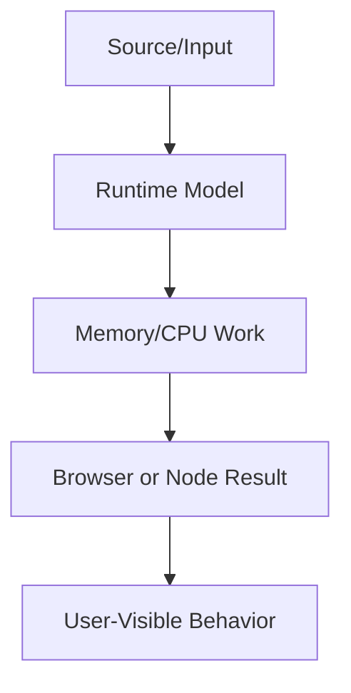

# Advanced JavaScript

This volume contains domain-specific senior-level notes for: Event Loop, Promises, Async/Await, Functional Programming, Design Patterns, Memory Leaks, Performance.



## Event Loop

### What it is
The event loop coordinates synchronous JavaScript, queued tasks, microtasks, rendering opportunities, and browser callbacks.

### Why it exists
It explains why async callbacks, rendering, timers, and user input run in the order developers observe in browsers.

### Source-code / internal model
Call stack runs to completion; microtasks drain after the stack; tasks such as timers run later; rendering happens between suitable turns.

### Architecture diagram


### Production React example
Debounced search, promise chains, animation frames, and click handlers all depend on event-loop ordering.

```tsx
const EventLoopExample = {
  input: "dashboard filter, route transition, or API response",
  failureMode: "stale state, remount, blocked input, or unsafe data sink",
  metric: "React Profiler commit time, Chrome long task, heap growth, or Web Vital",
};
```

### Debugging scenario
If a spinner never appears, synchronous work may block rendering before the browser can paint.

### Performance profiling example
Use Chrome Performance panel long tasks and microtask waterfalls to diagnose input delay.

### Product-company interview prompts
- Interviewers ask output-order questions mixing console.log, Promise, setTimeout, queueMicrotask, and requestAnimationFrame.
- Explain one production incident involving Event Loop and how you would prevent recurrence.
- Implement or design a minimal example of Event Loop while narrating correctness, edge cases, and trade-offs.

### Senior-engineer checklist
- What owns the data or behavior?
- What can make it stale, slow, inaccessible, insecure, or hard to test?
- What instrumentation proves it works in production?
- What API would you expose to a team so misuse is difficult?

## Promises

### What it is
A Promise represents a future completion value and standardizes async composition.

### Why it exists
They standardize async completion and error propagation without callback pyramids.

### Source-code / internal model
Fulfillment/rejection reactions are scheduled as microtasks; every then/catch returns a new promise.

### Architecture diagram


### Production React example
API clients chain auth refresh, retry, parse, and error mapping through promises.

```tsx
const PromisesExample = {
  input: "dashboard filter, route transition, or API response",
  failureMode: "stale state, remount, blocked input, or unsafe data sink",
  metric: "React Profiler commit time, Chrome long task, heap growth, or Web Vital",
};
```

### Debugging scenario
Unhandled rejection logs usually mean a branch forgot return/await or catch.

### Performance profiling example
Profile promise-heavy loops that starve rendering by continuously queueing microtasks.

### Product-company interview prompts
- Companies ask: promise states, thenable assimilation, error propagation, Promise.all vs allSettled.
- Explain one production incident involving Promises and how you would prevent recurrence.
- Implement or design a minimal example of Promises while narrating correctness, edge cases, and trade-offs.

### Senior-engineer checklist
- What owns the data or behavior?
- What can make it stale, slow, inaccessible, insecure, or hard to test?
- What instrumentation proves it works in production?
- What API would you expose to a team so misuse is difficult?

## Async/Await

### What it is
async/await is syntax over Promises that makes asynchronous control flow read like sequential code.

### Why it exists
It makes promise-based flows readable while preserving non-blocking browser behavior.

### Source-code / internal model
An async function returns a Promise; await suspends continuation and resumes in a microtask after settlement.

### Architecture diagram


### Production React example
Login flows await token request, profile fetch, and navigation while handling errors with try/finally.

```tsx
const Async/AwaitExample = {
  input: "dashboard filter, route transition, or API response",
  failureMode: "stale state, remount, blocked input, or unsafe data sink",
  metric: "React Profiler commit time, Chrome long task, heap growth, or Web Vital",
};
```

### Debugging scenario
Common bug: awaiting requests sequentially when they could run in parallel with Promise.all.

### Performance profiling example
Measure network waterfall; parallelize independent awaits to reduce total latency.

### Product-company interview prompts
- Interviews ask: await in loops, error propagation, cancellation with AbortController.
- Explain one production incident involving Async/Await and how you would prevent recurrence.
- Implement or design a minimal example of Async/Await while narrating correctness, edge cases, and trade-offs.

### Senior-engineer checklist
- What owns the data or behavior?
- What can make it stale, slow, inaccessible, insecure, or hard to test?
- What instrumentation proves it works in production?
- What API would you expose to a team so misuse is difficult?

## Functional Programming

### What it is
Functional programming emphasizes pure functions, immutability, composition, and data transformation.

### Why it exists
It reduces hidden state and makes UI transformations testable.

### Source-code / internal model
map/filter/reduce create transformation pipelines; pure reducers are deterministic.

### Architecture diagram


### Production React example
Redux reducers, selector pipelines, and form validators use FP heavily.

```tsx
const FunctionalProgrammingExample = {
  input: "dashboard filter, route transition, or API response",
  failureMode: "stale state, remount, blocked input, or unsafe data sink",
  metric: "React Profiler commit time, Chrome long task, heap growth, or Web Vital",
};
```

### Debugging scenario
Over-composed point-free code becomes unreadable.

### Performance profiling example
Avoid allocating many intermediate arrays in hot paths; transduce or single-pass when measured.

### Product-company interview prompts
- Asked: pure function, immutability, currying, compose.
- Explain one production incident involving Functional Programming and how you would prevent recurrence.
- Implement or design a minimal example of Functional Programming while narrating correctness, edge cases, and trade-offs.

### Senior-engineer checklist
- What owns the data or behavior?
- What can make it stale, slow, inaccessible, insecure, or hard to test?
- What instrumentation proves it works in production?
- What API would you expose to a team so misuse is difficult?

## Design Patterns

### What it is
Design patterns are named solutions to recurring design problems.

### Why it exists
They create shared language for trade-offs, not rules to force everywhere.

### Source-code / internal model
Observer, strategy, adapter, factory, command, and state patterns appear in UI systems.

### Architecture diagram


### Production React example
Feature-flag strategies, analytics adapters, and command palettes use patterns.

```tsx
const DesignPatternsExample = {
  input: "dashboard filter, route transition, or API response",
  failureMode: "stale state, remount, blocked input, or unsafe data sink",
  metric: "React Profiler commit time, Chrome long task, heap growth, or Web Vital",
};
```

### Debugging scenario
Pattern overuse creates indirection without product value.

### Performance profiling example
Abstractions cost bundle size and cognitive load; measure reuse.

### Product-company interview prompts
- Asked: implement observer/pub-sub, strategy, singleton pitfalls.
- Explain one production incident involving Design Patterns and how you would prevent recurrence.
- Implement or design a minimal example of Design Patterns while narrating correctness, edge cases, and trade-offs.

### Senior-engineer checklist
- What owns the data or behavior?
- What can make it stale, slow, inaccessible, insecure, or hard to test?
- What instrumentation proves it works in production?
- What API would you expose to a team so misuse is difficult?

## Memory Leaks

### What it is
A memory leak is unwanted retention of objects that should be collectible.

### Why it exists
They explain why long-lived SPAs slow down or crash after repeated interactions.

### Source-code / internal model
Leaks occur when references remain from closures, globals, caches, listeners, timers, observers, or detached DOM.

### Architecture diagram


### Production React example
Realtime apps leak when WebSocket subscriptions are not cleaned on route changes.

```tsx
const MemoryLeaksExample = {
  input: "dashboard filter, route transition, or API response",
  failureMode: "stale state, remount, blocked input, or unsafe data sink",
  metric: "React Profiler commit time, Chrome long task, heap growth, or Web Vital",
};
```

### Debugging scenario
Use heap snapshots before/after navigation and inspect retaining paths.

### Performance profiling example
Monitor heap growth over repeated flows; cap caches and unsubscribe on cleanup.

### Product-company interview prompts
- Interviews ask: find leak in setInterval/useEffect/event listener code.
- Explain one production incident involving Memory Leaks and how you would prevent recurrence.
- Implement or design a minimal example of Memory Leaks while narrating correctness, edge cases, and trade-offs.

### Senior-engineer checklist
- What owns the data or behavior?
- What can make it stale, slow, inaccessible, insecure, or hard to test?
- What instrumentation proves it works in production?
- What API would you expose to a team so misuse is difficult?

## Performance

### What it is
Frontend performance is the discipline of making UI load, respond, and update within user-perceived budgets.

### Why it exists
It exists because users abandon slow experiences and slow devices magnify inefficiencies.

### Source-code / internal model
Performance spans network, parsing, JS, style/layout/paint, React renders, memory, and backend latency.

### Architecture diagram


### Production React example
Product teams set budgets for route JS, LCP, INP, and memory.

```tsx
performance.mark("start");
runExpensiveUIWork();
performance.mark("end");
performance.measure("ui-work", "start", "end");
```

### Debugging scenario
Guessing is the bug; always capture a trace.

### Performance profiling example
Use Lighthouse, Performance panel, React Profiler, bundle analyzer, and RUM.

### Product-company interview prompts
- Asked: diagnose slow React page end-to-end.
- Explain one production incident involving Performance and how you would prevent recurrence.
- Implement or design a minimal example of Performance while narrating correctness, edge cases, and trade-offs.

### Senior-engineer checklist
- What owns the data or behavior?
- What can make it stale, slow, inaccessible, insecure, or hard to test?
- What instrumentation proves it works in production?
- What API would you expose to a team so misuse is difficult?

