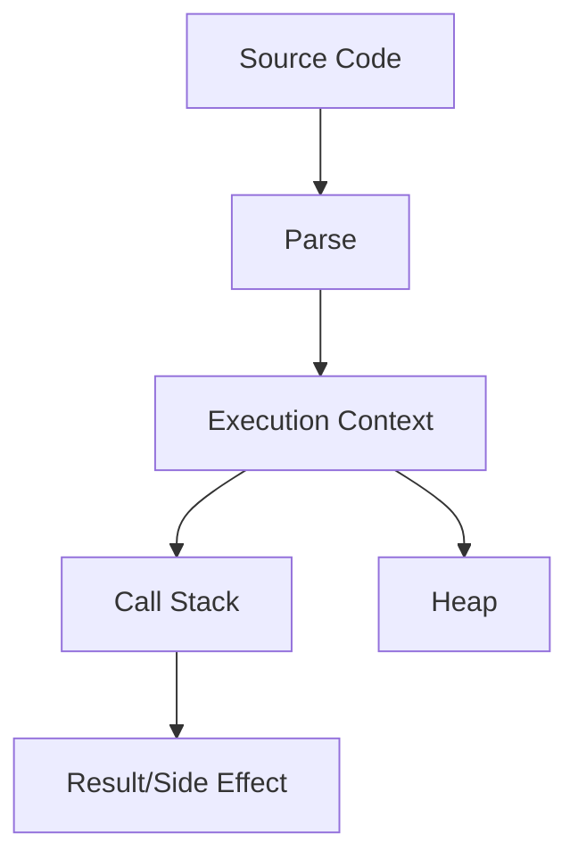

# Volume 03: Advanced JavaScript

This volume covers Advanced JavaScript from beginner foundations to teaching-level mastery. Each topic follows the required repository structure and links internals to production frontend work.

## Volume Learning Order

Event Loop -> Promises -> Async/Await -> Functional Programming -> Design Patterns -> Memory Leaks -> Performance

# Event Loop

## Introduction

Event Loop is a foundational Advanced JavaScript topic. Mastery means you can use it correctly, predict its behavior, debug production issues, explain internals, and connect it to interviews, architecture, accessibility, security, and performance.

## Why This Concept Exists

* What problem does it solve? It reduces ambiguity around how frontend systems represent data, run code, render UI, communicate over networks, and recover from failure.
* Why was it introduced? It emerged because applications needed more predictable, reusable, observable, and scalable ways to manage complexity.

## Core Fundamentals

- Definition: know the exact vocabulary for Event Loop.
- Contract: identify inputs, outputs, side effects, ownership, lifecycle, and cleanup.
- Boundaries: separate language behavior, browser behavior, framework behavior, and application policy.
- Correctness: cover happy path, loading path, empty state, error state, retry path, and cleanup path.
- Production readiness: include tests, monitoring, documentation, performance budgets, and accessibility/security review where relevant.

## Internal Working

Explain step-by-step what happens internally.

JavaScript engines parse source, create execution contexts, allocate primitives on stack-like records and objects on the heap, execute through an interpreter/JIT, and reclaim unreachable memory with garbage collection.

For JavaScript topics:

* Memory: primitives are stored directly in execution records where possible; objects, arrays, functions, and closures live on the heap and are referenced.
* Execution Context: creation phase builds bindings and scope links; execution phase evaluates statements and expressions.
* Call Stack: synchronous frames push and pop; long frames block input and rendering.
* Engine Behavior: engines optimize stable shapes and predictable types, but can deoptimize polymorphic or megamorphic hot paths.

For React topics:

* Rendering: React calls components to describe UI.
* Reconciliation: React compares previous and next element trees using type and key.
* Fiber: work is represented as interruptible units linked in a tree.
* Scheduler: urgent updates can be prioritized over non-urgent rendering.

For Browser topics:

* DOM: parsed HTML becomes nodes and relationships.
* CSSOM: CSS becomes matched style rules.
* Rendering Pipeline: style, layout, paint, and composite turn data into pixels.

## Mental Models

- Restaurant analogy: Event Loop is like the workflow between order taking, kitchen preparation, serving, and cleanup.
- Airport analogy: requests and events move through queues, priorities, gates, and security checks.
- Library analogy: references point to books on shelves; losing the catalog reference makes a book eligible for cleanup.
- Warehouse analogy: caching and indexing trade storage cost for faster retrieval.

## Visual Diagrams



## Step-by-Step Examples

```js
console.log(1);
Promise.resolve().then(()=>console.log(2));
setTimeout(()=>console.log(3));
console.log(4);
```

Line-by-line explanation:

1. Identify declarations and allocate necessary bindings.
2. Create runtime values or references.
3. Execute the synchronous part first.
4. Schedule asynchronous, rendering, or cleanup work if present.
5. Observe the final state through logs, UI, network panel, profiler, or tests.

Specific explanation: Synchronous code runs first, microtasks drain next, then timer tasks run.

## Memory Visualizations

```text
Stack / Execution Records
main() frame
  local binding -> ref:0x001

Heap
0x001 -> { topic: "Event Loop", lifecycle: "created -> used -> cleaned" }

GC rule
reachable from stack/module/global/subscription => kept
unreachable after cleanup => collectible
```

## Real-World Use Cases

- React hooks and component state synchronization.
- React Query or cache invalidation workflows.
- Debouncing input and avoiding unnecessary network calls.
- Authentication, authorization, and guarded routes.
- Notifications, chat, optimistic updates, uploads, and realtime dashboards.

## Common Mistakes

- Treating Event Loop as syntax instead of a lifecycle and ownership problem.
- Forgetting cleanup for listeners, timers, subscriptions, observers, or pending requests.
- Confusing microtasks, tasks, render work, and React commits.
- Ignoring empty, duplicate, stale, failed, or slow states.
- Adding abstractions before the problem repeats.

## Best Practices

- Make ownership explicit.
- Keep side effects at boundaries.
- Prefer native browser semantics before custom JavaScript.
- Add tests for normal, boundary, and failure behavior.
- Document invariants and trade-offs.

## Performance Considerations

- Time complexity: identify whether work is O(1), O(n), O(n log n), or worse.
- Space complexity: track retained objects, caches, closures, and subscriptions.
- Rendering cost: avoid unnecessary DOM work, style recalculation, layout, paint, and React re-renders.
- Re-renders: stabilize keys, props, callbacks, and derived data only when measurement shows benefit.
- Memory impact: release references and cap cache size.

## Edge Cases

- Null, undefined, empty arrays, duplicate IDs, and unexpected types.
- Slow network, offline mode, retries, cancellation, and race conditions.
- Browser tab suspension and page visibility changes.
- Server/client mismatches during hydration.
- Accessibility states such as focus, disabled, expanded, selected, and live updates.

## Interview Questions

### Beginner Questions

1. Define Event Loop?
2. Why does production code need Event Loop?
3. Show a simple example of Event Loop?
4. What problem is solved by Event Loop?
5. What breaks when misusing Event Loop?
6. How do you debug Event Loop?
7. What browser or engine behavior affects Event Loop?
8. What React behavior affects Event Loop?
9. What performance metric is impacted by Event Loop?
10. How would you teach Event Loop?

### Intermediate Questions

1. Compare trade-offs of Event Loop in a real app?
2. Describe memory implications of Event Loop in a real app?
3. Explain async or rendering order for Event Loop in a real app?
4. Design a reusable abstraction around Event Loop in a real app?
5. List edge cases for Event Loop in a real app?
6. Write tests for Event Loop in a real app?
7. Profile bottlenecks caused by Event Loop in a real app?
8. Connect security concerns to Event Loop in a real app?
9. Explain failure recovery for Event Loop in a real app?
10. Refactor legacy usage of Event Loop in a real app?

### Advanced Questions

1. Explain internals of Event Loop under scale?
2. How would you optimize Event Loop under scale?
3. How would you design observability for Event Loop under scale?
4. What deoptimization or reconciliation pitfalls affect Event Loop under scale?
5. How do concurrent updates change Event Loop under scale?
6. How would you document invariants for Event Loop under scale?
7. How would you migrate a large codebase using Event Loop under scale?
8. How would you prevent regressions in Event Loop under scale?
9. How would you answer a staff-level interview about Event Loop under scale?
10. What are the hidden trade-offs of Event Loop under scale?

## Coding Challenges

1. Build a minimal demo for Event Loop and log every lifecycle step.
2. Add input validation and error handling.
3. Add cleanup logic and prove it with a test.
4. Profile the implementation and remove one bottleneck.
5. Convert the demo into a reusable production-style API.

## Assignments

1. Write a one-page beginner explanation with a diagram.
2. Create an interview answer bank with short and long answers.
3. Build a production checklist covering tests, performance, accessibility, and security.

## Mini Projects

- Build a small dashboard feature that uses Event Loop, includes loading/error/empty states, has tests, exposes metrics, and documents trade-offs.

## Revision Notes

Event Loop: definition, problem solved, lifecycle, memory model, browser/React impact, failure modes, performance cost, debugging tools, and one production example.

## Cheat Sheet

| Need | Reminder |
| --- | --- |
| Define | State what Event Loop is in one sentence. |
| Debug | Inspect stack, heap references, events, network, render commits, and logs. |
| Optimize | Measure first, then reduce repeated work or retained memory. |
| Interview | Answer with definition, example, internals, edge cases, trade-offs. |

## Teaching Notes

- A beginner: use one analogy and one tiny example.
- A junior developer: add lifecycle, pitfalls, and debugging workflow.
- A senior developer: discuss trade-offs, scale, observability, migration, and failure isolation.

## FAQs

1. What is Event Loop? It is a core concept in Advanced JavaScript used to reason about frontend behavior.
2. Why should I learn it? It appears in bugs, architecture, and interviews.
3. Is it language-level or browser-level? It may involve both; separate the layers.
4. How do I debug it? Reproduce, isolate, inspect runtime state, and add targeted tests.
5. What is the biggest beginner mistake? Memorizing behavior without understanding lifecycle.
6. What is the biggest production mistake? Forgetting cleanup, failure states, or monitoring.
7. How does it affect performance? Through CPU time, memory retention, rendering, network, or bundle size.
8. How does React change the story? React adds render, reconciliation, commit, and scheduling semantics.
9. What should I say in interviews? Define it, show an example, explain internals, and discuss trade-offs.
10. How do I teach it? Start with analogy, then code, then internals, then production scenario.

## Related Topics

Event Loop -> Scope -> Execution Context -> Event Loop -> Browser Rendering -> React Rendering -> Testing -> Performance -> System Design

# Promises

## Introduction

Promises is a foundational Advanced JavaScript topic. Mastery means you can use it correctly, predict its behavior, debug production issues, explain internals, and connect it to interviews, architecture, accessibility, security, and performance.

## Why This Concept Exists

* What problem does it solve? It reduces ambiguity around how frontend systems represent data, run code, render UI, communicate over networks, and recover from failure.
* Why was it introduced? It emerged because applications needed more predictable, reusable, observable, and scalable ways to manage complexity.

## Core Fundamentals

- Definition: know the exact vocabulary for Promises.
- Contract: identify inputs, outputs, side effects, ownership, lifecycle, and cleanup.
- Boundaries: separate language behavior, browser behavior, framework behavior, and application policy.
- Correctness: cover happy path, loading path, empty state, error state, retry path, and cleanup path.
- Production readiness: include tests, monitoring, documentation, performance budgets, and accessibility/security review where relevant.

## Internal Working

Explain step-by-step what happens internally.

JavaScript engines parse source, create execution contexts, allocate primitives on stack-like records and objects on the heap, execute through an interpreter/JIT, and reclaim unreachable memory with garbage collection.

For JavaScript topics:

* Memory: primitives are stored directly in execution records where possible; objects, arrays, functions, and closures live on the heap and are referenced.
* Execution Context: creation phase builds bindings and scope links; execution phase evaluates statements and expressions.
* Call Stack: synchronous frames push and pop; long frames block input and rendering.
* Engine Behavior: engines optimize stable shapes and predictable types, but can deoptimize polymorphic or megamorphic hot paths.

For React topics:

* Rendering: React calls components to describe UI.
* Reconciliation: React compares previous and next element trees using type and key.
* Fiber: work is represented as interruptible units linked in a tree.
* Scheduler: urgent updates can be prioritized over non-urgent rendering.

For Browser topics:

* DOM: parsed HTML becomes nodes and relationships.
* CSSOM: CSS becomes matched style rules.
* Rendering Pipeline: style, layout, paint, and composite turn data into pixels.

## Mental Models

- Restaurant analogy: Promises is like the workflow between order taking, kitchen preparation, serving, and cleanup.
- Airport analogy: requests and events move through queues, priorities, gates, and security checks.
- Library analogy: references point to books on shelves; losing the catalog reference makes a book eligible for cleanup.
- Warehouse analogy: caching and indexing trade storage cost for faster retrieval.

## Visual Diagrams


## Step-by-Step Examples

```js
fetch("/api/user")
  .then(r => r.json())
  .then(setUser)
  .catch(showError);
```

Line-by-line explanation:

1. Identify declarations and allocate necessary bindings.
2. Create runtime values or references.
3. Execute the synchronous part first.
4. Schedule asynchronous, rendering, or cleanup work if present.
5. Observe the final state through logs, UI, network panel, profiler, or tests.

Specific explanation: Each `.then` schedules continuation work and returns a new promise for chaining.

## Memory Visualizations

```text
Stack / Execution Records
main() frame
  local binding -> ref:0x001

Heap
0x001 -> { topic: "Promises", lifecycle: "created -> used -> cleaned" }

GC rule
reachable from stack/module/global/subscription => kept
unreachable after cleanup => collectible
```

## Real-World Use Cases

- React hooks and component state synchronization.
- React Query or cache invalidation workflows.
- Debouncing input and avoiding unnecessary network calls.
- Authentication, authorization, and guarded routes.
- Notifications, chat, optimistic updates, uploads, and realtime dashboards.

## Common Mistakes

- Treating Promises as syntax instead of a lifecycle and ownership problem.
- Forgetting cleanup for listeners, timers, subscriptions, observers, or pending requests.
- Confusing microtasks, tasks, render work, and React commits.
- Ignoring empty, duplicate, stale, failed, or slow states.
- Adding abstractions before the problem repeats.

## Best Practices

- Make ownership explicit.
- Keep side effects at boundaries.
- Prefer native browser semantics before custom JavaScript.
- Add tests for normal, boundary, and failure behavior.
- Document invariants and trade-offs.

## Performance Considerations

- Time complexity: identify whether work is O(1), O(n), O(n log n), or worse.
- Space complexity: track retained objects, caches, closures, and subscriptions.
- Rendering cost: avoid unnecessary DOM work, style recalculation, layout, paint, and React re-renders.
- Re-renders: stabilize keys, props, callbacks, and derived data only when measurement shows benefit.
- Memory impact: release references and cap cache size.

## Edge Cases

- Null, undefined, empty arrays, duplicate IDs, and unexpected types.
- Slow network, offline mode, retries, cancellation, and race conditions.
- Browser tab suspension and page visibility changes.
- Server/client mismatches during hydration.
- Accessibility states such as focus, disabled, expanded, selected, and live updates.

## Interview Questions

### Beginner Questions

1. Define Promises?
2. Why does production code need Promises?
3. Show a simple example of Promises?
4. What problem is solved by Promises?
5. What breaks when misusing Promises?
6. How do you debug Promises?
7. What browser or engine behavior affects Promises?
8. What React behavior affects Promises?
9. What performance metric is impacted by Promises?
10. How would you teach Promises?

### Intermediate Questions

1. Compare trade-offs of Promises in a real app?
2. Describe memory implications of Promises in a real app?
3. Explain async or rendering order for Promises in a real app?
4. Design a reusable abstraction around Promises in a real app?
5. List edge cases for Promises in a real app?
6. Write tests for Promises in a real app?
7. Profile bottlenecks caused by Promises in a real app?
8. Connect security concerns to Promises in a real app?
9. Explain failure recovery for Promises in a real app?
10. Refactor legacy usage of Promises in a real app?

### Advanced Questions

1. Explain internals of Promises under scale?
2. How would you optimize Promises under scale?
3. How would you design observability for Promises under scale?
4. What deoptimization or reconciliation pitfalls affect Promises under scale?
5. How do concurrent updates change Promises under scale?
6. How would you document invariants for Promises under scale?
7. How would you migrate a large codebase using Promises under scale?
8. How would you prevent regressions in Promises under scale?
9. How would you answer a staff-level interview about Promises under scale?
10. What are the hidden trade-offs of Promises under scale?

## Coding Challenges

1. Build a minimal demo for Promises and log every lifecycle step.
2. Add input validation and error handling.
3. Add cleanup logic and prove it with a test.
4. Profile the implementation and remove one bottleneck.
5. Convert the demo into a reusable production-style API.

## Assignments

1. Write a one-page beginner explanation with a diagram.
2. Create an interview answer bank with short and long answers.
3. Build a production checklist covering tests, performance, accessibility, and security.

## Mini Projects

- Build a small dashboard feature that uses Promises, includes loading/error/empty states, has tests, exposes metrics, and documents trade-offs.

## Revision Notes

Promises: definition, problem solved, lifecycle, memory model, browser/React impact, failure modes, performance cost, debugging tools, and one production example.

## Cheat Sheet

| Need | Reminder |
| --- | --- |
| Define | State what Promises is in one sentence. |
| Debug | Inspect stack, heap references, events, network, render commits, and logs. |
| Optimize | Measure first, then reduce repeated work or retained memory. |
| Interview | Answer with definition, example, internals, edge cases, trade-offs. |

## Teaching Notes

- A beginner: use one analogy and one tiny example.
- A junior developer: add lifecycle, pitfalls, and debugging workflow.
- A senior developer: discuss trade-offs, scale, observability, migration, and failure isolation.

## FAQs

1. What is Promises? It is a core concept in Advanced JavaScript used to reason about frontend behavior.
2. Why should I learn it? It appears in bugs, architecture, and interviews.
3. Is it language-level or browser-level? It may involve both; separate the layers.
4. How do I debug it? Reproduce, isolate, inspect runtime state, and add targeted tests.
5. What is the biggest beginner mistake? Memorizing behavior without understanding lifecycle.
6. What is the biggest production mistake? Forgetting cleanup, failure states, or monitoring.
7. How does it affect performance? Through CPU time, memory retention, rendering, network, or bundle size.
8. How does React change the story? React adds render, reconciliation, commit, and scheduling semantics.
9. What should I say in interviews? Define it, show an example, explain internals, and discuss trade-offs.
10. How do I teach it? Start with analogy, then code, then internals, then production scenario.

## Related Topics

Promises -> Scope -> Execution Context -> Event Loop -> Browser Rendering -> React Rendering -> Testing -> Performance -> System Design

# Async/Await

## Introduction

Async/Await is a foundational Advanced JavaScript topic. Mastery means you can use it correctly, predict its behavior, debug production issues, explain internals, and connect it to interviews, architecture, accessibility, security, and performance.

## Why This Concept Exists

* What problem does it solve? It reduces ambiguity around how frontend systems represent data, run code, render UI, communicate over networks, and recover from failure.
* Why was it introduced? It emerged because applications needed more predictable, reusable, observable, and scalable ways to manage complexity.

## Core Fundamentals

- Definition: know the exact vocabulary for Async/Await.
- Contract: identify inputs, outputs, side effects, ownership, lifecycle, and cleanup.
- Boundaries: separate language behavior, browser behavior, framework behavior, and application policy.
- Correctness: cover happy path, loading path, empty state, error state, retry path, and cleanup path.
- Production readiness: include tests, monitoring, documentation, performance budgets, and accessibility/security review where relevant.

## Internal Working

Explain step-by-step what happens internally.

JavaScript engines parse source, create execution contexts, allocate primitives on stack-like records and objects on the heap, execute through an interpreter/JIT, and reclaim unreachable memory with garbage collection.

For JavaScript topics:

* Memory: primitives are stored directly in execution records where possible; objects, arrays, functions, and closures live on the heap and are referenced.
* Execution Context: creation phase builds bindings and scope links; execution phase evaluates statements and expressions.
* Call Stack: synchronous frames push and pop; long frames block input and rendering.
* Engine Behavior: engines optimize stable shapes and predictable types, but can deoptimize polymorphic or megamorphic hot paths.

For React topics:

* Rendering: React calls components to describe UI.
* Reconciliation: React compares previous and next element trees using type and key.
* Fiber: work is represented as interruptible units linked in a tree.
* Scheduler: urgent updates can be prioritized over non-urgent rendering.

For Browser topics:

* DOM: parsed HTML becomes nodes and relationships.
* CSSOM: CSS becomes matched style rules.
* Rendering Pipeline: style, layout, paint, and composite turn data into pixels.

## Mental Models

- Restaurant analogy: Async/Await is like the workflow between order taking, kitchen preparation, serving, and cleanup.
- Airport analogy: requests and events move through queues, priorities, gates, and security checks.
- Library analogy: references point to books on shelves; losing the catalog reference makes a book eligible for cleanup.
- Warehouse analogy: caching and indexing trade storage cost for faster retrieval.

## Visual Diagrams


## Step-by-Step Examples

```js
async function load(){
  const r = await fetch("/api");
  return r.json();
}
```

Line-by-line explanation:

1. Identify declarations and allocate necessary bindings.
2. Create runtime values or references.
3. Execute the synchronous part first.
4. Schedule asynchronous, rendering, or cleanup work if present.
5. Observe the final state through logs, UI, network panel, profiler, or tests.

Specific explanation: `await` pauses the async function continuation without blocking the main thread.

## Memory Visualizations

```text
Stack / Execution Records
main() frame
  local binding -> ref:0x001

Heap
0x001 -> { topic: "Async/Await", lifecycle: "created -> used -> cleaned" }

GC rule
reachable from stack/module/global/subscription => kept
unreachable after cleanup => collectible
```

## Real-World Use Cases

- React hooks and component state synchronization.
- React Query or cache invalidation workflows.
- Debouncing input and avoiding unnecessary network calls.
- Authentication, authorization, and guarded routes.
- Notifications, chat, optimistic updates, uploads, and realtime dashboards.

## Common Mistakes

- Treating Async/Await as syntax instead of a lifecycle and ownership problem.
- Forgetting cleanup for listeners, timers, subscriptions, observers, or pending requests.
- Confusing microtasks, tasks, render work, and React commits.
- Ignoring empty, duplicate, stale, failed, or slow states.
- Adding abstractions before the problem repeats.

## Best Practices

- Make ownership explicit.
- Keep side effects at boundaries.
- Prefer native browser semantics before custom JavaScript.
- Add tests for normal, boundary, and failure behavior.
- Document invariants and trade-offs.

## Performance Considerations

- Time complexity: identify whether work is O(1), O(n), O(n log n), or worse.
- Space complexity: track retained objects, caches, closures, and subscriptions.
- Rendering cost: avoid unnecessary DOM work, style recalculation, layout, paint, and React re-renders.
- Re-renders: stabilize keys, props, callbacks, and derived data only when measurement shows benefit.
- Memory impact: release references and cap cache size.

## Edge Cases

- Null, undefined, empty arrays, duplicate IDs, and unexpected types.
- Slow network, offline mode, retries, cancellation, and race conditions.
- Browser tab suspension and page visibility changes.
- Server/client mismatches during hydration.
- Accessibility states such as focus, disabled, expanded, selected, and live updates.

## Interview Questions

### Beginner Questions

1. Define Async/Await?
2. Why does production code need Async/Await?
3. Show a simple example of Async/Await?
4. What problem is solved by Async/Await?
5. What breaks when misusing Async/Await?
6. How do you debug Async/Await?
7. What browser or engine behavior affects Async/Await?
8. What React behavior affects Async/Await?
9. What performance metric is impacted by Async/Await?
10. How would you teach Async/Await?

### Intermediate Questions

1. Compare trade-offs of Async/Await in a real app?
2. Describe memory implications of Async/Await in a real app?
3. Explain async or rendering order for Async/Await in a real app?
4. Design a reusable abstraction around Async/Await in a real app?
5. List edge cases for Async/Await in a real app?
6. Write tests for Async/Await in a real app?
7. Profile bottlenecks caused by Async/Await in a real app?
8. Connect security concerns to Async/Await in a real app?
9. Explain failure recovery for Async/Await in a real app?
10. Refactor legacy usage of Async/Await in a real app?

### Advanced Questions

1. Explain internals of Async/Await under scale?
2. How would you optimize Async/Await under scale?
3. How would you design observability for Async/Await under scale?
4. What deoptimization or reconciliation pitfalls affect Async/Await under scale?
5. How do concurrent updates change Async/Await under scale?
6. How would you document invariants for Async/Await under scale?
7. How would you migrate a large codebase using Async/Await under scale?
8. How would you prevent regressions in Async/Await under scale?
9. How would you answer a staff-level interview about Async/Await under scale?
10. What are the hidden trade-offs of Async/Await under scale?

## Coding Challenges

1. Build a minimal demo for Async/Await and log every lifecycle step.
2. Add input validation and error handling.
3. Add cleanup logic and prove it with a test.
4. Profile the implementation and remove one bottleneck.
5. Convert the demo into a reusable production-style API.

## Assignments

1. Write a one-page beginner explanation with a diagram.
2. Create an interview answer bank with short and long answers.
3. Build a production checklist covering tests, performance, accessibility, and security.

## Mini Projects

- Build a small dashboard feature that uses Async/Await, includes loading/error/empty states, has tests, exposes metrics, and documents trade-offs.

## Revision Notes

Async/Await: definition, problem solved, lifecycle, memory model, browser/React impact, failure modes, performance cost, debugging tools, and one production example.

## Cheat Sheet

| Need | Reminder |
| --- | --- |
| Define | State what Async/Await is in one sentence. |
| Debug | Inspect stack, heap references, events, network, render commits, and logs. |
| Optimize | Measure first, then reduce repeated work or retained memory. |
| Interview | Answer with definition, example, internals, edge cases, trade-offs. |

## Teaching Notes

- A beginner: use one analogy and one tiny example.
- A junior developer: add lifecycle, pitfalls, and debugging workflow.
- A senior developer: discuss trade-offs, scale, observability, migration, and failure isolation.

## FAQs

1. What is Async/Await? It is a core concept in Advanced JavaScript used to reason about frontend behavior.
2. Why should I learn it? It appears in bugs, architecture, and interviews.
3. Is it language-level or browser-level? It may involve both; separate the layers.
4. How do I debug it? Reproduce, isolate, inspect runtime state, and add targeted tests.
5. What is the biggest beginner mistake? Memorizing behavior without understanding lifecycle.
6. What is the biggest production mistake? Forgetting cleanup, failure states, or monitoring.
7. How does it affect performance? Through CPU time, memory retention, rendering, network, or bundle size.
8. How does React change the story? React adds render, reconciliation, commit, and scheduling semantics.
9. What should I say in interviews? Define it, show an example, explain internals, and discuss trade-offs.
10. How do I teach it? Start with analogy, then code, then internals, then production scenario.

## Related Topics

Async/Await -> Scope -> Execution Context -> Event Loop -> Browser Rendering -> React Rendering -> Testing -> Performance -> System Design

# Functional Programming

## Introduction

Functional Programming is a foundational Advanced JavaScript topic. Mastery means you can use it correctly, predict its behavior, debug production issues, explain internals, and connect it to interviews, architecture, accessibility, security, and performance.

## Why This Concept Exists

* What problem does it solve? It reduces ambiguity around how frontend systems represent data, run code, render UI, communicate over networks, and recover from failure.
* Why was it introduced? It emerged because applications needed more predictable, reusable, observable, and scalable ways to manage complexity.

## Core Fundamentals

- Definition: know the exact vocabulary for Functional Programming.
- Contract: identify inputs, outputs, side effects, ownership, lifecycle, and cleanup.
- Boundaries: separate language behavior, browser behavior, framework behavior, and application policy.
- Correctness: cover happy path, loading path, empty state, error state, retry path, and cleanup path.
- Production readiness: include tests, monitoring, documentation, performance budgets, and accessibility/security review where relevant.

## Internal Working

Explain step-by-step what happens internally.

JavaScript engines parse source, create execution contexts, allocate primitives on stack-like records and objects on the heap, execute through an interpreter/JIT, and reclaim unreachable memory with garbage collection.

For JavaScript topics:

* Memory: primitives are stored directly in execution records where possible; objects, arrays, functions, and closures live on the heap and are referenced.
* Execution Context: creation phase builds bindings and scope links; execution phase evaluates statements and expressions.
* Call Stack: synchronous frames push and pop; long frames block input and rendering.
* Engine Behavior: engines optimize stable shapes and predictable types, but can deoptimize polymorphic or megamorphic hot paths.

For React topics:

* Rendering: React calls components to describe UI.
* Reconciliation: React compares previous and next element trees using type and key.
* Fiber: work is represented as interruptible units linked in a tree.
* Scheduler: urgent updates can be prioritized over non-urgent rendering.

For Browser topics:

* DOM: parsed HTML becomes nodes and relationships.
* CSSOM: CSS becomes matched style rules.
* Rendering Pipeline: style, layout, paint, and composite turn data into pixels.

## Mental Models

- Restaurant analogy: Functional Programming is like the workflow between order taking, kitchen preparation, serving, and cleanup.
- Airport analogy: requests and events move through queues, priorities, gates, and security checks.
- Library analogy: references point to books on shelves; losing the catalog reference makes a book eligible for cleanup.
- Warehouse analogy: caching and indexing trade storage cost for faster retrieval.

## Visual Diagrams


## Step-by-Step Examples

```js
const topic = "Functional Programming";
console.log(`Learning ${topic} deeply`);
```

Line-by-line explanation:

1. Identify declarations and allocate necessary bindings.
2. Create runtime values or references.
3. Execute the synchronous part first.
4. Schedule asynchronous, rendering, or cleanup work if present.
5. Observe the final state through logs, UI, network panel, profiler, or tests.

Specific explanation: This minimal snippet creates, stores, and reads a value related to Functional Programming; expand it with real inputs, errors, and measurement.

## Memory Visualizations

```text
Stack / Execution Records
main() frame
  local binding -> ref:0x001

Heap
0x001 -> { topic: "Functional Programming", lifecycle: "created -> used -> cleaned" }

GC rule
reachable from stack/module/global/subscription => kept
unreachable after cleanup => collectible
```

## Real-World Use Cases

- React hooks and component state synchronization.
- React Query or cache invalidation workflows.
- Debouncing input and avoiding unnecessary network calls.
- Authentication, authorization, and guarded routes.
- Notifications, chat, optimistic updates, uploads, and realtime dashboards.

## Common Mistakes

- Treating Functional Programming as syntax instead of a lifecycle and ownership problem.
- Forgetting cleanup for listeners, timers, subscriptions, observers, or pending requests.
- Confusing microtasks, tasks, render work, and React commits.
- Ignoring empty, duplicate, stale, failed, or slow states.
- Adding abstractions before the problem repeats.

## Best Practices

- Make ownership explicit.
- Keep side effects at boundaries.
- Prefer native browser semantics before custom JavaScript.
- Add tests for normal, boundary, and failure behavior.
- Document invariants and trade-offs.

## Performance Considerations

- Time complexity: identify whether work is O(1), O(n), O(n log n), or worse.
- Space complexity: track retained objects, caches, closures, and subscriptions.
- Rendering cost: avoid unnecessary DOM work, style recalculation, layout, paint, and React re-renders.
- Re-renders: stabilize keys, props, callbacks, and derived data only when measurement shows benefit.
- Memory impact: release references and cap cache size.

## Edge Cases

- Null, undefined, empty arrays, duplicate IDs, and unexpected types.
- Slow network, offline mode, retries, cancellation, and race conditions.
- Browser tab suspension and page visibility changes.
- Server/client mismatches during hydration.
- Accessibility states such as focus, disabled, expanded, selected, and live updates.

## Interview Questions

### Beginner Questions

1. Define Functional Programming?
2. Why does production code need Functional Programming?
3. Show a simple example of Functional Programming?
4. What problem is solved by Functional Programming?
5. What breaks when misusing Functional Programming?
6. How do you debug Functional Programming?
7. What browser or engine behavior affects Functional Programming?
8. What React behavior affects Functional Programming?
9. What performance metric is impacted by Functional Programming?
10. How would you teach Functional Programming?

### Intermediate Questions

1. Compare trade-offs of Functional Programming in a real app?
2. Describe memory implications of Functional Programming in a real app?
3. Explain async or rendering order for Functional Programming in a real app?
4. Design a reusable abstraction around Functional Programming in a real app?
5. List edge cases for Functional Programming in a real app?
6. Write tests for Functional Programming in a real app?
7. Profile bottlenecks caused by Functional Programming in a real app?
8. Connect security concerns to Functional Programming in a real app?
9. Explain failure recovery for Functional Programming in a real app?
10. Refactor legacy usage of Functional Programming in a real app?

### Advanced Questions

1. Explain internals of Functional Programming under scale?
2. How would you optimize Functional Programming under scale?
3. How would you design observability for Functional Programming under scale?
4. What deoptimization or reconciliation pitfalls affect Functional Programming under scale?
5. How do concurrent updates change Functional Programming under scale?
6. How would you document invariants for Functional Programming under scale?
7. How would you migrate a large codebase using Functional Programming under scale?
8. How would you prevent regressions in Functional Programming under scale?
9. How would you answer a staff-level interview about Functional Programming under scale?
10. What are the hidden trade-offs of Functional Programming under scale?

## Coding Challenges

1. Build a minimal demo for Functional Programming and log every lifecycle step.
2. Add input validation and error handling.
3. Add cleanup logic and prove it with a test.
4. Profile the implementation and remove one bottleneck.
5. Convert the demo into a reusable production-style API.

## Assignments

1. Write a one-page beginner explanation with a diagram.
2. Create an interview answer bank with short and long answers.
3. Build a production checklist covering tests, performance, accessibility, and security.

## Mini Projects

- Build a small dashboard feature that uses Functional Programming, includes loading/error/empty states, has tests, exposes metrics, and documents trade-offs.

## Revision Notes

Functional Programming: definition, problem solved, lifecycle, memory model, browser/React impact, failure modes, performance cost, debugging tools, and one production example.

## Cheat Sheet

| Need | Reminder |
| --- | --- |
| Define | State what Functional Programming is in one sentence. |
| Debug | Inspect stack, heap references, events, network, render commits, and logs. |
| Optimize | Measure first, then reduce repeated work or retained memory. |
| Interview | Answer with definition, example, internals, edge cases, trade-offs. |

## Teaching Notes

- A beginner: use one analogy and one tiny example.
- A junior developer: add lifecycle, pitfalls, and debugging workflow.
- A senior developer: discuss trade-offs, scale, observability, migration, and failure isolation.

## FAQs

1. What is Functional Programming? It is a core concept in Advanced JavaScript used to reason about frontend behavior.
2. Why should I learn it? It appears in bugs, architecture, and interviews.
3. Is it language-level or browser-level? It may involve both; separate the layers.
4. How do I debug it? Reproduce, isolate, inspect runtime state, and add targeted tests.
5. What is the biggest beginner mistake? Memorizing behavior without understanding lifecycle.
6. What is the biggest production mistake? Forgetting cleanup, failure states, or monitoring.
7. How does it affect performance? Through CPU time, memory retention, rendering, network, or bundle size.
8. How does React change the story? React adds render, reconciliation, commit, and scheduling semantics.
9. What should I say in interviews? Define it, show an example, explain internals, and discuss trade-offs.
10. How do I teach it? Start with analogy, then code, then internals, then production scenario.

## Related Topics

Functional Programming -> Scope -> Execution Context -> Event Loop -> Browser Rendering -> React Rendering -> Testing -> Performance -> System Design

# Design Patterns

## Introduction

Design Patterns is a foundational Advanced JavaScript topic. Mastery means you can use it correctly, predict its behavior, debug production issues, explain internals, and connect it to interviews, architecture, accessibility, security, and performance.

## Why This Concept Exists

* What problem does it solve? It reduces ambiguity around how frontend systems represent data, run code, render UI, communicate over networks, and recover from failure.
* Why was it introduced? It emerged because applications needed more predictable, reusable, observable, and scalable ways to manage complexity.

## Core Fundamentals

- Definition: know the exact vocabulary for Design Patterns.
- Contract: identify inputs, outputs, side effects, ownership, lifecycle, and cleanup.
- Boundaries: separate language behavior, browser behavior, framework behavior, and application policy.
- Correctness: cover happy path, loading path, empty state, error state, retry path, and cleanup path.
- Production readiness: include tests, monitoring, documentation, performance budgets, and accessibility/security review where relevant.

## Internal Working

Explain step-by-step what happens internally.

JavaScript engines parse source, create execution contexts, allocate primitives on stack-like records and objects on the heap, execute through an interpreter/JIT, and reclaim unreachable memory with garbage collection.

For JavaScript topics:

* Memory: primitives are stored directly in execution records where possible; objects, arrays, functions, and closures live on the heap and are referenced.
* Execution Context: creation phase builds bindings and scope links; execution phase evaluates statements and expressions.
* Call Stack: synchronous frames push and pop; long frames block input and rendering.
* Engine Behavior: engines optimize stable shapes and predictable types, but can deoptimize polymorphic or megamorphic hot paths.

For React topics:

* Rendering: React calls components to describe UI.
* Reconciliation: React compares previous and next element trees using type and key.
* Fiber: work is represented as interruptible units linked in a tree.
* Scheduler: urgent updates can be prioritized over non-urgent rendering.

For Browser topics:

* DOM: parsed HTML becomes nodes and relationships.
* CSSOM: CSS becomes matched style rules.
* Rendering Pipeline: style, layout, paint, and composite turn data into pixels.

## Mental Models

- Restaurant analogy: Design Patterns is like the workflow between order taking, kitchen preparation, serving, and cleanup.
- Airport analogy: requests and events move through queues, priorities, gates, and security checks.
- Library analogy: references point to books on shelves; losing the catalog reference makes a book eligible for cleanup.
- Warehouse analogy: caching and indexing trade storage cost for faster retrieval.

## Visual Diagrams


## Step-by-Step Examples

```js
const topic = "Design Patterns";
console.log(`Learning ${topic} deeply`);
```

Line-by-line explanation:

1. Identify declarations and allocate necessary bindings.
2. Create runtime values or references.
3. Execute the synchronous part first.
4. Schedule asynchronous, rendering, or cleanup work if present.
5. Observe the final state through logs, UI, network panel, profiler, or tests.

Specific explanation: This minimal snippet creates, stores, and reads a value related to Design Patterns; expand it with real inputs, errors, and measurement.

## Memory Visualizations

```text
Stack / Execution Records
main() frame
  local binding -> ref:0x001

Heap
0x001 -> { topic: "Design Patterns", lifecycle: "created -> used -> cleaned" }

GC rule
reachable from stack/module/global/subscription => kept
unreachable after cleanup => collectible
```

## Real-World Use Cases

- React hooks and component state synchronization.
- React Query or cache invalidation workflows.
- Debouncing input and avoiding unnecessary network calls.
- Authentication, authorization, and guarded routes.
- Notifications, chat, optimistic updates, uploads, and realtime dashboards.

## Common Mistakes

- Treating Design Patterns as syntax instead of a lifecycle and ownership problem.
- Forgetting cleanup for listeners, timers, subscriptions, observers, or pending requests.
- Confusing microtasks, tasks, render work, and React commits.
- Ignoring empty, duplicate, stale, failed, or slow states.
- Adding abstractions before the problem repeats.

## Best Practices

- Make ownership explicit.
- Keep side effects at boundaries.
- Prefer native browser semantics before custom JavaScript.
- Add tests for normal, boundary, and failure behavior.
- Document invariants and trade-offs.

## Performance Considerations

- Time complexity: identify whether work is O(1), O(n), O(n log n), or worse.
- Space complexity: track retained objects, caches, closures, and subscriptions.
- Rendering cost: avoid unnecessary DOM work, style recalculation, layout, paint, and React re-renders.
- Re-renders: stabilize keys, props, callbacks, and derived data only when measurement shows benefit.
- Memory impact: release references and cap cache size.

## Edge Cases

- Null, undefined, empty arrays, duplicate IDs, and unexpected types.
- Slow network, offline mode, retries, cancellation, and race conditions.
- Browser tab suspension and page visibility changes.
- Server/client mismatches during hydration.
- Accessibility states such as focus, disabled, expanded, selected, and live updates.

## Interview Questions

### Beginner Questions

1. Define Design Patterns?
2. Why does production code need Design Patterns?
3. Show a simple example of Design Patterns?
4. What problem is solved by Design Patterns?
5. What breaks when misusing Design Patterns?
6. How do you debug Design Patterns?
7. What browser or engine behavior affects Design Patterns?
8. What React behavior affects Design Patterns?
9. What performance metric is impacted by Design Patterns?
10. How would you teach Design Patterns?

### Intermediate Questions

1. Compare trade-offs of Design Patterns in a real app?
2. Describe memory implications of Design Patterns in a real app?
3. Explain async or rendering order for Design Patterns in a real app?
4. Design a reusable abstraction around Design Patterns in a real app?
5. List edge cases for Design Patterns in a real app?
6. Write tests for Design Patterns in a real app?
7. Profile bottlenecks caused by Design Patterns in a real app?
8. Connect security concerns to Design Patterns in a real app?
9. Explain failure recovery for Design Patterns in a real app?
10. Refactor legacy usage of Design Patterns in a real app?

### Advanced Questions

1. Explain internals of Design Patterns under scale?
2. How would you optimize Design Patterns under scale?
3. How would you design observability for Design Patterns under scale?
4. What deoptimization or reconciliation pitfalls affect Design Patterns under scale?
5. How do concurrent updates change Design Patterns under scale?
6. How would you document invariants for Design Patterns under scale?
7. How would you migrate a large codebase using Design Patterns under scale?
8. How would you prevent regressions in Design Patterns under scale?
9. How would you answer a staff-level interview about Design Patterns under scale?
10. What are the hidden trade-offs of Design Patterns under scale?

## Coding Challenges

1. Build a minimal demo for Design Patterns and log every lifecycle step.
2. Add input validation and error handling.
3. Add cleanup logic and prove it with a test.
4. Profile the implementation and remove one bottleneck.
5. Convert the demo into a reusable production-style API.

## Assignments

1. Write a one-page beginner explanation with a diagram.
2. Create an interview answer bank with short and long answers.
3. Build a production checklist covering tests, performance, accessibility, and security.

## Mini Projects

- Build a small dashboard feature that uses Design Patterns, includes loading/error/empty states, has tests, exposes metrics, and documents trade-offs.

## Revision Notes

Design Patterns: definition, problem solved, lifecycle, memory model, browser/React impact, failure modes, performance cost, debugging tools, and one production example.

## Cheat Sheet

| Need | Reminder |
| --- | --- |
| Define | State what Design Patterns is in one sentence. |
| Debug | Inspect stack, heap references, events, network, render commits, and logs. |
| Optimize | Measure first, then reduce repeated work or retained memory. |
| Interview | Answer with definition, example, internals, edge cases, trade-offs. |

## Teaching Notes

- A beginner: use one analogy and one tiny example.
- A junior developer: add lifecycle, pitfalls, and debugging workflow.
- A senior developer: discuss trade-offs, scale, observability, migration, and failure isolation.

## FAQs

1. What is Design Patterns? It is a core concept in Advanced JavaScript used to reason about frontend behavior.
2. Why should I learn it? It appears in bugs, architecture, and interviews.
3. Is it language-level or browser-level? It may involve both; separate the layers.
4. How do I debug it? Reproduce, isolate, inspect runtime state, and add targeted tests.
5. What is the biggest beginner mistake? Memorizing behavior without understanding lifecycle.
6. What is the biggest production mistake? Forgetting cleanup, failure states, or monitoring.
7. How does it affect performance? Through CPU time, memory retention, rendering, network, or bundle size.
8. How does React change the story? React adds render, reconciliation, commit, and scheduling semantics.
9. What should I say in interviews? Define it, show an example, explain internals, and discuss trade-offs.
10. How do I teach it? Start with analogy, then code, then internals, then production scenario.

## Related Topics

Design Patterns -> Scope -> Execution Context -> Event Loop -> Browser Rendering -> React Rendering -> Testing -> Performance -> System Design

# Memory Leaks

## Introduction

Memory Leaks is a foundational Advanced JavaScript topic. Mastery means you can use it correctly, predict its behavior, debug production issues, explain internals, and connect it to interviews, architecture, accessibility, security, and performance.

## Why This Concept Exists

* What problem does it solve? It reduces ambiguity around how frontend systems represent data, run code, render UI, communicate over networks, and recover from failure.
* Why was it introduced? It emerged because applications needed more predictable, reusable, observable, and scalable ways to manage complexity.

## Core Fundamentals

- Definition: know the exact vocabulary for Memory Leaks.
- Contract: identify inputs, outputs, side effects, ownership, lifecycle, and cleanup.
- Boundaries: separate language behavior, browser behavior, framework behavior, and application policy.
- Correctness: cover happy path, loading path, empty state, error state, retry path, and cleanup path.
- Production readiness: include tests, monitoring, documentation, performance budgets, and accessibility/security review where relevant.

## Internal Working

Explain step-by-step what happens internally.

JavaScript engines parse source, create execution contexts, allocate primitives on stack-like records and objects on the heap, execute through an interpreter/JIT, and reclaim unreachable memory with garbage collection.

For JavaScript topics:

* Memory: primitives are stored directly in execution records where possible; objects, arrays, functions, and closures live on the heap and are referenced.
* Execution Context: creation phase builds bindings and scope links; execution phase evaluates statements and expressions.
* Call Stack: synchronous frames push and pop; long frames block input and rendering.
* Engine Behavior: engines optimize stable shapes and predictable types, but can deoptimize polymorphic or megamorphic hot paths.

For React topics:

* Rendering: React calls components to describe UI.
* Reconciliation: React compares previous and next element trees using type and key.
* Fiber: work is represented as interruptible units linked in a tree.
* Scheduler: urgent updates can be prioritized over non-urgent rendering.

For Browser topics:

* DOM: parsed HTML becomes nodes and relationships.
* CSSOM: CSS becomes matched style rules.
* Rendering Pipeline: style, layout, paint, and composite turn data into pixels.

## Mental Models

- Restaurant analogy: Memory Leaks is like the workflow between order taking, kitchen preparation, serving, and cleanup.
- Airport analogy: requests and events move through queues, priorities, gates, and security checks.
- Library analogy: references point to books on shelves; losing the catalog reference makes a book eligible for cleanup.
- Warehouse analogy: caching and indexing trade storage cost for faster retrieval.

## Visual Diagrams


## Step-by-Step Examples

```js
const topic = "Memory Leaks";
console.log(`Learning ${topic} deeply`);
```

Line-by-line explanation:

1. Identify declarations and allocate necessary bindings.
2. Create runtime values or references.
3. Execute the synchronous part first.
4. Schedule asynchronous, rendering, or cleanup work if present.
5. Observe the final state through logs, UI, network panel, profiler, or tests.

Specific explanation: This minimal snippet creates, stores, and reads a value related to Memory Leaks; expand it with real inputs, errors, and measurement.

## Memory Visualizations

```text
Stack / Execution Records
main() frame
  local binding -> ref:0x001

Heap
0x001 -> { topic: "Memory Leaks", lifecycle: "created -> used -> cleaned" }

GC rule
reachable from stack/module/global/subscription => kept
unreachable after cleanup => collectible
```

## Real-World Use Cases

- React hooks and component state synchronization.
- React Query or cache invalidation workflows.
- Debouncing input and avoiding unnecessary network calls.
- Authentication, authorization, and guarded routes.
- Notifications, chat, optimistic updates, uploads, and realtime dashboards.

## Common Mistakes

- Treating Memory Leaks as syntax instead of a lifecycle and ownership problem.
- Forgetting cleanup for listeners, timers, subscriptions, observers, or pending requests.
- Confusing microtasks, tasks, render work, and React commits.
- Ignoring empty, duplicate, stale, failed, or slow states.
- Adding abstractions before the problem repeats.

## Best Practices

- Make ownership explicit.
- Keep side effects at boundaries.
- Prefer native browser semantics before custom JavaScript.
- Add tests for normal, boundary, and failure behavior.
- Document invariants and trade-offs.

## Performance Considerations

- Time complexity: identify whether work is O(1), O(n), O(n log n), or worse.
- Space complexity: track retained objects, caches, closures, and subscriptions.
- Rendering cost: avoid unnecessary DOM work, style recalculation, layout, paint, and React re-renders.
- Re-renders: stabilize keys, props, callbacks, and derived data only when measurement shows benefit.
- Memory impact: release references and cap cache size.

## Edge Cases

- Null, undefined, empty arrays, duplicate IDs, and unexpected types.
- Slow network, offline mode, retries, cancellation, and race conditions.
- Browser tab suspension and page visibility changes.
- Server/client mismatches during hydration.
- Accessibility states such as focus, disabled, expanded, selected, and live updates.

## Interview Questions

### Beginner Questions

1. Define Memory Leaks?
2. Why does production code need Memory Leaks?
3. Show a simple example of Memory Leaks?
4. What problem is solved by Memory Leaks?
5. What breaks when misusing Memory Leaks?
6. How do you debug Memory Leaks?
7. What browser or engine behavior affects Memory Leaks?
8. What React behavior affects Memory Leaks?
9. What performance metric is impacted by Memory Leaks?
10. How would you teach Memory Leaks?

### Intermediate Questions

1. Compare trade-offs of Memory Leaks in a real app?
2. Describe memory implications of Memory Leaks in a real app?
3. Explain async or rendering order for Memory Leaks in a real app?
4. Design a reusable abstraction around Memory Leaks in a real app?
5. List edge cases for Memory Leaks in a real app?
6. Write tests for Memory Leaks in a real app?
7. Profile bottlenecks caused by Memory Leaks in a real app?
8. Connect security concerns to Memory Leaks in a real app?
9. Explain failure recovery for Memory Leaks in a real app?
10. Refactor legacy usage of Memory Leaks in a real app?

### Advanced Questions

1. Explain internals of Memory Leaks under scale?
2. How would you optimize Memory Leaks under scale?
3. How would you design observability for Memory Leaks under scale?
4. What deoptimization or reconciliation pitfalls affect Memory Leaks under scale?
5. How do concurrent updates change Memory Leaks under scale?
6. How would you document invariants for Memory Leaks under scale?
7. How would you migrate a large codebase using Memory Leaks under scale?
8. How would you prevent regressions in Memory Leaks under scale?
9. How would you answer a staff-level interview about Memory Leaks under scale?
10. What are the hidden trade-offs of Memory Leaks under scale?

## Coding Challenges

1. Build a minimal demo for Memory Leaks and log every lifecycle step.
2. Add input validation and error handling.
3. Add cleanup logic and prove it with a test.
4. Profile the implementation and remove one bottleneck.
5. Convert the demo into a reusable production-style API.

## Assignments

1. Write a one-page beginner explanation with a diagram.
2. Create an interview answer bank with short and long answers.
3. Build a production checklist covering tests, performance, accessibility, and security.

## Mini Projects

- Build a small dashboard feature that uses Memory Leaks, includes loading/error/empty states, has tests, exposes metrics, and documents trade-offs.

## Revision Notes

Memory Leaks: definition, problem solved, lifecycle, memory model, browser/React impact, failure modes, performance cost, debugging tools, and one production example.

## Cheat Sheet

| Need | Reminder |
| --- | --- |
| Define | State what Memory Leaks is in one sentence. |
| Debug | Inspect stack, heap references, events, network, render commits, and logs. |
| Optimize | Measure first, then reduce repeated work or retained memory. |
| Interview | Answer with definition, example, internals, edge cases, trade-offs. |

## Teaching Notes

- A beginner: use one analogy and one tiny example.
- A junior developer: add lifecycle, pitfalls, and debugging workflow.
- A senior developer: discuss trade-offs, scale, observability, migration, and failure isolation.

## FAQs

1. What is Memory Leaks? It is a core concept in Advanced JavaScript used to reason about frontend behavior.
2. Why should I learn it? It appears in bugs, architecture, and interviews.
3. Is it language-level or browser-level? It may involve both; separate the layers.
4. How do I debug it? Reproduce, isolate, inspect runtime state, and add targeted tests.
5. What is the biggest beginner mistake? Memorizing behavior without understanding lifecycle.
6. What is the biggest production mistake? Forgetting cleanup, failure states, or monitoring.
7. How does it affect performance? Through CPU time, memory retention, rendering, network, or bundle size.
8. How does React change the story? React adds render, reconciliation, commit, and scheduling semantics.
9. What should I say in interviews? Define it, show an example, explain internals, and discuss trade-offs.
10. How do I teach it? Start with analogy, then code, then internals, then production scenario.

## Related Topics

Memory Leaks -> Scope -> Execution Context -> Event Loop -> Browser Rendering -> React Rendering -> Testing -> Performance -> System Design

# Performance

## Introduction

Performance is a foundational Advanced JavaScript topic. Mastery means you can use it correctly, predict its behavior, debug production issues, explain internals, and connect it to interviews, architecture, accessibility, security, and performance.

## Why This Concept Exists

* What problem does it solve? It reduces ambiguity around how frontend systems represent data, run code, render UI, communicate over networks, and recover from failure.
* Why was it introduced? It emerged because applications needed more predictable, reusable, observable, and scalable ways to manage complexity.

## Core Fundamentals

- Definition: know the exact vocabulary for Performance.
- Contract: identify inputs, outputs, side effects, ownership, lifecycle, and cleanup.
- Boundaries: separate language behavior, browser behavior, framework behavior, and application policy.
- Correctness: cover happy path, loading path, empty state, error state, retry path, and cleanup path.
- Production readiness: include tests, monitoring, documentation, performance budgets, and accessibility/security review where relevant.

## Internal Working

Explain step-by-step what happens internally.

JavaScript engines parse source, create execution contexts, allocate primitives on stack-like records and objects on the heap, execute through an interpreter/JIT, and reclaim unreachable memory with garbage collection.

For JavaScript topics:

* Memory: primitives are stored directly in execution records where possible; objects, arrays, functions, and closures live on the heap and are referenced.
* Execution Context: creation phase builds bindings and scope links; execution phase evaluates statements and expressions.
* Call Stack: synchronous frames push and pop; long frames block input and rendering.
* Engine Behavior: engines optimize stable shapes and predictable types, but can deoptimize polymorphic or megamorphic hot paths.

For React topics:

* Rendering: React calls components to describe UI.
* Reconciliation: React compares previous and next element trees using type and key.
* Fiber: work is represented as interruptible units linked in a tree.
* Scheduler: urgent updates can be prioritized over non-urgent rendering.

For Browser topics:

* DOM: parsed HTML becomes nodes and relationships.
* CSSOM: CSS becomes matched style rules.
* Rendering Pipeline: style, layout, paint, and composite turn data into pixels.

## Mental Models

- Restaurant analogy: Performance is like the workflow between order taking, kitchen preparation, serving, and cleanup.
- Airport analogy: requests and events move through queues, priorities, gates, and security checks.
- Library analogy: references point to books on shelves; losing the catalog reference makes a book eligible for cleanup.
- Warehouse analogy: caching and indexing trade storage cost for faster retrieval.

## Visual Diagrams


## Step-by-Step Examples

```js
const topic = "Performance";
console.log(`Learning ${topic} deeply`);
```

Line-by-line explanation:

1. Identify declarations and allocate necessary bindings.
2. Create runtime values or references.
3. Execute the synchronous part first.
4. Schedule asynchronous, rendering, or cleanup work if present.
5. Observe the final state through logs, UI, network panel, profiler, or tests.

Specific explanation: This minimal snippet creates, stores, and reads a value related to Performance; expand it with real inputs, errors, and measurement.

## Memory Visualizations

```text
Stack / Execution Records
main() frame
  local binding -> ref:0x001

Heap
0x001 -> { topic: "Performance", lifecycle: "created -> used -> cleaned" }

GC rule
reachable from stack/module/global/subscription => kept
unreachable after cleanup => collectible
```

## Real-World Use Cases

- React hooks and component state synchronization.
- React Query or cache invalidation workflows.
- Debouncing input and avoiding unnecessary network calls.
- Authentication, authorization, and guarded routes.
- Notifications, chat, optimistic updates, uploads, and realtime dashboards.

## Common Mistakes

- Treating Performance as syntax instead of a lifecycle and ownership problem.
- Forgetting cleanup for listeners, timers, subscriptions, observers, or pending requests.
- Confusing microtasks, tasks, render work, and React commits.
- Ignoring empty, duplicate, stale, failed, or slow states.
- Adding abstractions before the problem repeats.

## Best Practices

- Make ownership explicit.
- Keep side effects at boundaries.
- Prefer native browser semantics before custom JavaScript.
- Add tests for normal, boundary, and failure behavior.
- Document invariants and trade-offs.

## Performance Considerations

- Time complexity: identify whether work is O(1), O(n), O(n log n), or worse.
- Space complexity: track retained objects, caches, closures, and subscriptions.
- Rendering cost: avoid unnecessary DOM work, style recalculation, layout, paint, and React re-renders.
- Re-renders: stabilize keys, props, callbacks, and derived data only when measurement shows benefit.
- Memory impact: release references and cap cache size.

## Edge Cases

- Null, undefined, empty arrays, duplicate IDs, and unexpected types.
- Slow network, offline mode, retries, cancellation, and race conditions.
- Browser tab suspension and page visibility changes.
- Server/client mismatches during hydration.
- Accessibility states such as focus, disabled, expanded, selected, and live updates.

## Interview Questions

### Beginner Questions

1. Define Performance?
2. Why does production code need Performance?
3. Show a simple example of Performance?
4. What problem is solved by Performance?
5. What breaks when misusing Performance?
6. How do you debug Performance?
7. What browser or engine behavior affects Performance?
8. What React behavior affects Performance?
9. What performance metric is impacted by Performance?
10. How would you teach Performance?

### Intermediate Questions

1. Compare trade-offs of Performance in a real app?
2. Describe memory implications of Performance in a real app?
3. Explain async or rendering order for Performance in a real app?
4. Design a reusable abstraction around Performance in a real app?
5. List edge cases for Performance in a real app?
6. Write tests for Performance in a real app?
7. Profile bottlenecks caused by Performance in a real app?
8. Connect security concerns to Performance in a real app?
9. Explain failure recovery for Performance in a real app?
10. Refactor legacy usage of Performance in a real app?

### Advanced Questions

1. Explain internals of Performance under scale?
2. How would you optimize Performance under scale?
3. How would you design observability for Performance under scale?
4. What deoptimization or reconciliation pitfalls affect Performance under scale?
5. How do concurrent updates change Performance under scale?
6. How would you document invariants for Performance under scale?
7. How would you migrate a large codebase using Performance under scale?
8. How would you prevent regressions in Performance under scale?
9. How would you answer a staff-level interview about Performance under scale?
10. What are the hidden trade-offs of Performance under scale?

## Coding Challenges

1. Build a minimal demo for Performance and log every lifecycle step.
2. Add input validation and error handling.
3. Add cleanup logic and prove it with a test.
4. Profile the implementation and remove one bottleneck.
5. Convert the demo into a reusable production-style API.

## Assignments

1. Write a one-page beginner explanation with a diagram.
2. Create an interview answer bank with short and long answers.
3. Build a production checklist covering tests, performance, accessibility, and security.

## Mini Projects

- Build a small dashboard feature that uses Performance, includes loading/error/empty states, has tests, exposes metrics, and documents trade-offs.

## Revision Notes

Performance: definition, problem solved, lifecycle, memory model, browser/React impact, failure modes, performance cost, debugging tools, and one production example.

## Cheat Sheet

| Need | Reminder |
| --- | --- |
| Define | State what Performance is in one sentence. |
| Debug | Inspect stack, heap references, events, network, render commits, and logs. |
| Optimize | Measure first, then reduce repeated work or retained memory. |
| Interview | Answer with definition, example, internals, edge cases, trade-offs. |

## Teaching Notes

- A beginner: use one analogy and one tiny example.
- A junior developer: add lifecycle, pitfalls, and debugging workflow.
- A senior developer: discuss trade-offs, scale, observability, migration, and failure isolation.

## FAQs

1. What is Performance? It is a core concept in Advanced JavaScript used to reason about frontend behavior.
2. Why should I learn it? It appears in bugs, architecture, and interviews.
3. Is it language-level or browser-level? It may involve both; separate the layers.
4. How do I debug it? Reproduce, isolate, inspect runtime state, and add targeted tests.
5. What is the biggest beginner mistake? Memorizing behavior without understanding lifecycle.
6. What is the biggest production mistake? Forgetting cleanup, failure states, or monitoring.
7. How does it affect performance? Through CPU time, memory retention, rendering, network, or bundle size.
8. How does React change the story? React adds render, reconciliation, commit, and scheduling semantics.
9. What should I say in interviews? Define it, show an example, explain internals, and discuss trade-offs.
10. How do I teach it? Start with analogy, then code, then internals, then production scenario.

## Related Topics

Performance -> Scope -> Execution Context -> Event Loop -> Browser Rendering -> React Rendering -> Testing -> Performance -> System Design

