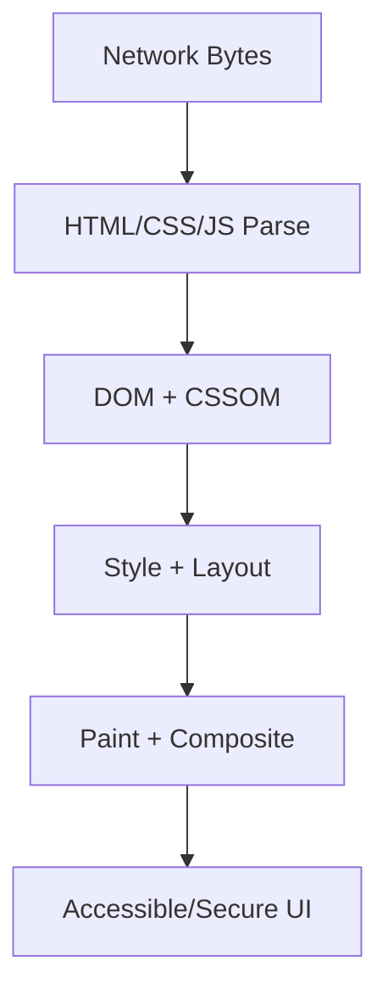
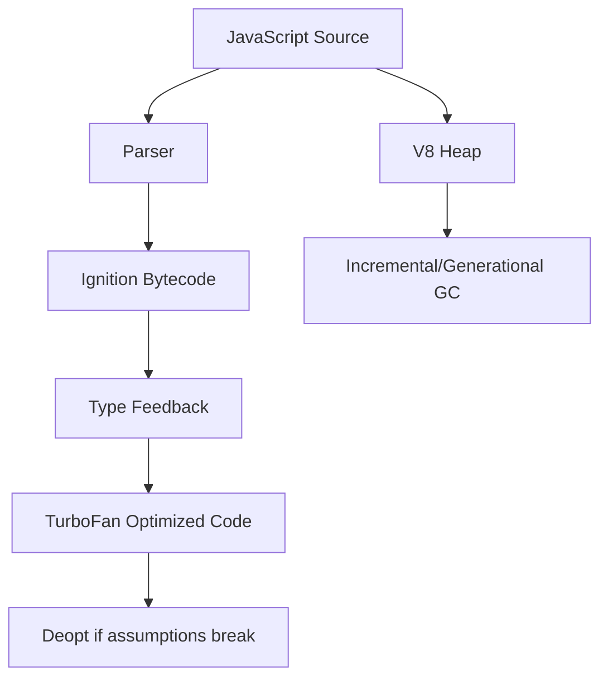

# Browser Internals

This volume contains domain-specific senior-level notes for: DOM, CSSOM, Rendering Pipeline, Reflow/Repaint, Event Delegation, Storage, Security.



## DOM

### What it is
DOM is the browser's live object tree representing parsed HTML.

### Why it exists
It gives scripts and browser subsystems a structured, live representation of the document.

### Source-code / internal model
Parser creates nodes; JS can mutate nodes; style/layout systems consume DOM plus CSSOM.

### Architecture diagram


### Production React example
React, forms, modals, analytics tags, and accessibility APIs ultimately interact with DOM nodes.

```tsx
const DOMExample = {
  input: "dashboard filter, route transition, or API response",
  failureMode: "stale state, remount, blocked input, or unsafe data sink",
  metric: "React Profiler commit time, Chrome long task, heap growth, or Web Vital",
};
```

### Debugging scenario
If UI exists visually but screen reader cannot use it, inspect DOM semantics, not CSS alone.

### Performance profiling example
Large DOM size increases style, layout, memory, and query cost.

### Product-company interview prompts
- Interviewers ask: DOM vs HTML, live collections, event propagation, and mutation observers.
- Explain one production incident involving DOM and how you would prevent recurrence.
- Implement or design a minimal example of DOM while narrating correctness, edge cases, and trade-offs.

### Senior-engineer checklist
- What owns the data or behavior?
- What can make it stale, slow, inaccessible, insecure, or hard to test?
- What instrumentation proves it works in production?
- What API would you expose to a team so misuse is difficult?

## CSSOM

### What it is
CSSOM is the parsed representation of CSS rules and computed style dependencies.

### Why it exists
It gives the browser a structured style model for cascade, inheritance, selector matching, and computed styles.

### Source-code / internal model
Browser parses stylesheets, blocks rendering for critical CSS, matches selectors against DOM, and computes cascaded values.

### Architecture diagram


### Production React example
Design systems rely on CSS variables, cascade layers, and predictable specificity.

```tsx
const CSSOMExample = {
  input: "dashboard filter, route transition, or API response",
  failureMode: "stale state, remount, blocked input, or unsafe data sink",
  metric: "React Profiler commit time, Chrome long task, heap growth, or Web Vital",
};
```

### Debugging scenario
Specificity bugs happen when component overrides fight global styles.

### Performance profiling example
Selector complexity and large invalidation scopes can increase style recalculation.

### Product-company interview prompts
- Questions include cascade, specificity, inheritance, critical CSS, and CSSOM blocking behavior.
- Explain one production incident involving CSSOM and how you would prevent recurrence.
- Implement or design a minimal example of CSSOM while narrating correctness, edge cases, and trade-offs.

### Senior-engineer checklist
- What owns the data or behavior?
- What can make it stale, slow, inaccessible, insecure, or hard to test?
- What instrumentation proves it works in production?
- What API would you expose to a team so misuse is difficult?

## Rendering Pipeline

### What it is
The rendering pipeline turns DOM and CSSOM into pixels through style, layout, paint, and compositing.

### Why it exists
It explains how HTML, CSS, JS, and assets become pixels and where performance bottlenecks appear.

### Source-code / internal model
DOM/CSSOM produce render tree; layout calculates boxes; paint records draw commands; compositor assembles layers.

### Architecture diagram


### Production React example
Performance work on feeds, dashboards, and animations depends on avoiding unnecessary layout/paint.

```tsx
const RenderingPipelineExample = {
  input: "dashboard filter, route transition, or API response",
  failureMode: "stale state, remount, blocked input, or unsafe data sink",
  metric: "React Profiler commit time, Chrome long task, heap growth, or Web Vital",
};
```

### Debugging scenario
Jank during scroll usually means long JS, forced layout, or expensive paint.

### Performance profiling example
Use Chrome Performance panel: look for Recalculate Style, Layout, Paint, Composite, Long Task.

### Product-company interview prompts
- Interviews ask: reflow vs repaint, compositor-only animations, and critical rendering path.
- Explain one production incident involving Rendering Pipeline and how you would prevent recurrence.
- Implement or design a minimal example of Rendering Pipeline while narrating correctness, edge cases, and trade-offs.

### Senior-engineer checklist
- What owns the data or behavior?
- What can make it stale, slow, inaccessible, insecure, or hard to test?
- What instrumentation proves it works in production?
- What API would you expose to a team so misuse is difficult?

## Reflow/Repaint

### What it is
Reflow/layout recalculates geometry; repaint redraws pixels without necessarily changing layout.

### Why it exists
They explain why some visual changes are cheap compositor updates while others force expensive layout or paint.

### Source-code / internal model
Reading layout after writing styles can force synchronous layout because browser must flush pending changes.

### Architecture diagram


### Production React example
Virtualized lists avoid repeated reflow for thousands of DOM nodes.

```tsx
const Reflow/RepaintExample = {
  input: "dashboard filter, route transition, or API response",
  failureMode: "stale state, remount, blocked input, or unsafe data sink",
  metric: "React Profiler commit time, Chrome long task, heap growth, or Web Vital",
};
```

### Debugging scenario
If animation stutters, check layout-changing properties such as top/left/width.

### Performance profiling example
Profile forced reflow warnings; prefer transform/opacity for animations.

### Product-company interview prompts
- Common question: why transform is cheaper than top/left.
- Explain one production incident involving Reflow/Repaint and how you would prevent recurrence.
- Implement or design a minimal example of Reflow/Repaint while narrating correctness, edge cases, and trade-offs.

### Senior-engineer checklist
- What owns the data or behavior?
- What can make it stale, slow, inaccessible, insecure, or hard to test?
- What instrumentation proves it works in production?
- What API would you expose to a team so misuse is difficult?

## Event Delegation

### What it is
Event delegation handles events at a stable ancestor instead of attaching listeners to every child.

### Why it exists
It exists because lists and tables can contain thousands of dynamic items.

### Source-code / internal model
Events bubble from target to ancestors; handler checks event.target.closest to identify intended child.

### Architecture diagram


### Production React example
A notification list can handle archive clicks with one parent listener.

```tsx
const EventDelegationExample = {
  input: "dashboard filter, route transition, or API response",
  failureMode: "stale state, remount, blocked input, or unsafe data sink",
  metric: "React Profiler commit time, Chrome long task, heap growth, or Web Vital",
};
```

### Debugging scenario
If wrong row opens, inspect closest selector and stopped propagation.

### Performance profiling example
Measure listener count and memory before/after delegation in large lists.

### Product-company interview prompts
- Asked: event bubbling, capturing, stopPropagation, delegation trade-offs.
- Explain one production incident involving Event Delegation and how you would prevent recurrence.
- Implement or design a minimal example of Event Delegation while narrating correctness, edge cases, and trade-offs.

### Senior-engineer checklist
- What owns the data or behavior?
- What can make it stale, slow, inaccessible, insecure, or hard to test?
- What instrumentation proves it works in production?
- What API would you expose to a team so misuse is difficult?

## Storage

### What it is
Browser storage includes cookies, localStorage, sessionStorage, IndexedDB, Cache Storage, and memory caches.

### Why it exists
It exists to persist data across reloads, sessions, offline usage, and network boundaries.

### Source-code / internal model
Each storage API has quota, sync/async behavior, origin scoping, and security implications.

### Architecture diagram


### Production React example
Offline-first apps store drafts in IndexedDB and API responses in Cache Storage.

```tsx
const res = await fetch("/api/session", { credentials: "include" });
if (!res.ok) throw new Error("session check failed");
```

### Debugging scenario
QuotaExceededError and stale schema versions are common production failures.

### Performance profiling example
localStorage blocks main thread; IndexedDB is async and better for large data.

### Product-company interview prompts
- Asked: cookie vs localStorage vs IndexedDB and token storage risks.
- Explain one production incident involving Storage and how you would prevent recurrence.
- Implement or design a minimal example of Storage while narrating correctness, edge cases, and trade-offs.

### Senior-engineer checklist
- What owns the data or behavior?
- What can make it stale, slow, inaccessible, insecure, or hard to test?
- What instrumentation proves it works in production?
- What API would you expose to a team so misuse is difficult?

## Security

### What it is
Browser security protects users through same-origin policy, sandboxing, permissions, TLS, cookies, and CSP.

### Why it exists
It exists because web pages run untrusted code from many origins on user devices.

### Source-code / internal model
The browser isolates origins, restricts cross-origin reads, protects credentials, and mediates powerful APIs.

### Architecture diagram


### Production React example
Auth flows, payments, iframes, and third-party scripts require security review.

```tsx
const res = await fetch("/api/session", { credentials: "include" });
if (!res.ok) throw new Error("session check failed");
```

### Debugging scenario
If a script can exfiltrate tokens, inspect XSS sinks and storage choices.

### Performance profiling example
Security controls can affect performance through preflights, CSP reports, and third-party script blocking.

### Product-company interview prompts
- Asked: SOP, CORS, CSP, cookies, XSS, CSRF.
- Explain one production incident involving Security and how you would prevent recurrence.
- Implement or design a minimal example of Security while narrating correctness, edge cases, and trade-offs.

### Senior-engineer checklist
- What owns the data or behavior?
- What can make it stale, slow, inaccessible, insecure, or hard to test?
- What instrumentation proves it works in production?
- What API would you expose to a team so misuse is difficult?

# Browser and V8 Deep Dive

## Browser Architecture
Modern browsers separate the browser process, renderer process, GPU process, network process, extension processes, and utility processes. The browser process owns tabs, navigation, permissions, and UI chrome. Renderer processes run web content and are isolated for security. The GPU process composites layers and handles raster/GPU work. The network process owns fetches, caching, TLS, and proxy behavior.

## Rendering Pipeline
HTML creates DOM, CSS creates CSSOM, DOM + CSSOM create render tree, layout computes geometry, paint records draw commands, and composite assembles layers. JavaScript can invalidate any part of this pipeline by mutating DOM, styles, or layout-dependent properties.

## V8 Internals
V8 parses JavaScript into AST/bytecode. Ignition interprets bytecode. TurboFan optimizes hot functions when type feedback is stable. Hidden classes represent object shapes; inline caches speed repeated property access. Changing object shapes in hot paths can deoptimize optimized code.

## Garbage Collection
V8 uses generational GC: new objects start in young generation and surviving objects promote to old generation. Mark-and-sweep identifies reachable objects; incremental and concurrent marking reduce pause time. Frontend leaks usually come from retained closures, globals, listeners, observers, detached DOM, and unbounded caches.


