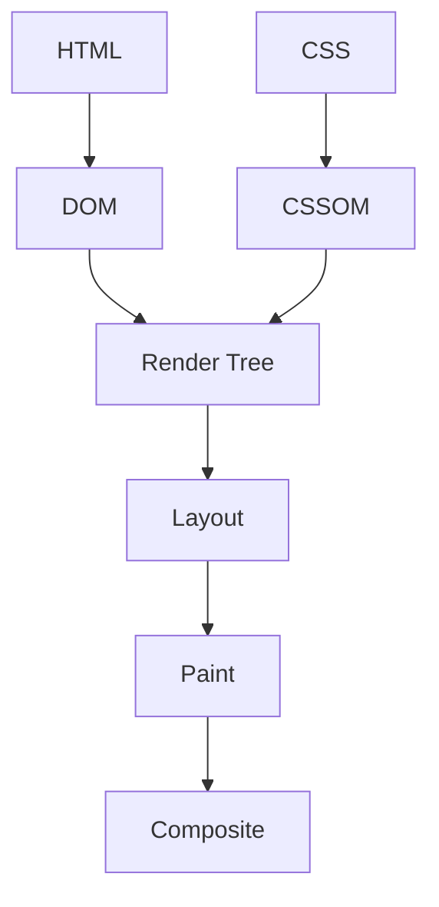

# Volume 04: Browser Internals

This volume covers Browser Internals from beginner foundations to teaching-level mastery. Each topic follows the required repository structure and links internals to production frontend work.

## Volume Learning Order

DOM -> CSSOM -> Rendering Pipeline -> Reflow/Repaint -> Event Delegation -> Storage -> Security

# DOM

## Introduction

DOM is a foundational Browser Internals topic. Mastery means you can use it correctly, predict its behavior, debug production issues, explain internals, and connect it to interviews, architecture, accessibility, security, and performance.

## Why This Concept Exists

* What problem does it solve? It reduces ambiguity around how frontend systems represent data, run code, render UI, communicate over networks, and recover from failure.
* Why was it introduced? It emerged because applications needed more predictable, reusable, observable, and scalable ways to manage complexity.

## Core Fundamentals

- Definition: know the exact vocabulary for DOM.
- Contract: identify inputs, outputs, side effects, ownership, lifecycle, and cleanup.
- Boundaries: separate language behavior, browser behavior, framework behavior, and application policy.
- Correctness: cover happy path, loading path, empty state, error state, retry path, and cleanup path.
- Production readiness: include tests, monitoring, documentation, performance budgets, and accessibility/security review where relevant.

## Internal Working

Explain step-by-step what happens internally.

The browser parses bytes into DOM/CSSOM, schedules JavaScript tasks, calculates style/layout, paints pixels, composites layers, and enforces security boundaries such as origin and CSP.

For JavaScript topics:

* Memory: primitives are stored directly in execution records where possible; objects, arrays, functions, and closures live on the heap and are referenced.
* Execution Context: creation phase builds bindings and scope links; execution phase evaluates statements and expressions.
* Call Stack: synchronous frames push and pop; long frames block input and rendering.
* Engine Behavior: engines optimize stable shapes and predictable types, but can deoptimize polymorphic or megamorphic hot paths.

For React topics:

* Rendering: React calls components to describe UI.
* Reconciliation: React compares previous and next element trees using type and key.
* Fiber: work is represented as interruptible units linked in a tree.
* Scheduler: urgent updates can be prioritized over non-urgent rendering.

For Browser topics:

* DOM: parsed HTML becomes nodes and relationships.
* CSSOM: CSS becomes matched style rules.
* Rendering Pipeline: style, layout, paint, and composite turn data into pixels.

## Mental Models

- Restaurant analogy: DOM is like the workflow between order taking, kitchen preparation, serving, and cleanup.
- Airport analogy: requests and events move through queues, priorities, gates, and security checks.
- Library analogy: references point to books on shelves; losing the catalog reference makes a book eligible for cleanup.
- Warehouse analogy: caching and indexing trade storage cost for faster retrieval.

## Visual Diagrams



## Step-by-Step Examples

```js
const topic = "DOM";
console.log(`Learning ${topic} deeply`);
```

Line-by-line explanation:

1. Identify declarations and allocate necessary bindings.
2. Create runtime values or references.
3. Execute the synchronous part first.
4. Schedule asynchronous, rendering, or cleanup work if present.
5. Observe the final state through logs, UI, network panel, profiler, or tests.

Specific explanation: This minimal snippet creates, stores, and reads a value related to DOM; expand it with real inputs, errors, and measurement.

## Memory Visualizations

```text
Stack / Execution Records
main() frame
  local binding -> ref:0x001

Heap
0x001 -> { topic: "DOM", lifecycle: "created -> used -> cleaned" }

GC rule
reachable from stack/module/global/subscription => kept
unreachable after cleanup => collectible
```

## Real-World Use Cases

- React hooks and component state synchronization.
- React Query or cache invalidation workflows.
- Debouncing input and avoiding unnecessary network calls.
- Authentication, authorization, and guarded routes.
- Notifications, chat, optimistic updates, uploads, and realtime dashboards.

## Common Mistakes

- Treating DOM as syntax instead of a lifecycle and ownership problem.
- Forgetting cleanup for listeners, timers, subscriptions, observers, or pending requests.
- Confusing microtasks, tasks, render work, and React commits.
- Ignoring empty, duplicate, stale, failed, or slow states.
- Adding abstractions before the problem repeats.

## Best Practices

- Make ownership explicit.
- Keep side effects at boundaries.
- Prefer native browser semantics before custom JavaScript.
- Add tests for normal, boundary, and failure behavior.
- Document invariants and trade-offs.

## Performance Considerations

- Time complexity: identify whether work is O(1), O(n), O(n log n), or worse.
- Space complexity: track retained objects, caches, closures, and subscriptions.
- Rendering cost: avoid unnecessary DOM work, style recalculation, layout, paint, and React re-renders.
- Re-renders: stabilize keys, props, callbacks, and derived data only when measurement shows benefit.
- Memory impact: release references and cap cache size.

## Edge Cases

- Null, undefined, empty arrays, duplicate IDs, and unexpected types.
- Slow network, offline mode, retries, cancellation, and race conditions.
- Browser tab suspension and page visibility changes.
- Server/client mismatches during hydration.
- Accessibility states such as focus, disabled, expanded, selected, and live updates.

## Interview Questions

### Beginner Questions

1. Define DOM?
2. Why does production code need DOM?
3. Show a simple example of DOM?
4. What problem is solved by DOM?
5. What breaks when misusing DOM?
6. How do you debug DOM?
7. What browser or engine behavior affects DOM?
8. What React behavior affects DOM?
9. What performance metric is impacted by DOM?
10. How would you teach DOM?

### Intermediate Questions

1. Compare trade-offs of DOM in a real app?
2. Describe memory implications of DOM in a real app?
3. Explain async or rendering order for DOM in a real app?
4. Design a reusable abstraction around DOM in a real app?
5. List edge cases for DOM in a real app?
6. Write tests for DOM in a real app?
7. Profile bottlenecks caused by DOM in a real app?
8. Connect security concerns to DOM in a real app?
9. Explain failure recovery for DOM in a real app?
10. Refactor legacy usage of DOM in a real app?

### Advanced Questions

1. Explain internals of DOM under scale?
2. How would you optimize DOM under scale?
3. How would you design observability for DOM under scale?
4. What deoptimization or reconciliation pitfalls affect DOM under scale?
5. How do concurrent updates change DOM under scale?
6. How would you document invariants for DOM under scale?
7. How would you migrate a large codebase using DOM under scale?
8. How would you prevent regressions in DOM under scale?
9. How would you answer a staff-level interview about DOM under scale?
10. What are the hidden trade-offs of DOM under scale?

## Coding Challenges

1. Build a minimal demo for DOM and log every lifecycle step.
2. Add input validation and error handling.
3. Add cleanup logic and prove it with a test.
4. Profile the implementation and remove one bottleneck.
5. Convert the demo into a reusable production-style API.

## Assignments

1. Write a one-page beginner explanation with a diagram.
2. Create an interview answer bank with short and long answers.
3. Build a production checklist covering tests, performance, accessibility, and security.

## Mini Projects

- Build a small dashboard feature that uses DOM, includes loading/error/empty states, has tests, exposes metrics, and documents trade-offs.

## Revision Notes

DOM: definition, problem solved, lifecycle, memory model, browser/React impact, failure modes, performance cost, debugging tools, and one production example.

## Cheat Sheet

| Need | Reminder |
| --- | --- |
| Define | State what DOM is in one sentence. |
| Debug | Inspect stack, heap references, events, network, render commits, and logs. |
| Optimize | Measure first, then reduce repeated work or retained memory. |
| Interview | Answer with definition, example, internals, edge cases, trade-offs. |

## Teaching Notes

- A beginner: use one analogy and one tiny example.
- A junior developer: add lifecycle, pitfalls, and debugging workflow.
- A senior developer: discuss trade-offs, scale, observability, migration, and failure isolation.

## FAQs

1. What is DOM? It is a core concept in Browser Internals used to reason about frontend behavior.
2. Why should I learn it? It appears in bugs, architecture, and interviews.
3. Is it language-level or browser-level? It may involve both; separate the layers.
4. How do I debug it? Reproduce, isolate, inspect runtime state, and add targeted tests.
5. What is the biggest beginner mistake? Memorizing behavior without understanding lifecycle.
6. What is the biggest production mistake? Forgetting cleanup, failure states, or monitoring.
7. How does it affect performance? Through CPU time, memory retention, rendering, network, or bundle size.
8. How does React change the story? React adds render, reconciliation, commit, and scheduling semantics.
9. What should I say in interviews? Define it, show an example, explain internals, and discuss trade-offs.
10. How do I teach it? Start with analogy, then code, then internals, then production scenario.

## Related Topics

DOM -> Scope -> Execution Context -> Event Loop -> Browser Rendering -> React Rendering -> Testing -> Performance -> System Design

# CSSOM

## Introduction

CSSOM is a foundational Browser Internals topic. Mastery means you can use it correctly, predict its behavior, debug production issues, explain internals, and connect it to interviews, architecture, accessibility, security, and performance.

## Why This Concept Exists

* What problem does it solve? It reduces ambiguity around how frontend systems represent data, run code, render UI, communicate over networks, and recover from failure.
* Why was it introduced? It emerged because applications needed more predictable, reusable, observable, and scalable ways to manage complexity.

## Core Fundamentals

- Definition: know the exact vocabulary for CSSOM.
- Contract: identify inputs, outputs, side effects, ownership, lifecycle, and cleanup.
- Boundaries: separate language behavior, browser behavior, framework behavior, and application policy.
- Correctness: cover happy path, loading path, empty state, error state, retry path, and cleanup path.
- Production readiness: include tests, monitoring, documentation, performance budgets, and accessibility/security review where relevant.

## Internal Working

Explain step-by-step what happens internally.

The browser parses bytes into DOM/CSSOM, schedules JavaScript tasks, calculates style/layout, paints pixels, composites layers, and enforces security boundaries such as origin and CSP.

For JavaScript topics:

* Memory: primitives are stored directly in execution records where possible; objects, arrays, functions, and closures live on the heap and are referenced.
* Execution Context: creation phase builds bindings and scope links; execution phase evaluates statements and expressions.
* Call Stack: synchronous frames push and pop; long frames block input and rendering.
* Engine Behavior: engines optimize stable shapes and predictable types, but can deoptimize polymorphic or megamorphic hot paths.

For React topics:

* Rendering: React calls components to describe UI.
* Reconciliation: React compares previous and next element trees using type and key.
* Fiber: work is represented as interruptible units linked in a tree.
* Scheduler: urgent updates can be prioritized over non-urgent rendering.

For Browser topics:

* DOM: parsed HTML becomes nodes and relationships.
* CSSOM: CSS becomes matched style rules.
* Rendering Pipeline: style, layout, paint, and composite turn data into pixels.

## Mental Models

- Restaurant analogy: CSSOM is like the workflow between order taking, kitchen preparation, serving, and cleanup.
- Airport analogy: requests and events move through queues, priorities, gates, and security checks.
- Library analogy: references point to books on shelves; losing the catalog reference makes a book eligible for cleanup.
- Warehouse analogy: caching and indexing trade storage cost for faster retrieval.

## Visual Diagrams


## Step-by-Step Examples

```js
const topic = "CSSOM";
console.log(`Learning ${topic} deeply`);
```

Line-by-line explanation:

1. Identify declarations and allocate necessary bindings.
2. Create runtime values or references.
3. Execute the synchronous part first.
4. Schedule asynchronous, rendering, or cleanup work if present.
5. Observe the final state through logs, UI, network panel, profiler, or tests.

Specific explanation: This minimal snippet creates, stores, and reads a value related to CSSOM; expand it with real inputs, errors, and measurement.

## Memory Visualizations

```text
Stack / Execution Records
main() frame
  local binding -> ref:0x001

Heap
0x001 -> { topic: "CSSOM", lifecycle: "created -> used -> cleaned" }

GC rule
reachable from stack/module/global/subscription => kept
unreachable after cleanup => collectible
```

## Real-World Use Cases

- React hooks and component state synchronization.
- React Query or cache invalidation workflows.
- Debouncing input and avoiding unnecessary network calls.
- Authentication, authorization, and guarded routes.
- Notifications, chat, optimistic updates, uploads, and realtime dashboards.

## Common Mistakes

- Treating CSSOM as syntax instead of a lifecycle and ownership problem.
- Forgetting cleanup for listeners, timers, subscriptions, observers, or pending requests.
- Confusing microtasks, tasks, render work, and React commits.
- Ignoring empty, duplicate, stale, failed, or slow states.
- Adding abstractions before the problem repeats.

## Best Practices

- Make ownership explicit.
- Keep side effects at boundaries.
- Prefer native browser semantics before custom JavaScript.
- Add tests for normal, boundary, and failure behavior.
- Document invariants and trade-offs.

## Performance Considerations

- Time complexity: identify whether work is O(1), O(n), O(n log n), or worse.
- Space complexity: track retained objects, caches, closures, and subscriptions.
- Rendering cost: avoid unnecessary DOM work, style recalculation, layout, paint, and React re-renders.
- Re-renders: stabilize keys, props, callbacks, and derived data only when measurement shows benefit.
- Memory impact: release references and cap cache size.

## Edge Cases

- Null, undefined, empty arrays, duplicate IDs, and unexpected types.
- Slow network, offline mode, retries, cancellation, and race conditions.
- Browser tab suspension and page visibility changes.
- Server/client mismatches during hydration.
- Accessibility states such as focus, disabled, expanded, selected, and live updates.

## Interview Questions

### Beginner Questions

1. Define CSSOM?
2. Why does production code need CSSOM?
3. Show a simple example of CSSOM?
4. What problem is solved by CSSOM?
5. What breaks when misusing CSSOM?
6. How do you debug CSSOM?
7. What browser or engine behavior affects CSSOM?
8. What React behavior affects CSSOM?
9. What performance metric is impacted by CSSOM?
10. How would you teach CSSOM?

### Intermediate Questions

1. Compare trade-offs of CSSOM in a real app?
2. Describe memory implications of CSSOM in a real app?
3. Explain async or rendering order for CSSOM in a real app?
4. Design a reusable abstraction around CSSOM in a real app?
5. List edge cases for CSSOM in a real app?
6. Write tests for CSSOM in a real app?
7. Profile bottlenecks caused by CSSOM in a real app?
8. Connect security concerns to CSSOM in a real app?
9. Explain failure recovery for CSSOM in a real app?
10. Refactor legacy usage of CSSOM in a real app?

### Advanced Questions

1. Explain internals of CSSOM under scale?
2. How would you optimize CSSOM under scale?
3. How would you design observability for CSSOM under scale?
4. What deoptimization or reconciliation pitfalls affect CSSOM under scale?
5. How do concurrent updates change CSSOM under scale?
6. How would you document invariants for CSSOM under scale?
7. How would you migrate a large codebase using CSSOM under scale?
8. How would you prevent regressions in CSSOM under scale?
9. How would you answer a staff-level interview about CSSOM under scale?
10. What are the hidden trade-offs of CSSOM under scale?

## Coding Challenges

1. Build a minimal demo for CSSOM and log every lifecycle step.
2. Add input validation and error handling.
3. Add cleanup logic and prove it with a test.
4. Profile the implementation and remove one bottleneck.
5. Convert the demo into a reusable production-style API.

## Assignments

1. Write a one-page beginner explanation with a diagram.
2. Create an interview answer bank with short and long answers.
3. Build a production checklist covering tests, performance, accessibility, and security.

## Mini Projects

- Build a small dashboard feature that uses CSSOM, includes loading/error/empty states, has tests, exposes metrics, and documents trade-offs.

## Revision Notes

CSSOM: definition, problem solved, lifecycle, memory model, browser/React impact, failure modes, performance cost, debugging tools, and one production example.

## Cheat Sheet

| Need | Reminder |
| --- | --- |
| Define | State what CSSOM is in one sentence. |
| Debug | Inspect stack, heap references, events, network, render commits, and logs. |
| Optimize | Measure first, then reduce repeated work or retained memory. |
| Interview | Answer with definition, example, internals, edge cases, trade-offs. |

## Teaching Notes

- A beginner: use one analogy and one tiny example.
- A junior developer: add lifecycle, pitfalls, and debugging workflow.
- A senior developer: discuss trade-offs, scale, observability, migration, and failure isolation.

## FAQs

1. What is CSSOM? It is a core concept in Browser Internals used to reason about frontend behavior.
2. Why should I learn it? It appears in bugs, architecture, and interviews.
3. Is it language-level or browser-level? It may involve both; separate the layers.
4. How do I debug it? Reproduce, isolate, inspect runtime state, and add targeted tests.
5. What is the biggest beginner mistake? Memorizing behavior without understanding lifecycle.
6. What is the biggest production mistake? Forgetting cleanup, failure states, or monitoring.
7. How does it affect performance? Through CPU time, memory retention, rendering, network, or bundle size.
8. How does React change the story? React adds render, reconciliation, commit, and scheduling semantics.
9. What should I say in interviews? Define it, show an example, explain internals, and discuss trade-offs.
10. How do I teach it? Start with analogy, then code, then internals, then production scenario.

## Related Topics

CSSOM -> Scope -> Execution Context -> Event Loop -> Browser Rendering -> React Rendering -> Testing -> Performance -> System Design

# Rendering Pipeline

## Introduction

Rendering Pipeline is a foundational Browser Internals topic. Mastery means you can use it correctly, predict its behavior, debug production issues, explain internals, and connect it to interviews, architecture, accessibility, security, and performance.

## Why This Concept Exists

* What problem does it solve? It reduces ambiguity around how frontend systems represent data, run code, render UI, communicate over networks, and recover from failure.
* Why was it introduced? It emerged because applications needed more predictable, reusable, observable, and scalable ways to manage complexity.

## Core Fundamentals

- Definition: know the exact vocabulary for Rendering Pipeline.
- Contract: identify inputs, outputs, side effects, ownership, lifecycle, and cleanup.
- Boundaries: separate language behavior, browser behavior, framework behavior, and application policy.
- Correctness: cover happy path, loading path, empty state, error state, retry path, and cleanup path.
- Production readiness: include tests, monitoring, documentation, performance budgets, and accessibility/security review where relevant.

## Internal Working

Explain step-by-step what happens internally.

The browser parses bytes into DOM/CSSOM, schedules JavaScript tasks, calculates style/layout, paints pixels, composites layers, and enforces security boundaries such as origin and CSP.

For JavaScript topics:

* Memory: primitives are stored directly in execution records where possible; objects, arrays, functions, and closures live on the heap and are referenced.
* Execution Context: creation phase builds bindings and scope links; execution phase evaluates statements and expressions.
* Call Stack: synchronous frames push and pop; long frames block input and rendering.
* Engine Behavior: engines optimize stable shapes and predictable types, but can deoptimize polymorphic or megamorphic hot paths.

For React topics:

* Rendering: React calls components to describe UI.
* Reconciliation: React compares previous and next element trees using type and key.
* Fiber: work is represented as interruptible units linked in a tree.
* Scheduler: urgent updates can be prioritized over non-urgent rendering.

For Browser topics:

* DOM: parsed HTML becomes nodes and relationships.
* CSSOM: CSS becomes matched style rules.
* Rendering Pipeline: style, layout, paint, and composite turn data into pixels.

## Mental Models

- Restaurant analogy: Rendering Pipeline is like the workflow between order taking, kitchen preparation, serving, and cleanup.
- Airport analogy: requests and events move through queues, priorities, gates, and security checks.
- Library analogy: references point to books on shelves; losing the catalog reference makes a book eligible for cleanup.
- Warehouse analogy: caching and indexing trade storage cost for faster retrieval.

## Visual Diagrams


## Step-by-Step Examples

```js
const topic = "Rendering Pipeline";
console.log(`Learning ${topic} deeply`);
```

Line-by-line explanation:

1. Identify declarations and allocate necessary bindings.
2. Create runtime values or references.
3. Execute the synchronous part first.
4. Schedule asynchronous, rendering, or cleanup work if present.
5. Observe the final state through logs, UI, network panel, profiler, or tests.

Specific explanation: This minimal snippet creates, stores, and reads a value related to Rendering Pipeline; expand it with real inputs, errors, and measurement.

## Memory Visualizations

```text
Stack / Execution Records
main() frame
  local binding -> ref:0x001

Heap
0x001 -> { topic: "Rendering Pipeline", lifecycle: "created -> used -> cleaned" }

GC rule
reachable from stack/module/global/subscription => kept
unreachable after cleanup => collectible
```

## Real-World Use Cases

- React hooks and component state synchronization.
- React Query or cache invalidation workflows.
- Debouncing input and avoiding unnecessary network calls.
- Authentication, authorization, and guarded routes.
- Notifications, chat, optimistic updates, uploads, and realtime dashboards.

## Common Mistakes

- Treating Rendering Pipeline as syntax instead of a lifecycle and ownership problem.
- Forgetting cleanup for listeners, timers, subscriptions, observers, or pending requests.
- Confusing microtasks, tasks, render work, and React commits.
- Ignoring empty, duplicate, stale, failed, or slow states.
- Adding abstractions before the problem repeats.

## Best Practices

- Make ownership explicit.
- Keep side effects at boundaries.
- Prefer native browser semantics before custom JavaScript.
- Add tests for normal, boundary, and failure behavior.
- Document invariants and trade-offs.

## Performance Considerations

- Time complexity: identify whether work is O(1), O(n), O(n log n), or worse.
- Space complexity: track retained objects, caches, closures, and subscriptions.
- Rendering cost: avoid unnecessary DOM work, style recalculation, layout, paint, and React re-renders.
- Re-renders: stabilize keys, props, callbacks, and derived data only when measurement shows benefit.
- Memory impact: release references and cap cache size.

## Edge Cases

- Null, undefined, empty arrays, duplicate IDs, and unexpected types.
- Slow network, offline mode, retries, cancellation, and race conditions.
- Browser tab suspension and page visibility changes.
- Server/client mismatches during hydration.
- Accessibility states such as focus, disabled, expanded, selected, and live updates.

## Interview Questions

### Beginner Questions

1. Define Rendering Pipeline?
2. Why does production code need Rendering Pipeline?
3. Show a simple example of Rendering Pipeline?
4. What problem is solved by Rendering Pipeline?
5. What breaks when misusing Rendering Pipeline?
6. How do you debug Rendering Pipeline?
7. What browser or engine behavior affects Rendering Pipeline?
8. What React behavior affects Rendering Pipeline?
9. What performance metric is impacted by Rendering Pipeline?
10. How would you teach Rendering Pipeline?

### Intermediate Questions

1. Compare trade-offs of Rendering Pipeline in a real app?
2. Describe memory implications of Rendering Pipeline in a real app?
3. Explain async or rendering order for Rendering Pipeline in a real app?
4. Design a reusable abstraction around Rendering Pipeline in a real app?
5. List edge cases for Rendering Pipeline in a real app?
6. Write tests for Rendering Pipeline in a real app?
7. Profile bottlenecks caused by Rendering Pipeline in a real app?
8. Connect security concerns to Rendering Pipeline in a real app?
9. Explain failure recovery for Rendering Pipeline in a real app?
10. Refactor legacy usage of Rendering Pipeline in a real app?

### Advanced Questions

1. Explain internals of Rendering Pipeline under scale?
2. How would you optimize Rendering Pipeline under scale?
3. How would you design observability for Rendering Pipeline under scale?
4. What deoptimization or reconciliation pitfalls affect Rendering Pipeline under scale?
5. How do concurrent updates change Rendering Pipeline under scale?
6. How would you document invariants for Rendering Pipeline under scale?
7. How would you migrate a large codebase using Rendering Pipeline under scale?
8. How would you prevent regressions in Rendering Pipeline under scale?
9. How would you answer a staff-level interview about Rendering Pipeline under scale?
10. What are the hidden trade-offs of Rendering Pipeline under scale?

## Coding Challenges

1. Build a minimal demo for Rendering Pipeline and log every lifecycle step.
2. Add input validation and error handling.
3. Add cleanup logic and prove it with a test.
4. Profile the implementation and remove one bottleneck.
5. Convert the demo into a reusable production-style API.

## Assignments

1. Write a one-page beginner explanation with a diagram.
2. Create an interview answer bank with short and long answers.
3. Build a production checklist covering tests, performance, accessibility, and security.

## Mini Projects

- Build a small dashboard feature that uses Rendering Pipeline, includes loading/error/empty states, has tests, exposes metrics, and documents trade-offs.

## Revision Notes

Rendering Pipeline: definition, problem solved, lifecycle, memory model, browser/React impact, failure modes, performance cost, debugging tools, and one production example.

## Cheat Sheet

| Need | Reminder |
| --- | --- |
| Define | State what Rendering Pipeline is in one sentence. |
| Debug | Inspect stack, heap references, events, network, render commits, and logs. |
| Optimize | Measure first, then reduce repeated work or retained memory. |
| Interview | Answer with definition, example, internals, edge cases, trade-offs. |

## Teaching Notes

- A beginner: use one analogy and one tiny example.
- A junior developer: add lifecycle, pitfalls, and debugging workflow.
- A senior developer: discuss trade-offs, scale, observability, migration, and failure isolation.

## FAQs

1. What is Rendering Pipeline? It is a core concept in Browser Internals used to reason about frontend behavior.
2. Why should I learn it? It appears in bugs, architecture, and interviews.
3. Is it language-level or browser-level? It may involve both; separate the layers.
4. How do I debug it? Reproduce, isolate, inspect runtime state, and add targeted tests.
5. What is the biggest beginner mistake? Memorizing behavior without understanding lifecycle.
6. What is the biggest production mistake? Forgetting cleanup, failure states, or monitoring.
7. How does it affect performance? Through CPU time, memory retention, rendering, network, or bundle size.
8. How does React change the story? React adds render, reconciliation, commit, and scheduling semantics.
9. What should I say in interviews? Define it, show an example, explain internals, and discuss trade-offs.
10. How do I teach it? Start with analogy, then code, then internals, then production scenario.

## Related Topics

Rendering Pipeline -> Scope -> Execution Context -> Event Loop -> Browser Rendering -> React Rendering -> Testing -> Performance -> System Design

# Reflow/Repaint

## Introduction

Reflow/Repaint is a foundational Browser Internals topic. Mastery means you can use it correctly, predict its behavior, debug production issues, explain internals, and connect it to interviews, architecture, accessibility, security, and performance.

## Why This Concept Exists

* What problem does it solve? It reduces ambiguity around how frontend systems represent data, run code, render UI, communicate over networks, and recover from failure.
* Why was it introduced? It emerged because applications needed more predictable, reusable, observable, and scalable ways to manage complexity.

## Core Fundamentals

- Definition: know the exact vocabulary for Reflow/Repaint.
- Contract: identify inputs, outputs, side effects, ownership, lifecycle, and cleanup.
- Boundaries: separate language behavior, browser behavior, framework behavior, and application policy.
- Correctness: cover happy path, loading path, empty state, error state, retry path, and cleanup path.
- Production readiness: include tests, monitoring, documentation, performance budgets, and accessibility/security review where relevant.

## Internal Working

Explain step-by-step what happens internally.

The browser parses bytes into DOM/CSSOM, schedules JavaScript tasks, calculates style/layout, paints pixels, composites layers, and enforces security boundaries such as origin and CSP.

For JavaScript topics:

* Memory: primitives are stored directly in execution records where possible; objects, arrays, functions, and closures live on the heap and are referenced.
* Execution Context: creation phase builds bindings and scope links; execution phase evaluates statements and expressions.
* Call Stack: synchronous frames push and pop; long frames block input and rendering.
* Engine Behavior: engines optimize stable shapes and predictable types, but can deoptimize polymorphic or megamorphic hot paths.

For React topics:

* Rendering: React calls components to describe UI.
* Reconciliation: React compares previous and next element trees using type and key.
* Fiber: work is represented as interruptible units linked in a tree.
* Scheduler: urgent updates can be prioritized over non-urgent rendering.

For Browser topics:

* DOM: parsed HTML becomes nodes and relationships.
* CSSOM: CSS becomes matched style rules.
* Rendering Pipeline: style, layout, paint, and composite turn data into pixels.

## Mental Models

- Restaurant analogy: Reflow/Repaint is like the workflow between order taking, kitchen preparation, serving, and cleanup.
- Airport analogy: requests and events move through queues, priorities, gates, and security checks.
- Library analogy: references point to books on shelves; losing the catalog reference makes a book eligible for cleanup.
- Warehouse analogy: caching and indexing trade storage cost for faster retrieval.

## Visual Diagrams


## Step-by-Step Examples

```js
const topic = "Reflow/Repaint";
console.log(`Learning ${topic} deeply`);
```

Line-by-line explanation:

1. Identify declarations and allocate necessary bindings.
2. Create runtime values or references.
3. Execute the synchronous part first.
4. Schedule asynchronous, rendering, or cleanup work if present.
5. Observe the final state through logs, UI, network panel, profiler, or tests.

Specific explanation: This minimal snippet creates, stores, and reads a value related to Reflow/Repaint; expand it with real inputs, errors, and measurement.

## Memory Visualizations

```text
Stack / Execution Records
main() frame
  local binding -> ref:0x001

Heap
0x001 -> { topic: "Reflow/Repaint", lifecycle: "created -> used -> cleaned" }

GC rule
reachable from stack/module/global/subscription => kept
unreachable after cleanup => collectible
```

## Real-World Use Cases

- React hooks and component state synchronization.
- React Query or cache invalidation workflows.
- Debouncing input and avoiding unnecessary network calls.
- Authentication, authorization, and guarded routes.
- Notifications, chat, optimistic updates, uploads, and realtime dashboards.

## Common Mistakes

- Treating Reflow/Repaint as syntax instead of a lifecycle and ownership problem.
- Forgetting cleanup for listeners, timers, subscriptions, observers, or pending requests.
- Confusing microtasks, tasks, render work, and React commits.
- Ignoring empty, duplicate, stale, failed, or slow states.
- Adding abstractions before the problem repeats.

## Best Practices

- Make ownership explicit.
- Keep side effects at boundaries.
- Prefer native browser semantics before custom JavaScript.
- Add tests for normal, boundary, and failure behavior.
- Document invariants and trade-offs.

## Performance Considerations

- Time complexity: identify whether work is O(1), O(n), O(n log n), or worse.
- Space complexity: track retained objects, caches, closures, and subscriptions.
- Rendering cost: avoid unnecessary DOM work, style recalculation, layout, paint, and React re-renders.
- Re-renders: stabilize keys, props, callbacks, and derived data only when measurement shows benefit.
- Memory impact: release references and cap cache size.

## Edge Cases

- Null, undefined, empty arrays, duplicate IDs, and unexpected types.
- Slow network, offline mode, retries, cancellation, and race conditions.
- Browser tab suspension and page visibility changes.
- Server/client mismatches during hydration.
- Accessibility states such as focus, disabled, expanded, selected, and live updates.

## Interview Questions

### Beginner Questions

1. Define Reflow/Repaint?
2. Why does production code need Reflow/Repaint?
3. Show a simple example of Reflow/Repaint?
4. What problem is solved by Reflow/Repaint?
5. What breaks when misusing Reflow/Repaint?
6. How do you debug Reflow/Repaint?
7. What browser or engine behavior affects Reflow/Repaint?
8. What React behavior affects Reflow/Repaint?
9. What performance metric is impacted by Reflow/Repaint?
10. How would you teach Reflow/Repaint?

### Intermediate Questions

1. Compare trade-offs of Reflow/Repaint in a real app?
2. Describe memory implications of Reflow/Repaint in a real app?
3. Explain async or rendering order for Reflow/Repaint in a real app?
4. Design a reusable abstraction around Reflow/Repaint in a real app?
5. List edge cases for Reflow/Repaint in a real app?
6. Write tests for Reflow/Repaint in a real app?
7. Profile bottlenecks caused by Reflow/Repaint in a real app?
8. Connect security concerns to Reflow/Repaint in a real app?
9. Explain failure recovery for Reflow/Repaint in a real app?
10. Refactor legacy usage of Reflow/Repaint in a real app?

### Advanced Questions

1. Explain internals of Reflow/Repaint under scale?
2. How would you optimize Reflow/Repaint under scale?
3. How would you design observability for Reflow/Repaint under scale?
4. What deoptimization or reconciliation pitfalls affect Reflow/Repaint under scale?
5. How do concurrent updates change Reflow/Repaint under scale?
6. How would you document invariants for Reflow/Repaint under scale?
7. How would you migrate a large codebase using Reflow/Repaint under scale?
8. How would you prevent regressions in Reflow/Repaint under scale?
9. How would you answer a staff-level interview about Reflow/Repaint under scale?
10. What are the hidden trade-offs of Reflow/Repaint under scale?

## Coding Challenges

1. Build a minimal demo for Reflow/Repaint and log every lifecycle step.
2. Add input validation and error handling.
3. Add cleanup logic and prove it with a test.
4. Profile the implementation and remove one bottleneck.
5. Convert the demo into a reusable production-style API.

## Assignments

1. Write a one-page beginner explanation with a diagram.
2. Create an interview answer bank with short and long answers.
3. Build a production checklist covering tests, performance, accessibility, and security.

## Mini Projects

- Build a small dashboard feature that uses Reflow/Repaint, includes loading/error/empty states, has tests, exposes metrics, and documents trade-offs.

## Revision Notes

Reflow/Repaint: definition, problem solved, lifecycle, memory model, browser/React impact, failure modes, performance cost, debugging tools, and one production example.

## Cheat Sheet

| Need | Reminder |
| --- | --- |
| Define | State what Reflow/Repaint is in one sentence. |
| Debug | Inspect stack, heap references, events, network, render commits, and logs. |
| Optimize | Measure first, then reduce repeated work or retained memory. |
| Interview | Answer with definition, example, internals, edge cases, trade-offs. |

## Teaching Notes

- A beginner: use one analogy and one tiny example.
- A junior developer: add lifecycle, pitfalls, and debugging workflow.
- A senior developer: discuss trade-offs, scale, observability, migration, and failure isolation.

## FAQs

1. What is Reflow/Repaint? It is a core concept in Browser Internals used to reason about frontend behavior.
2. Why should I learn it? It appears in bugs, architecture, and interviews.
3. Is it language-level or browser-level? It may involve both; separate the layers.
4. How do I debug it? Reproduce, isolate, inspect runtime state, and add targeted tests.
5. What is the biggest beginner mistake? Memorizing behavior without understanding lifecycle.
6. What is the biggest production mistake? Forgetting cleanup, failure states, or monitoring.
7. How does it affect performance? Through CPU time, memory retention, rendering, network, or bundle size.
8. How does React change the story? React adds render, reconciliation, commit, and scheduling semantics.
9. What should I say in interviews? Define it, show an example, explain internals, and discuss trade-offs.
10. How do I teach it? Start with analogy, then code, then internals, then production scenario.

## Related Topics

Reflow/Repaint -> Scope -> Execution Context -> Event Loop -> Browser Rendering -> React Rendering -> Testing -> Performance -> System Design

# Event Delegation

## Introduction

Event Delegation is a foundational Browser Internals topic. Mastery means you can use it correctly, predict its behavior, debug production issues, explain internals, and connect it to interviews, architecture, accessibility, security, and performance.

## Why This Concept Exists

* What problem does it solve? It reduces ambiguity around how frontend systems represent data, run code, render UI, communicate over networks, and recover from failure.
* Why was it introduced? It emerged because applications needed more predictable, reusable, observable, and scalable ways to manage complexity.

## Core Fundamentals

- Definition: know the exact vocabulary for Event Delegation.
- Contract: identify inputs, outputs, side effects, ownership, lifecycle, and cleanup.
- Boundaries: separate language behavior, browser behavior, framework behavior, and application policy.
- Correctness: cover happy path, loading path, empty state, error state, retry path, and cleanup path.
- Production readiness: include tests, monitoring, documentation, performance budgets, and accessibility/security review where relevant.

## Internal Working

Explain step-by-step what happens internally.

The browser parses bytes into DOM/CSSOM, schedules JavaScript tasks, calculates style/layout, paints pixels, composites layers, and enforces security boundaries such as origin and CSP.

For JavaScript topics:

* Memory: primitives are stored directly in execution records where possible; objects, arrays, functions, and closures live on the heap and are referenced.
* Execution Context: creation phase builds bindings and scope links; execution phase evaluates statements and expressions.
* Call Stack: synchronous frames push and pop; long frames block input and rendering.
* Engine Behavior: engines optimize stable shapes and predictable types, but can deoptimize polymorphic or megamorphic hot paths.

For React topics:

* Rendering: React calls components to describe UI.
* Reconciliation: React compares previous and next element trees using type and key.
* Fiber: work is represented as interruptible units linked in a tree.
* Scheduler: urgent updates can be prioritized over non-urgent rendering.

For Browser topics:

* DOM: parsed HTML becomes nodes and relationships.
* CSSOM: CSS becomes matched style rules.
* Rendering Pipeline: style, layout, paint, and composite turn data into pixels.

## Mental Models

- Restaurant analogy: Event Delegation is like the workflow between order taking, kitchen preparation, serving, and cleanup.
- Airport analogy: requests and events move through queues, priorities, gates, and security checks.
- Library analogy: references point to books on shelves; losing the catalog reference makes a book eligible for cleanup.
- Warehouse analogy: caching and indexing trade storage cost for faster retrieval.

## Visual Diagrams


## Step-by-Step Examples

```js
const topic = "Event Delegation";
console.log(`Learning ${topic} deeply`);
```

Line-by-line explanation:

1. Identify declarations and allocate necessary bindings.
2. Create runtime values or references.
3. Execute the synchronous part first.
4. Schedule asynchronous, rendering, or cleanup work if present.
5. Observe the final state through logs, UI, network panel, profiler, or tests.

Specific explanation: This minimal snippet creates, stores, and reads a value related to Event Delegation; expand it with real inputs, errors, and measurement.

## Memory Visualizations

```text
Stack / Execution Records
main() frame
  local binding -> ref:0x001

Heap
0x001 -> { topic: "Event Delegation", lifecycle: "created -> used -> cleaned" }

GC rule
reachable from stack/module/global/subscription => kept
unreachable after cleanup => collectible
```

## Real-World Use Cases

- React hooks and component state synchronization.
- React Query or cache invalidation workflows.
- Debouncing input and avoiding unnecessary network calls.
- Authentication, authorization, and guarded routes.
- Notifications, chat, optimistic updates, uploads, and realtime dashboards.

## Common Mistakes

- Treating Event Delegation as syntax instead of a lifecycle and ownership problem.
- Forgetting cleanup for listeners, timers, subscriptions, observers, or pending requests.
- Confusing microtasks, tasks, render work, and React commits.
- Ignoring empty, duplicate, stale, failed, or slow states.
- Adding abstractions before the problem repeats.

## Best Practices

- Make ownership explicit.
- Keep side effects at boundaries.
- Prefer native browser semantics before custom JavaScript.
- Add tests for normal, boundary, and failure behavior.
- Document invariants and trade-offs.

## Performance Considerations

- Time complexity: identify whether work is O(1), O(n), O(n log n), or worse.
- Space complexity: track retained objects, caches, closures, and subscriptions.
- Rendering cost: avoid unnecessary DOM work, style recalculation, layout, paint, and React re-renders.
- Re-renders: stabilize keys, props, callbacks, and derived data only when measurement shows benefit.
- Memory impact: release references and cap cache size.

## Edge Cases

- Null, undefined, empty arrays, duplicate IDs, and unexpected types.
- Slow network, offline mode, retries, cancellation, and race conditions.
- Browser tab suspension and page visibility changes.
- Server/client mismatches during hydration.
- Accessibility states such as focus, disabled, expanded, selected, and live updates.

## Interview Questions

### Beginner Questions

1. Define Event Delegation?
2. Why does production code need Event Delegation?
3. Show a simple example of Event Delegation?
4. What problem is solved by Event Delegation?
5. What breaks when misusing Event Delegation?
6. How do you debug Event Delegation?
7. What browser or engine behavior affects Event Delegation?
8. What React behavior affects Event Delegation?
9. What performance metric is impacted by Event Delegation?
10. How would you teach Event Delegation?

### Intermediate Questions

1. Compare trade-offs of Event Delegation in a real app?
2. Describe memory implications of Event Delegation in a real app?
3. Explain async or rendering order for Event Delegation in a real app?
4. Design a reusable abstraction around Event Delegation in a real app?
5. List edge cases for Event Delegation in a real app?
6. Write tests for Event Delegation in a real app?
7. Profile bottlenecks caused by Event Delegation in a real app?
8. Connect security concerns to Event Delegation in a real app?
9. Explain failure recovery for Event Delegation in a real app?
10. Refactor legacy usage of Event Delegation in a real app?

### Advanced Questions

1. Explain internals of Event Delegation under scale?
2. How would you optimize Event Delegation under scale?
3. How would you design observability for Event Delegation under scale?
4. What deoptimization or reconciliation pitfalls affect Event Delegation under scale?
5. How do concurrent updates change Event Delegation under scale?
6. How would you document invariants for Event Delegation under scale?
7. How would you migrate a large codebase using Event Delegation under scale?
8. How would you prevent regressions in Event Delegation under scale?
9. How would you answer a staff-level interview about Event Delegation under scale?
10. What are the hidden trade-offs of Event Delegation under scale?

## Coding Challenges

1. Build a minimal demo for Event Delegation and log every lifecycle step.
2. Add input validation and error handling.
3. Add cleanup logic and prove it with a test.
4. Profile the implementation and remove one bottleneck.
5. Convert the demo into a reusable production-style API.

## Assignments

1. Write a one-page beginner explanation with a diagram.
2. Create an interview answer bank with short and long answers.
3. Build a production checklist covering tests, performance, accessibility, and security.

## Mini Projects

- Build a small dashboard feature that uses Event Delegation, includes loading/error/empty states, has tests, exposes metrics, and documents trade-offs.

## Revision Notes

Event Delegation: definition, problem solved, lifecycle, memory model, browser/React impact, failure modes, performance cost, debugging tools, and one production example.

## Cheat Sheet

| Need | Reminder |
| --- | --- |
| Define | State what Event Delegation is in one sentence. |
| Debug | Inspect stack, heap references, events, network, render commits, and logs. |
| Optimize | Measure first, then reduce repeated work or retained memory. |
| Interview | Answer with definition, example, internals, edge cases, trade-offs. |

## Teaching Notes

- A beginner: use one analogy and one tiny example.
- A junior developer: add lifecycle, pitfalls, and debugging workflow.
- A senior developer: discuss trade-offs, scale, observability, migration, and failure isolation.

## FAQs

1. What is Event Delegation? It is a core concept in Browser Internals used to reason about frontend behavior.
2. Why should I learn it? It appears in bugs, architecture, and interviews.
3. Is it language-level or browser-level? It may involve both; separate the layers.
4. How do I debug it? Reproduce, isolate, inspect runtime state, and add targeted tests.
5. What is the biggest beginner mistake? Memorizing behavior without understanding lifecycle.
6. What is the biggest production mistake? Forgetting cleanup, failure states, or monitoring.
7. How does it affect performance? Through CPU time, memory retention, rendering, network, or bundle size.
8. How does React change the story? React adds render, reconciliation, commit, and scheduling semantics.
9. What should I say in interviews? Define it, show an example, explain internals, and discuss trade-offs.
10. How do I teach it? Start with analogy, then code, then internals, then production scenario.

## Related Topics

Event Delegation -> Scope -> Execution Context -> Event Loop -> Browser Rendering -> React Rendering -> Testing -> Performance -> System Design

# Storage

## Introduction

Storage is a foundational Browser Internals topic. Mastery means you can use it correctly, predict its behavior, debug production issues, explain internals, and connect it to interviews, architecture, accessibility, security, and performance.

## Why This Concept Exists

* What problem does it solve? It reduces ambiguity around how frontend systems represent data, run code, render UI, communicate over networks, and recover from failure.
* Why was it introduced? It emerged because applications needed more predictable, reusable, observable, and scalable ways to manage complexity.

## Core Fundamentals

- Definition: know the exact vocabulary for Storage.
- Contract: identify inputs, outputs, side effects, ownership, lifecycle, and cleanup.
- Boundaries: separate language behavior, browser behavior, framework behavior, and application policy.
- Correctness: cover happy path, loading path, empty state, error state, retry path, and cleanup path.
- Production readiness: include tests, monitoring, documentation, performance budgets, and accessibility/security review where relevant.

## Internal Working

Explain step-by-step what happens internally.

The browser parses bytes into DOM/CSSOM, schedules JavaScript tasks, calculates style/layout, paints pixels, composites layers, and enforces security boundaries such as origin and CSP.

For JavaScript topics:

* Memory: primitives are stored directly in execution records where possible; objects, arrays, functions, and closures live on the heap and are referenced.
* Execution Context: creation phase builds bindings and scope links; execution phase evaluates statements and expressions.
* Call Stack: synchronous frames push and pop; long frames block input and rendering.
* Engine Behavior: engines optimize stable shapes and predictable types, but can deoptimize polymorphic or megamorphic hot paths.

For React topics:

* Rendering: React calls components to describe UI.
* Reconciliation: React compares previous and next element trees using type and key.
* Fiber: work is represented as interruptible units linked in a tree.
* Scheduler: urgent updates can be prioritized over non-urgent rendering.

For Browser topics:

* DOM: parsed HTML becomes nodes and relationships.
* CSSOM: CSS becomes matched style rules.
* Rendering Pipeline: style, layout, paint, and composite turn data into pixels.

## Mental Models

- Restaurant analogy: Storage is like the workflow between order taking, kitchen preparation, serving, and cleanup.
- Airport analogy: requests and events move through queues, priorities, gates, and security checks.
- Library analogy: references point to books on shelves; losing the catalog reference makes a book eligible for cleanup.
- Warehouse analogy: caching and indexing trade storage cost for faster retrieval.

## Visual Diagrams


## Step-by-Step Examples

```js
const topic = "Storage";
console.log(`Learning ${topic} deeply`);
```

Line-by-line explanation:

1. Identify declarations and allocate necessary bindings.
2. Create runtime values or references.
3. Execute the synchronous part first.
4. Schedule asynchronous, rendering, or cleanup work if present.
5. Observe the final state through logs, UI, network panel, profiler, or tests.

Specific explanation: This minimal snippet creates, stores, and reads a value related to Storage; expand it with real inputs, errors, and measurement.

## Memory Visualizations

```text
Stack / Execution Records
main() frame
  local binding -> ref:0x001

Heap
0x001 -> { topic: "Storage", lifecycle: "created -> used -> cleaned" }

GC rule
reachable from stack/module/global/subscription => kept
unreachable after cleanup => collectible
```

## Real-World Use Cases

- React hooks and component state synchronization.
- React Query or cache invalidation workflows.
- Debouncing input and avoiding unnecessary network calls.
- Authentication, authorization, and guarded routes.
- Notifications, chat, optimistic updates, uploads, and realtime dashboards.

## Common Mistakes

- Treating Storage as syntax instead of a lifecycle and ownership problem.
- Forgetting cleanup for listeners, timers, subscriptions, observers, or pending requests.
- Confusing microtasks, tasks, render work, and React commits.
- Ignoring empty, duplicate, stale, failed, or slow states.
- Adding abstractions before the problem repeats.

## Best Practices

- Make ownership explicit.
- Keep side effects at boundaries.
- Prefer native browser semantics before custom JavaScript.
- Add tests for normal, boundary, and failure behavior.
- Document invariants and trade-offs.

## Performance Considerations

- Time complexity: identify whether work is O(1), O(n), O(n log n), or worse.
- Space complexity: track retained objects, caches, closures, and subscriptions.
- Rendering cost: avoid unnecessary DOM work, style recalculation, layout, paint, and React re-renders.
- Re-renders: stabilize keys, props, callbacks, and derived data only when measurement shows benefit.
- Memory impact: release references and cap cache size.

## Edge Cases

- Null, undefined, empty arrays, duplicate IDs, and unexpected types.
- Slow network, offline mode, retries, cancellation, and race conditions.
- Browser tab suspension and page visibility changes.
- Server/client mismatches during hydration.
- Accessibility states such as focus, disabled, expanded, selected, and live updates.

## Interview Questions

### Beginner Questions

1. Define Storage?
2. Why does production code need Storage?
3. Show a simple example of Storage?
4. What problem is solved by Storage?
5. What breaks when misusing Storage?
6. How do you debug Storage?
7. What browser or engine behavior affects Storage?
8. What React behavior affects Storage?
9. What performance metric is impacted by Storage?
10. How would you teach Storage?

### Intermediate Questions

1. Compare trade-offs of Storage in a real app?
2. Describe memory implications of Storage in a real app?
3. Explain async or rendering order for Storage in a real app?
4. Design a reusable abstraction around Storage in a real app?
5. List edge cases for Storage in a real app?
6. Write tests for Storage in a real app?
7. Profile bottlenecks caused by Storage in a real app?
8. Connect security concerns to Storage in a real app?
9. Explain failure recovery for Storage in a real app?
10. Refactor legacy usage of Storage in a real app?

### Advanced Questions

1. Explain internals of Storage under scale?
2. How would you optimize Storage under scale?
3. How would you design observability for Storage under scale?
4. What deoptimization or reconciliation pitfalls affect Storage under scale?
5. How do concurrent updates change Storage under scale?
6. How would you document invariants for Storage under scale?
7. How would you migrate a large codebase using Storage under scale?
8. How would you prevent regressions in Storage under scale?
9. How would you answer a staff-level interview about Storage under scale?
10. What are the hidden trade-offs of Storage under scale?

## Coding Challenges

1. Build a minimal demo for Storage and log every lifecycle step.
2. Add input validation and error handling.
3. Add cleanup logic and prove it with a test.
4. Profile the implementation and remove one bottleneck.
5. Convert the demo into a reusable production-style API.

## Assignments

1. Write a one-page beginner explanation with a diagram.
2. Create an interview answer bank with short and long answers.
3. Build a production checklist covering tests, performance, accessibility, and security.

## Mini Projects

- Build a small dashboard feature that uses Storage, includes loading/error/empty states, has tests, exposes metrics, and documents trade-offs.

## Revision Notes

Storage: definition, problem solved, lifecycle, memory model, browser/React impact, failure modes, performance cost, debugging tools, and one production example.

## Cheat Sheet

| Need | Reminder |
| --- | --- |
| Define | State what Storage is in one sentence. |
| Debug | Inspect stack, heap references, events, network, render commits, and logs. |
| Optimize | Measure first, then reduce repeated work or retained memory. |
| Interview | Answer with definition, example, internals, edge cases, trade-offs. |

## Teaching Notes

- A beginner: use one analogy and one tiny example.
- A junior developer: add lifecycle, pitfalls, and debugging workflow.
- A senior developer: discuss trade-offs, scale, observability, migration, and failure isolation.

## FAQs

1. What is Storage? It is a core concept in Browser Internals used to reason about frontend behavior.
2. Why should I learn it? It appears in bugs, architecture, and interviews.
3. Is it language-level or browser-level? It may involve both; separate the layers.
4. How do I debug it? Reproduce, isolate, inspect runtime state, and add targeted tests.
5. What is the biggest beginner mistake? Memorizing behavior without understanding lifecycle.
6. What is the biggest production mistake? Forgetting cleanup, failure states, or monitoring.
7. How does it affect performance? Through CPU time, memory retention, rendering, network, or bundle size.
8. How does React change the story? React adds render, reconciliation, commit, and scheduling semantics.
9. What should I say in interviews? Define it, show an example, explain internals, and discuss trade-offs.
10. How do I teach it? Start with analogy, then code, then internals, then production scenario.

## Related Topics

Storage -> Scope -> Execution Context -> Event Loop -> Browser Rendering -> React Rendering -> Testing -> Performance -> System Design

# Security

## Introduction

Security is a foundational Browser Internals topic. Mastery means you can use it correctly, predict its behavior, debug production issues, explain internals, and connect it to interviews, architecture, accessibility, security, and performance.

## Why This Concept Exists

* What problem does it solve? It reduces ambiguity around how frontend systems represent data, run code, render UI, communicate over networks, and recover from failure.
* Why was it introduced? It emerged because applications needed more predictable, reusable, observable, and scalable ways to manage complexity.

## Core Fundamentals

- Definition: know the exact vocabulary for Security.
- Contract: identify inputs, outputs, side effects, ownership, lifecycle, and cleanup.
- Boundaries: separate language behavior, browser behavior, framework behavior, and application policy.
- Correctness: cover happy path, loading path, empty state, error state, retry path, and cleanup path.
- Production readiness: include tests, monitoring, documentation, performance budgets, and accessibility/security review where relevant.

## Internal Working

Explain step-by-step what happens internally.

The browser parses bytes into DOM/CSSOM, schedules JavaScript tasks, calculates style/layout, paints pixels, composites layers, and enforces security boundaries such as origin and CSP.

For JavaScript topics:

* Memory: primitives are stored directly in execution records where possible; objects, arrays, functions, and closures live on the heap and are referenced.
* Execution Context: creation phase builds bindings and scope links; execution phase evaluates statements and expressions.
* Call Stack: synchronous frames push and pop; long frames block input and rendering.
* Engine Behavior: engines optimize stable shapes and predictable types, but can deoptimize polymorphic or megamorphic hot paths.

For React topics:

* Rendering: React calls components to describe UI.
* Reconciliation: React compares previous and next element trees using type and key.
* Fiber: work is represented as interruptible units linked in a tree.
* Scheduler: urgent updates can be prioritized over non-urgent rendering.

For Browser topics:

* DOM: parsed HTML becomes nodes and relationships.
* CSSOM: CSS becomes matched style rules.
* Rendering Pipeline: style, layout, paint, and composite turn data into pixels.

## Mental Models

- Restaurant analogy: Security is like the workflow between order taking, kitchen preparation, serving, and cleanup.
- Airport analogy: requests and events move through queues, priorities, gates, and security checks.
- Library analogy: references point to books on shelves; losing the catalog reference makes a book eligible for cleanup.
- Warehouse analogy: caching and indexing trade storage cost for faster retrieval.

## Visual Diagrams


## Step-by-Step Examples

```js
const topic = "Security";
console.log(`Learning ${topic} deeply`);
```

Line-by-line explanation:

1. Identify declarations and allocate necessary bindings.
2. Create runtime values or references.
3. Execute the synchronous part first.
4. Schedule asynchronous, rendering, or cleanup work if present.
5. Observe the final state through logs, UI, network panel, profiler, or tests.

Specific explanation: This minimal snippet creates, stores, and reads a value related to Security; expand it with real inputs, errors, and measurement.

## Memory Visualizations

```text
Stack / Execution Records
main() frame
  local binding -> ref:0x001

Heap
0x001 -> { topic: "Security", lifecycle: "created -> used -> cleaned" }

GC rule
reachable from stack/module/global/subscription => kept
unreachable after cleanup => collectible
```

## Real-World Use Cases

- React hooks and component state synchronization.
- React Query or cache invalidation workflows.
- Debouncing input and avoiding unnecessary network calls.
- Authentication, authorization, and guarded routes.
- Notifications, chat, optimistic updates, uploads, and realtime dashboards.

## Common Mistakes

- Treating Security as syntax instead of a lifecycle and ownership problem.
- Forgetting cleanup for listeners, timers, subscriptions, observers, or pending requests.
- Confusing microtasks, tasks, render work, and React commits.
- Ignoring empty, duplicate, stale, failed, or slow states.
- Adding abstractions before the problem repeats.

## Best Practices

- Make ownership explicit.
- Keep side effects at boundaries.
- Prefer native browser semantics before custom JavaScript.
- Add tests for normal, boundary, and failure behavior.
- Document invariants and trade-offs.

## Performance Considerations

- Time complexity: identify whether work is O(1), O(n), O(n log n), or worse.
- Space complexity: track retained objects, caches, closures, and subscriptions.
- Rendering cost: avoid unnecessary DOM work, style recalculation, layout, paint, and React re-renders.
- Re-renders: stabilize keys, props, callbacks, and derived data only when measurement shows benefit.
- Memory impact: release references and cap cache size.

## Edge Cases

- Null, undefined, empty arrays, duplicate IDs, and unexpected types.
- Slow network, offline mode, retries, cancellation, and race conditions.
- Browser tab suspension and page visibility changes.
- Server/client mismatches during hydration.
- Accessibility states such as focus, disabled, expanded, selected, and live updates.

## Interview Questions

### Beginner Questions

1. Define Security?
2. Why does production code need Security?
3. Show a simple example of Security?
4. What problem is solved by Security?
5. What breaks when misusing Security?
6. How do you debug Security?
7. What browser or engine behavior affects Security?
8. What React behavior affects Security?
9. What performance metric is impacted by Security?
10. How would you teach Security?

### Intermediate Questions

1. Compare trade-offs of Security in a real app?
2. Describe memory implications of Security in a real app?
3. Explain async or rendering order for Security in a real app?
4. Design a reusable abstraction around Security in a real app?
5. List edge cases for Security in a real app?
6. Write tests for Security in a real app?
7. Profile bottlenecks caused by Security in a real app?
8. Connect security concerns to Security in a real app?
9. Explain failure recovery for Security in a real app?
10. Refactor legacy usage of Security in a real app?

### Advanced Questions

1. Explain internals of Security under scale?
2. How would you optimize Security under scale?
3. How would you design observability for Security under scale?
4. What deoptimization or reconciliation pitfalls affect Security under scale?
5. How do concurrent updates change Security under scale?
6. How would you document invariants for Security under scale?
7. How would you migrate a large codebase using Security under scale?
8. How would you prevent regressions in Security under scale?
9. How would you answer a staff-level interview about Security under scale?
10. What are the hidden trade-offs of Security under scale?

## Coding Challenges

1. Build a minimal demo for Security and log every lifecycle step.
2. Add input validation and error handling.
3. Add cleanup logic and prove it with a test.
4. Profile the implementation and remove one bottleneck.
5. Convert the demo into a reusable production-style API.

## Assignments

1. Write a one-page beginner explanation with a diagram.
2. Create an interview answer bank with short and long answers.
3. Build a production checklist covering tests, performance, accessibility, and security.

## Mini Projects

- Build a small dashboard feature that uses Security, includes loading/error/empty states, has tests, exposes metrics, and documents trade-offs.

## Revision Notes

Security: definition, problem solved, lifecycle, memory model, browser/React impact, failure modes, performance cost, debugging tools, and one production example.

## Cheat Sheet

| Need | Reminder |
| --- | --- |
| Define | State what Security is in one sentence. |
| Debug | Inspect stack, heap references, events, network, render commits, and logs. |
| Optimize | Measure first, then reduce repeated work or retained memory. |
| Interview | Answer with definition, example, internals, edge cases, trade-offs. |

## Teaching Notes

- A beginner: use one analogy and one tiny example.
- A junior developer: add lifecycle, pitfalls, and debugging workflow.
- A senior developer: discuss trade-offs, scale, observability, migration, and failure isolation.

## FAQs

1. What is Security? It is a core concept in Browser Internals used to reason about frontend behavior.
2. Why should I learn it? It appears in bugs, architecture, and interviews.
3. Is it language-level or browser-level? It may involve both; separate the layers.
4. How do I debug it? Reproduce, isolate, inspect runtime state, and add targeted tests.
5. What is the biggest beginner mistake? Memorizing behavior without understanding lifecycle.
6. What is the biggest production mistake? Forgetting cleanup, failure states, or monitoring.
7. How does it affect performance? Through CPU time, memory retention, rendering, network, or bundle size.
8. How does React change the story? React adds render, reconciliation, commit, and scheduling semantics.
9. What should I say in interviews? Define it, show an example, explain internals, and discuss trade-offs.
10. How do I teach it? Start with analogy, then code, then internals, then production scenario.

## Related Topics

Security -> Scope -> Execution Context -> Event Loop -> Browser Rendering -> React Rendering -> Testing -> Performance -> System Design

