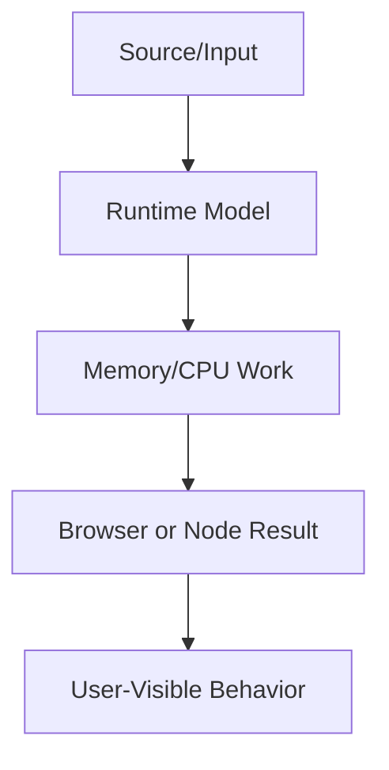

# DSA for Frontend

This volume contains domain-specific senior-level notes for: Arrays, Objects, Maps, Sets, Recursion, Trees, Graphs, Interview Problems.



## Arrays

### What it is
Arrays are ordered indexed collections optimized for dense numeric indices.

### Why it exists
They model lists rendered by React and sequences processed by algorithms.

### Source-code / internal model
Engines optimize packed arrays; holes and mixed types can degrade performance.

### Architecture diagram


### Production React example
Search results, table rows, and route breadcrumbs are array-driven UI.

```tsx
const byId = new Map(items.map(item => [item.id, item]));
const visible = items.filter(item => selectedIds.has(item.id));
```

### Debugging scenario
Mutating arrays in React state can prevent re-render or corrupt memoization.

### Performance profiling example
Know O(n) map/filter/find and virtualize huge rendered arrays.

### Product-company interview prompts
- Asked: implement map/reduce, two-sum, flatten, dedupe.
- Explain one production incident involving Arrays and how you would prevent recurrence.
- Implement or design a minimal example of Arrays while narrating correctness, edge cases, and trade-offs.

### Senior-engineer checklist
- What owns the data or behavior?
- What can make it stale, slow, inaccessible, insecure, or hard to test?
- What instrumentation proves it works in production?
- What API would you expose to a team so misuse is difficult?

## Objects

### What it is
Objects are dynamic key-value reference types with prototypes and property descriptors.

### Why it exists
They model records, maps, config, component props, and domain entities.

### Source-code / internal model
Engines optimize stable hidden classes; adding/deleting properties unpredictably can deoptimize.

### Architecture diagram


### Production React example
Normalized entity stores use objects keyed by ID for O(1) lookup.

```tsx
const byId = new Map(items.map(item => [item.id, item]));
const visible = items.filter(item => selectedIds.has(item.id));
```

### Debugging scenario
Prototype pollution and accidental mutation are production risks.

### Performance profiling example
Prefer stable shapes in hot paths and Object.freeze for invariant config.

### Product-company interview prompts
- Asked: property lookup, descriptors, Object.create, shallow copy.
- Explain one production incident involving Objects and how you would prevent recurrence.
- Implement or design a minimal example of Objects while narrating correctness, edge cases, and trade-offs.

### Senior-engineer checklist
- What owns the data or behavior?
- What can make it stale, slow, inaccessible, insecure, or hard to test?
- What instrumentation proves it works in production?
- What API would you expose to a team so misuse is difficult?

## Maps

### What it is
Map stores key-value pairs with arbitrary key types and predictable iteration order.

### Why it exists
It solves object-key limitations and accidental prototype key collisions.

### Source-code / internal model
Map uses hash-table-like internals with SameValueZero key equality.

### Architecture diagram


### Production React example
Caching fetched entities by object key or URL uses Map.

```tsx
const byId = new Map(items.map(item => [item.id, item]));
const visible = items.filter(item => selectedIds.has(item.id));
```

### Debugging scenario
Memory leaks happen when Map keys should be collectible; use WeakMap for object metadata.

### Performance profiling example
Map lookup is O(1) average; watch unbounded caches.

### Product-company interview prompts
- Asked: Map vs Object and WeakMap use cases.
- Explain one production incident involving Maps and how you would prevent recurrence.
- Implement or design a minimal example of Maps while narrating correctness, edge cases, and trade-offs.

### Senior-engineer checklist
- What owns the data or behavior?
- What can make it stale, slow, inaccessible, insecure, or hard to test?
- What instrumentation proves it works in production?
- What API would you expose to a team so misuse is difficult?

## Sets

### What it is
Set stores unique values and preserves insertion order.

### Why it exists
It solves deduplication and membership checks better than array scans.

### Source-code / internal model
Set uses SameValueZero equality; object identity matters.

### Architecture diagram


### Production React example
Selected row IDs and visited nodes are common Set use cases.

```tsx
const byId = new Map(items.map(item => [item.id, item]));
const visible = items.filter(item => selectedIds.has(item.id));
```

### Debugging scenario
Creating a new Set every render can break memoized props.

### Performance profiling example
Membership is O(1) average vs O(n) array includes.

### Product-company interview prompts
- Asked: dedupe array, intersection, union, object identity.
- Explain one production incident involving Sets and how you would prevent recurrence.
- Implement or design a minimal example of Sets while narrating correctness, edge cases, and trade-offs.

### Senior-engineer checklist
- What owns the data or behavior?
- What can make it stale, slow, inaccessible, insecure, or hard to test?
- What instrumentation proves it works in production?
- What API would you expose to a team so misuse is difficult?

## Recursion

### What it is
Recursion solves problems defined in terms of smaller subproblems.

### Why it exists
It naturally models trees, nested comments, menus, and graph traversal.

### Source-code / internal model
Each recursive call consumes stack until base case returns.

### Architecture diagram


### Production React example
Recursive React components render nested navigation or file trees.

```tsx
const RecursionExample = {
  input: "dashboard filter, route transition, or API response",
  failureMode: "stale state, remount, blocked input, or unsafe data sink",
  metric: "React Profiler commit time, Chrome long task, heap growth, or Web Vital",
};
```

### Debugging scenario
Missing base cases or cyclic data cause stack overflow.

### Performance profiling example
For deep untrusted data, use iterative traversal to avoid call-stack limits.

### Product-company interview prompts
- Asked: tree traversal, flatten nested arrays, base case.
- Explain one production incident involving Recursion and how you would prevent recurrence.
- Implement or design a minimal example of Recursion while narrating correctness, edge cases, and trade-offs.

### Senior-engineer checklist
- What owns the data or behavior?
- What can make it stale, slow, inaccessible, insecure, or hard to test?
- What instrumentation proves it works in production?
- What API would you expose to a team so misuse is difficult?

## Trees

### What it is
Trees are hierarchical structures with parent-child relationships.

### Why it exists
They model DOM, React Fiber, routes, menus, ASTs, and org charts.

### Source-code / internal model
Traversal strategies include DFS, BFS, preorder, postorder, and level-order.

### Architecture diagram


### Production React example
File explorers and nested comments are tree UI problems.

```tsx
const byId = new Map(items.map(item => [item.id, item]));
const visible = items.filter(item => selectedIds.has(item.id));
```

### Debugging scenario
Mutating tree nodes in place breaks immutable update assumptions.

### Performance profiling example
Tree operations are O(nodes visited); virtualize or lazy-load huge trees.

### Product-company interview prompts
- Asked: traverse DOM/tree, LCA, serialize tree.
- Explain one production incident involving Trees and how you would prevent recurrence.
- Implement or design a minimal example of Trees while narrating correctness, edge cases, and trade-offs.

### Senior-engineer checklist
- What owns the data or behavior?
- What can make it stale, slow, inaccessible, insecure, or hard to test?
- What instrumentation proves it works in production?
- What API would you expose to a team so misuse is difficult?

## Graphs

### What it is
Graphs model nodes connected by edges with arbitrary relationships.

### Why it exists
They solve dependency, routing, recommendation, and workflow problems.

### Source-code / internal model
Traversal uses BFS/DFS; cycles require visited sets; weighted graphs need algorithms like Dijkstra.

### Architecture diagram


### Production React example
Build tools and package managers operate on dependency graphs.

```tsx
const byId = new Map(items.map(item => [item.id, item]));
const visible = items.filter(item => selectedIds.has(item.id));
```

### Debugging scenario
Infinite loops happen when graph traversal ignores cycles.

### Performance profiling example
Graph complexity is O(V+E); large graphs need pruning and incremental layout.

### Product-company interview prompts
- Asked: detect cycle, shortest path, topological sort.
- Explain one production incident involving Graphs and how you would prevent recurrence.
- Implement or design a minimal example of Graphs while narrating correctness, edge cases, and trade-offs.

### Senior-engineer checklist
- What owns the data or behavior?
- What can make it stale, slow, inaccessible, insecure, or hard to test?
- What instrumentation proves it works in production?
- What API would you expose to a team so misuse is difficult?

## Interview Problems

### What it is
Frontend interview problems test reasoning, communication, correctness, and trade-offs.

### Why it exists
They exist to evaluate practical problem solving under constraints.

### Source-code / internal model
Good answers clarify requirements, choose data structures, implement cleanly, test edge cases, and discuss complexity.

### Architecture diagram


### Production React example
Machine-coding rounds simulate components like autocomplete, modal, table, or calendar.

```tsx
const InterviewProblemsExample = {
  input: "dashboard filter, route transition, or API response",
  failureMode: "stale state, remount, blocked input, or unsafe data sink",
  metric: "React Profiler commit time, Chrome long task, heap growth, or Web Vital",
};
```

### Debugging scenario
Silent coding without explaining assumptions loses signal.

### Performance profiling example
Optimize only after passing examples and edge cases.

### Product-company interview prompts
- Asked: debounce, promise pool, virtual list, nested comments, typeahead.
- Explain one production incident involving Interview Problems and how you would prevent recurrence.
- Implement or design a minimal example of Interview Problems while narrating correctness, edge cases, and trade-offs.

### Senior-engineer checklist
- What owns the data or behavior?
- What can make it stale, slow, inaccessible, insecure, or hard to test?
- What instrumentation proves it works in production?
- What API would you expose to a team so misuse is difficult?

