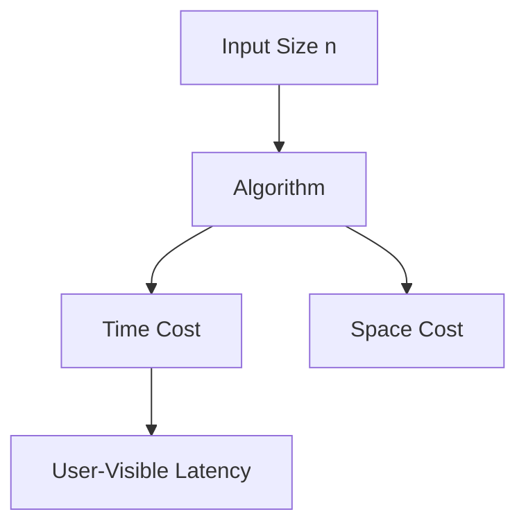

# Volume 05: DSA for Frontend

This volume covers DSA for Frontend from beginner foundations to teaching-level mastery. Each topic follows the required repository structure and links internals to production frontend work.

## Volume Learning Order

Arrays -> Objects -> Maps -> Sets -> Recursion -> Trees -> Graphs -> Interview Problems

# Arrays

## Introduction

Arrays is a foundational DSA for Frontend topic. Mastery means you can use it correctly, predict its behavior, debug production issues, explain internals, and connect it to interviews, architecture, accessibility, security, and performance.

## Why This Concept Exists

* What problem does it solve? It reduces ambiguity around how frontend systems represent data, run code, render UI, communicate over networks, and recover from failure.
* Why was it introduced? It emerged because applications needed more predictable, reusable, observable, and scalable ways to manage complexity.

## Core Fundamentals

- Definition: know the exact vocabulary for Arrays.
- Contract: identify inputs, outputs, side effects, ownership, lifecycle, and cleanup.
- Boundaries: separate language behavior, browser behavior, framework behavior, and application policy.
- Correctness: cover happy path, loading path, empty state, error state, retry path, and cleanup path.
- Production readiness: include tests, monitoring, documentation, performance budgets, and accessibility/security review where relevant.

## Internal Working

Explain step-by-step what happens internally.

Data structures trade time, memory, ordering, lookup speed, and mutation cost. Frontend systems use them for rendering lists, caching, routing, dependency graphs, and UI state.

For JavaScript topics:

* Memory: primitives are stored directly in execution records where possible; objects, arrays, functions, and closures live on the heap and are referenced.
* Execution Context: creation phase builds bindings and scope links; execution phase evaluates statements and expressions.
* Call Stack: synchronous frames push and pop; long frames block input and rendering.
* Engine Behavior: engines optimize stable shapes and predictable types, but can deoptimize polymorphic or megamorphic hot paths.

For React topics:

* Rendering: React calls components to describe UI.
* Reconciliation: React compares previous and next element trees using type and key.
* Fiber: work is represented as interruptible units linked in a tree.
* Scheduler: urgent updates can be prioritized over non-urgent rendering.

For Browser topics:

* DOM: parsed HTML becomes nodes and relationships.
* CSSOM: CSS becomes matched style rules.
* Rendering Pipeline: style, layout, paint, and composite turn data into pixels.

## Mental Models

- Restaurant analogy: Arrays is like the workflow between order taking, kitchen preparation, serving, and cleanup.
- Airport analogy: requests and events move through queues, priorities, gates, and security checks.
- Library analogy: references point to books on shelves; losing the catalog reference makes a book eligible for cleanup.
- Warehouse analogy: caching and indexing trade storage cost for faster retrieval.

## Visual Diagrams



## Step-by-Step Examples

```js
const topic = "Arrays";
console.log(`Learning ${topic} deeply`);
```

Line-by-line explanation:

1. Identify declarations and allocate necessary bindings.
2. Create runtime values or references.
3. Execute the synchronous part first.
4. Schedule asynchronous, rendering, or cleanup work if present.
5. Observe the final state through logs, UI, network panel, profiler, or tests.

Specific explanation: This minimal snippet creates, stores, and reads a value related to Arrays; expand it with real inputs, errors, and measurement.

## Memory Visualizations

```text
Stack / Execution Records
main() frame
  local binding -> ref:0x001

Heap
0x001 -> { topic: "Arrays", lifecycle: "created -> used -> cleaned" }

GC rule
reachable from stack/module/global/subscription => kept
unreachable after cleanup => collectible
```

## Real-World Use Cases

- React hooks and component state synchronization.
- React Query or cache invalidation workflows.
- Debouncing input and avoiding unnecessary network calls.
- Authentication, authorization, and guarded routes.
- Notifications, chat, optimistic updates, uploads, and realtime dashboards.

## Common Mistakes

- Treating Arrays as syntax instead of a lifecycle and ownership problem.
- Forgetting cleanup for listeners, timers, subscriptions, observers, or pending requests.
- Confusing microtasks, tasks, render work, and React commits.
- Ignoring empty, duplicate, stale, failed, or slow states.
- Adding abstractions before the problem repeats.

## Best Practices

- Make ownership explicit.
- Keep side effects at boundaries.
- Prefer native browser semantics before custom JavaScript.
- Add tests for normal, boundary, and failure behavior.
- Document invariants and trade-offs.

## Performance Considerations

- Time complexity: identify whether work is O(1), O(n), O(n log n), or worse.
- Space complexity: track retained objects, caches, closures, and subscriptions.
- Rendering cost: avoid unnecessary DOM work, style recalculation, layout, paint, and React re-renders.
- Re-renders: stabilize keys, props, callbacks, and derived data only when measurement shows benefit.
- Memory impact: release references and cap cache size.

## Edge Cases

- Null, undefined, empty arrays, duplicate IDs, and unexpected types.
- Slow network, offline mode, retries, cancellation, and race conditions.
- Browser tab suspension and page visibility changes.
- Server/client mismatches during hydration.
- Accessibility states such as focus, disabled, expanded, selected, and live updates.

## Interview Questions

### Beginner Questions

1. Define Arrays?
2. Why does production code need Arrays?
3. Show a simple example of Arrays?
4. What problem is solved by Arrays?
5. What breaks when misusing Arrays?
6. How do you debug Arrays?
7. What browser or engine behavior affects Arrays?
8. What React behavior affects Arrays?
9. What performance metric is impacted by Arrays?
10. How would you teach Arrays?

### Intermediate Questions

1. Compare trade-offs of Arrays in a real app?
2. Describe memory implications of Arrays in a real app?
3. Explain async or rendering order for Arrays in a real app?
4. Design a reusable abstraction around Arrays in a real app?
5. List edge cases for Arrays in a real app?
6. Write tests for Arrays in a real app?
7. Profile bottlenecks caused by Arrays in a real app?
8. Connect security concerns to Arrays in a real app?
9. Explain failure recovery for Arrays in a real app?
10. Refactor legacy usage of Arrays in a real app?

### Advanced Questions

1. Explain internals of Arrays under scale?
2. How would you optimize Arrays under scale?
3. How would you design observability for Arrays under scale?
4. What deoptimization or reconciliation pitfalls affect Arrays under scale?
5. How do concurrent updates change Arrays under scale?
6. How would you document invariants for Arrays under scale?
7. How would you migrate a large codebase using Arrays under scale?
8. How would you prevent regressions in Arrays under scale?
9. How would you answer a staff-level interview about Arrays under scale?
10. What are the hidden trade-offs of Arrays under scale?

## Coding Challenges

1. Build a minimal demo for Arrays and log every lifecycle step.
2. Add input validation and error handling.
3. Add cleanup logic and prove it with a test.
4. Profile the implementation and remove one bottleneck.
5. Convert the demo into a reusable production-style API.

## Assignments

1. Write a one-page beginner explanation with a diagram.
2. Create an interview answer bank with short and long answers.
3. Build a production checklist covering tests, performance, accessibility, and security.

## Mini Projects

- Build a small dashboard feature that uses Arrays, includes loading/error/empty states, has tests, exposes metrics, and documents trade-offs.

## Revision Notes

Arrays: definition, problem solved, lifecycle, memory model, browser/React impact, failure modes, performance cost, debugging tools, and one production example.

## Cheat Sheet

| Need | Reminder |
| --- | --- |
| Define | State what Arrays is in one sentence. |
| Debug | Inspect stack, heap references, events, network, render commits, and logs. |
| Optimize | Measure first, then reduce repeated work or retained memory. |
| Interview | Answer with definition, example, internals, edge cases, trade-offs. |

## Teaching Notes

- A beginner: use one analogy and one tiny example.
- A junior developer: add lifecycle, pitfalls, and debugging workflow.
- A senior developer: discuss trade-offs, scale, observability, migration, and failure isolation.

## FAQs

1. What is Arrays? It is a core concept in DSA for Frontend used to reason about frontend behavior.
2. Why should I learn it? It appears in bugs, architecture, and interviews.
3. Is it language-level or browser-level? It may involve both; separate the layers.
4. How do I debug it? Reproduce, isolate, inspect runtime state, and add targeted tests.
5. What is the biggest beginner mistake? Memorizing behavior without understanding lifecycle.
6. What is the biggest production mistake? Forgetting cleanup, failure states, or monitoring.
7. How does it affect performance? Through CPU time, memory retention, rendering, network, or bundle size.
8. How does React change the story? React adds render, reconciliation, commit, and scheduling semantics.
9. What should I say in interviews? Define it, show an example, explain internals, and discuss trade-offs.
10. How do I teach it? Start with analogy, then code, then internals, then production scenario.

## Related Topics

Arrays -> Scope -> Execution Context -> Event Loop -> Browser Rendering -> React Rendering -> Testing -> Performance -> System Design

# Objects

## Introduction

Objects is a foundational DSA for Frontend topic. Mastery means you can use it correctly, predict its behavior, debug production issues, explain internals, and connect it to interviews, architecture, accessibility, security, and performance.

## Why This Concept Exists

* What problem does it solve? It reduces ambiguity around how frontend systems represent data, run code, render UI, communicate over networks, and recover from failure.
* Why was it introduced? It emerged because applications needed more predictable, reusable, observable, and scalable ways to manage complexity.

## Core Fundamentals

- Definition: know the exact vocabulary for Objects.
- Contract: identify inputs, outputs, side effects, ownership, lifecycle, and cleanup.
- Boundaries: separate language behavior, browser behavior, framework behavior, and application policy.
- Correctness: cover happy path, loading path, empty state, error state, retry path, and cleanup path.
- Production readiness: include tests, monitoring, documentation, performance budgets, and accessibility/security review where relevant.

## Internal Working

Explain step-by-step what happens internally.

Data structures trade time, memory, ordering, lookup speed, and mutation cost. Frontend systems use them for rendering lists, caching, routing, dependency graphs, and UI state.

For JavaScript topics:

* Memory: primitives are stored directly in execution records where possible; objects, arrays, functions, and closures live on the heap and are referenced.
* Execution Context: creation phase builds bindings and scope links; execution phase evaluates statements and expressions.
* Call Stack: synchronous frames push and pop; long frames block input and rendering.
* Engine Behavior: engines optimize stable shapes and predictable types, but can deoptimize polymorphic or megamorphic hot paths.

For React topics:

* Rendering: React calls components to describe UI.
* Reconciliation: React compares previous and next element trees using type and key.
* Fiber: work is represented as interruptible units linked in a tree.
* Scheduler: urgent updates can be prioritized over non-urgent rendering.

For Browser topics:

* DOM: parsed HTML becomes nodes and relationships.
* CSSOM: CSS becomes matched style rules.
* Rendering Pipeline: style, layout, paint, and composite turn data into pixels.

## Mental Models

- Restaurant analogy: Objects is like the workflow between order taking, kitchen preparation, serving, and cleanup.
- Airport analogy: requests and events move through queues, priorities, gates, and security checks.
- Library analogy: references point to books on shelves; losing the catalog reference makes a book eligible for cleanup.
- Warehouse analogy: caching and indexing trade storage cost for faster retrieval.

## Visual Diagrams


## Step-by-Step Examples

```js
const topic = "Objects";
console.log(`Learning ${topic} deeply`);
```

Line-by-line explanation:

1. Identify declarations and allocate necessary bindings.
2. Create runtime values or references.
3. Execute the synchronous part first.
4. Schedule asynchronous, rendering, or cleanup work if present.
5. Observe the final state through logs, UI, network panel, profiler, or tests.

Specific explanation: This minimal snippet creates, stores, and reads a value related to Objects; expand it with real inputs, errors, and measurement.

## Memory Visualizations

```text
Stack / Execution Records
main() frame
  local binding -> ref:0x001

Heap
0x001 -> { topic: "Objects", lifecycle: "created -> used -> cleaned" }

GC rule
reachable from stack/module/global/subscription => kept
unreachable after cleanup => collectible
```

## Real-World Use Cases

- React hooks and component state synchronization.
- React Query or cache invalidation workflows.
- Debouncing input and avoiding unnecessary network calls.
- Authentication, authorization, and guarded routes.
- Notifications, chat, optimistic updates, uploads, and realtime dashboards.

## Common Mistakes

- Treating Objects as syntax instead of a lifecycle and ownership problem.
- Forgetting cleanup for listeners, timers, subscriptions, observers, or pending requests.
- Confusing microtasks, tasks, render work, and React commits.
- Ignoring empty, duplicate, stale, failed, or slow states.
- Adding abstractions before the problem repeats.

## Best Practices

- Make ownership explicit.
- Keep side effects at boundaries.
- Prefer native browser semantics before custom JavaScript.
- Add tests for normal, boundary, and failure behavior.
- Document invariants and trade-offs.

## Performance Considerations

- Time complexity: identify whether work is O(1), O(n), O(n log n), or worse.
- Space complexity: track retained objects, caches, closures, and subscriptions.
- Rendering cost: avoid unnecessary DOM work, style recalculation, layout, paint, and React re-renders.
- Re-renders: stabilize keys, props, callbacks, and derived data only when measurement shows benefit.
- Memory impact: release references and cap cache size.

## Edge Cases

- Null, undefined, empty arrays, duplicate IDs, and unexpected types.
- Slow network, offline mode, retries, cancellation, and race conditions.
- Browser tab suspension and page visibility changes.
- Server/client mismatches during hydration.
- Accessibility states such as focus, disabled, expanded, selected, and live updates.

## Interview Questions

### Beginner Questions

1. Define Objects?
2. Why does production code need Objects?
3. Show a simple example of Objects?
4. What problem is solved by Objects?
5. What breaks when misusing Objects?
6. How do you debug Objects?
7. What browser or engine behavior affects Objects?
8. What React behavior affects Objects?
9. What performance metric is impacted by Objects?
10. How would you teach Objects?

### Intermediate Questions

1. Compare trade-offs of Objects in a real app?
2. Describe memory implications of Objects in a real app?
3. Explain async or rendering order for Objects in a real app?
4. Design a reusable abstraction around Objects in a real app?
5. List edge cases for Objects in a real app?
6. Write tests for Objects in a real app?
7. Profile bottlenecks caused by Objects in a real app?
8. Connect security concerns to Objects in a real app?
9. Explain failure recovery for Objects in a real app?
10. Refactor legacy usage of Objects in a real app?

### Advanced Questions

1. Explain internals of Objects under scale?
2. How would you optimize Objects under scale?
3. How would you design observability for Objects under scale?
4. What deoptimization or reconciliation pitfalls affect Objects under scale?
5. How do concurrent updates change Objects under scale?
6. How would you document invariants for Objects under scale?
7. How would you migrate a large codebase using Objects under scale?
8. How would you prevent regressions in Objects under scale?
9. How would you answer a staff-level interview about Objects under scale?
10. What are the hidden trade-offs of Objects under scale?

## Coding Challenges

1. Build a minimal demo for Objects and log every lifecycle step.
2. Add input validation and error handling.
3. Add cleanup logic and prove it with a test.
4. Profile the implementation and remove one bottleneck.
5. Convert the demo into a reusable production-style API.

## Assignments

1. Write a one-page beginner explanation with a diagram.
2. Create an interview answer bank with short and long answers.
3. Build a production checklist covering tests, performance, accessibility, and security.

## Mini Projects

- Build a small dashboard feature that uses Objects, includes loading/error/empty states, has tests, exposes metrics, and documents trade-offs.

## Revision Notes

Objects: definition, problem solved, lifecycle, memory model, browser/React impact, failure modes, performance cost, debugging tools, and one production example.

## Cheat Sheet

| Need | Reminder |
| --- | --- |
| Define | State what Objects is in one sentence. |
| Debug | Inspect stack, heap references, events, network, render commits, and logs. |
| Optimize | Measure first, then reduce repeated work or retained memory. |
| Interview | Answer with definition, example, internals, edge cases, trade-offs. |

## Teaching Notes

- A beginner: use one analogy and one tiny example.
- A junior developer: add lifecycle, pitfalls, and debugging workflow.
- A senior developer: discuss trade-offs, scale, observability, migration, and failure isolation.

## FAQs

1. What is Objects? It is a core concept in DSA for Frontend used to reason about frontend behavior.
2. Why should I learn it? It appears in bugs, architecture, and interviews.
3. Is it language-level or browser-level? It may involve both; separate the layers.
4. How do I debug it? Reproduce, isolate, inspect runtime state, and add targeted tests.
5. What is the biggest beginner mistake? Memorizing behavior without understanding lifecycle.
6. What is the biggest production mistake? Forgetting cleanup, failure states, or monitoring.
7. How does it affect performance? Through CPU time, memory retention, rendering, network, or bundle size.
8. How does React change the story? React adds render, reconciliation, commit, and scheduling semantics.
9. What should I say in interviews? Define it, show an example, explain internals, and discuss trade-offs.
10. How do I teach it? Start with analogy, then code, then internals, then production scenario.

## Related Topics

Objects -> Scope -> Execution Context -> Event Loop -> Browser Rendering -> React Rendering -> Testing -> Performance -> System Design

# Maps

## Introduction

Maps is a foundational DSA for Frontend topic. Mastery means you can use it correctly, predict its behavior, debug production issues, explain internals, and connect it to interviews, architecture, accessibility, security, and performance.

## Why This Concept Exists

* What problem does it solve? It reduces ambiguity around how frontend systems represent data, run code, render UI, communicate over networks, and recover from failure.
* Why was it introduced? It emerged because applications needed more predictable, reusable, observable, and scalable ways to manage complexity.

## Core Fundamentals

- Definition: know the exact vocabulary for Maps.
- Contract: identify inputs, outputs, side effects, ownership, lifecycle, and cleanup.
- Boundaries: separate language behavior, browser behavior, framework behavior, and application policy.
- Correctness: cover happy path, loading path, empty state, error state, retry path, and cleanup path.
- Production readiness: include tests, monitoring, documentation, performance budgets, and accessibility/security review where relevant.

## Internal Working

Explain step-by-step what happens internally.

Data structures trade time, memory, ordering, lookup speed, and mutation cost. Frontend systems use them for rendering lists, caching, routing, dependency graphs, and UI state.

For JavaScript topics:

* Memory: primitives are stored directly in execution records where possible; objects, arrays, functions, and closures live on the heap and are referenced.
* Execution Context: creation phase builds bindings and scope links; execution phase evaluates statements and expressions.
* Call Stack: synchronous frames push and pop; long frames block input and rendering.
* Engine Behavior: engines optimize stable shapes and predictable types, but can deoptimize polymorphic or megamorphic hot paths.

For React topics:

* Rendering: React calls components to describe UI.
* Reconciliation: React compares previous and next element trees using type and key.
* Fiber: work is represented as interruptible units linked in a tree.
* Scheduler: urgent updates can be prioritized over non-urgent rendering.

For Browser topics:

* DOM: parsed HTML becomes nodes and relationships.
* CSSOM: CSS becomes matched style rules.
* Rendering Pipeline: style, layout, paint, and composite turn data into pixels.

## Mental Models

- Restaurant analogy: Maps is like the workflow between order taking, kitchen preparation, serving, and cleanup.
- Airport analogy: requests and events move through queues, priorities, gates, and security checks.
- Library analogy: references point to books on shelves; losing the catalog reference makes a book eligible for cleanup.
- Warehouse analogy: caching and indexing trade storage cost for faster retrieval.

## Visual Diagrams


## Step-by-Step Examples

```js
const topic = "Maps";
console.log(`Learning ${topic} deeply`);
```

Line-by-line explanation:

1. Identify declarations and allocate necessary bindings.
2. Create runtime values or references.
3. Execute the synchronous part first.
4. Schedule asynchronous, rendering, or cleanup work if present.
5. Observe the final state through logs, UI, network panel, profiler, or tests.

Specific explanation: This minimal snippet creates, stores, and reads a value related to Maps; expand it with real inputs, errors, and measurement.

## Memory Visualizations

```text
Stack / Execution Records
main() frame
  local binding -> ref:0x001

Heap
0x001 -> { topic: "Maps", lifecycle: "created -> used -> cleaned" }

GC rule
reachable from stack/module/global/subscription => kept
unreachable after cleanup => collectible
```

## Real-World Use Cases

- React hooks and component state synchronization.
- React Query or cache invalidation workflows.
- Debouncing input and avoiding unnecessary network calls.
- Authentication, authorization, and guarded routes.
- Notifications, chat, optimistic updates, uploads, and realtime dashboards.

## Common Mistakes

- Treating Maps as syntax instead of a lifecycle and ownership problem.
- Forgetting cleanup for listeners, timers, subscriptions, observers, or pending requests.
- Confusing microtasks, tasks, render work, and React commits.
- Ignoring empty, duplicate, stale, failed, or slow states.
- Adding abstractions before the problem repeats.

## Best Practices

- Make ownership explicit.
- Keep side effects at boundaries.
- Prefer native browser semantics before custom JavaScript.
- Add tests for normal, boundary, and failure behavior.
- Document invariants and trade-offs.

## Performance Considerations

- Time complexity: identify whether work is O(1), O(n), O(n log n), or worse.
- Space complexity: track retained objects, caches, closures, and subscriptions.
- Rendering cost: avoid unnecessary DOM work, style recalculation, layout, paint, and React re-renders.
- Re-renders: stabilize keys, props, callbacks, and derived data only when measurement shows benefit.
- Memory impact: release references and cap cache size.

## Edge Cases

- Null, undefined, empty arrays, duplicate IDs, and unexpected types.
- Slow network, offline mode, retries, cancellation, and race conditions.
- Browser tab suspension and page visibility changes.
- Server/client mismatches during hydration.
- Accessibility states such as focus, disabled, expanded, selected, and live updates.

## Interview Questions

### Beginner Questions

1. Define Maps?
2. Why does production code need Maps?
3. Show a simple example of Maps?
4. What problem is solved by Maps?
5. What breaks when misusing Maps?
6. How do you debug Maps?
7. What browser or engine behavior affects Maps?
8. What React behavior affects Maps?
9. What performance metric is impacted by Maps?
10. How would you teach Maps?

### Intermediate Questions

1. Compare trade-offs of Maps in a real app?
2. Describe memory implications of Maps in a real app?
3. Explain async or rendering order for Maps in a real app?
4. Design a reusable abstraction around Maps in a real app?
5. List edge cases for Maps in a real app?
6. Write tests for Maps in a real app?
7. Profile bottlenecks caused by Maps in a real app?
8. Connect security concerns to Maps in a real app?
9. Explain failure recovery for Maps in a real app?
10. Refactor legacy usage of Maps in a real app?

### Advanced Questions

1. Explain internals of Maps under scale?
2. How would you optimize Maps under scale?
3. How would you design observability for Maps under scale?
4. What deoptimization or reconciliation pitfalls affect Maps under scale?
5. How do concurrent updates change Maps under scale?
6. How would you document invariants for Maps under scale?
7. How would you migrate a large codebase using Maps under scale?
8. How would you prevent regressions in Maps under scale?
9. How would you answer a staff-level interview about Maps under scale?
10. What are the hidden trade-offs of Maps under scale?

## Coding Challenges

1. Build a minimal demo for Maps and log every lifecycle step.
2. Add input validation and error handling.
3. Add cleanup logic and prove it with a test.
4. Profile the implementation and remove one bottleneck.
5. Convert the demo into a reusable production-style API.

## Assignments

1. Write a one-page beginner explanation with a diagram.
2. Create an interview answer bank with short and long answers.
3. Build a production checklist covering tests, performance, accessibility, and security.

## Mini Projects

- Build a small dashboard feature that uses Maps, includes loading/error/empty states, has tests, exposes metrics, and documents trade-offs.

## Revision Notes

Maps: definition, problem solved, lifecycle, memory model, browser/React impact, failure modes, performance cost, debugging tools, and one production example.

## Cheat Sheet

| Need | Reminder |
| --- | --- |
| Define | State what Maps is in one sentence. |
| Debug | Inspect stack, heap references, events, network, render commits, and logs. |
| Optimize | Measure first, then reduce repeated work or retained memory. |
| Interview | Answer with definition, example, internals, edge cases, trade-offs. |

## Teaching Notes

- A beginner: use one analogy and one tiny example.
- A junior developer: add lifecycle, pitfalls, and debugging workflow.
- A senior developer: discuss trade-offs, scale, observability, migration, and failure isolation.

## FAQs

1. What is Maps? It is a core concept in DSA for Frontend used to reason about frontend behavior.
2. Why should I learn it? It appears in bugs, architecture, and interviews.
3. Is it language-level or browser-level? It may involve both; separate the layers.
4. How do I debug it? Reproduce, isolate, inspect runtime state, and add targeted tests.
5. What is the biggest beginner mistake? Memorizing behavior without understanding lifecycle.
6. What is the biggest production mistake? Forgetting cleanup, failure states, or monitoring.
7. How does it affect performance? Through CPU time, memory retention, rendering, network, or bundle size.
8. How does React change the story? React adds render, reconciliation, commit, and scheduling semantics.
9. What should I say in interviews? Define it, show an example, explain internals, and discuss trade-offs.
10. How do I teach it? Start with analogy, then code, then internals, then production scenario.

## Related Topics

Maps -> Scope -> Execution Context -> Event Loop -> Browser Rendering -> React Rendering -> Testing -> Performance -> System Design

# Sets

## Introduction

Sets is a foundational DSA for Frontend topic. Mastery means you can use it correctly, predict its behavior, debug production issues, explain internals, and connect it to interviews, architecture, accessibility, security, and performance.

## Why This Concept Exists

* What problem does it solve? It reduces ambiguity around how frontend systems represent data, run code, render UI, communicate over networks, and recover from failure.
* Why was it introduced? It emerged because applications needed more predictable, reusable, observable, and scalable ways to manage complexity.

## Core Fundamentals

- Definition: know the exact vocabulary for Sets.
- Contract: identify inputs, outputs, side effects, ownership, lifecycle, and cleanup.
- Boundaries: separate language behavior, browser behavior, framework behavior, and application policy.
- Correctness: cover happy path, loading path, empty state, error state, retry path, and cleanup path.
- Production readiness: include tests, monitoring, documentation, performance budgets, and accessibility/security review where relevant.

## Internal Working

Explain step-by-step what happens internally.

Data structures trade time, memory, ordering, lookup speed, and mutation cost. Frontend systems use them for rendering lists, caching, routing, dependency graphs, and UI state.

For JavaScript topics:

* Memory: primitives are stored directly in execution records where possible; objects, arrays, functions, and closures live on the heap and are referenced.
* Execution Context: creation phase builds bindings and scope links; execution phase evaluates statements and expressions.
* Call Stack: synchronous frames push and pop; long frames block input and rendering.
* Engine Behavior: engines optimize stable shapes and predictable types, but can deoptimize polymorphic or megamorphic hot paths.

For React topics:

* Rendering: React calls components to describe UI.
* Reconciliation: React compares previous and next element trees using type and key.
* Fiber: work is represented as interruptible units linked in a tree.
* Scheduler: urgent updates can be prioritized over non-urgent rendering.

For Browser topics:

* DOM: parsed HTML becomes nodes and relationships.
* CSSOM: CSS becomes matched style rules.
* Rendering Pipeline: style, layout, paint, and composite turn data into pixels.

## Mental Models

- Restaurant analogy: Sets is like the workflow between order taking, kitchen preparation, serving, and cleanup.
- Airport analogy: requests and events move through queues, priorities, gates, and security checks.
- Library analogy: references point to books on shelves; losing the catalog reference makes a book eligible for cleanup.
- Warehouse analogy: caching and indexing trade storage cost for faster retrieval.

## Visual Diagrams


## Step-by-Step Examples

```js
const topic = "Sets";
console.log(`Learning ${topic} deeply`);
```

Line-by-line explanation:

1. Identify declarations and allocate necessary bindings.
2. Create runtime values or references.
3. Execute the synchronous part first.
4. Schedule asynchronous, rendering, or cleanup work if present.
5. Observe the final state through logs, UI, network panel, profiler, or tests.

Specific explanation: This minimal snippet creates, stores, and reads a value related to Sets; expand it with real inputs, errors, and measurement.

## Memory Visualizations

```text
Stack / Execution Records
main() frame
  local binding -> ref:0x001

Heap
0x001 -> { topic: "Sets", lifecycle: "created -> used -> cleaned" }

GC rule
reachable from stack/module/global/subscription => kept
unreachable after cleanup => collectible
```

## Real-World Use Cases

- React hooks and component state synchronization.
- React Query or cache invalidation workflows.
- Debouncing input and avoiding unnecessary network calls.
- Authentication, authorization, and guarded routes.
- Notifications, chat, optimistic updates, uploads, and realtime dashboards.

## Common Mistakes

- Treating Sets as syntax instead of a lifecycle and ownership problem.
- Forgetting cleanup for listeners, timers, subscriptions, observers, or pending requests.
- Confusing microtasks, tasks, render work, and React commits.
- Ignoring empty, duplicate, stale, failed, or slow states.
- Adding abstractions before the problem repeats.

## Best Practices

- Make ownership explicit.
- Keep side effects at boundaries.
- Prefer native browser semantics before custom JavaScript.
- Add tests for normal, boundary, and failure behavior.
- Document invariants and trade-offs.

## Performance Considerations

- Time complexity: identify whether work is O(1), O(n), O(n log n), or worse.
- Space complexity: track retained objects, caches, closures, and subscriptions.
- Rendering cost: avoid unnecessary DOM work, style recalculation, layout, paint, and React re-renders.
- Re-renders: stabilize keys, props, callbacks, and derived data only when measurement shows benefit.
- Memory impact: release references and cap cache size.

## Edge Cases

- Null, undefined, empty arrays, duplicate IDs, and unexpected types.
- Slow network, offline mode, retries, cancellation, and race conditions.
- Browser tab suspension and page visibility changes.
- Server/client mismatches during hydration.
- Accessibility states such as focus, disabled, expanded, selected, and live updates.

## Interview Questions

### Beginner Questions

1. Define Sets?
2. Why does production code need Sets?
3. Show a simple example of Sets?
4. What problem is solved by Sets?
5. What breaks when misusing Sets?
6. How do you debug Sets?
7. What browser or engine behavior affects Sets?
8. What React behavior affects Sets?
9. What performance metric is impacted by Sets?
10. How would you teach Sets?

### Intermediate Questions

1. Compare trade-offs of Sets in a real app?
2. Describe memory implications of Sets in a real app?
3. Explain async or rendering order for Sets in a real app?
4. Design a reusable abstraction around Sets in a real app?
5. List edge cases for Sets in a real app?
6. Write tests for Sets in a real app?
7. Profile bottlenecks caused by Sets in a real app?
8. Connect security concerns to Sets in a real app?
9. Explain failure recovery for Sets in a real app?
10. Refactor legacy usage of Sets in a real app?

### Advanced Questions

1. Explain internals of Sets under scale?
2. How would you optimize Sets under scale?
3. How would you design observability for Sets under scale?
4. What deoptimization or reconciliation pitfalls affect Sets under scale?
5. How do concurrent updates change Sets under scale?
6. How would you document invariants for Sets under scale?
7. How would you migrate a large codebase using Sets under scale?
8. How would you prevent regressions in Sets under scale?
9. How would you answer a staff-level interview about Sets under scale?
10. What are the hidden trade-offs of Sets under scale?

## Coding Challenges

1. Build a minimal demo for Sets and log every lifecycle step.
2. Add input validation and error handling.
3. Add cleanup logic and prove it with a test.
4. Profile the implementation and remove one bottleneck.
5. Convert the demo into a reusable production-style API.

## Assignments

1. Write a one-page beginner explanation with a diagram.
2. Create an interview answer bank with short and long answers.
3. Build a production checklist covering tests, performance, accessibility, and security.

## Mini Projects

- Build a small dashboard feature that uses Sets, includes loading/error/empty states, has tests, exposes metrics, and documents trade-offs.

## Revision Notes

Sets: definition, problem solved, lifecycle, memory model, browser/React impact, failure modes, performance cost, debugging tools, and one production example.

## Cheat Sheet

| Need | Reminder |
| --- | --- |
| Define | State what Sets is in one sentence. |
| Debug | Inspect stack, heap references, events, network, render commits, and logs. |
| Optimize | Measure first, then reduce repeated work or retained memory. |
| Interview | Answer with definition, example, internals, edge cases, trade-offs. |

## Teaching Notes

- A beginner: use one analogy and one tiny example.
- A junior developer: add lifecycle, pitfalls, and debugging workflow.
- A senior developer: discuss trade-offs, scale, observability, migration, and failure isolation.

## FAQs

1. What is Sets? It is a core concept in DSA for Frontend used to reason about frontend behavior.
2. Why should I learn it? It appears in bugs, architecture, and interviews.
3. Is it language-level or browser-level? It may involve both; separate the layers.
4. How do I debug it? Reproduce, isolate, inspect runtime state, and add targeted tests.
5. What is the biggest beginner mistake? Memorizing behavior without understanding lifecycle.
6. What is the biggest production mistake? Forgetting cleanup, failure states, or monitoring.
7. How does it affect performance? Through CPU time, memory retention, rendering, network, or bundle size.
8. How does React change the story? React adds render, reconciliation, commit, and scheduling semantics.
9. What should I say in interviews? Define it, show an example, explain internals, and discuss trade-offs.
10. How do I teach it? Start with analogy, then code, then internals, then production scenario.

## Related Topics

Sets -> Scope -> Execution Context -> Event Loop -> Browser Rendering -> React Rendering -> Testing -> Performance -> System Design

# Recursion

## Introduction

Recursion is a foundational DSA for Frontend topic. Mastery means you can use it correctly, predict its behavior, debug production issues, explain internals, and connect it to interviews, architecture, accessibility, security, and performance.

## Why This Concept Exists

* What problem does it solve? It reduces ambiguity around how frontend systems represent data, run code, render UI, communicate over networks, and recover from failure.
* Why was it introduced? It emerged because applications needed more predictable, reusable, observable, and scalable ways to manage complexity.

## Core Fundamentals

- Definition: know the exact vocabulary for Recursion.
- Contract: identify inputs, outputs, side effects, ownership, lifecycle, and cleanup.
- Boundaries: separate language behavior, browser behavior, framework behavior, and application policy.
- Correctness: cover happy path, loading path, empty state, error state, retry path, and cleanup path.
- Production readiness: include tests, monitoring, documentation, performance budgets, and accessibility/security review where relevant.

## Internal Working

Explain step-by-step what happens internally.

Data structures trade time, memory, ordering, lookup speed, and mutation cost. Frontend systems use them for rendering lists, caching, routing, dependency graphs, and UI state.

For JavaScript topics:

* Memory: primitives are stored directly in execution records where possible; objects, arrays, functions, and closures live on the heap and are referenced.
* Execution Context: creation phase builds bindings and scope links; execution phase evaluates statements and expressions.
* Call Stack: synchronous frames push and pop; long frames block input and rendering.
* Engine Behavior: engines optimize stable shapes and predictable types, but can deoptimize polymorphic or megamorphic hot paths.

For React topics:

* Rendering: React calls components to describe UI.
* Reconciliation: React compares previous and next element trees using type and key.
* Fiber: work is represented as interruptible units linked in a tree.
* Scheduler: urgent updates can be prioritized over non-urgent rendering.

For Browser topics:

* DOM: parsed HTML becomes nodes and relationships.
* CSSOM: CSS becomes matched style rules.
* Rendering Pipeline: style, layout, paint, and composite turn data into pixels.

## Mental Models

- Restaurant analogy: Recursion is like the workflow between order taking, kitchen preparation, serving, and cleanup.
- Airport analogy: requests and events move through queues, priorities, gates, and security checks.
- Library analogy: references point to books on shelves; losing the catalog reference makes a book eligible for cleanup.
- Warehouse analogy: caching and indexing trade storage cost for faster retrieval.

## Visual Diagrams


## Step-by-Step Examples

```js
const topic = "Recursion";
console.log(`Learning ${topic} deeply`);
```

Line-by-line explanation:

1. Identify declarations and allocate necessary bindings.
2. Create runtime values or references.
3. Execute the synchronous part first.
4. Schedule asynchronous, rendering, or cleanup work if present.
5. Observe the final state through logs, UI, network panel, profiler, or tests.

Specific explanation: This minimal snippet creates, stores, and reads a value related to Recursion; expand it with real inputs, errors, and measurement.

## Memory Visualizations

```text
Stack / Execution Records
main() frame
  local binding -> ref:0x001

Heap
0x001 -> { topic: "Recursion", lifecycle: "created -> used -> cleaned" }

GC rule
reachable from stack/module/global/subscription => kept
unreachable after cleanup => collectible
```

## Real-World Use Cases

- React hooks and component state synchronization.
- React Query or cache invalidation workflows.
- Debouncing input and avoiding unnecessary network calls.
- Authentication, authorization, and guarded routes.
- Notifications, chat, optimistic updates, uploads, and realtime dashboards.

## Common Mistakes

- Treating Recursion as syntax instead of a lifecycle and ownership problem.
- Forgetting cleanup for listeners, timers, subscriptions, observers, or pending requests.
- Confusing microtasks, tasks, render work, and React commits.
- Ignoring empty, duplicate, stale, failed, or slow states.
- Adding abstractions before the problem repeats.

## Best Practices

- Make ownership explicit.
- Keep side effects at boundaries.
- Prefer native browser semantics before custom JavaScript.
- Add tests for normal, boundary, and failure behavior.
- Document invariants and trade-offs.

## Performance Considerations

- Time complexity: identify whether work is O(1), O(n), O(n log n), or worse.
- Space complexity: track retained objects, caches, closures, and subscriptions.
- Rendering cost: avoid unnecessary DOM work, style recalculation, layout, paint, and React re-renders.
- Re-renders: stabilize keys, props, callbacks, and derived data only when measurement shows benefit.
- Memory impact: release references and cap cache size.

## Edge Cases

- Null, undefined, empty arrays, duplicate IDs, and unexpected types.
- Slow network, offline mode, retries, cancellation, and race conditions.
- Browser tab suspension and page visibility changes.
- Server/client mismatches during hydration.
- Accessibility states such as focus, disabled, expanded, selected, and live updates.

## Interview Questions

### Beginner Questions

1. Define Recursion?
2. Why does production code need Recursion?
3. Show a simple example of Recursion?
4. What problem is solved by Recursion?
5. What breaks when misusing Recursion?
6. How do you debug Recursion?
7. What browser or engine behavior affects Recursion?
8. What React behavior affects Recursion?
9. What performance metric is impacted by Recursion?
10. How would you teach Recursion?

### Intermediate Questions

1. Compare trade-offs of Recursion in a real app?
2. Describe memory implications of Recursion in a real app?
3. Explain async or rendering order for Recursion in a real app?
4. Design a reusable abstraction around Recursion in a real app?
5. List edge cases for Recursion in a real app?
6. Write tests for Recursion in a real app?
7. Profile bottlenecks caused by Recursion in a real app?
8. Connect security concerns to Recursion in a real app?
9. Explain failure recovery for Recursion in a real app?
10. Refactor legacy usage of Recursion in a real app?

### Advanced Questions

1. Explain internals of Recursion under scale?
2. How would you optimize Recursion under scale?
3. How would you design observability for Recursion under scale?
4. What deoptimization or reconciliation pitfalls affect Recursion under scale?
5. How do concurrent updates change Recursion under scale?
6. How would you document invariants for Recursion under scale?
7. How would you migrate a large codebase using Recursion under scale?
8. How would you prevent regressions in Recursion under scale?
9. How would you answer a staff-level interview about Recursion under scale?
10. What are the hidden trade-offs of Recursion under scale?

## Coding Challenges

1. Build a minimal demo for Recursion and log every lifecycle step.
2. Add input validation and error handling.
3. Add cleanup logic and prove it with a test.
4. Profile the implementation and remove one bottleneck.
5. Convert the demo into a reusable production-style API.

## Assignments

1. Write a one-page beginner explanation with a diagram.
2. Create an interview answer bank with short and long answers.
3. Build a production checklist covering tests, performance, accessibility, and security.

## Mini Projects

- Build a small dashboard feature that uses Recursion, includes loading/error/empty states, has tests, exposes metrics, and documents trade-offs.

## Revision Notes

Recursion: definition, problem solved, lifecycle, memory model, browser/React impact, failure modes, performance cost, debugging tools, and one production example.

## Cheat Sheet

| Need | Reminder |
| --- | --- |
| Define | State what Recursion is in one sentence. |
| Debug | Inspect stack, heap references, events, network, render commits, and logs. |
| Optimize | Measure first, then reduce repeated work or retained memory. |
| Interview | Answer with definition, example, internals, edge cases, trade-offs. |

## Teaching Notes

- A beginner: use one analogy and one tiny example.
- A junior developer: add lifecycle, pitfalls, and debugging workflow.
- A senior developer: discuss trade-offs, scale, observability, migration, and failure isolation.

## FAQs

1. What is Recursion? It is a core concept in DSA for Frontend used to reason about frontend behavior.
2. Why should I learn it? It appears in bugs, architecture, and interviews.
3. Is it language-level or browser-level? It may involve both; separate the layers.
4. How do I debug it? Reproduce, isolate, inspect runtime state, and add targeted tests.
5. What is the biggest beginner mistake? Memorizing behavior without understanding lifecycle.
6. What is the biggest production mistake? Forgetting cleanup, failure states, or monitoring.
7. How does it affect performance? Through CPU time, memory retention, rendering, network, or bundle size.
8. How does React change the story? React adds render, reconciliation, commit, and scheduling semantics.
9. What should I say in interviews? Define it, show an example, explain internals, and discuss trade-offs.
10. How do I teach it? Start with analogy, then code, then internals, then production scenario.

## Related Topics

Recursion -> Scope -> Execution Context -> Event Loop -> Browser Rendering -> React Rendering -> Testing -> Performance -> System Design

# Trees

## Introduction

Trees is a foundational DSA for Frontend topic. Mastery means you can use it correctly, predict its behavior, debug production issues, explain internals, and connect it to interviews, architecture, accessibility, security, and performance.

## Why This Concept Exists

* What problem does it solve? It reduces ambiguity around how frontend systems represent data, run code, render UI, communicate over networks, and recover from failure.
* Why was it introduced? It emerged because applications needed more predictable, reusable, observable, and scalable ways to manage complexity.

## Core Fundamentals

- Definition: know the exact vocabulary for Trees.
- Contract: identify inputs, outputs, side effects, ownership, lifecycle, and cleanup.
- Boundaries: separate language behavior, browser behavior, framework behavior, and application policy.
- Correctness: cover happy path, loading path, empty state, error state, retry path, and cleanup path.
- Production readiness: include tests, monitoring, documentation, performance budgets, and accessibility/security review where relevant.

## Internal Working

Explain step-by-step what happens internally.

Data structures trade time, memory, ordering, lookup speed, and mutation cost. Frontend systems use them for rendering lists, caching, routing, dependency graphs, and UI state.

For JavaScript topics:

* Memory: primitives are stored directly in execution records where possible; objects, arrays, functions, and closures live on the heap and are referenced.
* Execution Context: creation phase builds bindings and scope links; execution phase evaluates statements and expressions.
* Call Stack: synchronous frames push and pop; long frames block input and rendering.
* Engine Behavior: engines optimize stable shapes and predictable types, but can deoptimize polymorphic or megamorphic hot paths.

For React topics:

* Rendering: React calls components to describe UI.
* Reconciliation: React compares previous and next element trees using type and key.
* Fiber: work is represented as interruptible units linked in a tree.
* Scheduler: urgent updates can be prioritized over non-urgent rendering.

For Browser topics:

* DOM: parsed HTML becomes nodes and relationships.
* CSSOM: CSS becomes matched style rules.
* Rendering Pipeline: style, layout, paint, and composite turn data into pixels.

## Mental Models

- Restaurant analogy: Trees is like the workflow between order taking, kitchen preparation, serving, and cleanup.
- Airport analogy: requests and events move through queues, priorities, gates, and security checks.
- Library analogy: references point to books on shelves; losing the catalog reference makes a book eligible for cleanup.
- Warehouse analogy: caching and indexing trade storage cost for faster retrieval.

## Visual Diagrams


## Step-by-Step Examples

```js
const topic = "Trees";
console.log(`Learning ${topic} deeply`);
```

Line-by-line explanation:

1. Identify declarations and allocate necessary bindings.
2. Create runtime values or references.
3. Execute the synchronous part first.
4. Schedule asynchronous, rendering, or cleanup work if present.
5. Observe the final state through logs, UI, network panel, profiler, or tests.

Specific explanation: This minimal snippet creates, stores, and reads a value related to Trees; expand it with real inputs, errors, and measurement.

## Memory Visualizations

```text
Stack / Execution Records
main() frame
  local binding -> ref:0x001

Heap
0x001 -> { topic: "Trees", lifecycle: "created -> used -> cleaned" }

GC rule
reachable from stack/module/global/subscription => kept
unreachable after cleanup => collectible
```

## Real-World Use Cases

- React hooks and component state synchronization.
- React Query or cache invalidation workflows.
- Debouncing input and avoiding unnecessary network calls.
- Authentication, authorization, and guarded routes.
- Notifications, chat, optimistic updates, uploads, and realtime dashboards.

## Common Mistakes

- Treating Trees as syntax instead of a lifecycle and ownership problem.
- Forgetting cleanup for listeners, timers, subscriptions, observers, or pending requests.
- Confusing microtasks, tasks, render work, and React commits.
- Ignoring empty, duplicate, stale, failed, or slow states.
- Adding abstractions before the problem repeats.

## Best Practices

- Make ownership explicit.
- Keep side effects at boundaries.
- Prefer native browser semantics before custom JavaScript.
- Add tests for normal, boundary, and failure behavior.
- Document invariants and trade-offs.

## Performance Considerations

- Time complexity: identify whether work is O(1), O(n), O(n log n), or worse.
- Space complexity: track retained objects, caches, closures, and subscriptions.
- Rendering cost: avoid unnecessary DOM work, style recalculation, layout, paint, and React re-renders.
- Re-renders: stabilize keys, props, callbacks, and derived data only when measurement shows benefit.
- Memory impact: release references and cap cache size.

## Edge Cases

- Null, undefined, empty arrays, duplicate IDs, and unexpected types.
- Slow network, offline mode, retries, cancellation, and race conditions.
- Browser tab suspension and page visibility changes.
- Server/client mismatches during hydration.
- Accessibility states such as focus, disabled, expanded, selected, and live updates.

## Interview Questions

### Beginner Questions

1. Define Trees?
2. Why does production code need Trees?
3. Show a simple example of Trees?
4. What problem is solved by Trees?
5. What breaks when misusing Trees?
6. How do you debug Trees?
7. What browser or engine behavior affects Trees?
8. What React behavior affects Trees?
9. What performance metric is impacted by Trees?
10. How would you teach Trees?

### Intermediate Questions

1. Compare trade-offs of Trees in a real app?
2. Describe memory implications of Trees in a real app?
3. Explain async or rendering order for Trees in a real app?
4. Design a reusable abstraction around Trees in a real app?
5. List edge cases for Trees in a real app?
6. Write tests for Trees in a real app?
7. Profile bottlenecks caused by Trees in a real app?
8. Connect security concerns to Trees in a real app?
9. Explain failure recovery for Trees in a real app?
10. Refactor legacy usage of Trees in a real app?

### Advanced Questions

1. Explain internals of Trees under scale?
2. How would you optimize Trees under scale?
3. How would you design observability for Trees under scale?
4. What deoptimization or reconciliation pitfalls affect Trees under scale?
5. How do concurrent updates change Trees under scale?
6. How would you document invariants for Trees under scale?
7. How would you migrate a large codebase using Trees under scale?
8. How would you prevent regressions in Trees under scale?
9. How would you answer a staff-level interview about Trees under scale?
10. What are the hidden trade-offs of Trees under scale?

## Coding Challenges

1. Build a minimal demo for Trees and log every lifecycle step.
2. Add input validation and error handling.
3. Add cleanup logic and prove it with a test.
4. Profile the implementation and remove one bottleneck.
5. Convert the demo into a reusable production-style API.

## Assignments

1. Write a one-page beginner explanation with a diagram.
2. Create an interview answer bank with short and long answers.
3. Build a production checklist covering tests, performance, accessibility, and security.

## Mini Projects

- Build a small dashboard feature that uses Trees, includes loading/error/empty states, has tests, exposes metrics, and documents trade-offs.

## Revision Notes

Trees: definition, problem solved, lifecycle, memory model, browser/React impact, failure modes, performance cost, debugging tools, and one production example.

## Cheat Sheet

| Need | Reminder |
| --- | --- |
| Define | State what Trees is in one sentence. |
| Debug | Inspect stack, heap references, events, network, render commits, and logs. |
| Optimize | Measure first, then reduce repeated work or retained memory. |
| Interview | Answer with definition, example, internals, edge cases, trade-offs. |

## Teaching Notes

- A beginner: use one analogy and one tiny example.
- A junior developer: add lifecycle, pitfalls, and debugging workflow.
- A senior developer: discuss trade-offs, scale, observability, migration, and failure isolation.

## FAQs

1. What is Trees? It is a core concept in DSA for Frontend used to reason about frontend behavior.
2. Why should I learn it? It appears in bugs, architecture, and interviews.
3. Is it language-level or browser-level? It may involve both; separate the layers.
4. How do I debug it? Reproduce, isolate, inspect runtime state, and add targeted tests.
5. What is the biggest beginner mistake? Memorizing behavior without understanding lifecycle.
6. What is the biggest production mistake? Forgetting cleanup, failure states, or monitoring.
7. How does it affect performance? Through CPU time, memory retention, rendering, network, or bundle size.
8. How does React change the story? React adds render, reconciliation, commit, and scheduling semantics.
9. What should I say in interviews? Define it, show an example, explain internals, and discuss trade-offs.
10. How do I teach it? Start with analogy, then code, then internals, then production scenario.

## Related Topics

Trees -> Scope -> Execution Context -> Event Loop -> Browser Rendering -> React Rendering -> Testing -> Performance -> System Design

# Graphs

## Introduction

Graphs is a foundational DSA for Frontend topic. Mastery means you can use it correctly, predict its behavior, debug production issues, explain internals, and connect it to interviews, architecture, accessibility, security, and performance.

## Why This Concept Exists

* What problem does it solve? It reduces ambiguity around how frontend systems represent data, run code, render UI, communicate over networks, and recover from failure.
* Why was it introduced? It emerged because applications needed more predictable, reusable, observable, and scalable ways to manage complexity.

## Core Fundamentals

- Definition: know the exact vocabulary for Graphs.
- Contract: identify inputs, outputs, side effects, ownership, lifecycle, and cleanup.
- Boundaries: separate language behavior, browser behavior, framework behavior, and application policy.
- Correctness: cover happy path, loading path, empty state, error state, retry path, and cleanup path.
- Production readiness: include tests, monitoring, documentation, performance budgets, and accessibility/security review where relevant.

## Internal Working

Explain step-by-step what happens internally.

Data structures trade time, memory, ordering, lookup speed, and mutation cost. Frontend systems use them for rendering lists, caching, routing, dependency graphs, and UI state.

For JavaScript topics:

* Memory: primitives are stored directly in execution records where possible; objects, arrays, functions, and closures live on the heap and are referenced.
* Execution Context: creation phase builds bindings and scope links; execution phase evaluates statements and expressions.
* Call Stack: synchronous frames push and pop; long frames block input and rendering.
* Engine Behavior: engines optimize stable shapes and predictable types, but can deoptimize polymorphic or megamorphic hot paths.

For React topics:

* Rendering: React calls components to describe UI.
* Reconciliation: React compares previous and next element trees using type and key.
* Fiber: work is represented as interruptible units linked in a tree.
* Scheduler: urgent updates can be prioritized over non-urgent rendering.

For Browser topics:

* DOM: parsed HTML becomes nodes and relationships.
* CSSOM: CSS becomes matched style rules.
* Rendering Pipeline: style, layout, paint, and composite turn data into pixels.

## Mental Models

- Restaurant analogy: Graphs is like the workflow between order taking, kitchen preparation, serving, and cleanup.
- Airport analogy: requests and events move through queues, priorities, gates, and security checks.
- Library analogy: references point to books on shelves; losing the catalog reference makes a book eligible for cleanup.
- Warehouse analogy: caching and indexing trade storage cost for faster retrieval.

## Visual Diagrams


## Step-by-Step Examples

```js
const topic = "Graphs";
console.log(`Learning ${topic} deeply`);
```

Line-by-line explanation:

1. Identify declarations and allocate necessary bindings.
2. Create runtime values or references.
3. Execute the synchronous part first.
4. Schedule asynchronous, rendering, or cleanup work if present.
5. Observe the final state through logs, UI, network panel, profiler, or tests.

Specific explanation: This minimal snippet creates, stores, and reads a value related to Graphs; expand it with real inputs, errors, and measurement.

## Memory Visualizations

```text
Stack / Execution Records
main() frame
  local binding -> ref:0x001

Heap
0x001 -> { topic: "Graphs", lifecycle: "created -> used -> cleaned" }

GC rule
reachable from stack/module/global/subscription => kept
unreachable after cleanup => collectible
```

## Real-World Use Cases

- React hooks and component state synchronization.
- React Query or cache invalidation workflows.
- Debouncing input and avoiding unnecessary network calls.
- Authentication, authorization, and guarded routes.
- Notifications, chat, optimistic updates, uploads, and realtime dashboards.

## Common Mistakes

- Treating Graphs as syntax instead of a lifecycle and ownership problem.
- Forgetting cleanup for listeners, timers, subscriptions, observers, or pending requests.
- Confusing microtasks, tasks, render work, and React commits.
- Ignoring empty, duplicate, stale, failed, or slow states.
- Adding abstractions before the problem repeats.

## Best Practices

- Make ownership explicit.
- Keep side effects at boundaries.
- Prefer native browser semantics before custom JavaScript.
- Add tests for normal, boundary, and failure behavior.
- Document invariants and trade-offs.

## Performance Considerations

- Time complexity: identify whether work is O(1), O(n), O(n log n), or worse.
- Space complexity: track retained objects, caches, closures, and subscriptions.
- Rendering cost: avoid unnecessary DOM work, style recalculation, layout, paint, and React re-renders.
- Re-renders: stabilize keys, props, callbacks, and derived data only when measurement shows benefit.
- Memory impact: release references and cap cache size.

## Edge Cases

- Null, undefined, empty arrays, duplicate IDs, and unexpected types.
- Slow network, offline mode, retries, cancellation, and race conditions.
- Browser tab suspension and page visibility changes.
- Server/client mismatches during hydration.
- Accessibility states such as focus, disabled, expanded, selected, and live updates.

## Interview Questions

### Beginner Questions

1. Define Graphs?
2. Why does production code need Graphs?
3. Show a simple example of Graphs?
4. What problem is solved by Graphs?
5. What breaks when misusing Graphs?
6. How do you debug Graphs?
7. What browser or engine behavior affects Graphs?
8. What React behavior affects Graphs?
9. What performance metric is impacted by Graphs?
10. How would you teach Graphs?

### Intermediate Questions

1. Compare trade-offs of Graphs in a real app?
2. Describe memory implications of Graphs in a real app?
3. Explain async or rendering order for Graphs in a real app?
4. Design a reusable abstraction around Graphs in a real app?
5. List edge cases for Graphs in a real app?
6. Write tests for Graphs in a real app?
7. Profile bottlenecks caused by Graphs in a real app?
8. Connect security concerns to Graphs in a real app?
9. Explain failure recovery for Graphs in a real app?
10. Refactor legacy usage of Graphs in a real app?

### Advanced Questions

1. Explain internals of Graphs under scale?
2. How would you optimize Graphs under scale?
3. How would you design observability for Graphs under scale?
4. What deoptimization or reconciliation pitfalls affect Graphs under scale?
5. How do concurrent updates change Graphs under scale?
6. How would you document invariants for Graphs under scale?
7. How would you migrate a large codebase using Graphs under scale?
8. How would you prevent regressions in Graphs under scale?
9. How would you answer a staff-level interview about Graphs under scale?
10. What are the hidden trade-offs of Graphs under scale?

## Coding Challenges

1. Build a minimal demo for Graphs and log every lifecycle step.
2. Add input validation and error handling.
3. Add cleanup logic and prove it with a test.
4. Profile the implementation and remove one bottleneck.
5. Convert the demo into a reusable production-style API.

## Assignments

1. Write a one-page beginner explanation with a diagram.
2. Create an interview answer bank with short and long answers.
3. Build a production checklist covering tests, performance, accessibility, and security.

## Mini Projects

- Build a small dashboard feature that uses Graphs, includes loading/error/empty states, has tests, exposes metrics, and documents trade-offs.

## Revision Notes

Graphs: definition, problem solved, lifecycle, memory model, browser/React impact, failure modes, performance cost, debugging tools, and one production example.

## Cheat Sheet

| Need | Reminder |
| --- | --- |
| Define | State what Graphs is in one sentence. |
| Debug | Inspect stack, heap references, events, network, render commits, and logs. |
| Optimize | Measure first, then reduce repeated work or retained memory. |
| Interview | Answer with definition, example, internals, edge cases, trade-offs. |

## Teaching Notes

- A beginner: use one analogy and one tiny example.
- A junior developer: add lifecycle, pitfalls, and debugging workflow.
- A senior developer: discuss trade-offs, scale, observability, migration, and failure isolation.

## FAQs

1. What is Graphs? It is a core concept in DSA for Frontend used to reason about frontend behavior.
2. Why should I learn it? It appears in bugs, architecture, and interviews.
3. Is it language-level or browser-level? It may involve both; separate the layers.
4. How do I debug it? Reproduce, isolate, inspect runtime state, and add targeted tests.
5. What is the biggest beginner mistake? Memorizing behavior without understanding lifecycle.
6. What is the biggest production mistake? Forgetting cleanup, failure states, or monitoring.
7. How does it affect performance? Through CPU time, memory retention, rendering, network, or bundle size.
8. How does React change the story? React adds render, reconciliation, commit, and scheduling semantics.
9. What should I say in interviews? Define it, show an example, explain internals, and discuss trade-offs.
10. How do I teach it? Start with analogy, then code, then internals, then production scenario.

## Related Topics

Graphs -> Scope -> Execution Context -> Event Loop -> Browser Rendering -> React Rendering -> Testing -> Performance -> System Design

# Interview Problems

## Introduction

Interview Problems is a foundational DSA for Frontend topic. Mastery means you can use it correctly, predict its behavior, debug production issues, explain internals, and connect it to interviews, architecture, accessibility, security, and performance.

## Why This Concept Exists

* What problem does it solve? It reduces ambiguity around how frontend systems represent data, run code, render UI, communicate over networks, and recover from failure.
* Why was it introduced? It emerged because applications needed more predictable, reusable, observable, and scalable ways to manage complexity.

## Core Fundamentals

- Definition: know the exact vocabulary for Interview Problems.
- Contract: identify inputs, outputs, side effects, ownership, lifecycle, and cleanup.
- Boundaries: separate language behavior, browser behavior, framework behavior, and application policy.
- Correctness: cover happy path, loading path, empty state, error state, retry path, and cleanup path.
- Production readiness: include tests, monitoring, documentation, performance budgets, and accessibility/security review where relevant.

## Internal Working

Explain step-by-step what happens internally.

Data structures trade time, memory, ordering, lookup speed, and mutation cost. Frontend systems use them for rendering lists, caching, routing, dependency graphs, and UI state.

For JavaScript topics:

* Memory: primitives are stored directly in execution records where possible; objects, arrays, functions, and closures live on the heap and are referenced.
* Execution Context: creation phase builds bindings and scope links; execution phase evaluates statements and expressions.
* Call Stack: synchronous frames push and pop; long frames block input and rendering.
* Engine Behavior: engines optimize stable shapes and predictable types, but can deoptimize polymorphic or megamorphic hot paths.

For React topics:

* Rendering: React calls components to describe UI.
* Reconciliation: React compares previous and next element trees using type and key.
* Fiber: work is represented as interruptible units linked in a tree.
* Scheduler: urgent updates can be prioritized over non-urgent rendering.

For Browser topics:

* DOM: parsed HTML becomes nodes and relationships.
* CSSOM: CSS becomes matched style rules.
* Rendering Pipeline: style, layout, paint, and composite turn data into pixels.

## Mental Models

- Restaurant analogy: Interview Problems is like the workflow between order taking, kitchen preparation, serving, and cleanup.
- Airport analogy: requests and events move through queues, priorities, gates, and security checks.
- Library analogy: references point to books on shelves; losing the catalog reference makes a book eligible for cleanup.
- Warehouse analogy: caching and indexing trade storage cost for faster retrieval.

## Visual Diagrams


## Step-by-Step Examples

```js
const topic = "Interview Problems";
console.log(`Learning ${topic} deeply`);
```

Line-by-line explanation:

1. Identify declarations and allocate necessary bindings.
2. Create runtime values or references.
3. Execute the synchronous part first.
4. Schedule asynchronous, rendering, or cleanup work if present.
5. Observe the final state through logs, UI, network panel, profiler, or tests.

Specific explanation: This minimal snippet creates, stores, and reads a value related to Interview Problems; expand it with real inputs, errors, and measurement.

## Memory Visualizations

```text
Stack / Execution Records
main() frame
  local binding -> ref:0x001

Heap
0x001 -> { topic: "Interview Problems", lifecycle: "created -> used -> cleaned" }

GC rule
reachable from stack/module/global/subscription => kept
unreachable after cleanup => collectible
```

## Real-World Use Cases

- React hooks and component state synchronization.
- React Query or cache invalidation workflows.
- Debouncing input and avoiding unnecessary network calls.
- Authentication, authorization, and guarded routes.
- Notifications, chat, optimistic updates, uploads, and realtime dashboards.

## Common Mistakes

- Treating Interview Problems as syntax instead of a lifecycle and ownership problem.
- Forgetting cleanup for listeners, timers, subscriptions, observers, or pending requests.
- Confusing microtasks, tasks, render work, and React commits.
- Ignoring empty, duplicate, stale, failed, or slow states.
- Adding abstractions before the problem repeats.

## Best Practices

- Make ownership explicit.
- Keep side effects at boundaries.
- Prefer native browser semantics before custom JavaScript.
- Add tests for normal, boundary, and failure behavior.
- Document invariants and trade-offs.

## Performance Considerations

- Time complexity: identify whether work is O(1), O(n), O(n log n), or worse.
- Space complexity: track retained objects, caches, closures, and subscriptions.
- Rendering cost: avoid unnecessary DOM work, style recalculation, layout, paint, and React re-renders.
- Re-renders: stabilize keys, props, callbacks, and derived data only when measurement shows benefit.
- Memory impact: release references and cap cache size.

## Edge Cases

- Null, undefined, empty arrays, duplicate IDs, and unexpected types.
- Slow network, offline mode, retries, cancellation, and race conditions.
- Browser tab suspension and page visibility changes.
- Server/client mismatches during hydration.
- Accessibility states such as focus, disabled, expanded, selected, and live updates.

## Interview Questions

### Beginner Questions

1. Define Interview Problems?
2. Why does production code need Interview Problems?
3. Show a simple example of Interview Problems?
4. What problem is solved by Interview Problems?
5. What breaks when misusing Interview Problems?
6. How do you debug Interview Problems?
7. What browser or engine behavior affects Interview Problems?
8. What React behavior affects Interview Problems?
9. What performance metric is impacted by Interview Problems?
10. How would you teach Interview Problems?

### Intermediate Questions

1. Compare trade-offs of Interview Problems in a real app?
2. Describe memory implications of Interview Problems in a real app?
3. Explain async or rendering order for Interview Problems in a real app?
4. Design a reusable abstraction around Interview Problems in a real app?
5. List edge cases for Interview Problems in a real app?
6. Write tests for Interview Problems in a real app?
7. Profile bottlenecks caused by Interview Problems in a real app?
8. Connect security concerns to Interview Problems in a real app?
9. Explain failure recovery for Interview Problems in a real app?
10. Refactor legacy usage of Interview Problems in a real app?

### Advanced Questions

1. Explain internals of Interview Problems under scale?
2. How would you optimize Interview Problems under scale?
3. How would you design observability for Interview Problems under scale?
4. What deoptimization or reconciliation pitfalls affect Interview Problems under scale?
5. How do concurrent updates change Interview Problems under scale?
6. How would you document invariants for Interview Problems under scale?
7. How would you migrate a large codebase using Interview Problems under scale?
8. How would you prevent regressions in Interview Problems under scale?
9. How would you answer a staff-level interview about Interview Problems under scale?
10. What are the hidden trade-offs of Interview Problems under scale?

## Coding Challenges

1. Build a minimal demo for Interview Problems and log every lifecycle step.
2. Add input validation and error handling.
3. Add cleanup logic and prove it with a test.
4. Profile the implementation and remove one bottleneck.
5. Convert the demo into a reusable production-style API.

## Assignments

1. Write a one-page beginner explanation with a diagram.
2. Create an interview answer bank with short and long answers.
3. Build a production checklist covering tests, performance, accessibility, and security.

## Mini Projects

- Build a small dashboard feature that uses Interview Problems, includes loading/error/empty states, has tests, exposes metrics, and documents trade-offs.

## Revision Notes

Interview Problems: definition, problem solved, lifecycle, memory model, browser/React impact, failure modes, performance cost, debugging tools, and one production example.

## Cheat Sheet

| Need | Reminder |
| --- | --- |
| Define | State what Interview Problems is in one sentence. |
| Debug | Inspect stack, heap references, events, network, render commits, and logs. |
| Optimize | Measure first, then reduce repeated work or retained memory. |
| Interview | Answer with definition, example, internals, edge cases, trade-offs. |

## Teaching Notes

- A beginner: use one analogy and one tiny example.
- A junior developer: add lifecycle, pitfalls, and debugging workflow.
- A senior developer: discuss trade-offs, scale, observability, migration, and failure isolation.

## FAQs

1. What is Interview Problems? It is a core concept in DSA for Frontend used to reason about frontend behavior.
2. Why should I learn it? It appears in bugs, architecture, and interviews.
3. Is it language-level or browser-level? It may involve both; separate the layers.
4. How do I debug it? Reproduce, isolate, inspect runtime state, and add targeted tests.
5. What is the biggest beginner mistake? Memorizing behavior without understanding lifecycle.
6. What is the biggest production mistake? Forgetting cleanup, failure states, or monitoring.
7. How does it affect performance? Through CPU time, memory retention, rendering, network, or bundle size.
8. How does React change the story? React adds render, reconciliation, commit, and scheduling semantics.
9. What should I say in interviews? Define it, show an example, explain internals, and discuss trade-offs.
10. How do I teach it? Start with analogy, then code, then internals, then production scenario.

## Related Topics

Interview Problems -> Scope -> Execution Context -> Event Loop -> Browser Rendering -> React Rendering -> Testing -> Performance -> System Design

