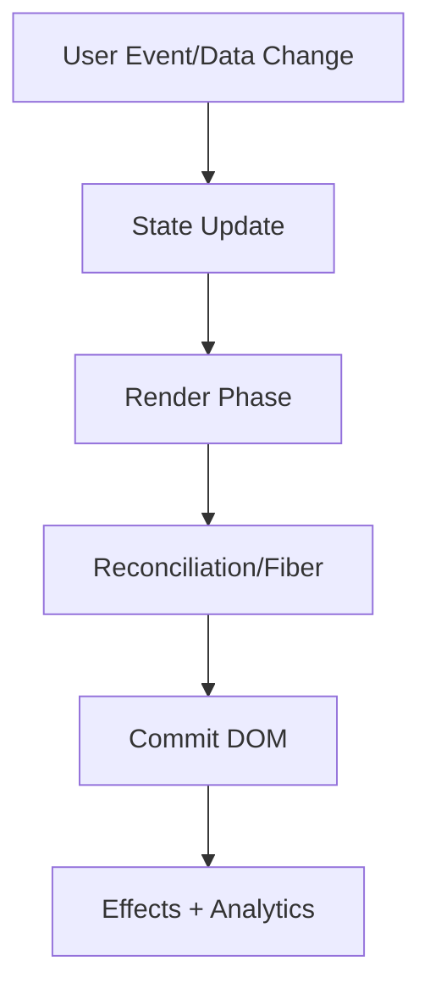

# React Core

This volume contains domain-specific senior-level notes for: JSX, Components, Props, State, Lifecycle, Hooks.



## JSX

### What it is
JSX is syntax for creating React elements, not HTML inside JavaScript.

### Why it exists
It lets developers describe component trees declaratively while compiling to JavaScript element objects.

### Source-code / internal model
Build tools transform JSX into function calls that create immutable element objects.

### Architecture diagram


### Production React example
Design systems use JSX to compose semantic components and slots.

```tsx
const JSXExample = {
  input: "dashboard filter, route transition, or API response",
  failureMode: "stale state, remount, blocked input, or unsafe data sink",
  metric: "React Profiler commit time, Chrome long task, heap growth, or Web Vital",
};
```

### Debugging scenario
class vs className and prop casing bugs come from confusing JSX with HTML.

### Performance profiling example
JSX itself is cheap; generated element trees can be large in hot renders.

### Product-company interview prompts
- Interviewers ask: what JSX compiles to and why adjacent elements need a wrapper.
- Explain one production incident involving JSX and how you would prevent recurrence.
- Implement or design a minimal example of JSX while narrating correctness, edge cases, and trade-offs.

### Senior-engineer checklist
- What owns the data or behavior?
- What can make it stale, slow, inaccessible, insecure, or hard to test?
- What instrumentation proves it works in production?
- What API would you expose to a team so misuse is difficult?

## Components

### What it is
Components encapsulate UI, behavior, data requirements, and accessibility semantics.

### Why it exists
They create reusable UI boundaries with clear ownership of markup, behavior, and accessibility.

### Source-code / internal model
React calls components during render; returned elements describe host nodes or other components.

### Architecture diagram


### Production React example
Product apps split page, feature, container, and presentational components.

```tsx
const ComponentsExample = {
  input: "dashboard filter, route transition, or API response",
  failureMode: "stale state, remount, blocked input, or unsafe data sink",
  metric: "React Profiler commit time, Chrome long task, heap growth, or Web Vital",
};
```

### Debugging scenario
Over-large components hide state ownership and make tests brittle.

### Performance profiling example
Profiler shows expensive component renders; split or memoize only after measuring.

### Product-company interview prompts
- Asked: component boundaries, composition vs inheritance, controlled components.
- Explain one production incident involving Components and how you would prevent recurrence.
- Implement or design a minimal example of Components while narrating correctness, edge cases, and trade-offs.

### Senior-engineer checklist
- What owns the data or behavior?
- What can make it stale, slow, inaccessible, insecure, or hard to test?
- What instrumentation proves it works in production?
- What API would you expose to a team so misuse is difficult?

## Props

### What it is
Props are read-only inputs passed from parent to child to describe configuration and data.

### Why it exists
They define a component input contract so parents can configure children predictably.

### Source-code / internal model
Changing props schedules child rendering; referential equality matters for memoized children.

### Architecture diagram


### Production React example
Reusable design-system components rely on stable, documented props contracts.

```tsx
const PropsExample = {
  input: "dashboard filter, route transition, or API response",
  failureMode: "stale state, remount, blocked input, or unsafe data sink",
  metric: "React Profiler commit time, Chrome long task, heap growth, or Web Vital",
};
```

### Debugging scenario
Prop drilling becomes painful when many unrelated layers forward data.

### Performance profiling example
Stabilize object/function props only for measured memoized paths.

### Product-company interview prompts
- Interviewers ask: props vs state, children prop, controlled/uncontrolled APIs.
- Explain one production incident involving Props and how you would prevent recurrence.
- Implement or design a minimal example of Props while narrating correctness, edge cases, and trade-offs.

### Senior-engineer checklist
- What owns the data or behavior?
- What can make it stale, slow, inaccessible, insecure, or hard to test?
- What instrumentation proves it works in production?
- What API would you expose to a team so misuse is difficult?

## State

### What it is
State is component-owned data that changes over time and triggers React rendering.

### Why it exists
It lets React remember values across renders and schedule UI updates when those values change.

### Source-code / internal model
setState enqueues an update on the Fiber; React batches updates and computes next state during render.

### Architecture diagram


### Production React example
Forms, filters, modals, tabs, and optimistic UI use local state.

```tsx
const StateExample = {
  input: "dashboard filter, route transition, or API response",
  failureMode: "stale state, remount, blocked input, or unsafe data sink",
  metric: "React Profiler commit time, Chrome long task, heap growth, or Web Vital",
};
```

### Debugging scenario
If state updates use stale values, prefer functional updates.

### Performance profiling example
Profile whether state is placed too high and causing broad re-renders.

### Product-company interview prompts
- Asked: state vs props, batching, derived state, controlled components.
- Explain one production incident involving State and how you would prevent recurrence.
- Implement or design a minimal example of State while narrating correctness, edge cases, and trade-offs.

### Senior-engineer checklist
- What owns the data or behavior?
- What can make it stale, slow, inaccessible, insecure, or hard to test?
- What instrumentation proves it works in production?
- What API would you expose to a team so misuse is difficult?

## Lifecycle

### What it is
React lifecycle is when components render, commit, run effects, update, and unmount.

### Why it exists
It exists to coordinate UI with external systems safely.

### Source-code / internal model
Function components use render plus useLayoutEffect/useEffect cleanup instead of class lifecycle methods.

### Architecture diagram


### Production React example
Subscriptions, timers, and DOM measurements must attach and clean up at the right lifecycle point.

```tsx
const LifecycleExample = {
  input: "dashboard filter, route transition, or API response",
  failureMode: "stale state, remount, blocked input, or unsafe data sink",
  metric: "React Profiler commit time, Chrome long task, heap growth, or Web Vital",
};
```

### Debugging scenario
Missing cleanup creates duplicated listeners after navigation.

### Performance profiling example
Profiler separates render and commit costs; effects can block post-commit work.

### Product-company interview prompts
- Asked: effect cleanup, layout effect vs effect, StrictMode double invoke.
- Explain one production incident involving Lifecycle and how you would prevent recurrence.
- Implement or design a minimal example of Lifecycle while narrating correctness, edge cases, and trade-offs.

### Senior-engineer checklist
- What owns the data or behavior?
- What can make it stale, slow, inaccessible, insecure, or hard to test?
- What instrumentation proves it works in production?
- What API would you expose to a team so misuse is difficult?

## Hooks

### What it is
Hooks let function components use React state, effects, refs, context, memoization, and external subscriptions.

### Why it exists
They let function components own state, effects, refs, and subscriptions without class lifecycle APIs.

### Source-code / internal model
React stores hook state in call order on the Fiber; rules of hooks preserve deterministic indexing.

### Architecture diagram


### Production React example
Production apps compose hooks for auth, feature flags, data fetching, analytics, and responsive behavior.

```tsx
const HooksExample = {
  input: "dashboard filter, route transition, or API response",
  failureMode: "stale state, remount, blocked input, or unsafe data sink",
  metric: "React Profiler commit time, Chrome long task, heap growth, or Web Vital",
};
```

### Debugging scenario
Conditional hooks break state ordering; missing dependencies create stale effects.

### Performance profiling example
Use React DevTools hooks inspector and Profiler to find expensive custom hooks.

### Product-company interview prompts
- Interviews ask: useEffect timing, useMemo misuse, useRef vs state, custom hook design.
- Explain one production incident involving Hooks and how you would prevent recurrence.
- Implement or design a minimal example of Hooks while narrating correctness, edge cases, and trade-offs.

### Senior-engineer checklist
- What owns the data or behavior?
- What can make it stale, slow, inaccessible, insecure, or hard to test?
- What instrumentation proves it works in production?
- What API would you expose to a team so misuse is difficult?

