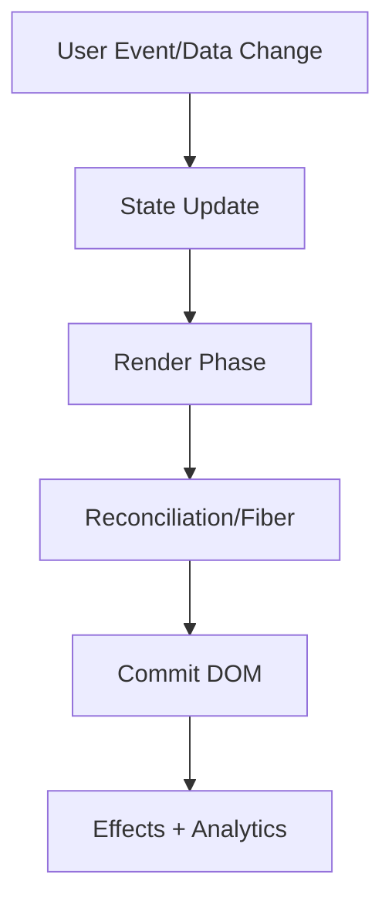

# React Internals

This volume contains domain-specific senior-level notes for: Virtual DOM, Reconciliation, Fiber, Scheduler, Concurrent Rendering.



## Virtual DOM

### What it is
A Virtual DOM is React element data in memory, not a browser DOM clone; it is a lightweight description of desired UI.

### Why it exists
It separates describing UI from mutating the DOM, giving React a predictable place to compare desired UI before committing browser changes.

### Source-code / internal model
React creates element objects from JSX, stores work on Fibers, compares previous and next element shape, then commits minimal host operations to the real DOM.

### Architecture diagram


### Production React example
In a dashboard, filtering a table updates element descriptions first; React only mutates rows whose type/key/props changed.

```tsx
const VirtualDOMExample = {
  input: "dashboard filter, route transition, or API response",
  failureMode: "stale state, remount, blocked input, or unsafe data sink",
  metric: "React Profiler commit time, Chrome long task, heap growth, or Web Vital",
};
```

### Debugging scenario
If input focus disappears, inspect unstable keys or conditional component types that cause remounts.

### Performance profiling example
Use React DevTools Profiler to check whether large subtrees render after unrelated state changes.

### Product-company interview prompts
- Meta/Google ask: Virtual DOM vs real DOM, why keys matter, and why Virtual DOM is not automatically faster.
- Explain one production incident involving Virtual DOM and how you would prevent recurrence.
- Implement or design a minimal example of Virtual DOM while narrating correctness, edge cases, and trade-offs.

### Senior-engineer checklist
- What owns the data or behavior?
- What can make it stale, slow, inaccessible, insecure, or hard to test?
- What instrumentation proves it works in production?
- What API would you expose to a team so misuse is difficult?

## Reconciliation

### What it is
Reconciliation is React's diffing process for deciding whether existing component instances/Fibers can be reused.

### Why it exists
It lets React preserve component state when UI shape is stable and remount only when identity actually changes.

### Source-code / internal model
Same type and key preserve state; different type or key remounts; child arrays are matched primarily by key.

### Architecture diagram


### Production React example
Kanban boards rely on stable card IDs so drag reorder does not reset card editing state.

```tsx
const ReconciliationExample = {
  input: "dashboard filter, route transition, or API response",
  failureMode: "stale state, remount, blocked input, or unsafe data sink",
  metric: "React Profiler commit time, Chrome long task, heap growth, or Web Vital",
};
```

### Debugging scenario
A bug where form fields swap values usually means index keys were used in a reorderable list.

### Performance profiling example
Profile commit counts before/after introducing stable keys and memoized row components.

### Product-company interview prompts
- Product interviews ask: explain key, remount, state preservation, and list diff complexity.
- Explain one production incident involving Reconciliation and how you would prevent recurrence.
- Implement or design a minimal example of Reconciliation while narrating correctness, edge cases, and trade-offs.

### Senior-engineer checklist
- What owns the data or behavior?
- What can make it stale, slow, inaccessible, insecure, or hard to test?
- What instrumentation proves it works in production?
- What API would you expose to a team so misuse is difficult?

## Fiber

### What it is
Fiber is React's linked data structure for incremental rendering work and component state bookkeeping.

### Why it exists
It enables React to split render work into units, track effects, and prioritize updates instead of rendering everything with one recursive stack.

### Source-code / internal model
Each Fiber stores pending props, memoized props/state, effect flags, lanes, return/child/sibling pointers, and alternate work-in-progress pointer.

### Architecture diagram


### Production React example
A search results page can keep typing responsive while a large result list renders in interruptible chunks.

```tsx
const FiberExample = {
  input: "dashboard filter, route transition, or API response",
  failureMode: "stale state, remount, blocked input, or unsafe data sink",
  metric: "React Profiler commit time, Chrome long task, heap growth, or Web Vital",
};
```

### Debugging scenario
Unexpected double effects in development are often StrictMode verifying Fiber cleanup safety.

### Performance profiling example
React Profiler flamegraph shows render work per component; scheduling lanes explain why updates appear deferred.

### Product-company interview prompts
- Senior interviews ask: why Fiber replaced the stack reconciler and how render/commit phases differ.
- Explain one production incident involving Fiber and how you would prevent recurrence.
- Implement or design a minimal example of Fiber while narrating correctness, edge cases, and trade-offs.

### Senior-engineer checklist
- What owns the data or behavior?
- What can make it stale, slow, inaccessible, insecure, or hard to test?
- What instrumentation proves it works in production?
- What API would you expose to a team so misuse is difficult?

## Scheduler

### What it is
The Scheduler coordinates update priority so urgent input can win over less urgent rendering.

### Why it exists
It keeps urgent interactions such as typing and clicking responsive while less urgent rendering waits.

### Source-code / internal model
React assigns updates to lanes; render work can be paused, resumed, or restarted before a synchronous commit.

### Architecture diagram


### Production React example
Autocomplete should prioritize keystrokes over rendering a huge recommendations panel.

```tsx
const SchedulerExample = {
  input: "dashboard filter, route transition, or API response",
  failureMode: "stale state, remount, blocked input, or unsafe data sink",
  metric: "React Profiler commit time, Chrome long task, heap growth, or Web Vital",
};
```

### Debugging scenario
If UI feels laggy, check whether expensive synchronous work runs inside input handlers.

### Performance profiling example
Use Performance panel long-task markers and React Profiler interactions to identify blocked input.

### Product-company interview prompts
- Interviewers ask: difference between debounce, transition, deferred value, and scheduler priority.
- Explain one production incident involving Scheduler and how you would prevent recurrence.
- Implement or design a minimal example of Scheduler while narrating correctness, edge cases, and trade-offs.

### Senior-engineer checklist
- What owns the data or behavior?
- What can make it stale, slow, inaccessible, insecure, or hard to test?
- What instrumentation proves it works in production?
- What API would you expose to a team so misuse is difficult?

## Concurrent Rendering

### What it is
Concurrent rendering lets React prepare UI in the background without committing unfinished work.

### Why it exists
It lets React prepare expensive UI updates without immediately blocking or committing incomplete work.

### Source-code / internal model
React may start rendering a tree, interrupt it for a higher-priority update, and discard/retry work before commit.

### Architecture diagram


### Production React example
Route transitions can show existing screen while the next screen prepares data and UI.

```tsx
const ConcurrentRenderingExample = {
  input: "dashboard filter, route transition, or API response",
  failureMode: "stale state, remount, blocked input, or unsafe data sink",
  metric: "React Profiler commit time, Chrome long task, heap growth, or Web Vital",
};
```

### Debugging scenario
Bugs usually come from impure render logic: mutating globals, reading time/random values, or causing side effects during render.

### Performance profiling example
Use Profiler to compare transition updates and urgent updates; verify commits, not just renders.

### Product-company interview prompts
- Product companies ask: what concurrent rendering guarantees and what it does not guarantee.
- Explain one production incident involving Concurrent Rendering and how you would prevent recurrence.
- Implement or design a minimal example of Concurrent Rendering while narrating correctness, edge cases, and trade-offs.

### Senior-engineer checklist
- What owns the data or behavior?
- What can make it stale, slow, inaccessible, insecure, or hard to test?
- What instrumentation proves it works in production?
- What API would you expose to a team so misuse is difficult?

