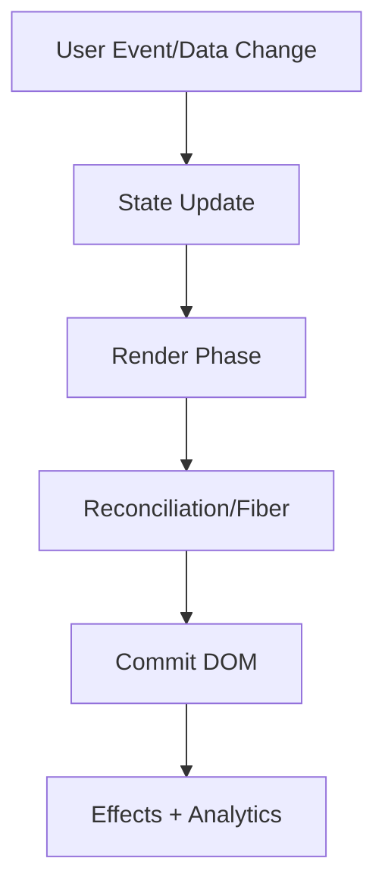

# State Management

This volume contains domain-specific senior-level notes for: Context API, Redux, Zustand, React Query.



## Context API

### What it is
Context API passes values through a React subtree without prop drilling; it is not a general-purpose high-frequency state store.

### Why it exists
It removes prop drilling for low-frequency cross-cutting values such as theme, locale, session, and feature flags.

### Source-code / internal model
A Provider stores a value; consumers subscribe to the nearest provider; when provider value identity changes, consumers can re-render.

### Architecture diagram


### Production React example
Theme, locale, auth session, feature flags, and design tokens are good Context use cases.

```tsx
const ContextAPIExample = {
  input: "dashboard filter, route transition, or API response",
  failureMode: "stale state, remount, blocked input, or unsafe data sink",
  metric: "React Profiler commit time, Chrome long task, heap growth, or Web Vital",
};
```

### Debugging scenario
If every page re-renders after typing, inspect a broad Context provider whose value object changes on every render.

### Performance profiling example
Use React Profiler and split contexts by update frequency: auth context separate from theme and permissions.

### Product-company interview prompts
- Interviews ask: Context vs Redux, provider value memoization, and context update blast radius.
- Explain one production incident involving Context API and how you would prevent recurrence.
- Implement or design a minimal example of Context API while narrating correctness, edge cases, and trade-offs.

### Senior-engineer checklist
- What owns the data or behavior?
- What can make it stale, slow, inaccessible, insecure, or hard to test?
- What instrumentation proves it works in production?
- What API would you expose to a team so misuse is difficult?

## Redux

### What it is
Redux centralizes client state transitions with actions and pure reducers.

### Why it exists
It makes complex client-state transitions inspectable, replayable, and testable across large teams.

### Source-code / internal model
Dispatch creates an action, reducers compute next immutable state, subscribers are notified, and selectors derive view data.

### Architecture diagram


### Production React example
Large ecommerce apps use Redux for cart, checkout flow, permissions, and undoable UI workflows.

```tsx
const ReduxExample = {
  input: "dashboard filter, route transition, or API response",
  failureMode: "stale state, remount, blocked input, or unsafe data sink",
  metric: "React Profiler commit time, Chrome long task, heap growth, or Web Vital",
};
```

### Debugging scenario
A stale UI often means selectors mutate data or reducers return the same object after changing nested fields.

### Performance profiling example
Use Redux DevTools action trace and selector memoization metrics to find over-rendering.

### Product-company interview prompts
- Companies ask: why reducers must be pure, middleware flow, and Redux Toolkit benefits.
- Explain one production incident involving Redux and how you would prevent recurrence.
- Implement or design a minimal example of Redux while narrating correctness, edge cases, and trade-offs.

### Senior-engineer checklist
- What owns the data or behavior?
- What can make it stale, slow, inaccessible, insecure, or hard to test?
- What instrumentation proves it works in production?
- What API would you expose to a team so misuse is difficult?

## Zustand

### What it is
Zustand is a small external store library using hooks and selector subscriptions.

### Why it exists
It provides granular external-store subscriptions without the ceremony of reducers/actions for every UI state change.

### Source-code / internal model
The store lives outside React; components subscribe to selected slices and re-render when equality checks detect changes.

### Architecture diagram


### Production React example
Collaborative editors use Zustand for local UI state such as panels, selected nodes, and transient tool modes.

```tsx
const ZustandExample = {
  input: "dashboard filter, route transition, or API response",
  failureMode: "stale state, remount, blocked input, or unsafe data sink",
  metric: "React Profiler commit time, Chrome long task, heap growth, or Web Vital",
};
```

### Debugging scenario
If components re-render too often, check selectors returning new objects without shallow comparison.

### Performance profiling example
Profile selector churn and compare component renders before/after granular subscriptions.

### Product-company interview prompts
- Interviews ask: external store vs Context and how useSyncExternalStore avoids tearing.
- Explain one production incident involving Zustand and how you would prevent recurrence.
- Implement or design a minimal example of Zustand while narrating correctness, edge cases, and trade-offs.

### Senior-engineer checklist
- What owns the data or behavior?
- What can make it stale, slow, inaccessible, insecure, or hard to test?
- What instrumentation proves it works in production?
- What API would you expose to a team so misuse is difficult?

## React Query

### What it is
React Query manages server state: cache, fetch lifecycle, retries, invalidation, background refetch, and stale data.

### Why it exists
It separates server-state concerns from client UI state: freshness, caching, retries, invalidation, and background refetch.

### Source-code / internal model
Query keys index cache records; observers subscribe components; staleTime/cacheTime control freshness and garbage collection.

### Architecture diagram


### Production React example
Admin apps use it for user lists, optimistic mutations, pagination, and refetch-on-focus.

```tsx
const ReactQueryExample = {
  input: "dashboard filter, route transition, or API response",
  failureMode: "stale state, remount, blocked input, or unsafe data sink",
  metric: "React Profiler commit time, Chrome long task, heap growth, or Web Vital",
};
```

### Debugging scenario
Duplicate requests usually mean unstable query keys or query functions created with missing parameters.

### Performance profiling example
Use React Query Devtools to inspect cache status, stale state, observers, and retries.

### Product-company interview prompts
- Interviews ask: server state vs client state, invalidation strategy, optimistic update rollback.
- Explain one production incident involving React Query and how you would prevent recurrence.
- Implement or design a minimal example of React Query while narrating correctness, edge cases, and trade-offs.

### Senior-engineer checklist
- What owns the data or behavior?
- What can make it stale, slow, inaccessible, insecure, or hard to test?
- What instrumentation proves it works in production?
- What API would you expose to a team so misuse is difficult?

# Advanced React Query Notes

## Query Lifecycle
A query starts as idle or loading, executes `queryFn`, stores success/error state by query key, notifies observers, becomes stale after `staleTime`, and is garbage-collected after it has no observers for `gcTime`. The query key is the cache identity; if tenant, locale, filters, or auth scope affect data, they belong in the key.

## Cache Lifecycle and Garbage Collection
React Query cache entries survive component unmount until garbage collection. This is why navigating away and back can feel instant. In production, tune `staleTime` for freshness and `gcTime` for memory. Admin dashboards often use longer `staleTime` for reference data and short `staleTime` for operational metrics.

## Optimistic Updates
Optimistic mutations should snapshot previous cache, write optimistic state, cancel in-flight queries, rollback on error, and invalidate on settle. Never optimistic-update data the user may not be authorized to see after a role change.

```ts
const mutation = useMutation({
  mutationFn: markNotificationRead,
  onMutate: async (id) => {
    await queryClient.cancelQueries({ queryKey: ['notifications'] });
    const previous = queryClient.getQueryData(['notifications']);
    queryClient.setQueryData(['notifications'], old => markRead(old, id));
    return { previous };
  },
  onError: (_err, _id, ctx) => queryClient.setQueryData(['notifications'], ctx?.previous),
  onSettled: () => queryClient.invalidateQueries({ queryKey: ['notifications'] }),
});
```

## Pagination and Infinite Queries
Cursor pagination is safer than offset pagination when lists change. Infinite queries should dedupe IDs because reconnects, retries, and backend race conditions can return overlapping pages.

## Prefetching and Offline Support
Prefetch route data on intent, not every hover. For offline support, persist query cache carefully, exclude sensitive data, and pair mutations with an idempotent queue.

## Retry Strategies and Mutation Queue
Use exponential backoff for transient network failures; do not retry validation or authorization failures. Mutation queues need idempotency keys, ordering rules, and visible retry/cancel UI.

## React Query Interview Traps
- React Query is not Redux; it owns server state lifecycle.
- `staleTime` is not `gcTime`.
- Invalidating too broadly causes network storms.
- Query keys must include every variable that changes the result.
- Optimistic updates without rollback corrupt trust.
