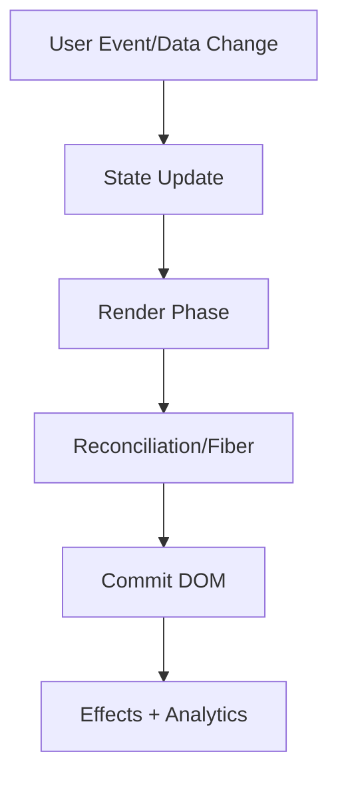

# Advanced React

This volume contains domain-specific senior-level notes for: Patterns, Performance, Testing, Accessibility.



## Patterns

### What it is
Advanced React patterns solve API design, reuse, and composition problems.

### Why it exists
They exist to keep components flexible without exposing internal implementation.

### Source-code / internal model
Composition, controlled/uncontrolled state, slots, reducers, and context selectors appear in mature libraries.

### Architecture diagram


### Production React example
Design-system components use patterns for Dialog, Tabs, Combobox, and DataTable.

```tsx
const PatternsExample = {
  input: "dashboard filter, route transition, or API response",
  failureMode: "stale state, remount, blocked input, or unsafe data sink",
  metric: "React Profiler commit time, Chrome long task, heap growth, or Web Vital",
};
```

### Debugging scenario
Over-abstracted patterns hide simple data flow.

### Performance profiling example
Profile abstraction overhead only after correctness and accessibility.

### Product-company interview prompts
- Asked: compound components, render props, HOC trade-offs.
- Explain one production incident involving Patterns and how you would prevent recurrence.
- Implement or design a minimal example of Patterns while narrating correctness, edge cases, and trade-offs.

### Senior-engineer checklist
- What owns the data or behavior?
- What can make it stale, slow, inaccessible, insecure, or hard to test?
- What instrumentation proves it works in production?
- What API would you expose to a team so misuse is difficult?

## Performance

### What it is
Frontend performance is the discipline of making UI load, respond, and update within user-perceived budgets.

### Why it exists
It exists because users abandon slow experiences and slow devices magnify inefficiencies.

### Source-code / internal model
Performance spans network, parsing, JS, style/layout/paint, React renders, memory, and backend latency.

### Architecture diagram


### Production React example
Product teams set budgets for route JS, LCP, INP, and memory.

```tsx
performance.mark("start");
runExpensiveUIWork();
performance.mark("end");
performance.measure("ui-work", "start", "end");
```

### Debugging scenario
Guessing is the bug; always capture a trace.

### Performance profiling example
Use Lighthouse, Performance panel, React Profiler, bundle analyzer, and RUM.

### Product-company interview prompts
- Asked: diagnose slow React page end-to-end.
- Explain one production incident involving Performance and how you would prevent recurrence.
- Implement or design a minimal example of Performance while narrating correctness, edge cases, and trade-offs.

### Senior-engineer checklist
- What owns the data or behavior?
- What can make it stale, slow, inaccessible, insecure, or hard to test?
- What instrumentation proves it works in production?
- What API would you expose to a team so misuse is difficult?

## Testing

### What it is
Frontend testing verifies behavior at unit, integration, component, and end-to-end levels.

### Why it exists
It prevents regressions in fast-changing UI code.

### Source-code / internal model
Testing Library queries accessible output; Playwright verifies real browser flows; unit tests cover pure logic.

### Architecture diagram


### Production React example
Checkout, auth, permissions, and critical forms need integration/E2E coverage.

```tsx
const TestingExample = {
  input: "dashboard filter, route transition, or API response",
  failureMode: "stale state, remount, blocked input, or unsafe data sink",
  metric: "React Profiler commit time, Chrome long task, heap growth, or Web Vital",
};
```

### Debugging scenario
Testing implementation details makes refactors painful.

### Performance profiling example
Parallelize tests and avoid unnecessary sleeps for CI speed.

### Product-company interview prompts
- Asked: what to test, mocking strategy, unit vs E2E.
- Explain one production incident involving Testing and how you would prevent recurrence.
- Implement or design a minimal example of Testing while narrating correctness, edge cases, and trade-offs.

### Senior-engineer checklist
- What owns the data or behavior?
- What can make it stale, slow, inaccessible, insecure, or hard to test?
- What instrumentation proves it works in production?
- What API would you expose to a team so misuse is difficult?

## Accessibility

### What it is
Accessibility makes UI usable by keyboard, screen readers, voice control, and assistive tech.

### Why it exists
It is a product requirement, legal risk reducer, and quality multiplier.

### Source-code / internal model
Semantic HTML maps to accessibility tree; ARIA modifies roles/states when native elements are insufficient.

### Architecture diagram


### Production React example
Dialogs need focus trap, aria-modal, labelling, Escape behavior, and restore focus.

```tsx
<button type="button" aria-expanded={open} onClick={toggle}>
  Menu
</button>
```

### Debugging scenario
A div button without keyboard support is a common defect.

### Performance profiling example
Accessibility can improve performance by using native controls instead of custom JS.

### Product-company interview prompts
- Asked: semantic HTML, ARIA misuse, keyboard navigation.
- Explain one production incident involving Accessibility and how you would prevent recurrence.
- Implement or design a minimal example of Accessibility while narrating correctness, edge cases, and trade-offs.

### Senior-engineer checklist
- What owns the data or behavior?
- What can make it stale, slow, inaccessible, insecure, or hard to test?
- What instrumentation proves it works in production?
- What API would you expose to a team so misuse is difficult?

