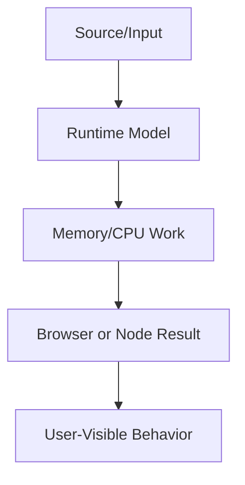

# Frontend Architecture

This volume contains domain-specific senior-level notes for: Design Systems, Component Libraries, Monorepo, Scalable Folder Structure.



## Design Systems

### What it is
Design systems are shared tokens, components, patterns, documentation, and governance.

### Why it exists
They reduce duplicated UI decisions and improve consistency at scale.

### Source-code / internal model
Tokens feed CSS variables/build artifacts; components encode accessibility and interaction contracts.

### Architecture diagram


### Production React example
Multi-product companies use systems for Button, Dialog, Table, Form, and theming.

```tsx
function Dialog({ open, onOpenChange, children }) {
  return open ? <div role="dialog" aria-modal="true">{children}</div> : null;
}
```

### Debugging scenario
A component library without contribution rules becomes a dumping ground.

### Performance profiling example
Tree-shake components and avoid shipping all icons/styles to every route.

### Product-company interview prompts
- Asked: how to design Button API and version breaking changes.
- Explain one production incident involving Design Systems and how you would prevent recurrence.
- Implement or design a minimal example of Design Systems while narrating correctness, edge cases, and trade-offs.

### Senior-engineer checklist
- What owns the data or behavior?
- What can make it stale, slow, inaccessible, insecure, or hard to test?
- What instrumentation proves it works in production?
- What API would you expose to a team so misuse is difficult?

## Component Libraries

### What it is
Component libraries package reusable UI primitives and product components.

### Why it exists
They let teams build consistent screens faster.

### Source-code / internal model
Library architecture covers tokens, slots, polymorphism, theming, docs, tests, and release workflow.

### Architecture diagram


### Production React example
Internal npm packages provide components to multiple apps.

```tsx
function Dialog({ open, onOpenChange, children }) {
  return open ? <div role="dialog" aria-modal="true">{children}</div> : null;
}
```

### Debugging scenario
Too many props create impossible state combinations.

### Performance profiling example
Bundle analyze library consumers, not just library build output.

### Product-company interview prompts
- Asked: controlled/uncontrolled props and accessibility guarantees.
- Explain one production incident involving Component Libraries and how you would prevent recurrence.
- Implement or design a minimal example of Component Libraries while narrating correctness, edge cases, and trade-offs.

### Senior-engineer checklist
- What owns the data or behavior?
- What can make it stale, slow, inaccessible, insecure, or hard to test?
- What instrumentation proves it works in production?
- What API would you expose to a team so misuse is difficult?

## Monorepo

### What it is
A monorepo stores multiple packages/apps in one repository with shared tooling.

### Why it exists
It improves atomic changes and dependency visibility across frontend platforms.

### Source-code / internal model
Workspaces, task graphs, caching, affected builds, and versioning define the workflow.

### Architecture diagram


### Production React example
Design system, web app, docs, and shared utilities often live together.

```tsx
const MonorepoExample = {
  input: "dashboard filter, route transition, or API response",
  failureMode: "stale state, remount, blocked input, or unsafe data sink",
  metric: "React Profiler commit time, Chrome long task, heap growth, or Web Vital",
};
```

### Debugging scenario
Bad boundaries cause every change to rebuild everything.

### Performance profiling example
Use Nx/Turborepo/Bazel-style task caching and dependency graph pruning.

### Product-company interview prompts
- Asked: monorepo pros/cons and CI scaling.
- Explain one production incident involving Monorepo and how you would prevent recurrence.
- Implement or design a minimal example of Monorepo while narrating correctness, edge cases, and trade-offs.

### Senior-engineer checklist
- What owns the data or behavior?
- What can make it stale, slow, inaccessible, insecure, or hard to test?
- What instrumentation proves it works in production?
- What API would you expose to a team so misuse is difficult?

## Scalable Folder Structure

### What it is
Scalable folder structure organizes code by ownership, feature, dependency direction, and deployability.

### Why it exists
It prevents large apps from becoming import spaghetti.

### Source-code / internal model
Feature slices, shared UI, domain models, infrastructure adapters, and route boundaries should be explicit.

### Architecture diagram


### Production React example
Enterprise apps separate features like billing, users, reports, and settings.

```tsx
const ScalableFolderStructureExample = {
  input: "dashboard filter, route transition, or API response",
  failureMode: "stale state, remount, blocked input, or unsafe data sink",
  metric: "React Profiler commit time, Chrome long task, heap growth, or Web Vital",
};
```

### Debugging scenario
Deep relative imports and circular dependencies signal structure decay.

### Performance profiling example
Architecture lint rules protect boundaries with minimal runtime cost.

### Product-company interview prompts
- Asked: feature-based vs layer-based structure.
- Explain one production incident involving Scalable Folder Structure and how you would prevent recurrence.
- Implement or design a minimal example of Scalable Folder Structure while narrating correctness, edge cases, and trade-offs.

### Senior-engineer checklist
- What owns the data or behavior?
- What can make it stale, slow, inaccessible, insecure, or hard to test?
- What instrumentation proves it works in production?
- What API would you expose to a team so misuse is difficult?

