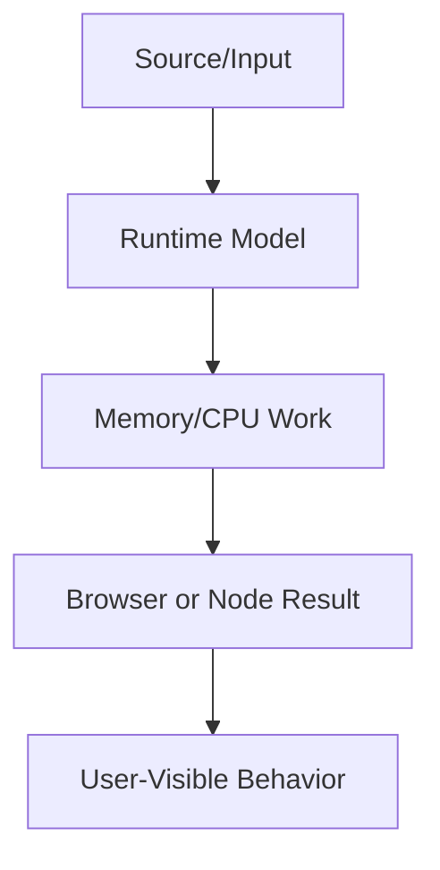
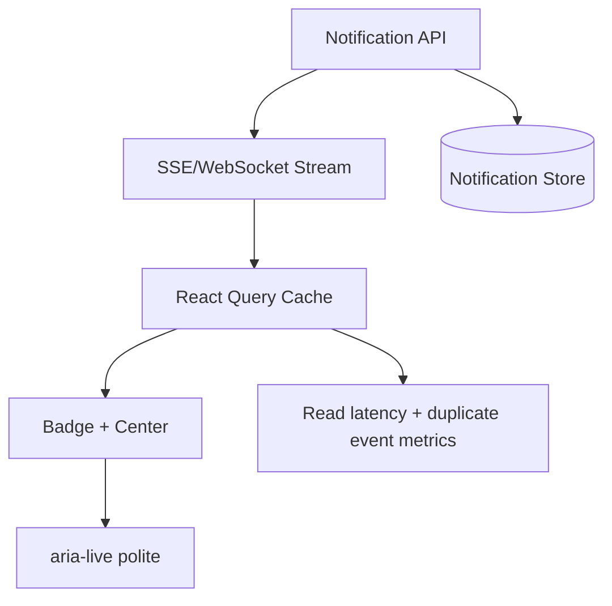

# Frontend System Design

This volume contains domain-specific senior-level notes for: Chat, Notifications, Maps, File Uploads, Realtime Systems.



## Chat

### What it is
Chat system design covers message delivery, ordering, presence, typing, pagination, and offline recovery.

### Why it exists
It exists because realtime UX has distributed-system edge cases.

### Source-code / internal model
Client maintains optimistic messages, server acknowledgements, WebSocket/SSE connection, and cache reconciliation.

### Architecture diagram


### Production React example
Support chat and team messaging need unread counts and reconnect handling.

```tsx
const ChatExample = {
  input: "dashboard filter, route transition, or API response",
  failureMode: "stale state, remount, blocked input, or unsafe data sink",
  metric: "React Profiler commit time, Chrome long task, heap growth, or Web Vital",
};
```

### Debugging scenario
Duplicate/out-of-order messages require idempotency and server sequence IDs.

### Performance profiling example
Profile list virtualization, websocket reconnect storms, and memory from retained messages.

### Product-company interview prompts
- Asked: design WhatsApp/Slack frontend.
- Explain one production incident involving Chat and how you would prevent recurrence.
- Implement or design a minimal example of Chat while narrating correctness, edge cases, and trade-offs.

### Senior-engineer checklist
- What owns the data or behavior?
- What can make it stale, slow, inaccessible, insecure, or hard to test?
- What instrumentation proves it works in production?
- What API would you expose to a team so misuse is difficult?

## Notifications

### What it is
Notifications deliver time-sensitive user updates across in-app, push, email, and badge surfaces.

### Why it exists
They solve awareness without forcing users to poll manually.

### Source-code / internal model
Client handles permissions, service worker push, in-app stream, read state, and dedupe.

### Architecture diagram


### Production React example
Collaboration apps notify mentions, assignments, and approvals.

```tsx
const NotificationsExample = {
  input: "dashboard filter, route transition, or API response",
  failureMode: "stale state, remount, blocked input, or unsafe data sink",
  metric: "React Profiler commit time, Chrome long task, heap growth, or Web Vital",
};
```

### Debugging scenario
Notification spam and duplicate events reduce trust.

### Performance profiling example
Batch DOM updates and virtualize notification centers.

### Product-company interview prompts
- Asked: design notification system with read/unread sync.
- Explain one production incident involving Notifications and how you would prevent recurrence.
- Implement or design a minimal example of Notifications while narrating correctness, edge cases, and trade-offs.

### Senior-engineer checklist
- What owns the data or behavior?
- What can make it stale, slow, inaccessible, insecure, or hard to test?
- What instrumentation proves it works in production?
- What API would you expose to a team so misuse is difficult?

## Maps

### What it is
Map stores key-value pairs with arbitrary key types and predictable iteration order.

### Why it exists
It solves object-key limitations and accidental prototype key collisions.

### Source-code / internal model
Map uses hash-table-like internals with SameValueZero key equality.

### Architecture diagram


### Production React example
Caching fetched entities by object key or URL uses Map.

```tsx
const byId = new Map(items.map(item => [item.id, item]));
const visible = items.filter(item => selectedIds.has(item.id));
```

### Debugging scenario
Memory leaks happen when Map keys should be collectible; use WeakMap for object metadata.

### Performance profiling example
Map lookup is O(1) average; watch unbounded caches.

### Product-company interview prompts
- Asked: Map vs Object and WeakMap use cases.
- Explain one production incident involving Maps and how you would prevent recurrence.
- Implement or design a minimal example of Maps while narrating correctness, edge cases, and trade-offs.

### Senior-engineer checklist
- What owns the data or behavior?
- What can make it stale, slow, inaccessible, insecure, or hard to test?
- What instrumentation proves it works in production?
- What API would you expose to a team so misuse is difficult?

## File Uploads

### What it is
File uploads move large local files reliably with validation, progress, retry, and security checks.

### Why it exists
They exist because network failures and large payloads are common.

### Source-code / internal model
Client validates type/size, requests signed URL, uploads chunks, tracks progress, and finalizes metadata.

### Architecture diagram


### Production React example
Media products upload images/videos with resumable chunks.

```tsx
const FileUploadsExample = {
  input: "dashboard filter, route transition, or API response",
  failureMode: "stale state, remount, blocked input, or unsafe data sink",
  metric: "React Profiler commit time, Chrome long task, heap growth, or Web Vital",
};
```

### Debugging scenario
Retrying without idempotency creates duplicate files.

### Performance profiling example
Profile main-thread blocking from hashing/compression; move heavy work to workers.

### Product-company interview prompts
- Asked: design resumable upload with progress and cancellation.
- Explain one production incident involving File Uploads and how you would prevent recurrence.
- Implement or design a minimal example of File Uploads while narrating correctness, edge cases, and trade-offs.

### Senior-engineer checklist
- What owns the data or behavior?
- What can make it stale, slow, inaccessible, insecure, or hard to test?
- What instrumentation proves it works in production?
- What API would you expose to a team so misuse is difficult?

## Realtime Systems

### What it is
Realtime systems keep UI synchronized with server events through WebSocket, SSE, polling, or WebRTC.

### Why it exists
They exist when stale UI harms collaboration or operations.

### Source-code / internal model
Client manages connection lifecycle, backoff, heartbeat, event ordering, and cache updates.

### Architecture diagram


### Production React example
Dashboards, multiplayer docs, trading UIs, and incident tools need realtime updates.

```tsx
const RealtimeSystemsExample = {
  input: "dashboard filter, route transition, or API response",
  failureMode: "stale state, remount, blocked input, or unsafe data sink",
  metric: "React Profiler commit time, Chrome long task, heap growth, or Web Vital",
};
```

### Debugging scenario
Reconnection can replay duplicate events; use event IDs and idempotent reducers.

### Performance profiling example
Profile message rate, render batching, and memory backpressure.

### Product-company interview prompts
- Asked: polling vs SSE vs WebSocket trade-offs.
- Explain one production incident involving Realtime Systems and how you would prevent recurrence.
- Implement or design a minimal example of Realtime Systems while narrating correctness, edge cases, and trade-offs.

### Senior-engineer checklist
- What owns the data or behavior?
- What can make it stale, slow, inaccessible, insecure, or hard to test?
- What instrumentation proves it works in production?
- What API would you expose to a team so misuse is difficult?

# Staff+ Frontend System Design Playbooks

These playbooks are intentionally concrete: each system includes architecture, data flow, state flow, API design, scaling, security, accessibility, monitoring, and recovery.

## Notification System



- **Data flow:** server emits notification events with monotonic IDs; client dedupes by ID and updates unread counts.
- **State flow:** unread count is server state; open/closed panel is client state; optimistic read updates must rollback on mutation failure.
- **API design:** `GET /notifications?cursor=`, `POST /notifications/:id/read`, `POST /notifications/read-all`, event `{id,type,actor,createdAt,readAt}`.
- **Scaling challenges:** fanout, duplicate delivery, cursor pagination, reconnect replay, multi-tab synchronization.
- **Security:** never expose notifications across tenant boundaries; authorize every cursor and mutation.
- **Accessibility:** badge changes should not spam screen readers; panel needs focus management and keyboard navigation.
- **Monitoring:** unread drift, event lag, duplicate event rate, read mutation failures.
- **Failure recovery:** replay from last seen event ID; reconcile with `GET` after reconnect.

## Chat System

- **Architecture:** WebSocket for messages/presence, HTTP for history, IndexedDB for offline draft/cache, virtualized message list for long rooms.
- **Data flow:** optimistic local message uses `clientMessageId`; server ack maps it to `messageId` and sequence.
- **State flow:** input draft is local; message history is server cache; presence is ephemeral stream state.
- **API design:** `GET /rooms/:id/messages?before=`, `POST /rooms/:id/messages`, WebSocket `message.created`, `message.ack`, `presence.changed`.
- **Scaling:** ordering, idempotency, backpressure, scroll anchoring, media upload, reconnect storms.
- **Security:** membership check on every room event; escape rich text; scan attachments.
- **Accessibility:** new-message announcements only when user is at bottom; preserve focus while messages arrive.
- **Monitoring:** send latency, ack latency, reconnect count, dropped events, virtual list render cost.
- **Recovery:** optimistic retry queue with exponential backoff and duplicate suppression.

## Maps System

- **Architecture:** tile CDN, vector data API, web worker for clustering, canvas/WebGL renderer, URL state for viewport.
- **Data flow:** viewport changes request tiles and domain markers; worker clusters markers; UI renders layers.
- **State flow:** map camera is client state; pins/search results are server state; selected marker is URL/share state.
- **Scaling:** tile cache, marker clustering, pan throttling, memory pressure from decoded tiles.
- **Security:** do not leak private coordinates across tenants; sign tile URLs when needed.
- **Accessibility:** provide list alternative for map results and keyboard navigation for markers.
- **Monitoring:** tile error rate, frame rate, worker time, memory growth.
- **Recovery:** fallback to static map/list when WebGL or tile service fails.

## File Upload System

- **Architecture:** client validates file, requests signed URL, uploads chunks directly to object storage, finalizes metadata through API.
- **Data flow:** file -> chunk queue -> signed URLs -> storage -> finalize -> asset record.
- **State flow:** per-file state machine: queued, hashing, uploading, paused, failed, complete.
- **Scaling:** resumable chunks, concurrency limits, backpressure, mobile network interruption.
- **Security:** MIME sniffing server-side, virus scanning, size limits, tenant-scoped storage keys.
- **Accessibility:** progress bar with `aria-valuenow`; keyboard operable cancel/retry.
- **Monitoring:** upload throughput, chunk failure rate, finalize failures.
- **Recovery:** persist upload session in IndexedDB and resume unfinished chunks.

## Realtime Dashboard

- **Architecture:** snapshot HTTP endpoint plus WebSocket/SSE deltas; reducer applies idempotent events to normalized cache.
- **Data flow:** initial snapshot -> event stream -> periodic reconciliation snapshot.
- **State flow:** filters are URL/client state; metrics are server state; connection status is UI state.
- **Scaling:** event batching, rendering throttles, chart downsampling, backpressure.
- **Security:** authorize each metric and redact sensitive dimensions.
- **Accessibility:** do not constantly move focus; announce critical alerts through controlled live regions.
- **Monitoring:** event lag, dropped events, chart render time, memory growth.
- **Recovery:** reconnect with last event ID; if gap detected, refetch snapshot.

## Infinite Scroll

- **Architecture:** cursor API, IntersectionObserver sentinel, React Query infinite query, virtualized list.
- **Data flow:** viewport approaches sentinel -> fetch next cursor -> append page -> virtualizer renders visible window.
- **State flow:** pages are server cache; scroll position is browser state; filters reset cursor cache.
- **Scaling:** duplicate pages, unstable sort, SEO, memory from unbounded pages.
- **Security:** cursor must encode authorized scope; do not trust client offsets for private data.
- **Accessibility:** provide Load More button fallback and announce newly loaded item count.
- **Monitoring:** fetch latency, duplicate item rate, scroll jank, memory.
- **Recovery:** retry failed page without losing previous pages.

## Analytics Dashboard

- **Architecture:** query builder UI, metrics API, chart renderer, worker for transforms, cache keyed by tenant/date/filter.
- **Data flow:** filters -> validated query -> API -> normalized series -> chart.
- **State flow:** URL owns shareable filters; server cache owns metric results; hover/selection is local state.
- **Scaling:** high-cardinality dimensions, large JSON payloads, chart overdraw, expensive date math.
- **Security:** row-level authorization and metric redaction.
- **Accessibility:** chart table fallback and keyboard-accessible legends.
- **Monitoring:** query latency, payload size, chart render cost, filter abandonment.
- **Recovery:** partial chart error states and cached stale data indicator.

## Multi Tenant SaaS

- **Architecture:** tenant resolver, permission service, feature flag service, themed design system, tenant-scoped caches.
- **Data flow:** request/session -> tenant -> permissions/flags/theme -> route data.
- **State flow:** tenant is top-level app state; caches must include tenant ID and role.
- **Scaling:** tenant switching, custom domains, per-tenant config, noisy-neighbor APIs.
- **Security:** never reuse cache entries across tenant or role; server-enforce all permissions.
- **Accessibility:** custom themes must maintain contrast and focus indicators.
- **Monitoring:** tenant-specific error rates, slow tenants, permission denials.
- **Recovery:** safe tenant switch clears scoped stores and aborts old requests.

## Design System

- **Architecture:** tokens, primitives, composed components, docs, visual tests, release pipeline.
- **Data flow:** Figma tokens -> token build -> CSS variables/packages -> consuming apps.
- **State flow:** components expose controlled/uncontrolled APIs and clear accessibility state.
- **Scaling:** versioning, migration codemods, ownership, contribution review.
- **Security:** avoid unsafe HTML props by default.
- **Accessibility:** primitives must encode ARIA, focus management, and keyboard behavior.
- **Monitoring:** adoption, bundle impact, accessibility regressions.
- **Recovery:** deprecate with migration path; do not silently break product flows.

## Offline First Application

- **Architecture:** service worker, Cache Storage, IndexedDB mutation queue, sync/retry engine, conflict resolver.
- **Data flow:** read from cache first; enqueue mutations offline; sync when network returns.
- **State flow:** local optimistic state, persisted queue, server canonical state.
- **Scaling:** conflict resolution, schema migrations, quota limits, stale data warnings.
- **Security:** encrypt sensitive offline data where appropriate and expire cached sessions.
- **Accessibility:** clearly announce offline/queued/synced states.
- **Monitoring:** queue length, sync failures, conflict rate, quota errors.
- **Recovery:** replay idempotent mutations and surface conflicts for human decision.
