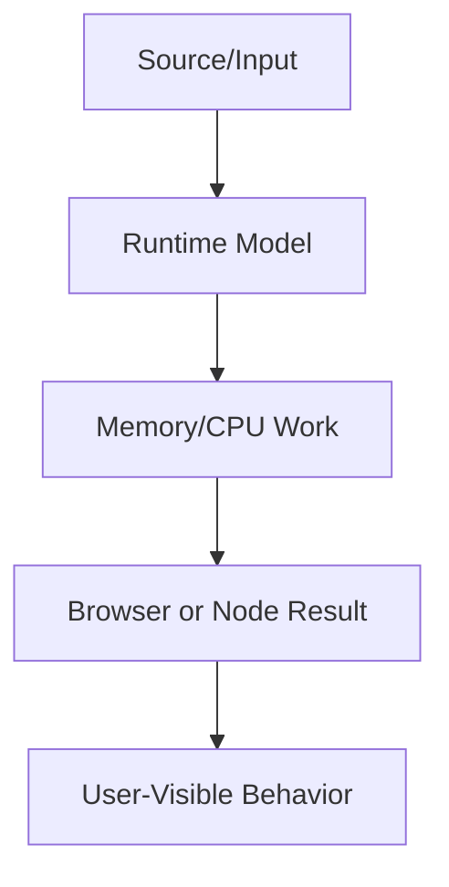

# Frontend System Design

This volume contains domain-specific senior-level notes for: Chat, Notifications, Maps, File Uploads, Realtime Systems.



## Chat

### What it is
Chat system design covers message delivery, ordering, presence, typing, pagination, and offline recovery.

### Why it exists
It exists because realtime UX has distributed-system edge cases.

### Source-code / internal model
Client maintains optimistic messages, server acknowledgements, WebSocket/SSE connection, and cache reconciliation.

### Architecture diagram


### Production React example
Support chat and team messaging need unread counts and reconnect handling.

```tsx
const ChatExample = {
  input: "dashboard filter, route transition, or API response",
  failureMode: "stale state, remount, blocked input, or unsafe data sink",
  metric: "React Profiler commit time, Chrome long task, heap growth, or Web Vital",
};
```

### Debugging scenario
Duplicate/out-of-order messages require idempotency and server sequence IDs.

### Performance profiling example
Profile list virtualization, websocket reconnect storms, and memory from retained messages.

### Product-company interview prompts
- Asked: design WhatsApp/Slack frontend.
- Explain one production incident involving Chat and how you would prevent recurrence.
- Implement or design a minimal example of Chat while narrating correctness, edge cases, and trade-offs.

### Senior-engineer checklist
- What owns the data or behavior?
- What can make it stale, slow, inaccessible, insecure, or hard to test?
- What instrumentation proves it works in production?
- What API would you expose to a team so misuse is difficult?

## Notifications

### What it is
Notifications deliver time-sensitive user updates across in-app, push, email, and badge surfaces.

### Why it exists
They solve awareness without forcing users to poll manually.

### Source-code / internal model
Client handles permissions, service worker push, in-app stream, read state, and dedupe.

### Architecture diagram


### Production React example
Collaboration apps notify mentions, assignments, and approvals.

```tsx
const NotificationsExample = {
  input: "dashboard filter, route transition, or API response",
  failureMode: "stale state, remount, blocked input, or unsafe data sink",
  metric: "React Profiler commit time, Chrome long task, heap growth, or Web Vital",
};
```

### Debugging scenario
Notification spam and duplicate events reduce trust.

### Performance profiling example
Batch DOM updates and virtualize notification centers.

### Product-company interview prompts
- Asked: design notification system with read/unread sync.
- Explain one production incident involving Notifications and how you would prevent recurrence.
- Implement or design a minimal example of Notifications while narrating correctness, edge cases, and trade-offs.

### Senior-engineer checklist
- What owns the data or behavior?
- What can make it stale, slow, inaccessible, insecure, or hard to test?
- What instrumentation proves it works in production?
- What API would you expose to a team so misuse is difficult?

## Maps

### What it is
Map stores key-value pairs with arbitrary key types and predictable iteration order.

### Why it exists
It solves object-key limitations and accidental prototype key collisions.

### Source-code / internal model
Map uses hash-table-like internals with SameValueZero key equality.

### Architecture diagram


### Production React example
Caching fetched entities by object key or URL uses Map.

```tsx
const byId = new Map(items.map(item => [item.id, item]));
const visible = items.filter(item => selectedIds.has(item.id));
```

### Debugging scenario
Memory leaks happen when Map keys should be collectible; use WeakMap for object metadata.

### Performance profiling example
Map lookup is O(1) average; watch unbounded caches.

### Product-company interview prompts
- Asked: Map vs Object and WeakMap use cases.
- Explain one production incident involving Maps and how you would prevent recurrence.
- Implement or design a minimal example of Maps while narrating correctness, edge cases, and trade-offs.

### Senior-engineer checklist
- What owns the data or behavior?
- What can make it stale, slow, inaccessible, insecure, or hard to test?
- What instrumentation proves it works in production?
- What API would you expose to a team so misuse is difficult?

## File Uploads

### What it is
File uploads move large local files reliably with validation, progress, retry, and security checks.

### Why it exists
They exist because network failures and large payloads are common.

### Source-code / internal model
Client validates type/size, requests signed URL, uploads chunks, tracks progress, and finalizes metadata.

### Architecture diagram


### Production React example
Media products upload images/videos with resumable chunks.

```tsx
const FileUploadsExample = {
  input: "dashboard filter, route transition, or API response",
  failureMode: "stale state, remount, blocked input, or unsafe data sink",
  metric: "React Profiler commit time, Chrome long task, heap growth, or Web Vital",
};
```

### Debugging scenario
Retrying without idempotency creates duplicate files.

### Performance profiling example
Profile main-thread blocking from hashing/compression; move heavy work to workers.

### Product-company interview prompts
- Asked: design resumable upload with progress and cancellation.
- Explain one production incident involving File Uploads and how you would prevent recurrence.
- Implement or design a minimal example of File Uploads while narrating correctness, edge cases, and trade-offs.

### Senior-engineer checklist
- What owns the data or behavior?
- What can make it stale, slow, inaccessible, insecure, or hard to test?
- What instrumentation proves it works in production?
- What API would you expose to a team so misuse is difficult?

## Realtime Systems

### What it is
Realtime systems keep UI synchronized with server events through WebSocket, SSE, polling, or WebRTC.

### Why it exists
They exist when stale UI harms collaboration or operations.

### Source-code / internal model
Client manages connection lifecycle, backoff, heartbeat, event ordering, and cache updates.

### Architecture diagram


### Production React example
Dashboards, multiplayer docs, trading UIs, and incident tools need realtime updates.

```tsx
const RealtimeSystemsExample = {
  input: "dashboard filter, route transition, or API response",
  failureMode: "stale state, remount, blocked input, or unsafe data sink",
  metric: "React Profiler commit time, Chrome long task, heap growth, or Web Vital",
};
```

### Debugging scenario
Reconnection can replay duplicate events; use event IDs and idempotent reducers.

### Performance profiling example
Profile message rate, render batching, and memory backpressure.

### Product-company interview prompts
- Asked: polling vs SSE vs WebSocket trade-offs.
- Explain one production incident involving Realtime Systems and how you would prevent recurrence.
- Implement or design a minimal example of Realtime Systems while narrating correctness, edge cases, and trade-offs.

### Senior-engineer checklist
- What owns the data or behavior?
- What can make it stale, slow, inaccessible, insecure, or hard to test?
- What instrumentation proves it works in production?
- What API would you expose to a team so misuse is difficult?

