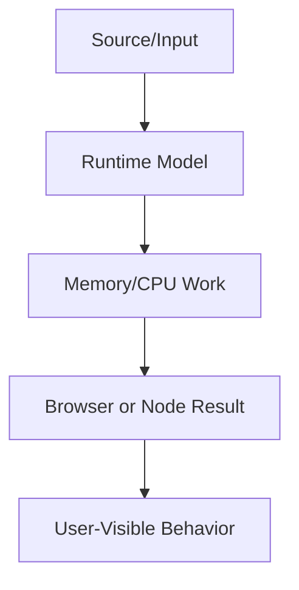

# Interview Mastery

This volume contains domain-specific senior-level notes for: 300+ JavaScript Questions, 200+ React Questions, Machine Coding, Frontend System Design.



## 300+ JavaScript Questions

### What it is
JavaScript question banks organize repeated interview patterns: execution order, closures, prototypes, async, objects, and browser APIs.

### Why it exists
They exist so candidates practice reasoning, not memorized trivia.

### Source-code / internal model
A strong answer traces creation phase, execution phase, memory references, event loop queues, and observable output.

### Architecture diagram


### Production React example
Teams use these drills for interview prep and internal mentoring sessions.

```tsx
const 300PlusJavaScriptQuestionsExample = {
  input: "dashboard filter, route transition, or API response",
  failureMode: "stale state, remount, blocked input, or unsafe data sink",
  metric: "React Profiler commit time, Chrome long task, heap growth, or Web Vital",
};
```

### Debugging scenario
If answers are inconsistent, write the code in Node/browser and annotate each runtime step.

### Performance profiling example
Time-box drills and classify misses by concept to improve weak areas.

### Product-company interview prompts
- Asked: output questions involving hoisting, closure loops, promises, this, prototypes, and coercion.
- Explain one production incident involving 300+ JavaScript Questions and how you would prevent recurrence.
- Implement or design a minimal example of 300+ JavaScript Questions while narrating correctness, edge cases, and trade-offs.

### Senior-engineer checklist
- What owns the data or behavior?
- What can make it stale, slow, inaccessible, insecure, or hard to test?
- What instrumentation proves it works in production?
- What API would you expose to a team so misuse is difficult?

## 200+ React Questions

### What it is
React question banks cover component model, hooks, rendering, reconciliation, state, performance, and accessibility.

### Why it exists
They exist because React interviews test mental models and production judgment.

### Source-code / internal model
A senior answer distinguishes render phase, commit phase, effect timing, Fiber reuse, and scheduling.

### Architecture diagram


### Production React example
Frontend teams use these questions to calibrate hiring bars and promotion readiness.

```tsx
const 200PlusReactQuestionsExample = {
  input: "dashboard filter, route transition, or API response",
  failureMode: "stale state, remount, blocked input, or unsafe data sink",
  metric: "React Profiler commit time, Chrome long task, heap growth, or Web Vital",
};
```

### Debugging scenario
If answers are vague, reproduce the scenario in a sandbox and inspect Profiler output.

### Performance profiling example
Measure whether proposed optimization reduces renders or only adds complexity.

### Product-company interview prompts
- Asked: useEffect dependencies, memoization, keys, Context performance, controlled components.
- Explain one production incident involving 200+ React Questions and how you would prevent recurrence.
- Implement or design a minimal example of 200+ React Questions while narrating correctness, edge cases, and trade-offs.

### Senior-engineer checklist
- What owns the data or behavior?
- What can make it stale, slow, inaccessible, insecure, or hard to test?
- What instrumentation proves it works in production?
- What API would you expose to a team so misuse is difficult?

## Machine Coding

### What it is
Machine coding is building a working feature under time constraints with clean architecture and edge cases.

### Why it exists
It exists to evaluate practical delivery, not just algorithm trivia.

### Source-code / internal model
Good solutions separate state, rendering, accessibility, async handling, error states, and tests.

### Architecture diagram


### Production React example
Common tasks: autocomplete, infinite scroll, modal, tabs, data table, calendar, toast system.

```tsx
const MachineCodingExample = {
  input: "dashboard filter, route transition, or API response",
  failureMode: "stale state, remount, blocked input, or unsafe data sink",
  metric: "React Profiler commit time, Chrome long task, heap growth, or Web Vital",
};
```

### Debugging scenario
Debug by narrating assumptions, checking edge states, and adding small tests as you build.

### Performance profiling example
Avoid premature abstraction; optimize only visible bottlenecks like large lists or repeated filtering.

### Product-company interview prompts
- Asked: build typeahead with debounce, cache, keyboard navigation, loading/error states.
- Explain one production incident involving Machine Coding and how you would prevent recurrence.
- Implement or design a minimal example of Machine Coding while narrating correctness, edge cases, and trade-offs.

### Senior-engineer checklist
- What owns the data or behavior?
- What can make it stale, slow, inaccessible, insecure, or hard to test?
- What instrumentation proves it works in production?
- What API would you expose to a team so misuse is difficult?

## Frontend System Design

### What it is
Frontend system design is architecting client experiences for scale, performance, reliability, accessibility, and team ownership.

### Why it exists
It exists because frontend is now a distributed system client with caching, realtime data, rendering, and security trade-offs.

### Source-code / internal model
A strong design covers APIs, state model, cache, rendering, routing, offline/retry, observability, accessibility, security, and rollout.

### Architecture diagram


### Production React example
Senior interviews ask design for chat, notifications, maps, file upload, dashboard, or collaborative editor.

```tsx
const FrontendSystemDesignExample = {
  input: "dashboard filter, route transition, or API response",
  failureMode: "stale state, remount, blocked input, or unsafe data sink",
  metric: "React Profiler commit time, Chrome long task, heap growth, or Web Vital",
};
```

### Debugging scenario
Debug designs by walking through slow network, duplicate events, refresh, multiple tabs, and permission changes.

### Performance profiling example
Profile proposed architecture against Core Web Vitals, bundle size, memory, and interaction latency.

### Product-company interview prompts
- Asked: design a scalable frontend for Slack/Google Maps/Dropbox upload.
- Explain one production incident involving Frontend System Design and how you would prevent recurrence.
- Implement or design a minimal example of Frontend System Design while narrating correctness, edge cases, and trade-offs.

### Senior-engineer checklist
- What owns the data or behavior?
- What can make it stale, slow, inaccessible, insecure, or hard to test?
- What instrumentation proves it works in production?
- What API would you expose to a team so misuse is difficult?

