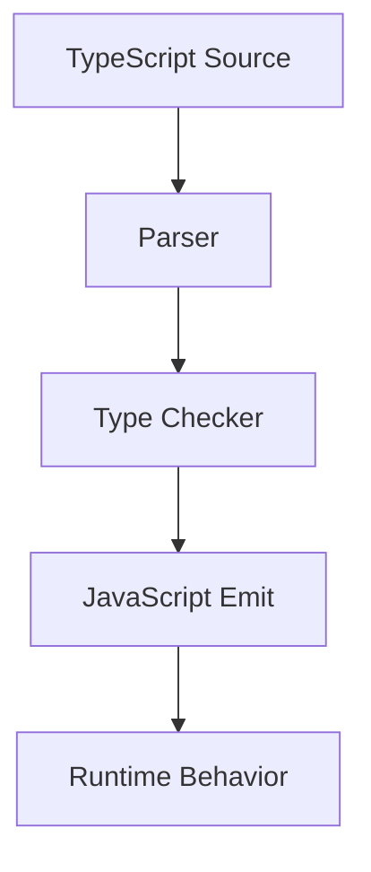

# TypeScript Mastery

This volume contains domain-specific senior-level notes for: Basics, Generics, Utility Types, Conditional Types, Infer, Mapped Types, Declaration Merging, Advanced Type Inference.



## Basics

### What it is
TypeScript basics are annotations, inference, unions, narrowing, interfaces, type aliases, and strict mode.

### Why it exists
They exist to catch type mismatches before runtime while still emitting JavaScript.

### Source-code / internal model
The compiler builds a type graph, narrows control flow, and erases types during emit.

### Architecture diagram


### Production React example
React props and API DTOs use TypeScript basics to prevent invalid UI states.

```tsx
type ApiResponse<T> = { data: T; error?: never } | { data?: never; error: string };
```

### Debugging scenario
If a value is any, trace where type information was lost at the boundary.

### Performance profiling example
No runtime cost; strict types reduce production validation gaps.

### Product-company interview prompts
- Asked: type vs interface, union narrowing, any vs unknown, strictNullChecks.
- Explain one production incident involving Basics and how you would prevent recurrence.
- Implement or design a minimal example of Basics while narrating correctness, edge cases, and trade-offs.

### Senior-engineer checklist
- What owns the data or behavior?
- What can make it stale, slow, inaccessible, insecure, or hard to test?
- What instrumentation proves it works in production?
- What API would you expose to a team so misuse is difficult?

## Generics

### What it is
Generics parameterize types so APIs preserve relationships between inputs and outputs.

### Why it exists
They preserve type relationships across reusable functions, hooks, components, and API clients.

### Source-code / internal model
TypeScript infers type parameters from call sites and checks constraints structurally.

### Architecture diagram


### Production React example
Reusable hooks like usePaginatedQuery<T> keep data strongly typed across products.

```tsx
const GenericsExample = {
  input: "dashboard filter, route transition, or API response",
  failureMode: "stale state, remount, blocked input, or unsafe data sink",
  metric: "React Profiler commit time, Chrome long task, heap growth, or Web Vital",
};
```

### Debugging scenario
If generic inference becomes unknown, inspect constraints and argument positions.

### Performance profiling example
Compile-time only; better types reduce runtime defensive code.

### Product-company interview prompts
- Asked: generic constraints, default type params, variance basics.
- Explain one production incident involving Generics and how you would prevent recurrence.
- Implement or design a minimal example of Generics while narrating correctness, edge cases, and trade-offs.

### Senior-engineer checklist
- What owns the data or behavior?
- What can make it stale, slow, inaccessible, insecure, or hard to test?
- What instrumentation proves it works in production?
- What API would you expose to a team so misuse is difficult?

## Utility Types

### What it is
Utility types transform existing types into variants such as Partial, Pick, Omit, Record, ReturnType.

### Why it exists
They avoid duplicating type transformations that are derived from existing models.

### Source-code / internal model
They are implemented using mapped, conditional, indexed access, and infer types.

### Architecture diagram


### Production React example
API DTOs, form drafts, and component prop variants use utility types heavily.

```tsx
const UtilityTypesExample = {
  input: "dashboard filter, route transition, or API response",
  failureMode: "stale state, remount, blocked input, or unsafe data sink",
  metric: "React Profiler commit time, Chrome long task, heap growth, or Web Vital",
};
```

### Debugging scenario
Overusing nested utilities can make error messages unreadable.

### Performance profiling example
No runtime cost; compile time may increase with deeply recursive types.

### Product-company interview prompts
- Asked: implement Pick/Omit/Readonly and when not to use Partial.
- Explain one production incident involving Utility Types and how you would prevent recurrence.
- Implement or design a minimal example of Utility Types while narrating correctness, edge cases, and trade-offs.

### Senior-engineer checklist
- What owns the data or behavior?
- What can make it stale, slow, inaccessible, insecure, or hard to test?
- What instrumentation proves it works in production?
- What API would you expose to a team so misuse is difficult?

## Conditional Types

### What it is
Conditional types choose one type branch based on assignability.

### Why it exists
They let TypeScript model APIs whose output type depends on input type.

### Source-code / internal model
T extends U ? X : Y distributes over unions when T is naked.

### Architecture diagram


### Production React example
Library authors model API responses, action payloads, and prop constraints with conditional types.

```tsx
const ConditionalTypesExample = {
  input: "dashboard filter, route transition, or API response",
  failureMode: "stale state, remount, blocked input, or unsafe data sink",
  metric: "React Profiler commit time, Chrome long task, heap growth, or Web Vital",
};
```

### Debugging scenario
Unexpected distribution is a common bug; wrap in tuples to disable.

### Performance profiling example
Complex conditional recursion can slow type checking.

### Product-company interview prompts
- Asked: union distribution and implement Exclude/Extract.
- Explain one production incident involving Conditional Types and how you would prevent recurrence.
- Implement or design a minimal example of Conditional Types while narrating correctness, edge cases, and trade-offs.

### Senior-engineer checklist
- What owns the data or behavior?
- What can make it stale, slow, inaccessible, insecure, or hard to test?
- What instrumentation proves it works in production?
- What API would you expose to a team so misuse is difficult?

## Infer

### What it is
infer captures a type variable inside a conditional type pattern.

### Why it exists
It exists so libraries can extract return types, argument types, awaited values, or component props.

### Source-code / internal model
The checker matches a type against a pattern and binds the inferred portion for the true branch.

### Architecture diagram


### Production React example
Design-system utilities extract component prop types and async result types.

```tsx
type ApiResponse<T> = { data: T; error?: never } | { data?: never; error: string };
```

### Debugging scenario
If infer returns never, the input type did not match the conditional pattern.

### Performance profiling example
Deep infer utilities can slow editor feedback.

### Product-company interview prompts
- Asked: implement ReturnType, Awaited, Parameters.
- Explain one production incident involving Infer and how you would prevent recurrence.
- Implement or design a minimal example of Infer while narrating correctness, edge cases, and trade-offs.

### Senior-engineer checklist
- What owns the data or behavior?
- What can make it stale, slow, inaccessible, insecure, or hard to test?
- What instrumentation proves it works in production?
- What API would you expose to a team so misuse is difficult?

## Mapped Types

### What it is
Mapped types iterate over keys to create transformed object types.

### Why it exists
They exist to avoid manually duplicating object shape transformations.

### Source-code / internal model
The checker maps keyof T and can add/remove readonly/optional modifiers or remap keys.

### Architecture diagram


### Production React example
Form libraries create touched/errors/dirty maps from a domain model.

```tsx
type ApiResponse<T> = { data: T; error?: never } | { data?: never; error: string };
```

### Debugging scenario
Key remapping bugs happen when string/number/symbol keys are not considered.

### Performance profiling example
Large recursive mapped types can increase type-check time.

### Product-company interview prompts
- Asked: implement Partial, Readonly, Pick-like transformations.
- Explain one production incident involving Mapped Types and how you would prevent recurrence.
- Implement or design a minimal example of Mapped Types while narrating correctness, edge cases, and trade-offs.

### Senior-engineer checklist
- What owns the data or behavior?
- What can make it stale, slow, inaccessible, insecure, or hard to test?
- What instrumentation proves it works in production?
- What API would you expose to a team so misuse is difficult?

## Declaration Merging

### What it is
Declaration merging combines compatible declarations with the same name.

### Why it exists
It exists for JavaScript extensibility and ambient type augmentation.

### Source-code / internal model
Interfaces, namespaces, and module declarations can merge under TypeScript rules.

### Architecture diagram


### Production React example
Apps augment Express/Next/Auth session types or global window fields.

```tsx
type ApiResponse<T> = { data: T; error?: never } | { data?: never; error: string };
```

### Debugging scenario
Accidental global augmentation can affect unrelated packages.

### Performance profiling example
No runtime cost, but broad ambient types can slow builds and confuse ownership.

### Product-company interview prompts
- Asked: interface merging and module augmentation.
- Explain one production incident involving Declaration Merging and how you would prevent recurrence.
- Implement or design a minimal example of Declaration Merging while narrating correctness, edge cases, and trade-offs.

### Senior-engineer checklist
- What owns the data or behavior?
- What can make it stale, slow, inaccessible, insecure, or hard to test?
- What instrumentation proves it works in production?
- What API would you expose to a team so misuse is difficult?

## Advanced Type Inference

### What it is
Advanced type inference uses contextual typing, generic inference, conditional types, and control-flow narrowing together.

### Why it exists
It exists so APIs can be safe without requiring callers to manually annotate everything.

### Source-code / internal model
Inference flows from arguments, return positions, constraints, overloads, and conditional branches.

### Architecture diagram


### Production React example
Typed route builders and API clients infer params, body, and response from one schema.

```tsx
type ApiResponse<T> = { data: T; error?: never } | { data?: never; error: string };
```

### Debugging scenario
Inference fails when types are too wide, overloaded ambiguously, or hidden behind any.

### Performance profiling example
Complex inference improves DX but may slow IDE type checking.

### Product-company interview prompts
- Asked: why inference widens literals and how as const/satisfies help.
- Explain one production incident involving Advanced Type Inference and how you would prevent recurrence.
- Implement or design a minimal example of Advanced Type Inference while narrating correctness, edge cases, and trade-offs.

### Senior-engineer checklist
- What owns the data or behavior?
- What can make it stale, slow, inaccessible, insecure, or hard to test?
- What instrumentation proves it works in production?
- What API would you expose to a team so misuse is difficult?

