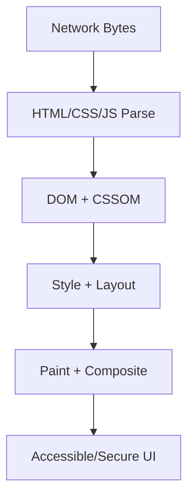

# Web Performance

This volume contains domain-specific senior-level notes for: Core Web Vitals, LCP, CLS, INP, Code Splitting, Bundle Optimization, Tree Shaking.



## Core Web Vitals

### What it is
Core Web Vitals are user-centered metrics for loading, responsiveness, and visual stability.

### Why it exists
They turn user-perceived loading, responsiveness, and stability into measurable product metrics.

### Source-code / internal model
LCP tracks largest content paint, INP tracks interaction responsiveness, CLS tracks unexpected layout shift.

### Architecture diagram


### Production React example
Commerce and media sites track vitals per route and device class.

```tsx
const CoreWebVitalsExample = {
  input: "dashboard filter, route transition, or API response",
  failureMode: "stale state, remount, blocked input, or unsafe data sink",
  metric: "React Profiler commit time, Chrome long task, heap growth, or Web Vital",
};
```

### Debugging scenario
Poor field data requires correlating element, route, device, network, and release.

### Performance profiling example
Use Lighthouse for lab hints and CrUX/RUM for field truth.

### Product-company interview prompts
- Asked: lab vs field, LCP/CLS/INP thresholds and fixes.
- Explain one production incident involving Core Web Vitals and how you would prevent recurrence.
- Implement or design a minimal example of Core Web Vitals while narrating correctness, edge cases, and trade-offs.

### Senior-engineer checklist
- What owns the data or behavior?
- What can make it stale, slow, inaccessible, insecure, or hard to test?
- What instrumentation proves it works in production?
- What API would you expose to a team so misuse is difficult?

## LCP

### What it is
LCP measures when the largest visible content element renders.

### Why it exists
It focuses teams on when the main visible content becomes useful.

### Source-code / internal model
Critical path includes TTFB, resource discovery, image/font loading, render-blocking CSS, and main-thread work.

### Architecture diagram


### Production React example
Hero images on landing pages must be sized, preloaded/fetchpriority, and served in modern formats.

```tsx
const LCPExample = {
  input: "dashboard filter, route transition, or API response",
  failureMode: "stale state, remount, blocked input, or unsafe data sink",
  metric: "React Profiler commit time, Chrome long task, heap growth, or Web Vital",
};
```

### Debugging scenario
If LCP element changes late, inspect lazy loading, CSS background images, and client rendering.

### Performance profiling example
Use Performance panel LCP marker and element attribution.

### Product-company interview prompts
- Interviews ask: improve LCP for SSR React ecommerce page.
- Explain one production incident involving LCP and how you would prevent recurrence.
- Implement or design a minimal example of LCP while narrating correctness, edge cases, and trade-offs.

### Senior-engineer checklist
- What owns the data or behavior?
- What can make it stale, slow, inaccessible, insecure, or hard to test?
- What instrumentation proves it works in production?
- What API would you expose to a team so misuse is difficult?

## CLS

### What it is
CLS measures unexpected visual movement after content is visible.

### Why it exists
It prevents unexpected movement that causes misclicks and user frustration.

### Source-code / internal model
Layout shifts occur when dimensions are missing, ads inject space, fonts swap, or banners appear above content.

### Architecture diagram


### Production React example
Feeds reserve image/ad/card skeleton dimensions to keep layout stable.

```tsx
const CLSExample = {
  input: "dashboard filter, route transition, or API response",
  failureMode: "stale state, remount, blocked input, or unsafe data sink",
  metric: "React Profiler commit time, Chrome long task, heap growth, or Web Vital",
};
```

### Debugging scenario
Debug with Layout Shift regions in Chrome DevTools.

### Performance profiling example
Set width/height/aspect-ratio and avoid inserting content above the viewport.

### Product-company interview prompts
- Asked: why skeletons can reduce CLS and when they can worsen perceived performance.
- Explain one production incident involving CLS and how you would prevent recurrence.
- Implement or design a minimal example of CLS while narrating correctness, edge cases, and trade-offs.

### Senior-engineer checklist
- What owns the data or behavior?
- What can make it stale, slow, inaccessible, insecure, or hard to test?
- What instrumentation proves it works in production?
- What API would you expose to a team so misuse is difficult?

## INP

### What it is
INP measures page responsiveness across interactions.

### Why it exists
It measures whether the page responds quickly to real user interactions.

### Source-code / internal model
Long tasks, heavy event handlers, layout thrashing, and expensive React renders delay next paint.

### Architecture diagram


### Production React example
Search inputs and filters must keep typing responsive under large data.

```tsx
performance.mark("start");
runExpensiveUIWork();
performance.mark("end");
performance.measure("ui-work", "start", "end");
```

### Debugging scenario
If clicks feel delayed, inspect long tasks around the interaction.

### Performance profiling example
Break work, virtualize lists, transition non-urgent React updates, and move CPU-heavy tasks to workers.

### Product-company interview prompts
- Asked: diagnose slow input in React using Performance and Profiler.
- Explain one production incident involving INP and how you would prevent recurrence.
- Implement or design a minimal example of INP while narrating correctness, edge cases, and trade-offs.

### Senior-engineer checklist
- What owns the data or behavior?
- What can make it stale, slow, inaccessible, insecure, or hard to test?
- What instrumentation proves it works in production?
- What API would you expose to a team so misuse is difficult?

## Code Splitting

### What it is
Code splitting breaks JavaScript into chunks loaded only when needed.

### Why it exists
It exists because shipping all route and feature code upfront hurts startup performance.

### Source-code / internal model
Bundlers create dynamic import boundaries and runtime chunk loading graphs.

### Architecture diagram


### Production React example
React.lazy loads admin charts only when the admin route opens.

```tsx
const AdminReports = lazy(() => import("./AdminReports"));
// Load only when the admin route is visited.
```

### Debugging scenario
Blank screens happen when lazy chunks fail without error boundaries/retry UI.

### Performance profiling example
Use bundle analyzer and route-level LCP/INP to validate split points.

### Product-company interview prompts
- Asked: dynamic import, route splitting, prefetching trade-offs.
- Explain one production incident involving Code Splitting and how you would prevent recurrence.
- Implement or design a minimal example of Code Splitting while narrating correctness, edge cases, and trade-offs.

### Senior-engineer checklist
- What owns the data or behavior?
- What can make it stale, slow, inaccessible, insecure, or hard to test?
- What instrumentation proves it works in production?
- What API would you expose to a team so misuse is difficult?

## Bundle Optimization

### What it is
Bundle optimization reduces shipped JavaScript/CSS through dependency choices, minification, compression, and chunk strategy.

### Why it exists
It exists because parse/compile/execute cost affects low-end devices even after download.

### Source-code / internal model
Bundlers resolve module graphs, apply transforms, dedupe dependencies, and emit chunks.

### Architecture diagram


### Production React example
Replacing moment with date-fns or Intl can cut dashboard bundle size.

```tsx
const AdminReports = lazy(() => import("./AdminReports"));
// Load only when the admin route is visited.
```

### Debugging scenario
Duplicate dependencies appear when package versions diverge.

### Performance profiling example
Measure transfer size, parsed size, unused code, and execution time.

### Product-company interview prompts
- Asked: how to reduce a 2MB React bundle.
- Explain one production incident involving Bundle Optimization and how you would prevent recurrence.
- Implement or design a minimal example of Bundle Optimization while narrating correctness, edge cases, and trade-offs.

### Senior-engineer checklist
- What owns the data or behavior?
- What can make it stale, slow, inaccessible, insecure, or hard to test?
- What instrumentation proves it works in production?
- What API would you expose to a team so misuse is difficult?

## Tree Shaking

### What it is
Tree shaking removes unused exports from the final bundle.

### Why it exists
It exists to avoid shipping library code the app never imports.

### Source-code / internal model
Bundlers rely on ES module static structure and sideEffects metadata.

### Architecture diagram


### Production React example
Icon libraries and utility libraries need tree-shakable imports.

```tsx
const AdminReports = lazy(() => import("./AdminReports"));
// Load only when the admin route is visited.
```

### Debugging scenario
CommonJS or side-effectful barrels can prevent elimination.

### Performance profiling example
Verify with bundle analyzer, not assumptions.

### Product-company interview prompts
- Asked: ESM vs CJS tree shaking and sideEffects package field.
- Explain one production incident involving Tree Shaking and how you would prevent recurrence.
- Implement or design a minimal example of Tree Shaking while narrating correctness, edge cases, and trade-offs.

### Senior-engineer checklist
- What owns the data or behavior?
- What can make it stale, slow, inaccessible, insecure, or hard to test?
- What instrumentation proves it works in production?
- What API would you expose to a team so misuse is difficult?

# Staff+ Performance Playbook

## Metrics Beyond The Basics
- **TTFB:** server and edge response start. Debug with CDN logs, server timing, cache status, and geographic latency.
- **FCP:** first text/image paint. Improve by reducing render-blocking CSS/JS and delivering critical HTML quickly.
- **LCP:** largest visible content. Optimize image discovery, priority, dimensions, TTFB, and main-thread blocking.
- **CLS:** visual stability. Reserve space for images, ads, embeds, and async banners.
- **INP:** interaction responsiveness. Break long tasks, reduce render fanout, virtualize large lists, and move CPU work to workers.

## Chrome DevTools Workflow
1. Record with CPU throttling and network conditions matching field data.
2. Inspect the main thread for long tasks.
3. Expand scripting stacks to identify framework, app, and third-party cost.
4. Check Layout/Paint events for forced reflow or expensive rendering.
5. Correlate with React Profiler commits.

## React Profiler Walkthrough
Use the Ranked tab to find expensive components, then ask whether cost is render frequency or render duration. Fix state placement, key stability, memoized selectors, virtualization, or expensive derived data only after observing the flamegraph.

## Memory Profiling
Take heap snapshots before and after repeated navigation. Look for retained listeners, timers, WebSocket subscriptions, detached DOM, unbounded React Query caches, and large arrays captured by closures.

## Bundle Analysis
Analyze parsed and executed JavaScript, not only gzip size. Prefer route-level code splitting, ESM imports, dependency dedupe, and removing side-effectful barrels that block tree shaking.
