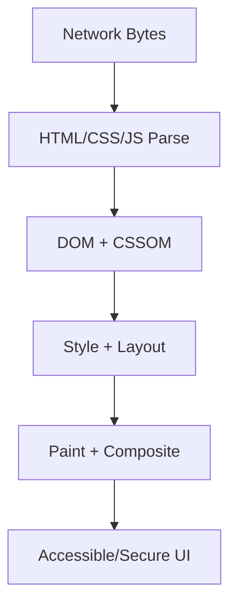

# Accessibility

This volume contains domain-specific senior-level notes for: ARIA, Screen Readers, Semantic HTML, Keyboard Navigation.



## ARIA

### What it is
ARIA adds accessibility semantics when native HTML cannot express a custom widget.

### Why it exists
It exists to communicate role, name, state, and relationships to assistive tech.

### Source-code / internal model
ARIA updates accessibility tree metadata; it does not add keyboard behavior automatically.

### Architecture diagram


### Production React example
Combobox and treeview widgets need precise ARIA attributes plus keyboard logic.

```tsx
<button type="button" aria-expanded={open} onClick={toggle}>
  Menu
</button>
```

### Debugging scenario
aria-label hiding visible text context or role misuse can worsen accessibility.

### Performance profiling example
Native elements are usually faster and more robust than custom ARIA widgets.

### Product-company interview prompts
- Asked: first rule of ARIA and accessible name computation.
- Explain one production incident involving ARIA and how you would prevent recurrence.
- Implement or design a minimal example of ARIA while narrating correctness, edge cases, and trade-offs.

### Senior-engineer checklist
- What owns the data or behavior?
- What can make it stale, slow, inaccessible, insecure, or hard to test?
- What instrumentation proves it works in production?
- What API would you expose to a team so misuse is difficult?

## Screen Readers

### What it is
Screen readers consume accessibility trees and announce roles, names, states, and live changes.

### Why it exists
They enable blind/low-vision users to navigate and operate applications.

### Source-code / internal model
Browser maps DOM semantics to platform accessibility APIs consumed by AT.

### Architecture diagram


### Production React example
Error summaries and live regions announce form validation in production apps.

```tsx
<button type="button" aria-expanded={open} onClick={toggle}>
  Menu
</button>
```

### Debugging scenario
Visual-only state changes are invisible to screen readers.

### Performance profiling example
Testing with VoiceOver/NVDA catches issues automation misses.

### Product-company interview prompts
- Asked: how to make dynamic content announced.
- Explain one production incident involving Screen Readers and how you would prevent recurrence.
- Implement or design a minimal example of Screen Readers while narrating correctness, edge cases, and trade-offs.

### Senior-engineer checklist
- What owns the data or behavior?
- What can make it stale, slow, inaccessible, insecure, or hard to test?
- What instrumentation proves it works in production?
- What API would you expose to a team so misuse is difficult?

## Semantic HTML

### What it is
Semantic HTML uses native elements that carry meaning and behavior.

### Why it exists
It exists so browsers, search engines, and assistive tech understand structure.

### Source-code / internal model
button, nav, main, form, label, table, and heading elements map to built-in roles and keyboard behavior.

### Architecture diagram


### Production React example
Design systems should wrap native controls rather than divs where possible.

```tsx
<button type="button" aria-expanded={open} onClick={toggle}>
  Menu
</button>
```

### Debugging scenario
Clickable divs fail keyboard and screen-reader expectations.

### Performance profiling example
Native semantics reduce custom JS and accessibility bugs.

### Product-company interview prompts
- Asked: button vs div role=button and form labels.
- Explain one production incident involving Semantic HTML and how you would prevent recurrence.
- Implement or design a minimal example of Semantic HTML while narrating correctness, edge cases, and trade-offs.

### Senior-engineer checklist
- What owns the data or behavior?
- What can make it stale, slow, inaccessible, insecure, or hard to test?
- What instrumentation proves it works in production?
- What API would you expose to a team so misuse is difficult?

## Keyboard Navigation

### What it is
Keyboard navigation ensures all interactive UI can be reached and operated without a mouse.

### Why it exists
It supports power users and assistive technology users.

### Source-code / internal model
Focus order follows DOM order unless managed; widgets implement arrow-key patterns where expected.

### Architecture diagram


### Production React example
Menus, dialogs, tabs, and comboboxes require focus management.

```tsx
<button type="button" aria-expanded={open} onClick={toggle}>
  Menu
</button>
```

### Debugging scenario
Focus traps that do not restore focus break workflows.

### Performance profiling example
Use minimal focus management and test tab/shift-tab/escape/enter/space.

### Product-company interview prompts
- Asked: implement accessible modal focus trap.
- Explain one production incident involving Keyboard Navigation and how you would prevent recurrence.
- Implement or design a minimal example of Keyboard Navigation while narrating correctness, edge cases, and trade-offs.

### Senior-engineer checklist
- What owns the data or behavior?
- What can make it stale, slow, inaccessible, insecure, or hard to test?
- What instrumentation proves it works in production?
- What API would you expose to a team so misuse is difficult?

