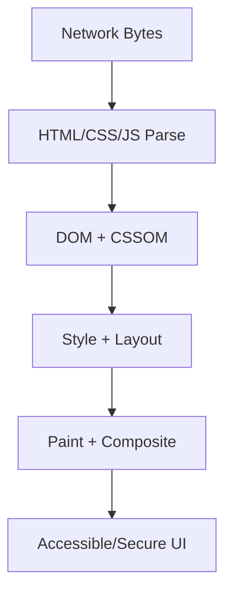

# Security

This volume contains domain-specific senior-level notes for: XSS, CSRF, CORS, CSP, Authentication, Authorization.



## XSS

### What it is
XSS lets attacker-controlled script execute in another user's browser context.

### Why it exists
The concept exists to describe and prevent script injection through untrusted data sinks.

### Source-code / internal model
It happens when untrusted input is interpreted as HTML/JS instead of text/data.

### Architecture diagram


### Production React example
Comments, markdown previews, rich text editors, and admin CMS fields require sanitization.

```tsx
const XSSExample = {
  input: "dashboard filter, route transition, or API response",
  failureMode: "stale state, remount, blocked input, or unsafe data sink",
  metric: "React Profiler commit time, Chrome long task, heap growth, or Web Vital",
};
```

### Debugging scenario
If a payload executes, trace source-to-sink: input, storage, rendering sink.

### Performance profiling example
Security profiling means checking sinks: innerHTML, dangerouslySetInnerHTML, URL attributes, script injection.

### Product-company interview prompts
- Asked: reflected vs stored XSS, React escaping, CSP, sanitization.
- Explain one production incident involving XSS and how you would prevent recurrence.
- Implement or design a minimal example of XSS while narrating correctness, edge cases, and trade-offs.

### Senior-engineer checklist
- What owns the data or behavior?
- What can make it stale, slow, inaccessible, insecure, or hard to test?
- What instrumentation proves it works in production?
- What API would you expose to a team so misuse is difficult?

## CSRF

### What it is
CSRF tricks a browser into sending authenticated requests to a site where the user is logged in.

### Why it exists
The concept exists because browsers automatically send cookies, so servers must verify user intent.

### Source-code / internal model
Cookies are automatically attached; server must verify intent with SameSite, CSRF tokens, or custom headers.

### Architecture diagram


### Production React example
Banking and admin mutation endpoints need CSRF protection.

```tsx
const res = await fetch("/api/session", { credentials: "include" });
if (!res.ok) throw new Error("session check failed");
```

### Debugging scenario
If POST succeeds cross-site, inspect SameSite and token validation.

### Performance profiling example
Security tests simulate cross-origin forms and image/script requests.

### Product-company interview prompts
- Asked: CSRF vs XSS and why tokens work.
- Explain one production incident involving CSRF and how you would prevent recurrence.
- Implement or design a minimal example of CSRF while narrating correctness, edge cases, and trade-offs.

### Senior-engineer checklist
- What owns the data or behavior?
- What can make it stale, slow, inaccessible, insecure, or hard to test?
- What instrumentation proves it works in production?
- What API would you expose to a team so misuse is difficult?

## CORS

### What it is
CORS is a browser-enforced protocol controlling which origins can read cross-origin responses.

### Why it exists
It lets servers explicitly decide which browser origins may read cross-origin responses.

### Source-code / internal model
Browser sends Origin and possibly preflight OPTIONS; server returns allow headers.

### Architecture diagram


### Production React example
Frontend apps calling API domains need explicit origin and credential policy.

```tsx
const res = await fetch("/api/session", { credentials: "include" });
if (!res.ok) throw new Error("session check failed");
```

### Debugging scenario
If request works in curl but fails in browser, inspect preflight and Access-Control headers.

### Performance profiling example
Preflight frequency can affect latency; cache OPTIONS with Access-Control-Max-Age.

### Product-company interview prompts
- Asked: CORS is not auth, wildcard with credentials is invalid.
- Explain one production incident involving CORS and how you would prevent recurrence.
- Implement or design a minimal example of CORS while narrating correctness, edge cases, and trade-offs.

### Senior-engineer checklist
- What owns the data or behavior?
- What can make it stale, slow, inaccessible, insecure, or hard to test?
- What instrumentation proves it works in production?
- What API would you expose to a team so misuse is difficult?

## CSP

### What it is
CSP restricts where scripts, styles, images, frames, and connections may load from.

### Why it exists
It provides defense-in-depth when code or content injection reaches the browser.

### Source-code / internal model
Browser enforces response policy directives and can report violations.

### Architecture diagram


### Production React example
High-security apps use nonce-based scripts and disallow unsafe-inline.

```tsx
const res = await fetch("/api/session", { credentials: "include" });
if (!res.ok) throw new Error("session check failed");
```

### Debugging scenario
If scripts stop loading after CSP rollout, inspect violation reports and missing nonces.

### Performance profiling example
CSP adds security defense-in-depth with minimal runtime performance cost.

### Product-company interview prompts
- Asked: CSP as XSS mitigation and nonce vs hash.
- Explain one production incident involving CSP and how you would prevent recurrence.
- Implement or design a minimal example of CSP while narrating correctness, edge cases, and trade-offs.

### Senior-engineer checklist
- What owns the data or behavior?
- What can make it stale, slow, inaccessible, insecure, or hard to test?
- What instrumentation proves it works in production?
- What API would you expose to a team so misuse is difficult?

## Authentication

### What it is
Authentication proves who the user is.

### Why it exists
It protects user-specific data and product actions.

### Source-code / internal model
Frontend handles redirects, tokens/cookies, session refresh, and secure storage boundaries; server remains source of truth.

### Architecture diagram


### Production React example
SaaS apps use OAuth/OIDC login and silent refresh or httpOnly cookies.

```tsx
const res = await fetch("/api/session", { credentials: "include" });
if (!res.ok) throw new Error("session check failed");
```

### Debugging scenario
Storing long-lived tokens in localStorage increases XSS impact.

### Performance profiling example
Auth checks should not block initial render longer than necessary; use skeletons and session cache.

### Product-company interview prompts
- Asked: JWT vs session cookie and refresh flow.
- Explain one production incident involving Authentication and how you would prevent recurrence.
- Implement or design a minimal example of Authentication while narrating correctness, edge cases, and trade-offs.

### Senior-engineer checklist
- What owns the data or behavior?
- What can make it stale, slow, inaccessible, insecure, or hard to test?
- What instrumentation proves it works in production?
- What API would you expose to a team so misuse is difficult?

## Authorization

### What it is
Authorization decides what an authenticated user can do.

### Why it exists
It enforces product permissions and data boundaries.

### Source-code / internal model
Frontend can hide UI affordances but server must enforce access.

### Architecture diagram


### Production React example
Admin panels render menus/actions from permission policies.

```tsx
const res = await fetch("/api/session", { credentials: "include" });
if (!res.ok) throw new Error("session check failed");
```

### Debugging scenario
Relying only on hidden buttons is a security bug.

### Performance profiling example
Permission checks should be cached but invalidated after role changes.

### Product-company interview prompts
- Asked: authn vs authz and frontend guard limitations.
- Explain one production incident involving Authorization and how you would prevent recurrence.
- Implement or design a minimal example of Authorization while narrating correctness, edge cases, and trade-offs.

### Senior-engineer checklist
- What owns the data or behavior?
- What can make it stale, slow, inaccessible, insecure, or hard to test?
- What instrumentation proves it works in production?
- What API would you expose to a team so misuse is difficult?

