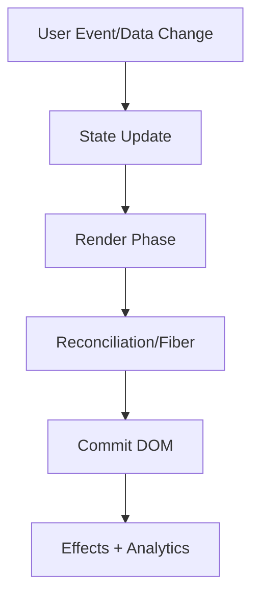

# Advanced Frontend Patterns

This volume contains domain-specific senior-level notes for: Compound Components, Render Props, HOCs, Headless Components.



## Compound Components

### What it is
Compound components share implicit state across related child components.

### Why it exists
They create expressive APIs like Tabs.List, Tabs.Trigger, Tabs.Content.

### Source-code / internal model
Parent context coordinates registration, active state, IDs, and accessibility relationships.

### Architecture diagram


### Production React example
Design systems use compound Dialog, Tabs, Accordion, and Menu APIs.

```tsx
function Dialog({ open, onOpenChange, children }) {
  return open ? <div role="dialog" aria-modal="true">{children}</div> : null;
}
```

### Debugging scenario
Unrestricted children can break required structure; validate or document composition rules.

### Performance profiling example
Split contexts to avoid re-rendering all children on active item changes.

### Product-company interview prompts
- Asked: implement Tabs with compound components.
- Explain one production incident involving Compound Components and how you would prevent recurrence.
- Implement or design a minimal example of Compound Components while narrating correctness, edge cases, and trade-offs.

### Senior-engineer checklist
- What owns the data or behavior?
- What can make it stale, slow, inaccessible, insecure, or hard to test?
- What instrumentation proves it works in production?
- What API would you expose to a team so misuse is difficult?

## Render Props

### What it is
Render props pass a function that receives state/behavior and returns UI.

### Why it exists
They separate behavior from rendering before hooks and still help with headless customization.

### Source-code / internal model
The component calls the render function with state, actions, and prop getters.

### Architecture diagram


### Production React example
A reusable MousePosition or DataFetcher can expose behavior to custom markup.

```tsx
const RenderPropsExample = {
  input: "dashboard filter, route transition, or API response",
  failureMode: "stale state, remount, blocked input, or unsafe data sink",
  metric: "React Profiler commit time, Chrome long task, heap growth, or Web Vital",
};
```

### Debugging scenario
Inline render functions can defeat memoization if passed deeply.

### Performance profiling example
Profile child re-renders and memoize only when needed.

### Product-company interview prompts
- Asked: render props vs hooks.
- Explain one production incident involving Render Props and how you would prevent recurrence.
- Implement or design a minimal example of Render Props while narrating correctness, edge cases, and trade-offs.

### Senior-engineer checklist
- What owns the data or behavior?
- What can make it stale, slow, inaccessible, insecure, or hard to test?
- What instrumentation proves it works in production?
- What API would you expose to a team so misuse is difficult?

## HOCs

### What it is
Higher-order components wrap components to add behavior or data.

### Why it exists
They enable cross-cutting concerns such as routing, permissions, analytics, or theming.

### Source-code / internal model
A HOC receives a component and returns another component that renders it with additional props.

### Architecture diagram


### Production React example
Legacy React codebases use connect, withRouter, and feature-flag wrappers.

```tsx
const HOCsExample = {
  input: "dashboard filter, route transition, or API response",
  failureMode: "stale state, remount, blocked input, or unsafe data sink",
  metric: "React Profiler commit time, Chrome long task, heap growth, or Web Vital",
};
```

### Debugging scenario
Wrapper hell and prop collisions are common HOC problems.

### Performance profiling example
HOCs add component layers visible in DevTools; prefer hooks for new code unless wrapper composition is needed.

### Product-company interview prompts
- Asked: HOC implementation and drawbacks.
- Explain one production incident involving HOCs and how you would prevent recurrence.
- Implement or design a minimal example of HOCs while narrating correctness, edge cases, and trade-offs.

### Senior-engineer checklist
- What owns the data or behavior?
- What can make it stale, slow, inaccessible, insecure, or hard to test?
- What instrumentation proves it works in production?
- What API would you expose to a team so misuse is difficult?

## Headless Components

### What it is
Headless components provide behavior/state/accessibility without imposing markup or styling.

### Why it exists
Headless They create reusable UI boundaries with clear ownership of markup, behavior, and accessibility.

### Source-code / internal model
They expose state via render props, hooks, context, or slot props while managing keyboard and ARIA logic.

### Architecture diagram


### Production React example
Design systems use headless combobox, dialog, tabs, and menu primitives across brands.

```tsx
function Dialog({ open, onOpenChange, children }) {
  return open ? <div role="dialog" aria-modal="true">{children}</div> : null;
}
```

### Debugging scenario
If accessibility breaks, ensure consumers spread required props and refs.

### Performance profiling example
Profile context updates in compound headless primitives.

### Product-company interview prompts
- Asked: headless vs styled component library and accessibility ownership.
- Explain one production incident involving Headless Components and how you would prevent recurrence.
- Implement or design a minimal example of Headless Components while narrating correctness, edge cases, and trade-offs.

### Senior-engineer checklist
- What owns the data or behavior?
- What can make it stale, slow, inaccessible, insecure, or hard to test?
- What instrumentation proves it works in production?
- What API would you expose to a team so misuse is difficult?

