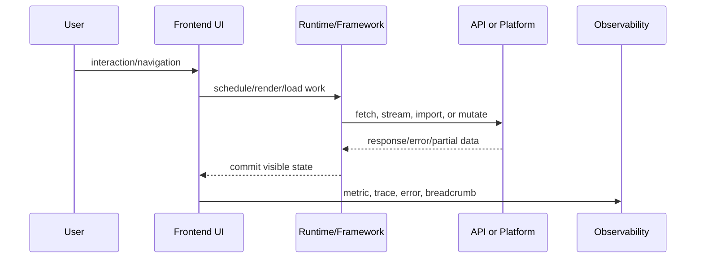

# Next.js Mastery

This volume was added for Staff+ frontend engineering depth. It focuses on runtime behavior, production failure modes, architecture decisions, and interview-grade reasoning.

## App Router Runtime Model

### What Is It?
App Router Runtime Model is a concrete engineering discipline inside Next.js Mastery; treat it as a production system with ownership, failure modes, observability, and user impact.

### Why Does It Exist?
It exists because large frontend applications need predictable delivery across teams, devices, networks, security boundaries, and deployment environments.

### Internal Working
At runtime, the important question is: where does work execute, when is data available, what cache owns it, what can fail, and what user-visible state appears while the system recovers.

### Runtime Flow


### Real Production Example
A production SaaS dashboard uses App Router Runtime Model when a user changes tenant, navigates to a lazily loaded route, fetches permission-scoped data, handles a partial outage, and still emits enough telemetry for on-call engineers to diagnose the issue.

### Source Code Analysis
```ts
type ProductionBoundary = {
  owner: string;
  input: 'navigation' | 'user-event' | 'server-data' | 'build-artifact';
  failure: 'timeout' | 'version-mismatch' | 'unauthorized' | 'render-error';
  metric: 'INP' | 'LCP' | 'error-rate' | 'cache-hit-rate';
};
```

### Common Bugs
- Hidden coupling between teams or packages.
- Missing fallback UI for slow or failed work.
- Cache invalidation that ignores tenant, locale, role, or feature flag.
- No trace connecting frontend symptom to backend or build artifact.

### Debugging Strategies
Use a reproduction URL, user/session metadata, release SHA, network waterfall, React Profiler commit, browser performance trace, and logs/traces tied by correlation ID.

### Performance Considerations
Measure JavaScript cost, network waterfalls, cache hit rate, hydration or route transition time, memory growth, and long tasks. Do not optimize abstractions before measuring user-visible latency.

### Security and Accessibility Considerations
Security: isolate trust boundaries, validate server decisions, avoid leaking tenant or user data, and fail closed. Accessibility: preserve focus, announce async state changes, keep keyboard paths working, and avoid UI that only communicates through color or motion.

### Interview Questions
#### Beginner
1. What problem does App Router Runtime Model solve?
2. What is the user-visible failure state?
3. What browser or React tool would you use first?

#### Intermediate
1. How would you design ownership boundaries for App Router Runtime Model?
2. How would caching, retries, and rollback work?
3. Which metric proves the design works?

#### Advanced
1. How would App Router Runtime Model behave during partial outage, deploy rollback, or version skew?
2. How would you make it observable across micro-frontends or server-rendered routes?
3. What trade-off would you document in an ADR?

### Mini Project
Build a production-grade demo with route-level error boundaries, loading states, telemetry events, keyboard support, and a README explaining failure recovery.

### Cheat Sheet
- Define owner.
- Define runtime boundary.
- Define cache and invalidation.
- Define fallback UI.
- Define metrics and alerts.
- Define security and accessibility checks.

### Related Concepts
React rendering, browser event loop, caching, system design, observability, security, accessibility, deployment strategy.

## Server Components

### What Is It?
Server Components is a concrete engineering discipline inside Next.js Mastery; treat it as a production system with ownership, failure modes, observability, and user impact.

### Why Does It Exist?
It exists because large frontend applications need predictable delivery across teams, devices, networks, security boundaries, and deployment environments.

### Internal Working
At runtime, the important question is: where does work execute, when is data available, what cache owns it, what can fail, and what user-visible state appears while the system recovers.

### Runtime Flow


### Real Production Example
A production SaaS dashboard uses Server Components when a user changes tenant, navigates to a lazily loaded route, fetches permission-scoped data, handles a partial outage, and still emits enough telemetry for on-call engineers to diagnose the issue.

### Source Code Analysis
```ts
type ProductionBoundary = {
  owner: string;
  input: 'navigation' | 'user-event' | 'server-data' | 'build-artifact';
  failure: 'timeout' | 'version-mismatch' | 'unauthorized' | 'render-error';
  metric: 'INP' | 'LCP' | 'error-rate' | 'cache-hit-rate';
};
```

### Common Bugs
- Hidden coupling between teams or packages.
- Missing fallback UI for slow or failed work.
- Cache invalidation that ignores tenant, locale, role, or feature flag.
- No trace connecting frontend symptom to backend or build artifact.

### Debugging Strategies
Use a reproduction URL, user/session metadata, release SHA, network waterfall, React Profiler commit, browser performance trace, and logs/traces tied by correlation ID.

### Performance Considerations
Measure JavaScript cost, network waterfalls, cache hit rate, hydration or route transition time, memory growth, and long tasks. Do not optimize abstractions before measuring user-visible latency.

### Security and Accessibility Considerations
Security: isolate trust boundaries, validate server decisions, avoid leaking tenant or user data, and fail closed. Accessibility: preserve focus, announce async state changes, keep keyboard paths working, and avoid UI that only communicates through color or motion.

### Interview Questions
#### Beginner
1. What problem does Server Components solve?
2. What is the user-visible failure state?
3. What browser or React tool would you use first?

#### Intermediate
1. How would you design ownership boundaries for Server Components?
2. How would caching, retries, and rollback work?
3. Which metric proves the design works?

#### Advanced
1. How would Server Components behave during partial outage, deploy rollback, or version skew?
2. How would you make it observable across micro-frontends or server-rendered routes?
3. What trade-off would you document in an ADR?

### Mini Project
Build a production-grade demo with route-level error boundaries, loading states, telemetry events, keyboard support, and a README explaining failure recovery.

### Cheat Sheet
- Define owner.
- Define runtime boundary.
- Define cache and invalidation.
- Define fallback UI.
- Define metrics and alerts.
- Define security and accessibility checks.

### Related Concepts
React rendering, browser event loop, caching, system design, observability, security, accessibility, deployment strategy.

## Server Actions

### What Is It?
Server Actions is a concrete engineering discipline inside Next.js Mastery; treat it as a production system with ownership, failure modes, observability, and user impact.

### Why Does It Exist?
It exists because large frontend applications need predictable delivery across teams, devices, networks, security boundaries, and deployment environments.

### Internal Working
At runtime, the important question is: where does work execute, when is data available, what cache owns it, what can fail, and what user-visible state appears while the system recovers.

### Runtime Flow


### Real Production Example
A production SaaS dashboard uses Server Actions when a user changes tenant, navigates to a lazily loaded route, fetches permission-scoped data, handles a partial outage, and still emits enough telemetry for on-call engineers to diagnose the issue.

### Source Code Analysis
```ts
type ProductionBoundary = {
  owner: string;
  input: 'navigation' | 'user-event' | 'server-data' | 'build-artifact';
  failure: 'timeout' | 'version-mismatch' | 'unauthorized' | 'render-error';
  metric: 'INP' | 'LCP' | 'error-rate' | 'cache-hit-rate';
};
```

### Common Bugs
- Hidden coupling between teams or packages.
- Missing fallback UI for slow or failed work.
- Cache invalidation that ignores tenant, locale, role, or feature flag.
- No trace connecting frontend symptom to backend or build artifact.

### Debugging Strategies
Use a reproduction URL, user/session metadata, release SHA, network waterfall, React Profiler commit, browser performance trace, and logs/traces tied by correlation ID.

### Performance Considerations
Measure JavaScript cost, network waterfalls, cache hit rate, hydration or route transition time, memory growth, and long tasks. Do not optimize abstractions before measuring user-visible latency.

### Security and Accessibility Considerations
Security: isolate trust boundaries, validate server decisions, avoid leaking tenant or user data, and fail closed. Accessibility: preserve focus, announce async state changes, keep keyboard paths working, and avoid UI that only communicates through color or motion.

### Interview Questions
#### Beginner
1. What problem does Server Actions solve?
2. What is the user-visible failure state?
3. What browser or React tool would you use first?

#### Intermediate
1. How would you design ownership boundaries for Server Actions?
2. How would caching, retries, and rollback work?
3. Which metric proves the design works?

#### Advanced
1. How would Server Actions behave during partial outage, deploy rollback, or version skew?
2. How would you make it observable across micro-frontends or server-rendered routes?
3. What trade-off would you document in an ADR?

### Mini Project
Build a production-grade demo with route-level error boundaries, loading states, telemetry events, keyboard support, and a README explaining failure recovery.

### Cheat Sheet
- Define owner.
- Define runtime boundary.
- Define cache and invalidation.
- Define fallback UI.
- Define metrics and alerts.
- Define security and accessibility checks.

### Related Concepts
React rendering, browser event loop, caching, system design, observability, security, accessibility, deployment strategy.

## Caching and Revalidation

### What Is It?
Caching and Revalidation is a concrete engineering discipline inside Next.js Mastery; treat it as a production system with ownership, failure modes, observability, and user impact.

### Why Does It Exist?
It exists because large frontend applications need predictable delivery across teams, devices, networks, security boundaries, and deployment environments.

### Internal Working
At runtime, the important question is: where does work execute, when is data available, what cache owns it, what can fail, and what user-visible state appears while the system recovers.

### Runtime Flow


### Real Production Example
A production SaaS dashboard uses Caching and Revalidation when a user changes tenant, navigates to a lazily loaded route, fetches permission-scoped data, handles a partial outage, and still emits enough telemetry for on-call engineers to diagnose the issue.

### Source Code Analysis
```ts
type ProductionBoundary = {
  owner: string;
  input: 'navigation' | 'user-event' | 'server-data' | 'build-artifact';
  failure: 'timeout' | 'version-mismatch' | 'unauthorized' | 'render-error';
  metric: 'INP' | 'LCP' | 'error-rate' | 'cache-hit-rate';
};
```

### Common Bugs
- Hidden coupling between teams or packages.
- Missing fallback UI for slow or failed work.
- Cache invalidation that ignores tenant, locale, role, or feature flag.
- No trace connecting frontend symptom to backend or build artifact.

### Debugging Strategies
Use a reproduction URL, user/session metadata, release SHA, network waterfall, React Profiler commit, browser performance trace, and logs/traces tied by correlation ID.

### Performance Considerations
Measure JavaScript cost, network waterfalls, cache hit rate, hydration or route transition time, memory growth, and long tasks. Do not optimize abstractions before measuring user-visible latency.

### Security and Accessibility Considerations
Security: isolate trust boundaries, validate server decisions, avoid leaking tenant or user data, and fail closed. Accessibility: preserve focus, announce async state changes, keep keyboard paths working, and avoid UI that only communicates through color or motion.

### Interview Questions
#### Beginner
1. What problem does Caching and Revalidation solve?
2. What is the user-visible failure state?
3. What browser or React tool would you use first?

#### Intermediate
1. How would you design ownership boundaries for Caching and Revalidation?
2. How would caching, retries, and rollback work?
3. Which metric proves the design works?

#### Advanced
1. How would Caching and Revalidation behave during partial outage, deploy rollback, or version skew?
2. How would you make it observable across micro-frontends or server-rendered routes?
3. What trade-off would you document in an ADR?

### Mini Project
Build a production-grade demo with route-level error boundaries, loading states, telemetry events, keyboard support, and a README explaining failure recovery.

### Cheat Sheet
- Define owner.
- Define runtime boundary.
- Define cache and invalidation.
- Define fallback UI.
- Define metrics and alerts.
- Define security and accessibility checks.

### Related Concepts
React rendering, browser event loop, caching, system design, observability, security, accessibility, deployment strategy.

## Streaming and Suspense

### What Is It?
Streaming and Suspense is a concrete engineering discipline inside Next.js Mastery; treat it as a production system with ownership, failure modes, observability, and user impact.

### Why Does It Exist?
It exists because large frontend applications need predictable delivery across teams, devices, networks, security boundaries, and deployment environments.

### Internal Working
At runtime, the important question is: where does work execute, when is data available, what cache owns it, what can fail, and what user-visible state appears while the system recovers.

### Runtime Flow


### Real Production Example
A production SaaS dashboard uses Streaming and Suspense when a user changes tenant, navigates to a lazily loaded route, fetches permission-scoped data, handles a partial outage, and still emits enough telemetry for on-call engineers to diagnose the issue.

### Source Code Analysis
```ts
type ProductionBoundary = {
  owner: string;
  input: 'navigation' | 'user-event' | 'server-data' | 'build-artifact';
  failure: 'timeout' | 'version-mismatch' | 'unauthorized' | 'render-error';
  metric: 'INP' | 'LCP' | 'error-rate' | 'cache-hit-rate';
};
```

### Common Bugs
- Hidden coupling between teams or packages.
- Missing fallback UI for slow or failed work.
- Cache invalidation that ignores tenant, locale, role, or feature flag.
- No trace connecting frontend symptom to backend or build artifact.

### Debugging Strategies
Use a reproduction URL, user/session metadata, release SHA, network waterfall, React Profiler commit, browser performance trace, and logs/traces tied by correlation ID.

### Performance Considerations
Measure JavaScript cost, network waterfalls, cache hit rate, hydration or route transition time, memory growth, and long tasks. Do not optimize abstractions before measuring user-visible latency.

### Security and Accessibility Considerations
Security: isolate trust boundaries, validate server decisions, avoid leaking tenant or user data, and fail closed. Accessibility: preserve focus, announce async state changes, keep keyboard paths working, and avoid UI that only communicates through color or motion.

### Interview Questions
#### Beginner
1. What problem does Streaming and Suspense solve?
2. What is the user-visible failure state?
3. What browser or React tool would you use first?

#### Intermediate
1. How would you design ownership boundaries for Streaming and Suspense?
2. How would caching, retries, and rollback work?
3. Which metric proves the design works?

#### Advanced
1. How would Streaming and Suspense behave during partial outage, deploy rollback, or version skew?
2. How would you make it observable across micro-frontends or server-rendered routes?
3. What trade-off would you document in an ADR?

### Mini Project
Build a production-grade demo with route-level error boundaries, loading states, telemetry events, keyboard support, and a README explaining failure recovery.

### Cheat Sheet
- Define owner.
- Define runtime boundary.
- Define cache and invalidation.
- Define fallback UI.
- Define metrics and alerts.
- Define security and accessibility checks.

### Related Concepts
React rendering, browser event loop, caching, system design, observability, security, accessibility, deployment strategy.

## Production Deployment

### What Is It?
Production Deployment is a concrete engineering discipline inside Next.js Mastery; treat it as a production system with ownership, failure modes, observability, and user impact.

### Why Does It Exist?
It exists because large frontend applications need predictable delivery across teams, devices, networks, security boundaries, and deployment environments.

### Internal Working
At runtime, the important question is: where does work execute, when is data available, what cache owns it, what can fail, and what user-visible state appears while the system recovers.

### Runtime Flow


### Real Production Example
A production SaaS dashboard uses Production Deployment when a user changes tenant, navigates to a lazily loaded route, fetches permission-scoped data, handles a partial outage, and still emits enough telemetry for on-call engineers to diagnose the issue.

### Source Code Analysis
```ts
type ProductionBoundary = {
  owner: string;
  input: 'navigation' | 'user-event' | 'server-data' | 'build-artifact';
  failure: 'timeout' | 'version-mismatch' | 'unauthorized' | 'render-error';
  metric: 'INP' | 'LCP' | 'error-rate' | 'cache-hit-rate';
};
```

### Common Bugs
- Hidden coupling between teams or packages.
- Missing fallback UI for slow or failed work.
- Cache invalidation that ignores tenant, locale, role, or feature flag.
- No trace connecting frontend symptom to backend or build artifact.

### Debugging Strategies
Use a reproduction URL, user/session metadata, release SHA, network waterfall, React Profiler commit, browser performance trace, and logs/traces tied by correlation ID.

### Performance Considerations
Measure JavaScript cost, network waterfalls, cache hit rate, hydration or route transition time, memory growth, and long tasks. Do not optimize abstractions before measuring user-visible latency.

### Security and Accessibility Considerations
Security: isolate trust boundaries, validate server decisions, avoid leaking tenant or user data, and fail closed. Accessibility: preserve focus, announce async state changes, keep keyboard paths working, and avoid UI that only communicates through color or motion.

### Interview Questions
#### Beginner
1. What problem does Production Deployment solve?
2. What is the user-visible failure state?
3. What browser or React tool would you use first?

#### Intermediate
1. How would you design ownership boundaries for Production Deployment?
2. How would caching, retries, and rollback work?
3. Which metric proves the design works?

#### Advanced
1. How would Production Deployment behave during partial outage, deploy rollback, or version skew?
2. How would you make it observable across micro-frontends or server-rendered routes?
3. What trade-off would you document in an ADR?

### Mini Project
Build a production-grade demo with route-level error boundaries, loading states, telemetry events, keyboard support, and a README explaining failure recovery.

### Cheat Sheet
- Define owner.
- Define runtime boundary.
- Define cache and invalidation.
- Define fallback UI.
- Define metrics and alerts.
- Define security and accessibility checks.

### Related Concepts
React rendering, browser event loop, caching, system design, observability, security, accessibility, deployment strategy.

