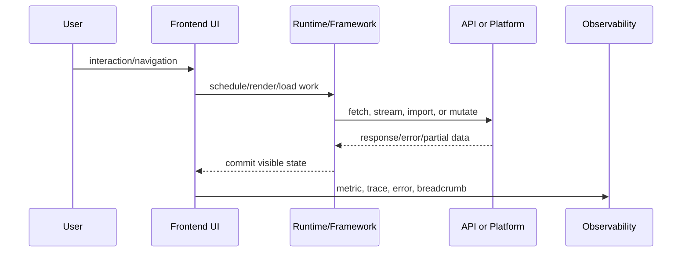

# Testing Mastery

This volume was added for Staff+ frontend engineering depth. It focuses on runtime behavior, production failure modes, architecture decisions, and interview-grade reasoning.

## Testing Pyramid

### What Is It?
Testing Pyramid is a concrete engineering discipline inside Testing Mastery; treat it as a production system with ownership, failure modes, observability, and user impact.

### Why Does It Exist?
It exists because large frontend applications need predictable delivery across teams, devices, networks, security boundaries, and deployment environments.

### Internal Working
At runtime, the important question is: where does work execute, when is data available, what cache owns it, what can fail, and what user-visible state appears while the system recovers.

### Runtime Flow


### Real Production Example
A production SaaS dashboard uses Testing Pyramid when a user changes tenant, navigates to a lazily loaded route, fetches permission-scoped data, handles a partial outage, and still emits enough telemetry for on-call engineers to diagnose the issue.

### Source Code Analysis
```ts
type ProductionBoundary = {
  owner: string;
  input: 'navigation' | 'user-event' | 'server-data' | 'build-artifact';
  failure: 'timeout' | 'version-mismatch' | 'unauthorized' | 'render-error';
  metric: 'INP' | 'LCP' | 'error-rate' | 'cache-hit-rate';
};
```

### Common Bugs
- Hidden coupling between teams or packages.
- Missing fallback UI for slow or failed work.
- Cache invalidation that ignores tenant, locale, role, or feature flag.
- No trace connecting frontend symptom to backend or build artifact.

### Debugging Strategies
Use a reproduction URL, user/session metadata, release SHA, network waterfall, React Profiler commit, browser performance trace, and logs/traces tied by correlation ID.

### Performance Considerations
Measure JavaScript cost, network waterfalls, cache hit rate, hydration or route transition time, memory growth, and long tasks. Do not optimize abstractions before measuring user-visible latency.

### Security and Accessibility Considerations
Security: isolate trust boundaries, validate server decisions, avoid leaking tenant or user data, and fail closed. Accessibility: preserve focus, announce async state changes, keep keyboard paths working, and avoid UI that only communicates through color or motion.

### Interview Questions
#### Beginner
1. What problem does Testing Pyramid solve?
2. What is the user-visible failure state?
3. What browser or React tool would you use first?

#### Intermediate
1. How would you design ownership boundaries for Testing Pyramid?
2. How would caching, retries, and rollback work?
3. Which metric proves the design works?

#### Advanced
1. How would Testing Pyramid behave during partial outage, deploy rollback, or version skew?
2. How would you make it observable across micro-frontends or server-rendered routes?
3. What trade-off would you document in an ADR?

### Mini Project
Build a production-grade demo with route-level error boundaries, loading states, telemetry events, keyboard support, and a README explaining failure recovery.

### Cheat Sheet
- Define owner.
- Define runtime boundary.
- Define cache and invalidation.
- Define fallback UI.
- Define metrics and alerts.
- Define security and accessibility checks.

### Related Concepts
React rendering, browser event loop, caching, system design, observability, security, accessibility, deployment strategy.

## React Testing Library

### What Is It?
React Testing Library is a concrete engineering discipline inside Testing Mastery; treat it as a production system with ownership, failure modes, observability, and user impact.

### Why Does It Exist?
It exists because large frontend applications need predictable delivery across teams, devices, networks, security boundaries, and deployment environments.

### Internal Working
At runtime, the important question is: where does work execute, when is data available, what cache owns it, what can fail, and what user-visible state appears while the system recovers.

### Runtime Flow


### Real Production Example
A production SaaS dashboard uses React Testing Library when a user changes tenant, navigates to a lazily loaded route, fetches permission-scoped data, handles a partial outage, and still emits enough telemetry for on-call engineers to diagnose the issue.

### Source Code Analysis
```ts
type ProductionBoundary = {
  owner: string;
  input: 'navigation' | 'user-event' | 'server-data' | 'build-artifact';
  failure: 'timeout' | 'version-mismatch' | 'unauthorized' | 'render-error';
  metric: 'INP' | 'LCP' | 'error-rate' | 'cache-hit-rate';
};
```

### Common Bugs
- Hidden coupling between teams or packages.
- Missing fallback UI for slow or failed work.
- Cache invalidation that ignores tenant, locale, role, or feature flag.
- No trace connecting frontend symptom to backend or build artifact.

### Debugging Strategies
Use a reproduction URL, user/session metadata, release SHA, network waterfall, React Profiler commit, browser performance trace, and logs/traces tied by correlation ID.

### Performance Considerations
Measure JavaScript cost, network waterfalls, cache hit rate, hydration or route transition time, memory growth, and long tasks. Do not optimize abstractions before measuring user-visible latency.

### Security and Accessibility Considerations
Security: isolate trust boundaries, validate server decisions, avoid leaking tenant or user data, and fail closed. Accessibility: preserve focus, announce async state changes, keep keyboard paths working, and avoid UI that only communicates through color or motion.

### Interview Questions
#### Beginner
1. What problem does React Testing Library solve?
2. What is the user-visible failure state?
3. What browser or React tool would you use first?

#### Intermediate
1. How would you design ownership boundaries for React Testing Library?
2. How would caching, retries, and rollback work?
3. Which metric proves the design works?

#### Advanced
1. How would React Testing Library behave during partial outage, deploy rollback, or version skew?
2. How would you make it observable across micro-frontends or server-rendered routes?
3. What trade-off would you document in an ADR?

### Mini Project
Build a production-grade demo with route-level error boundaries, loading states, telemetry events, keyboard support, and a README explaining failure recovery.

### Cheat Sheet
- Define owner.
- Define runtime boundary.
- Define cache and invalidation.
- Define fallback UI.
- Define metrics and alerts.
- Define security and accessibility checks.

### Related Concepts
React rendering, browser event loop, caching, system design, observability, security, accessibility, deployment strategy.

## Playwright E2E

### What Is It?
Playwright E2E is a concrete engineering discipline inside Testing Mastery; treat it as a production system with ownership, failure modes, observability, and user impact.

### Why Does It Exist?
It exists because large frontend applications need predictable delivery across teams, devices, networks, security boundaries, and deployment environments.

### Internal Working
At runtime, the important question is: where does work execute, when is data available, what cache owns it, what can fail, and what user-visible state appears while the system recovers.

### Runtime Flow


### Real Production Example
A production SaaS dashboard uses Playwright E2E when a user changes tenant, navigates to a lazily loaded route, fetches permission-scoped data, handles a partial outage, and still emits enough telemetry for on-call engineers to diagnose the issue.

### Source Code Analysis
```ts
type ProductionBoundary = {
  owner: string;
  input: 'navigation' | 'user-event' | 'server-data' | 'build-artifact';
  failure: 'timeout' | 'version-mismatch' | 'unauthorized' | 'render-error';
  metric: 'INP' | 'LCP' | 'error-rate' | 'cache-hit-rate';
};
```

### Common Bugs
- Hidden coupling between teams or packages.
- Missing fallback UI for slow or failed work.
- Cache invalidation that ignores tenant, locale, role, or feature flag.
- No trace connecting frontend symptom to backend or build artifact.

### Debugging Strategies
Use a reproduction URL, user/session metadata, release SHA, network waterfall, React Profiler commit, browser performance trace, and logs/traces tied by correlation ID.

### Performance Considerations
Measure JavaScript cost, network waterfalls, cache hit rate, hydration or route transition time, memory growth, and long tasks. Do not optimize abstractions before measuring user-visible latency.

### Security and Accessibility Considerations
Security: isolate trust boundaries, validate server decisions, avoid leaking tenant or user data, and fail closed. Accessibility: preserve focus, announce async state changes, keep keyboard paths working, and avoid UI that only communicates through color or motion.

### Interview Questions
#### Beginner
1. What problem does Playwright E2E solve?
2. What is the user-visible failure state?
3. What browser or React tool would you use first?

#### Intermediate
1. How would you design ownership boundaries for Playwright E2E?
2. How would caching, retries, and rollback work?
3. Which metric proves the design works?

#### Advanced
1. How would Playwright E2E behave during partial outage, deploy rollback, or version skew?
2. How would you make it observable across micro-frontends or server-rendered routes?
3. What trade-off would you document in an ADR?

### Mini Project
Build a production-grade demo with route-level error boundaries, loading states, telemetry events, keyboard support, and a README explaining failure recovery.

### Cheat Sheet
- Define owner.
- Define runtime boundary.
- Define cache and invalidation.
- Define fallback UI.
- Define metrics and alerts.
- Define security and accessibility checks.

### Related Concepts
React rendering, browser event loop, caching, system design, observability, security, accessibility, deployment strategy.

## Contract Testing

### What Is It?
Contract Testing is a concrete engineering discipline inside Testing Mastery; treat it as a production system with ownership, failure modes, observability, and user impact.

### Why Does It Exist?
It exists because large frontend applications need predictable delivery across teams, devices, networks, security boundaries, and deployment environments.

### Internal Working
At runtime, the important question is: where does work execute, when is data available, what cache owns it, what can fail, and what user-visible state appears while the system recovers.

### Runtime Flow


### Real Production Example
A production SaaS dashboard uses Contract Testing when a user changes tenant, navigates to a lazily loaded route, fetches permission-scoped data, handles a partial outage, and still emits enough telemetry for on-call engineers to diagnose the issue.

### Source Code Analysis
```ts
type ProductionBoundary = {
  owner: string;
  input: 'navigation' | 'user-event' | 'server-data' | 'build-artifact';
  failure: 'timeout' | 'version-mismatch' | 'unauthorized' | 'render-error';
  metric: 'INP' | 'LCP' | 'error-rate' | 'cache-hit-rate';
};
```

### Common Bugs
- Hidden coupling between teams or packages.
- Missing fallback UI for slow or failed work.
- Cache invalidation that ignores tenant, locale, role, or feature flag.
- No trace connecting frontend symptom to backend or build artifact.

### Debugging Strategies
Use a reproduction URL, user/session metadata, release SHA, network waterfall, React Profiler commit, browser performance trace, and logs/traces tied by correlation ID.

### Performance Considerations
Measure JavaScript cost, network waterfalls, cache hit rate, hydration or route transition time, memory growth, and long tasks. Do not optimize abstractions before measuring user-visible latency.

### Security and Accessibility Considerations
Security: isolate trust boundaries, validate server decisions, avoid leaking tenant or user data, and fail closed. Accessibility: preserve focus, announce async state changes, keep keyboard paths working, and avoid UI that only communicates through color or motion.

### Interview Questions
#### Beginner
1. What problem does Contract Testing solve?
2. What is the user-visible failure state?
3. What browser or React tool would you use first?

#### Intermediate
1. How would you design ownership boundaries for Contract Testing?
2. How would caching, retries, and rollback work?
3. Which metric proves the design works?

#### Advanced
1. How would Contract Testing behave during partial outage, deploy rollback, or version skew?
2. How would you make it observable across micro-frontends or server-rendered routes?
3. What trade-off would you document in an ADR?

### Mini Project
Build a production-grade demo with route-level error boundaries, loading states, telemetry events, keyboard support, and a README explaining failure recovery.

### Cheat Sheet
- Define owner.
- Define runtime boundary.
- Define cache and invalidation.
- Define fallback UI.
- Define metrics and alerts.
- Define security and accessibility checks.

### Related Concepts
React rendering, browser event loop, caching, system design, observability, security, accessibility, deployment strategy.

## Visual Regression

### What Is It?
Visual Regression is a concrete engineering discipline inside Testing Mastery; treat it as a production system with ownership, failure modes, observability, and user impact.

### Why Does It Exist?
It exists because large frontend applications need predictable delivery across teams, devices, networks, security boundaries, and deployment environments.

### Internal Working
At runtime, the important question is: where does work execute, when is data available, what cache owns it, what can fail, and what user-visible state appears while the system recovers.

### Runtime Flow


### Real Production Example
A production SaaS dashboard uses Visual Regression when a user changes tenant, navigates to a lazily loaded route, fetches permission-scoped data, handles a partial outage, and still emits enough telemetry for on-call engineers to diagnose the issue.

### Source Code Analysis
```ts
type ProductionBoundary = {
  owner: string;
  input: 'navigation' | 'user-event' | 'server-data' | 'build-artifact';
  failure: 'timeout' | 'version-mismatch' | 'unauthorized' | 'render-error';
  metric: 'INP' | 'LCP' | 'error-rate' | 'cache-hit-rate';
};
```

### Common Bugs
- Hidden coupling between teams or packages.
- Missing fallback UI for slow or failed work.
- Cache invalidation that ignores tenant, locale, role, or feature flag.
- No trace connecting frontend symptom to backend or build artifact.

### Debugging Strategies
Use a reproduction URL, user/session metadata, release SHA, network waterfall, React Profiler commit, browser performance trace, and logs/traces tied by correlation ID.

### Performance Considerations
Measure JavaScript cost, network waterfalls, cache hit rate, hydration or route transition time, memory growth, and long tasks. Do not optimize abstractions before measuring user-visible latency.

### Security and Accessibility Considerations
Security: isolate trust boundaries, validate server decisions, avoid leaking tenant or user data, and fail closed. Accessibility: preserve focus, announce async state changes, keep keyboard paths working, and avoid UI that only communicates through color or motion.

### Interview Questions
#### Beginner
1. What problem does Visual Regression solve?
2. What is the user-visible failure state?
3. What browser or React tool would you use first?

#### Intermediate
1. How would you design ownership boundaries for Visual Regression?
2. How would caching, retries, and rollback work?
3. Which metric proves the design works?

#### Advanced
1. How would Visual Regression behave during partial outage, deploy rollback, or version skew?
2. How would you make it observable across micro-frontends or server-rendered routes?
3. What trade-off would you document in an ADR?

### Mini Project
Build a production-grade demo with route-level error boundaries, loading states, telemetry events, keyboard support, and a README explaining failure recovery.

### Cheat Sheet
- Define owner.
- Define runtime boundary.
- Define cache and invalidation.
- Define fallback UI.
- Define metrics and alerts.
- Define security and accessibility checks.

### Related Concepts
React rendering, browser event loop, caching, system design, observability, security, accessibility, deployment strategy.

## CI Flake Debugging

### What Is It?
CI Flake Debugging is a concrete engineering discipline inside Testing Mastery; treat it as a production system with ownership, failure modes, observability, and user impact.

### Why Does It Exist?
It exists because large frontend applications need predictable delivery across teams, devices, networks, security boundaries, and deployment environments.

### Internal Working
At runtime, the important question is: where does work execute, when is data available, what cache owns it, what can fail, and what user-visible state appears while the system recovers.

### Runtime Flow


### Real Production Example
A production SaaS dashboard uses CI Flake Debugging when a user changes tenant, navigates to a lazily loaded route, fetches permission-scoped data, handles a partial outage, and still emits enough telemetry for on-call engineers to diagnose the issue.

### Source Code Analysis
```ts
type ProductionBoundary = {
  owner: string;
  input: 'navigation' | 'user-event' | 'server-data' | 'build-artifact';
  failure: 'timeout' | 'version-mismatch' | 'unauthorized' | 'render-error';
  metric: 'INP' | 'LCP' | 'error-rate' | 'cache-hit-rate';
};
```

### Common Bugs
- Hidden coupling between teams or packages.
- Missing fallback UI for slow or failed work.
- Cache invalidation that ignores tenant, locale, role, or feature flag.
- No trace connecting frontend symptom to backend or build artifact.

### Debugging Strategies
Use a reproduction URL, user/session metadata, release SHA, network waterfall, React Profiler commit, browser performance trace, and logs/traces tied by correlation ID.

### Performance Considerations
Measure JavaScript cost, network waterfalls, cache hit rate, hydration or route transition time, memory growth, and long tasks. Do not optimize abstractions before measuring user-visible latency.

### Security and Accessibility Considerations
Security: isolate trust boundaries, validate server decisions, avoid leaking tenant or user data, and fail closed. Accessibility: preserve focus, announce async state changes, keep keyboard paths working, and avoid UI that only communicates through color or motion.

### Interview Questions
#### Beginner
1. What problem does CI Flake Debugging solve?
2. What is the user-visible failure state?
3. What browser or React tool would you use first?

#### Intermediate
1. How would you design ownership boundaries for CI Flake Debugging?
2. How would caching, retries, and rollback work?
3. Which metric proves the design works?

#### Advanced
1. How would CI Flake Debugging behave during partial outage, deploy rollback, or version skew?
2. How would you make it observable across micro-frontends or server-rendered routes?
3. What trade-off would you document in an ADR?

### Mini Project
Build a production-grade demo with route-level error boundaries, loading states, telemetry events, keyboard support, and a README explaining failure recovery.

### Cheat Sheet
- Define owner.
- Define runtime boundary.
- Define cache and invalidation.
- Define fallback UI.
- Define metrics and alerts.
- Define security and accessibility checks.

### Related Concepts
React rendering, browser event loop, caching, system design, observability, security, accessibility, deployment strategy.

